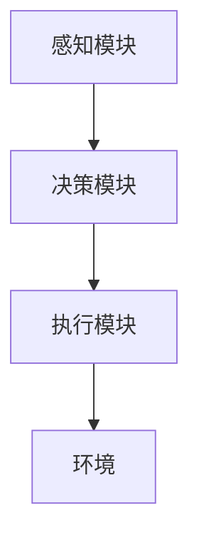

                 


# AI Agent的强化学习应用

## 关键词：AI Agent, 强化学习, 算法原理, 系统架构, 项目实战

## 摘要：  
本文详细探讨了AI Agent在强化学习中的应用，从基础概念到核心算法，再到实际项目案例，系统性地分析了AI Agent与强化学习的结合方式。文章首先介绍了AI Agent和强化学习的基本概念，然后深入讲解了强化学习的核心算法，如Q-learning和DQN。接着，分析了AI Agent的结构与强化学习的关系，探讨了强化学习在AI Agent中的优势与挑战。最后，通过实际项目案例展示了AI Agent的强化学习应用，并总结了相关经验和最佳实践。

---

## 第1章: AI Agent与强化学习概述

### 1.1 AI Agent的基本概念

#### 1.1.1 AI Agent的定义与特点  
AI Agent（人工智能代理）是指能够感知环境、做出决策并执行动作的智能实体。AI Agent的特点包括自主性、反应性、目标导向和学习能力。  

#### 1.1.2 AI Agent的核心功能与类型  
AI Agent的核心功能包括感知环境、处理信息、做出决策和执行动作。常见的AI Agent类型有基于规则的代理、基于模型的代理和基于学习的代理。  

#### 1.1.3 强化学习在AI Agent中的作用  
强化学习通过与环境的交互，通过试错和奖励机制优化AI Agent的决策能力，使其能够适应复杂动态的环境。  

---

### 1.2 强化学习的基本原理

#### 1.2.1 强化学习的定义与特点  
强化学习是一种机器学习范式，通过智能体与环境的交互，学习如何采取一系列动作以最大化累积奖励。其特点包括试错性、延迟奖励和策略优化。  

#### 1.2.2 强化学习的核心要素：状态、动作、奖励  
- **状态（State）**：智能体所处环境的当前情况。  
- **动作（Action）**：智能体在给定状态下采取的行为。  
- **奖励（Reward）**：智能体采取动作后获得的反馈，用于指导学习。  

#### 1.2.3 强化学习与监督学习的区别  
强化学习通过与环境交互获得反馈，而监督学习通过标签数据进行学习。强化学习的反馈是延迟的奖励，而监督学习的反馈是实时的标签。  

---

### 1.3 AI Agent与强化学习的结合

#### 1.3.1 AI Agent的强化学习应用场景  
- 游戏AI：如AlphaGo、Dota AI。  
- 机器人控制：如自动驾驶、工业机器人。  
- 财务交易：如自动股票交易系统。  

#### 1.3.2 强化学习在AI Agent中的优势  
- 自适应决策能力：能够根据环境变化动态调整策略。  
- 鲁棒性：能够在复杂和动态的环境中稳定运行。  
- 高效性：通过强化学习算法优化决策过程。  

#### 1.3.3 本章小结  
本章介绍了AI Agent和强化学习的基本概念，探讨了两者结合的潜力和应用场景。  

---

## 第2章: 强化学习的核心算法原理

### 2.1 马尔可夫决策过程（MDP）

#### 2.1.1 MDP的定义与数学模型  
马尔可夫决策过程是一种数学模型，描述了智能体与环境之间的交互过程。其数学模型包括状态空间S、动作空间A、转移概率P和奖励函数R。  

#### 2.1.2 MDP在强化学习中的应用  
MDP为强化学习提供了理论基础，广泛应用于机器人控制、游戏AI等领域。  

---

### 2.2 Q-learning算法

#### 2.2.1 Q-learning的算法流程  
Q-learning通过更新Q值表，学习状态-动作对的期望奖励。算法流程包括初始化Q表、选择动作、执行动作、更新Q值等步骤。  

#### 2.2.2 Q-learning的数学公式与推导  
Q-learning的核心公式为：  
$$ Q(s, a) \leftarrow Q(s, a) + \alpha [r + \gamma \max_{a'} Q(s', a') - Q(s, a)] $$  
其中，$\alpha$是学习率，$\gamma$是折扣因子。  

#### 2.2.3 Q-learning在AI Agent中的应用实例  
以游戏AI为例，Q-learning可以用于训练智能体在迷宫中寻找路径。  

---

### 2.3 深度强化学习简介

#### 2.3.1 深度强化学习的定义与特点  
深度强化学习结合了深度学习和强化学习，通过神经网络近似Q函数。  

#### 2.3.2 DQN算法的基本原理  
DQN（Deep Q-Network）通过使用两个神经网络（主网络和目标网络）来稳定学习过程。  

#### 2.3.3 DQN在AI Agent中的应用  
DQN广泛应用于游戏AI、机器人控制等领域。  

---

### 2.4 本章小结  
本章详细讲解了Q-learning和DQN算法的原理及其在AI Agent中的应用。  

---

## 第3章: AI Agent的结构与强化学习的关系

### 3.1 AI Agent的结构组成

#### 3.1.1 感知层：环境信息的获取  
感知层通过传感器或API获取环境信息，如图像、文本等。  

#### 3.1.2 决策层：强化学习算法的应用  
决策层基于强化学习算法生成动作，如Q-learning或DQN算法。  

#### 3.1.3 执行层：动作的输出与反馈  
执行层将决策层生成的动作输出到环境，并接收奖励信号。  

---

### 3.2 强化学习在AI Agent决策过程中的作用

#### 3.2.1 决策层的数学模型  
决策层通过强化学习算法更新Q值或策略，以最大化累积奖励。  

#### 3.2.2 动作选择的策略优化  
策略优化包括值函数优化和策略直接优化，如DQN和PPO算法。  

#### 3.2.3 奖励机制的设计与实现  
奖励机制的设计直接影响学习效果，常见的奖励设计方法包括稀疏奖励和密集奖励。  

---

### 3.3 AI Agent与强化学习的交互流程

#### 3.3.1 状态-动作-奖励的循环过程  
智能体与环境的交互过程包括感知状态、选择动作、执行动作并获得奖励。  

#### 3.3.2 动态环境中的适应性决策  
强化学习使AI Agent能够在动态环境中自适应调整决策策略。  

#### 3.3.3 复杂场景下的多目标优化  
多目标优化通过权衡不同目标，提升AI Agent在复杂场景下的决策能力。  

---

### 3.4 本章小结  
本章分析了AI Agent的结构与强化学习的关系，探讨了强化学习在决策过程中的作用。  

---

## 第4章: AI Agent的强化学习应用分析

### 4.1 强化学习在AI Agent中的优势

#### 4.1.1 自适应决策能力  
强化学习使AI Agent能够根据环境变化动态调整决策策略。  

#### 4.1.2 复杂环境下的鲁棒性  
强化学习算法能够在复杂和动态的环境中保持鲁棒性。  

#### 4.1.3 高效的策略优化  
强化学习通过试错和奖励机制快速优化决策策略。  

---

### 4.2 强化学习在AI Agent中的挑战

#### 4.2.1 状态空间的维度问题  
高维状态空间可能导致计算复杂度急剧增加。  

#### 4.2.2 奖励函数的设计难度  
奖励函数的设计直接影响学习效果，设计复杂且具有挑战性。  

#### 4.2.3 训练过程中的收敛问题  
强化学习算法的收敛性问题需要通过算法改进和经验重放等方法解决。  

---

### 4.3 AI Agent强化学习的应用场景

#### 4.3.1 游戏AI  
强化学习广泛应用于游戏AI，如AlphaGo和Dota AI。  

#### 4.3.2 机器人控制  
强化学习用于机器人路径规划、抓取和操作。  

#### 4.3.3 财务交易  
强化学习用于自动股票交易系统，优化投资策略。  

---

### 4.4 本章小结  
本章分析了强化学习在AI Agent中的优势与挑战，并探讨了其应用场景。  

---

## 第5章: AI Agent的强化学习系统设计

### 5.1 系统架构设计

#### 5.1.1 系统功能设计  
AI Agent的强化学习系统包括感知模块、决策模块和执行模块。  

#### 5.1.2 系统架构图  
使用mermaid绘制系统架构图：  


#### 5.1.3 接口设计  
系统接口包括状态输入接口、动作输出接口和奖励反馈接口。  

---

### 5.2 算法实现

#### 5.2.1 Q-learning算法实现  
Python代码示例：  
```python
import numpy as np

class QLearning:
    def __init__(self, state_space, action_space, alpha=0.1, gamma=0.9):
        self.q_table = np.zeros((state_space, action_space))
        self.alpha = alpha
        self.gamma = gamma

    def choose_action(self, state, epsilon=0.1):
        if np.random.random() < epsilon:
            return np.random.randint(0, action_space)
        return np.argmax(self.q_table[state])

    def update_q_table(self, state, action, reward, next_state):
        self.q_table[state][action] = self.q_table[state][action] + self.alpha * (reward + self.gamma * np.max(self.q_table[next_state]) - self.q_table[state][action])
```

---

### 5.3 项目实战

#### 5.3.1 环境搭建  
安装Python和相关库，如numpy、matplotlib。  

#### 5.3.2 代码实现  
实现一个简单的迷宫导航问题，使用Q-learning算法训练AI Agent。  

#### 5.3.3 案例分析  
分析训练过程中的Q值变化和奖励积累情况，优化算法参数。  

---

## 第6章: 最佳实践与总结

### 6.1 最佳实践

#### 6.1.1 算法选择  
根据应用场景选择合适的算法，如Q-learning适用于简单问题，DQN适用于复杂问题。  

#### 6.1.2 环境设计  
设计合理的环境和奖励机制，提升学习效率。  

#### 6.1.3 参数调优  
通过实验调优学习率、折扣因子等参数，优化算法性能。  

---

### 6.2 小结

#### 6.2.1 本文总结  
本文系统性地探讨了AI Agent的强化学习应用，从基础概念到实际案例，全面分析了其应用潜力和实现方法。  

#### 6.2.2 未来展望  
未来，强化学习在AI Agent中的应用将更加广泛，算法也将更加复杂和高效。  

---

## 作者：AI天才研究院 & 禅与计算机程序设计艺术

