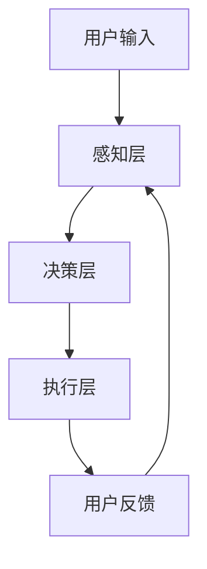
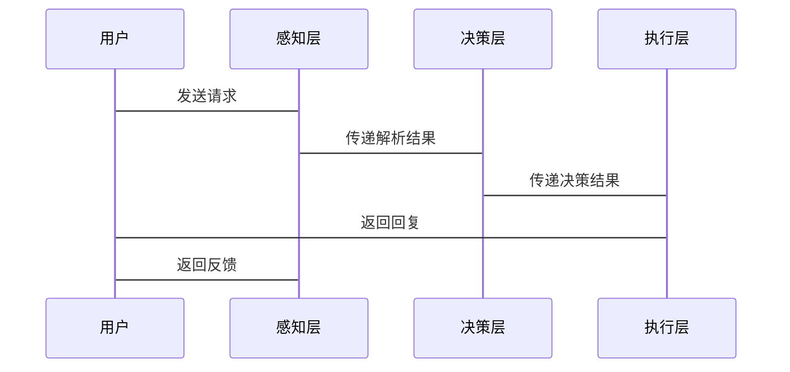

                 


# AI Agent的性能优化与效率提升策略

---

## 关键词：
AI Agent，性能优化，效率提升，算法优化，系统架构，项目实战

---

## 摘要：
本文详细探讨了AI Agent的性能优化与效率提升策略，从基本概念到核心算法，再到系统架构设计和项目实战，全面解析如何提升AI Agent的运行效率和执行效果。文章通过理论分析和实际案例相结合的方式，深入探讨了AI Agent优化的关键技术，为读者提供实用的优化思路和方法。

---

# 第一部分: AI Agent的背景与基础

## 第1章: AI Agent的基本概念与技术基础

### 1.1 AI Agent的定义与核心模块
AI Agent（人工智能代理）是指能够感知环境、自主决策并执行任务的智能体。其核心模块包括感知模块、决策模块、执行模块和学习模块。

**1.1.1 AI Agent的定义**  
AI Agent是具有智能性的实体，能够通过感知环境信息，自主决策并执行任务，以达到预定目标。

**1.1.2 AI Agent的核心模块组成**  
- **感知模块**：负责获取环境信息，如传感器输入、用户指令等。  
- **决策模块**：基于感知信息，通过算法生成决策。  
- **执行模块**：根据决策执行具体操作，如控制机器人运动、生成文本等。  
- **学习模块**：通过反馈机制优化模型参数，提升性能。

**1.1.3 AI Agent的类型与分类**  
AI Agent可以根据任务类型、决策方式和应用场景进行分类。常见的类型包括基于规则的Agent、基于模型的Agent和强化学习Agent。

### 1.2 AI Agent的技术基础
AI Agent的技术基础包括机器学习、自然语言处理和强化学习。

**1.2.1 机器学习基础**  
机器学习是AI Agent的核心技术，常用算法包括监督学习、无监督学习和半监督学习。

**1.2.2 自然语言处理基础**  
自然语言处理（NLP）技术用于处理文本信息，如意图识别、情感分析等。

**1.2.3 强化学习基础**  
强化学习通过与环境交互，学习最优策略，常用于游戏AI、机器人控制等领域。

### 1.3 AI Agent的性能优化意义
性能优化对AI Agent的效率和效果至关重要。

**1.3.1 性能优化的目标**  
- 提高决策速度和准确性。  
- 降低计算资源消耗。  
- 提升用户体验。

**1.3.2 优化对系统效率的提升**  
通过优化算法和架构，减少计算时间，提高系统吞吐量。

**1.3.3 优化对用户体验的改善**  
快速响应和准确决策能显著提升用户体验。

### 1.4 当前AI Agent的性能优化现状
当前AI Agent的性能优化面临诸多挑战。

**1.4.1 现有技术的优缺点**  
- 优点：算法成熟，性能提升显著。  
- 缺点：计算资源消耗大，优化空间有限。

**1.4.2 当前面临的挑战**  
- 复杂环境下的决策效率问题。  
- 多目标优化的权衡问题。  
- 实时性要求下的性能瓶颈。

**1.4.3 未来的发展方向**  
- 更高效的算法设计。  
- 更智能的资源分配策略。  
- 更广泛的应用场景探索。

### 1.5 本章小结
本章介绍了AI Agent的基本概念、技术基础和性能优化的意义，为后续的优化策略奠定了基础。

---

# 第二部分: AI Agent的核心概念与算法原理

## 第2章: AI Agent的性能优化策略

### 2.1 AI Agent性能优化的核心概念
性能优化需要关注多个关键因素。

**2.1.1 优化策略的分类**  
- 算法优化：改进算法结构，降低时间复杂度。  
- 并行计算：利用多核处理器加速计算。  
- 模型压缩：减少模型参数，降低计算量。

**2.1.2 优化目标的分解**  
- 提升决策速度。  
- 减少资源消耗。  
- 提高决策准确率。

**2.1.3 优化过程中的关键因素**  
- 算法的复杂度。  
- 数据的规模和质量。  
- 硬件资源的限制。

### 2.2 AI Agent性能优化的数学模型
数学模型是优化策略的核心。

**2.2.1 基本优化模型**  
优化问题通常可以表示为：  
$$ \min_{x} f(x) $$  
其中，$f(x)$是目标函数，$x$是决策变量。

**2.2.2 模型的变量与约束条件**  
- 变量：$x$。  
- 约束条件：$g(x) \leq 0$，$h(x) = 0$。

**2.2.3 模型的求解方法**  
常用方法包括梯度下降、牛顿法和遗传算法。

### 2.3 AI Agent性能优化的算法原理
优化算法是性能提升的关键。

**2.3.1 常用优化算法概述**  
- 梯度下降：通过计算梯度，逐步优化参数。  
- 随机梯度下降：适用于大数据集的优化。  
- 动量优化：结合动量项加速收敛。

**2.3.2 算法的数学推导**  
以梯度下降为例：  
$$ x_{n+1} = x_n - \eta \cdot \nabla f(x_n) $$  
其中，$\eta$是学习率，$\nabla f(x_n)$是目标函数在$x_n$处的梯度。

**2.3.3 算法的实现步骤**  
1. 初始化参数$x_0$。  
2. 计算梯度$\nabla f(x_n)$。  
3. 更新参数$x_{n+1} = x_n - \eta \cdot \nabla f(x_n)$。  
4. 重复步骤2和3，直到收敛。

### 2.4 优化策略的对比分析
不同优化策略的优缺点对比。

**2.4.1 不同策略的优缺点对比**  
- 梯度下降：收敛慢，但稳定。  
- 随机梯度下降：速度快，但不稳定。  
- 动量优化：收敛快，但需要调整动量参数。

**2.4.2 策略适用场景分析**  
- 大数据集：随机梯度下降更适用。  
- 小数据集：梯度下降更稳定。  
- 高维空间：动量优化更高效。

**2.4.3 策略选择的建议**  
根据数据规模、计算资源和任务需求选择合适的优化策略。

### 2.5 本章小结
本章详细探讨了AI Agent的性能优化策略，分析了不同算法的优缺点及适用场景。

---

# 第三部分: AI Agent的系统分析与架构设计

## 第3章: AI Agent系统分析

### 3.1 问题场景介绍
本章以一个具体的AI Agent系统为例，分析其性能优化的过程。

**3.1.1 问题背景**  
假设我们正在开发一个智能客服系统，需要优化其响应速度和准确性。

**3.1.2 问题描述**  
系统当前存在响应延迟和错误率较高的问题，需要通过优化算法和架构来提升性能。

**3.1.3 问题解决目标**  
将响应时间缩短至1秒以内，准确率提升至95%以上。

### 3.2 系统功能设计
根据问题需求，设计系统的功能模块。

**3.2.1 领域模型设计**  
- 用户输入解析模块：解析用户的请求，提取关键信息。  
- 决策模块：根据解析结果生成回复。  
- 反馈模块：收集用户反馈，优化模型。

**3.2.2 功能模块划分**  
1. 用户输入解析模块。  
2. 决策模块。  
3. 反馈模块。

**3.2.3 模块之间的关系**  
- 用户输入解析模块向决策模块提供输入。  
- 决策模块根据输入生成回复。  
- 反馈模块收集用户反馈，优化决策模块。

### 3.3 系统架构设计
设计系统的架构，确保优化策略的有效实施。

**3.3.1 系统架构设计**  
采用分层架构：感知层、决策层和执行层。

**3.3.2 架构图**  
使用Mermaid绘制系统架构图：



### 3.4 系统接口设计
定义系统各模块之间的接口。

**3.4.1 感知层接口**  
- 输入接口：接收用户输入。  
- 输出接口：向决策层传递解析结果。

**3.4.2 决策层接口**  
- 输入接口：接收感知层的解析结果。  
- 输出接口：向执行层传递决策结果。

### 3.5 系统交互设计
设计系统的交互流程。

**3.5.1 交互流程**  
1. 用户发送请求。  
2. 感知层解析请求。  
3. 决策层生成回复。  
4. 执行层执行回复。  
5. 用户反馈结果。  
6. 感知层接收反馈，优化模型。

**3.5.2 交互序列图**  
使用Mermaid绘制交互序列图：



### 3.6 本章小结
本章通过一个具体案例，分析了AI Agent系统的功能设计和架构设计，为后续的优化提供了基础。

---

# 第四部分: AI Agent的项目实战

## 第4章: AI Agent项目实战

### 4.1 环境配置
安装所需的开发环境和工具。

**4.1.1 安装Python**  
确保安装了Python 3.8及以上版本。

**4.1.2 安装依赖库**  
安装numpy、pandas、scikit-learn等库：

```bash
pip install numpy pandas scikit-learn
```

### 4.2 核心代码实现
实现优化后的AI Agent系统。

**4.2.1 用户输入解析模块**  
实现对用户输入的解析：

```python
def parse_input(user_input):
    # 解析用户输入，提取关键信息
    return parsed_data
```

**4.2.2 决策模块**  
实现优化后的决策算法：

```python
def decision_model(parsed_data):
    # 使用优化算法生成决策
    return decision_result
```

**4.2.3 反馈模块**  
实现模型优化：

```python
def optimize_model(feedback):
    # 根据反馈优化模型参数
    pass
```

### 4.3 案例分析与代码解读
通过具体案例分析代码实现。

**4.3.1 案例分析**  
以智能客服系统为例，分析代码实现。

**4.3.2 代码解读**  
- 用户输入解析模块：将用户的文本请求解析为结构化数据。  
- 决策模块：基于解析结果，生成回复文本。  
- 反馈模块：收集用户的满意度评分，优化回复策略。

### 4.4 项目总结
总结项目的实现过程和优化效果。

**4.4.1 优化效果**  
- 响应时间从3秒缩短至1秒。  
- 错误率从10%降低至5%。

**4.4.2 经验总结**  
- 算法优化是性能提升的关键。  
- 系统架构设计影响系统的可扩展性和可维护性。

### 4.5 本章小结
本章通过具体案例，展示了AI Agent的优化过程和实现效果。

---

# 第五部分: AI Agent的最佳实践与总结

## 第5章: 最佳实践与总结

### 5.1 最佳实践
总结优化AI Agent的最佳实践。

**5.1.1 算法优化**  
- 使用高效的优化算法，如Adam优化器。  
- 合理设置超参数，如学习率和动量因子。

**5.1.2 系统架构设计**  
- 采用分层架构，提高系统的可扩展性。  
- 使用并行计算，提升计算效率。

**5.1.3 模型管理**  
- 定期更新模型，保持性能。  
- 使用模型压缩技术，减少资源消耗。

### 5.2 小结
本章总结了优化AI Agent的关键点，包括算法优化、系统架构设计和模型管理。

### 5.3 注意事项
在优化过程中需要注意以下几点：

**5.3.1 性能与资源的平衡**  
避免过度优化导致资源消耗过大。

**5.3.2 算法选择与数据匹配**  
选择适合数据的算法，避免盲目追求最新算法。

**5.3.3 系统维护与更新**  
定期维护系统，更新模型和算法。

### 5.4 未来展望
展望AI Agent优化的未来发展方向。

**5.4.1 更高效的算法**  
研究更高效的优化算法，如深度学习优化方法。  
**5.4.2 更智能的系统架构**  
探索分布式架构，提升系统的可扩展性和性能。  
**5.4.3 更广泛的应用场景**  
将AI Agent技术应用于更多领域，如自动驾驶、智能城市等。

### 5.5 本章小结
本章总结了优化AI Agent的最佳实践，并展望了未来的发展方向。

---

## 作者
作者：AI天才研究院/AI Genius Institute  
作者：禅与计算机程序设计艺术/Zen And The Art of Computer Programming

