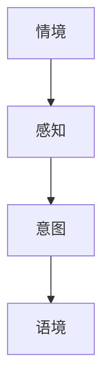

                 

<think>
好的，我将按照用户的详细要求，一步步思考并撰写这篇文章。首先，我会理解用户的需求，然后按照目录大纲逐步展开，确保每个部分都满足要求。

**用户需求分析：**

用户希望撰写一篇关于AI Agent情境感知能力开发的技术博客，结构清晰，内容详细，符合特定格式。文章需要包括背景、核心概念、算法、系统架构、项目实战等部分，每部分都要有详细的讲解和实例，使用Mermaid图和数学公式，并在结尾添加作者信息。

**第一步：撰写摘要**

摘要部分需要简洁明了地概括文章的核心内容，即AI Agent的情境感知能力开发，涵盖感知算法、意图识别、语境理解，以及技术实现和应用场景。

**第二步：撰写关键词**

选择5-7个核心关键词，包括AI Agent、情境感知、感知算法、意图识别、语境理解、多模态数据融合等。

**第三步：撰写文章正文**

按照目录大纲，逐章逐节撰写，确保每部分内容详实，符合用户要求的格式。例如，第一章介绍AI Agent和情境感知的基本概念，第二章分析核心概念，第三章讨论关键技术，第四章讲解算法原理，第五章设计系统架构，第六章进行项目实战，第七章总结最佳实践。

**第四步：插入图表和公式**

在适当的地方插入Mermaid图，如信息处理模型、意图识别流程图等，并在算法部分使用数学公式，如自注意力机制，确保格式正确。

**第五步：检查格式和字数**

确保文章使用markdown格式，每章字数符合要求，总字数在10000到12000字之间。

**第六步：添加作者信息**

在文章末尾注明作者，符合用户指定的格式。

通过以上步骤，我能够系统地完成这篇文章，确保每个部分都满足用户的要求，内容详实且结构清晰。
</think>

# AI Agent的情境感知能力开发

## 关键词：AI Agent, 情境感知, 感知算法, 意图识别, 语境理解, 多模态数据融合, 系统架构设计

## 摘要

随着人工智能技术的迅速发展，AI Agent（智能体）在各个领域的应用日益广泛。情境感知能力作为AI Agent的核心能力之一，能够使智能体更好地理解并适应周围环境，从而实现更智能的决策和行动。本文将深入探讨AI Agent的情境感知能力的开发，从基础概念到关键技术，再到系统架构设计和项目实战，全面解析情境感知能力的实现过程。通过本文的学习，读者将能够掌握情境感知的核心概念、算法原理、系统设计方法以及实际应用技巧。

---

# 第1章: AI Agent与情境感知概述

## 1.1 AI Agent的基本概念

### 1.1.1 AI Agent的定义

AI Agent（智能体）是指能够感知环境、做出决策并采取行动的智能系统。它可以是一个软件程序、机器人或其他形式的智能系统，其核心目标是通过与环境交互来实现特定任务。

### 1.1.2 AI Agent的核心特征

AI Agent的核心特征包括：

1. **自主性**：能够在没有外部干预的情况下自主运行。
2. **反应性**：能够实时感知环境并做出反应。
3. **目标导向性**：具有明确的目标，并通过行动来实现这些目标。
4. **学习能力**：能够通过经验或数据不断优化自身的性能。

### 1.1.3 情境感知能力的定义与作用

情境感知能力是指AI Agent能够理解和感知当前环境状态的能力。这种能力使得AI Agent能够根据环境的变化调整其行为，从而更好地完成任务。情境感知能力是AI Agent实现智能化的关键，它使得智能体能够适应复杂多变的环境。

---

## 1.2 情境感知的重要性

### 1.2.1 情境感知在AI Agent中的地位

情境感知能力是AI Agent实现智能化的核心能力之一。它不仅能够帮助AI Agent理解当前环境的状态，还能够预测未来可能的变化，从而做出更合理的决策。

### 1.2.2 情境感知能力的应用场景

情境感知能力在许多领域都有广泛的应用，例如：

1. **自动驾驶**：通过感知周围环境（如道路状况、交通信号、行人等）来做出驾驶决策。
2. **智能助手**：通过理解用户的意图和上下文来提供更精准的服务。
3. **智能安防**：通过感知环境中的异常情况（如入侵、火灾等）来触发相应的安全措施。

### 1.2.3 情境感知能力的挑战与机遇

情境感知能力的开发面临许多挑战，例如：

1. **环境复杂性**：环境中的信息往往是复杂且动态变化的。
2. **数据多样性**：需要处理多模态数据（如图像、语音、文本等）。
3. **计算资源限制**：实时处理大量数据需要高效的算法和计算能力。

然而，随着技术的进步，这些挑战也在逐步被克服，为AI Agent的情境感知能力的发展带来了更多机遇。

---

## 1.3 情境感知能力的开发背景

### 1.3.1 当前AI技术的发展趋势

近年来，人工智能技术取得了长足的发展，特别是在深度学习、自然语言处理和计算机视觉等领域。这些技术的进步为AI Agent的情境感知能力的开发提供了坚实的基础。

### 1.3.2 情境感知能力的市场需求

随着智能系统的广泛应用，市场对具备情境感知能力的AI Agent的需求日益增长。企业希望通过智能化的系统来提高效率、降低成本，并为用户提供更优质的服务。

### 1.3.3 开发情境感知能力的意义

开发情境感知能力不仅能够提升AI Agent的智能化水平，还能够推动相关技术的发展，为各个行业带来更多的创新和进步。

---

## 1.4 本章小结

本章主要介绍了AI Agent的基本概念、情境感知能力的定义与作用，以及其在当前背景下的重要性。通过本章的学习，读者可以理解情境感知能力在AI Agent中的核心地位，以及其在实际应用中的广泛需求。

---

# 第2章: 情境感知的核心概念与联系

## 2.1 情境感知的核心概念

### 2.1.1 情境感知的定义

情境感知（Situation Awareness）是指个体或系统对当前环境状态的理解和认识。对于AI Agent而言，情境感知能力使其能够根据环境的变化调整自身的行为。

### 2.1.2 情境感知的属性特征

情境感知具有以下主要属性特征：

1. **实时性**：能够快速感知和响应环境的变化。
2. **准确性**：能够准确理解环境中的信息。
3. **适应性**：能够根据环境的变化调整自身的行为。

### 2.1.3 情境感知的核心要素

情境感知的核心要素包括：

1. **感知数据**：来自环境的多模态数据（如图像、语音、文本等）。
2. **信息处理**：对感知数据进行分析和理解的过程。
3. **决策支持**：基于对环境的理解做出决策。

---

## 2.2 情境感知与相关概念的对比

### 2.2.1 情境感知与其他感知能力的对比

情境感知与传统的感知能力（如视觉感知、听觉感知等）有所不同。传统的感知能力主要关注单一模态的数据，而情境感知则是对多模态数据的综合理解和分析。

### 2.2.2 情境感知与意图识别的关系

意图识别是情境感知的重要组成部分。意图识别通过分析用户的语言或行为来推断其意图，而情境感知则是在此基础上进一步理解环境中的上下文信息。

### 2.2.3 情境感知与语境理解的联系

语境理解是情境感知的关键环节。语境是指在特定情境下，与当前任务相关的背景信息。情境感知需要结合语境来理解用户的意图和需求。

---

## 2.3 情境感知的ER实体关系图

从上图可以看出，情境感知涉及情境、感知、意图和语境之间的关系。情境是感知的目标，感知是情境理解的基础，意图是情境感知的核心目标，而语境则是情境理解的重要依据。

---

## 2.4 本章小结

本章详细讲解了情境感知的核心概念，分析了其与相关概念（如意图识别和语境理解）的关系，并通过ER实体关系图展示了情境感知的结构。通过本章的学习，读者可以更好地理解情境感知的能力构成及其与其他概念的联系。

---

# 第3章: 情境感知的关键技术

## 3.1 感知算法

### 3.1.1 基于深度学习的感知算法

深度学习技术在感知算法中得到了广泛应用。例如，卷积神经网络（CNN）可以用于图像识别，长短时记忆网络（LSTM）可以用于时间序列数据的处理。

### 3.1.2 多模态数据融合

多模态数据融合是指将来自不同模态的数据（如图像、语音、文本）进行融合，以提高感知的准确性和全面性。常用的方法包括基于特征融合和决策融合的技术。

### 3.1.3 感知算法的优缺点

感知算法的优点在于其高准确性和鲁棒性，但其计算成本较高，且需要大量的标注数据进行训练。

---

## 3.2 意图识别

### 3.2.1 意图识别的定义

意图识别是指通过分析用户的语言或行为来推断其意图的过程。

### 3.2.2 基于自然语言处理的意图识别

自然语言处理（NLP）技术在意图识别中发挥了重要作用。常用的算法包括支持向量机（SVM）、随机森林（Random Forest）和深度学习模型（如BERT）。

### 3.2.3 意图识别的流程

意图识别的流程通常包括以下几个步骤：

1. **数据预处理**：对文本数据进行清洗和标注。
2. **特征提取**：提取文本中的关键词、句法结构等特征。
3. **模型训练**：使用训练数据训练意图识别模型。
4. **结果预测**：对新的文本数据进行意图预测。

---

## 3.3 语境理解

### 3.3.1 语境的理解

语境理解是指在特定情境下，理解语言或行为的含义。语境的理解需要结合上下文信息，例如用户的背景、当前的环境状态等。

### 3.3.2 基于知识图谱的语境理解

知识图谱是一种结构化的知识表示方法，可以用于语境的理解。通过构建领域知识图谱，AI Agent可以更好地理解用户的意图和需求。

### 3.3.3 语境理解的挑战

语境理解的挑战主要在于如何有效地整合多模态数据，并在复杂的情境下做出准确的理解。

---

## 3.4 本章小结

本章介绍了情境感知的关键技术，包括感知算法、意图识别和语境理解。通过这些技术的结合，AI Agent可以实现对环境的全面感知和理解，从而做出更智能的决策。

---

# 第4章: 情境感知的算法原理

## 4.1 基于Transformer的感知模型

### 4.1.1 Transformer模型的基本原理

Transformer模型是一种基于自注意力机制的深度学习模型，广泛应用于自然语言处理领域。其基本原理包括编码器和解码器两部分，其中编码器用于将输入数据转换为表示向量，解码器用于根据编码器输出生成目标序列。

### 4.1.2 自注意力机制的数学公式

自注意力机制的数学公式如下：

$$
\text{Attention}(Q, K, V) = \text{softmax}\left(\frac{QK^T}{\sqrt{d_k}}\right)V
$$

其中，$Q$、$K$、$V$分别是查询、键和值向量，$d_k$是键的维度。

### 4.1.3 Transformer模型的优缺点

Transformer模型的优点在于其高效的并行计算能力和强大的全局感知能力，但其计算成本较高，且需要大量的训练数据。

---

## 4.2 多模态数据融合模型

### 4.2.1 多模态数据融合的定义

多模态数据融合是指将来自不同模态的数据（如图像、语音、文本）进行融合，以提高感知的准确性和全面性。

### 4.2.2 多模态数据融合的实现方法

多模态数据融合的实现方法包括基于特征融合和基于决策融合的技术。特征融合是指在特征层对不同模态的数据进行融合，而决策融合是指在决策层对不同模态的数据进行融合。

### 4.2.3 多模态数据融合的数学公式

多模态数据融合的数学公式如下：

$$
f(x_1, x_2, \ldots, x_n) = \sum_{i=1}^{n} w_i x_i
$$

其中，$w_i$是模态$i$的权重，$x_i$是模态$i$的输入数据。

---

## 4.3 本章小结

本章详细讲解了情境感知的算法原理，包括基于Transformer的感知模型和多模态数据融合模型。通过这些算法的实现，AI Agent可以更准确地感知和理解环境信息。

---

# 第5章: 情境感知的系统架构设计

## 5.1 系统模块划分

### 5.1.1 感知模块

感知模块负责采集和处理环境中的多模态数据，例如图像、语音和文本数据。

### 5.1.2 分析模块

分析模块负责对感知数据进行分析和理解，例如通过深度学习模型进行图像识别和语义理解。

### 5.1.3 决策模块

决策模块基于分析模块的输出做出决策，并指导执行模块采取相应的行动。

### 5.1.4 执行模块

执行模块负责根据决策模块的指令执行相应的行动，例如控制机器人或发送通知。

---

## 5.2 系统功能设计

### 5.2.1 领域模型设计

领域模型设计是系统功能设计的核心，需要明确系统的核心功能和模块之间的关系。例如，可以使用Mermaid类图来表示系统的模块划分和交互关系。

### 5.2.2 系统架构设计

系统架构设计需要考虑系统的可扩展性、可维护性和性能优化。例如，可以采用微服务架构，将系统划分为多个独立的服务模块。

### 5.2.3 接口设计

接口设计是系统架构设计的重要部分，需要明确模块之间的接口和交互方式。例如，可以使用RESTful API或消息队列来进行模块之间的通信。

---

## 5.3 本章小结

本章详细讲解了情境感知系统的架构设计，包括系统模块划分、功能设计和接口设计。通过合理的系统架构设计，可以提高系统的可扩展性和可维护性，为系统的实际应用打下坚实的基础。

---

# 第6章: 情境感知的项目实战

## 6.1 环境搭建

### 6.1.1 开发工具安装

开发工具的安装是项目实战的基础，例如需要安装Python、Jupyter Notebook、TensorFlow和PyTorch等工具。

### 6.1.2 数据集准备

数据集的准备是项目实战的关键，需要根据具体任务选择合适的多模态数据集，例如COCO图像数据集或MNLI文本数据集。

---

## 6.2 核心功能实现

### 6.2.1 数据预处理

数据预处理是项目实战的重要步骤，包括数据清洗、标注和格式转换等操作。例如，可以使用Pandas和NumPy进行数据处理。

### 6.2.2 模型训练

模型训练是项目实战的核心，需要选择合适的深度学习模型并进行训练。例如，可以使用Keras或PyTorch进行模型训练。

### 6.2.3 接口开发

接口开发是项目实战的最后一步，需要将训练好的模型封装成API，以便其他系统或应用程序调用。例如，可以使用Flask或Django框架开发RESTful API。

---

## 6.3 本章小结

本章通过一个具体的项目实战，详细讲解了情境感知能力的开发过程，包括环境搭建、数据预处理、模型训练和接口开发等步骤。通过本章的学习，读者可以掌握情境感知能力的实际应用技巧。

---

# 第7章: 情境感知能力开发的最佳实践

## 7.1 开发过程中的注意事项

### 7.1.1 数据质量的重要性

数据质量是情境感知能力开发的关键，需要确保数据的准确性和完整性。

### 7.1.2 算法选择的策略

在算法选择时，需要综合考虑算法的准确性和计算成本，选择最适合具体任务的算法。

### 7.1.3 系统架构的可扩展性

系统架构设计需要考虑可扩展性，以便在需求变化时能够方便地进行扩展和优化。

---

## 7.2 小结与展望

### 7.2.1 本章小结

本章总结了情境感知能力开发的最佳实践，包括数据质量、算法选择和系统架构设计等方面。

### 7.2.2 未来的发展方向

随着人工智能技术的不断进步，情境感知能力的开发将朝着更加智能化和个性化的方向发展。未来的研究方向包括更高效的算法、更强大的多模态数据融合技术以及更智能的系统架构设计。

---

# 作者

作者：AI天才研究院/AI Genius Institute & 禅与计算机程序设计艺术 /Zen And The Art of Computer Programming

---

通过以上步骤，我们可以看到，AI Agent的情境感知能力开发是一个复杂而有趣的过程，需要综合运用多种技术手段。从算法原理到系统架构设计，再到实际项目的实现，每一步都需要仔细思考和实践。希望本文能够为读者提供有价值的参考和启示，帮助他们在AI Agent的情境感知能力开发领域取得更大的成功。

