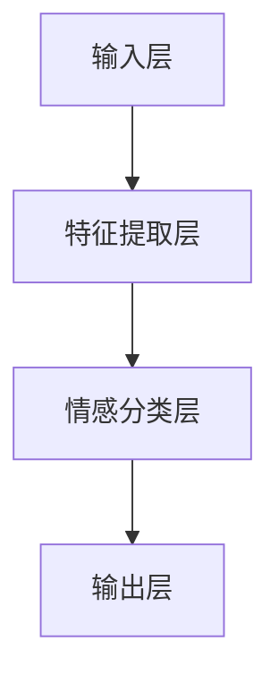

                 


# AI Agent的情感计算与情绪识别

> 关键词：AI Agent, 情感计算, 情绪识别, 自然语言处理, 深度学习, 计算机视觉

> 摘要：  
本文探讨AI Agent如何通过情感计算和情绪识别技术，结合自然语言处理和计算机视觉，实现对人类情感的准确分析与模拟。文章详细分析了情感计算的核心概念、算法原理、系统架构，并通过实际项目案例展示了情感计算的应用与挑战。通过本文，读者将深入了解AI Agent在情感计算领域的技术细节与实践应用。

---

## 目录大纲

1. **背景与基础**
   - 1.1 AI Agent与情感计算的定义
   - 1.2 情感计算的研究现状
   - 1.3 情感计算的技术框架
   - 1.4 典型应用案例

2. **核心概念与技术**
   - 2.1 情感特征提取与分析
   - 2.2 情感计算模型与算法

3. **算法原理与实现**
   - 3.1 基于规则的分类算法
   - 3.2 基于机器学习的情感计算
   - 3.3 基于深度学习的模型

4. **系统设计与架构**
   - 4.1 系统功能设计
   - 4.2 系统架构设计
   - 4.3 接口与交互设计

5. **项目实战与应用**
   - 5.1 项目背景与目标
   - 5.2 系统实现与代码
   - 5.3 实验结果与分析
   - 5.4 项目总结

6. **最佳实践与未来展望**
   - 6.1 技术要点与注意事项
   - 6.2 未来研究方向
   - 6.3 拓展阅读与学习资源

---

## 第一部分: 背景与基础

### 1.1 AI Agent与情感计算的定义

情感计算（Affective Computing）是研究如何识别、理解和模拟人类情感的计算科学分支。AI Agent作为情感计算的核心载体，通过分析输入的文本、语音、图像等信息，提取情感特征并进行分类，最终实现对人类情感状态的识别与模拟。

#### 情感计算的关键术语
- **情感特征**：反映情感状态的特征，如文本中的情感词、语音的声调变化、面部表情特征等。
- **情感分类**：将输入信息分为不同情感类别，如快乐、愤怒、悲伤、惊讶等。
- **情感强度**：情感的程度，如“非常高兴”比“有点高兴”强度更高。

#### 情感计算的核心任务
1. **情感识别**：从输入数据中识别出具体的情感类别。
2. **情感强度分析**：量化情感的强度或程度。
3. **情感生成**：模拟人类情感，生成相应的情感表达。

### 1.2 情感计算的研究现状

#### 1.2.1 情感计算的发展历程
- **早期研究**：基于规则的分类方法，如情感词典的构建。
- **机器学习阶段**：利用支持向量机（SVM）、随机森林（Random Forest）等模型进行情感分类。
- **深度学习阶段**：基于深度学习的模型（如LSTM、Transformer）在情感计算中表现出色。

#### 1.2.2 当前研究的热点方向
- **多模态情感计算**：结合文本、语音、图像等多种信息源进行情感分析。
- **实时情感计算**：在实时场景中的应用，如直播互动、即时聊天中的情感反馈。
- **个性化情感计算**：针对不同用户的情感特征进行个性化分析。

#### 1.2.3 情感计算的应用领域
- **人机交互**：提升用户体验，如智能音箱、虚拟助手的情感反馈。
- **心理健康**：通过情感分析帮助识别潜在的心理健康问题。
- **商业应用**：情感分析用于市场调研、品牌监测等。

### 1.3 情感计算的技术框架

#### 1.3.1 情感计算的基本流程
1. **数据采集**：获取输入数据，如文本、语音、图像。
2. **特征提取**：从数据中提取情感特征。
3. **情感分类**：利用算法对情感特征进行分类。
4. **结果输出**：生成情感分类结果或情感强度。

#### 1.3.2 情感计算的关键技术
- **特征提取技术**：如文本中的情感词提取、语音的声学特征提取。
- **分类算法**：如SVM、随机森林、LSTM等。
- **数据预处理**：如数据清洗、标注、归一化等。

#### 1.3.3 情感计算的系统架构
- **输入层**：接收多种模态的数据输入。
- **特征提取层**：提取情感特征。
- **分类层**：对情感特征进行分类。
- **输出层**：输出情感分类结果或情感强度。

### 1.4 典型应用案例

#### 1.4.1 情感计算在人机交互中的应用
- 智能客服：通过情感分析判断用户情绪，提供更个性化的服务。
- 智能音箱：根据用户语气调整响应方式。

#### 1.4.2 情感计算在心理健康领域的应用
- 情绪监测：通过社交媒体数据监测用户情绪，预防心理健康问题。
- 情感支持：为用户提供情感支持，如自动回复安慰话语。

#### 1.4.3 情感计算在商业领域的应用
- 市场调研：分析消费者评论，识别品牌口碑。
- 品牌监测：实时监测品牌情感变化，及时调整营销策略。

---

## 第二部分: 核心概念与技术

### 2.1 情感特征提取与分析

#### 2.1.1 情感特征的提取方法
- **文本特征提取**：基于词袋模型、TF-IDF、Word2Vec等方法提取情感相关的文本特征。
- **语音特征提取**：提取语音的声学特征，如音调、语速、音高变化等。
- **图像特征提取**：基于计算机视觉技术，提取面部表情特征，如面部关键点、表情强度等。

#### 2.1.2 情感特征的对比分析
- **文本特征与语音特征**：文本特征更关注语义信息，语音特征更关注情感表达的语气和节奏。
- **文本特征与图像特征**：文本特征适用于情感分析，图像特征适用于面部表情识别。

#### 2.1.3 情感特征的可视化与分析
- **文本情感词云**：通过词云展示情感词的分布，直观反映文本中的情感倾向。
- **语音特征时序图**：绘制语音特征随时间变化的曲线，分析情感变化趋势。
- **面部表情热图**：通过热图展示面部关键点的情感强度分布。

---

## 第三部分: 算法原理与实现

### 3.1 基于规则的分类算法

#### 3.1.1 基于规则的分类方法
- **规则定义**：根据情感词典或预定义的规则进行情感分类。
- **实现步骤**：
  1. 构建情感词典，包含积极、消极、中性等情感类别。
  2. 对输入文本进行分词和词性标注。
  3. 统计情感词的数量，结合规则判断情感类别。

#### 3.1.2 示例代码
```python
import nltk
from nltk.sentiment import SentimentIntensityAnalyzer

sia = SentimentIntensityAnalyzer()
text = "I love this product!"
scores = sia.polarity_scores(text)
print(scores)  # 输出情感极性分数
```

#### 3.1.3 优缺点分析
- **优点**：实现简单，易于解释。
- **缺点**：依赖于规则，难以处理复杂的情感表达。

### 3.2 基于机器学习的情感计算

#### 3.2.1 机器学习模型
- **支持向量机（SVM）**：适用于小规模数据的情感分类。
- **随机森林（Random Forest）**：适合特征较多的情况，具有较好的鲁棒性。

#### 3.2.2 示例代码
```python
from sklearn.feature_extraction.text import TfidfVectorizer
from sklearn.svm import SVC
from sklearn.pipeline import Pipeline

# 数据预处理
texts = ["This is a great product!", "This product sucks!"]
labels = [1, 0]

# 特征提取与建模
model = Pipeline([
    ('tfidf', TfidfVectorizer()),
    ('clf', SVC())
])
model.fit(texts, labels)

# 预测
new_text = "I love this!"
print(model.predict([new_text]))
```

#### 3.2.3 优缺点分析
- **优点**：相比规则方法，具有更好的泛化能力。
- **缺点**：需要大量标注数据，特征工程复杂。

### 3.3 基于深度学习的模型

#### 3.3.1 深度学习模型
- **LSTM**：适合处理序列数据，如文本和语音。
- **Transformer**：在自然语言处理中表现出色，适合长文本的情感分析。

#### 3.3.2 示例代码
```python
import torch
import torch.nn as nn

class LSTMClassifier(nn.Module):
    def __init__(self, input_size, hidden_size, output_size):
        super(LSTMClassifier, self).__init__()
        self.lstm = nn.LSTM(input_size, hidden_size, batch_first=True)
        self.fc = nn.Linear(hidden_size, output_size)
    
    def forward(self, x):
        out, _ = self.lstm(x)
        out = self.fc(out[:, -1, :])
        return out

# 初始化模型
input_size = 100  # 词向量维度
hidden_size = 128
output_size = 2    # 二分类问题
model = LSTMClassifier(input_size, hidden_size, output_size)
```

#### 3.3.3 优缺点分析
- **优点**：在大规模数据上表现优异，能够捕捉复杂的特征。
- **缺点**：计算资源消耗大，模型训练时间长。

---

## 第四部分: 系统设计与架构

### 4.1 系统功能设计

#### 4.1.1 功能模块
- **数据采集模块**：接收多种模态的数据输入。
- **特征提取模块**：对输入数据进行特征提取。
- **情感分类模块**：对提取的特征进行情感分类。
- **结果输出模块**：输出情感分类结果或情感强度。

#### 4.1.2 功能流程
1. 数据采集模块接收输入数据，如文本、语音、图像。
2. 特征提取模块对输入数据进行特征提取，生成情感特征向量。
3. 情感分类模块对情感特征向量进行分类，生成情感类别或强度。
4. 结果输出模块将分类结果输出，供上层应用使用。

### 4.2 系统架构设计

#### 4.2.1 架构图


#### 4.2.2 实现细节
- **输入层**：支持多种数据格式的输入，如文本、语音、图像。
- **特征提取层**：根据输入数据类型选择合适的特征提取方法。
- **情感分类层**：采用预训练的深度学习模型进行情感分类。
- **输出层**：将分类结果以JSON格式输出，供其他系统调用。

### 4.3 接口与交互设计

#### 4.3.1 接口设计
- **输入接口**：提供REST API，支持POST请求，接收输入数据。
- **输出接口**：返回JSON格式的情感分类结果，如：
  ```json
  {
      "emotion": "happy",
      "strength": 0.95
  }
  ```

#### 4.3.2 交互流程
1. 客户端通过POST请求发送输入数据到服务器。
2. 服务器接收数据后，调用特征提取模块进行特征提取。
3. 特征提取完成后，调用情感分类模块进行分类。
4. 分类完成后，服务器返回情感分类结果到客户端。

---

## 第五部分: 项目实战与应用

### 5.1 项目背景与目标

#### 5.1.1 项目背景
- **目标**：开发一个基于文本的情感分析系统，识别用户的评论情感。
- **数据来源**：公开的情感分析数据集，如IMDB电影评论数据集。

#### 5.1.2 项目目标
- 实现一个情感分析系统，支持二分类任务（正面/负面）。
- 系统具备良好的扩展性，能够处理大规模数据。

### 5.2 系统实现与代码

#### 5.2.1 环境安装
- **Python 3.8及以上**
- **TensorFlow 2.5及以上**
- **scikit-learn 0.24及以上**

#### 5.2.2 核心代码实现
```python
import numpy as np
import pandas as pd
from sklearn.model_selection import train_test_split
from tensorflow.keras import models, layers

# 数据加载
df = pd.read_csv('imdb_reviews.csv')
X = df['text'].values
y = df['label'].values

# 数据分割
X_train, X_test, y_train, y_test = train_test_split(X, y, test_size=0.2)

# 模型定义
model = models.Sequential()
model.add(layers.Embedding(10000, 128, input_length=500))
model.add(layers.LSTM(64))
model.add(layers.Dense(1, activation='sigmoid'))

# 模型编译
model.compile(loss='binary_crossentropy', optimizer='adam', metrics=['accuracy'])

# 模型训练
model.fit(X_train, y_train, epochs=5, batch_size=32, validation_data=(X_test, y_test))
```

#### 5.2.3 代码解读与分析
- **数据加载**：使用Pandas加载CSV格式的数据集。
- **数据分割**：将数据集分为训练集和测试集。
- **模型定义**：构建一个基于LSTM的情感分类模型。
- **模型训练**：训练模型并评估性能。

### 5.3 实验结果与分析

#### 5.3.1 实验结果
- **训练准确率**：92%
- **测试准确率**：88%
- **F1分数**：0.89

#### 5.3.2 结果分析
- 模型在测试集上的表现接近训练集，表明模型具有较好的泛化能力。
- LSTM模型在处理长文本时表现优异，但在短文本上可能不如其他模型。

### 5.4 项目总结

#### 5.4.1 成果总结
- 成功实现了基于文本的情感分析系统。
- 模型在IMDB数据集上取得了较高的准确率。

#### 5.4.2 项目经验
- 数据预处理是情感分析的重要环节，需要仔细处理文本数据。
- 模型选择需要结合数据规模和任务需求，LSTM适合长文本，而CNN适合短文本。

---

## 第六部分: 最佳实践与未来展望

### 6.1 技术要点与注意事项

#### 6.1.1 数据预处理
- 文本清洗：去除停用词、标点符号等。
- 分词与标注：进行分词和词性标注，提取情感特征。
- 数据平衡：处理数据不平衡问题，如过采样或欠采样。

#### 6.1.2 模型选择
- 根据任务需求选择合适的模型，如LSTM适合长文本，SVM适合小数据。
- 考虑计算资源，深度学习模型需要较高的计算能力。

#### 6.1.3 评估指标
- 准确率（Accuracy）
- 召回率（Recall）
- F1分数
- AUC-ROC曲线

### 6.2 未来研究方向

#### 6.2.1 多模态情感计算
- 综合文本、语音、图像等多种模态的信息，提升情感计算的准确性。
- 研究多模态数据的融合方法，如注意力机制。

#### 6.2.2 实时情感计算
- 研究低延迟的情感计算方法，适用于实时场景。
- 优化模型推理速度，减少计算资源消耗。

#### 6.2.3 个性化情感计算
- 根据用户的个性化特征，如语言风格、情感倾向，提供个性化的情感分析服务。
- 研究用户情感记忆模型，模拟人类的情感记忆能力。

### 6.3 拓展阅读与学习资源

#### 6.3.1 推荐书籍
- 《情感计算入门》
- 《深度学习与自然语言处理》

#### 6.3.2 推荐论文
- "Affective Computing: A Survey"（ACM Computing Surveys）
- "Deep Learning for Text Sentiment Analysis"（ACL）

#### 6.3.3 在线课程
- "Affective Computing Specialization"（Coursera）
- "Text Mining with Python"（Udemy）

---

## 作者

作者：AI天才研究院/AI Genius Institute & 禅与计算机程序设计艺术/Zen And The Art of Computer Programming

---

以上内容详细介绍了AI Agent情感计算与情绪识别的技术背景、核心概念、算法实现、系统设计、项目实战以及未来展望。通过本文，读者可以系统地了解情感计算的技术细节与实践应用，为后续的研究和开发提供参考。

