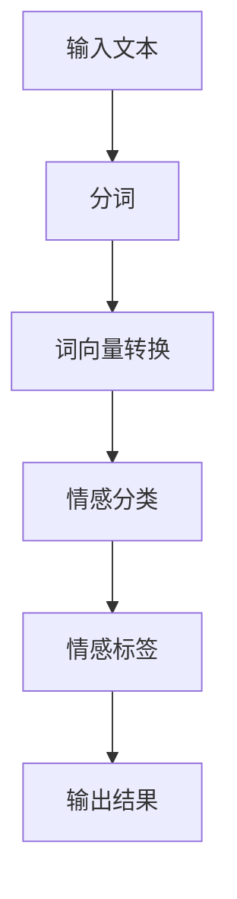
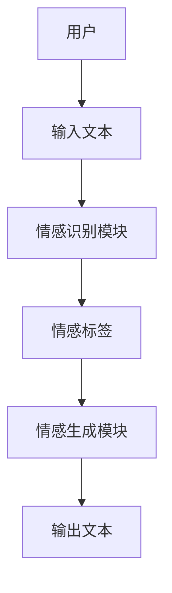

                 


# AI Agent的情感计算与表达模块

## 关键词：AI Agent, 情感计算, 情感表达, 自然语言处理, 机器学习, 深度学习

## 摘要：  
本文探讨了AI Agent的情感计算与表达模块，从核心概念到算法实现，再到系统设计和项目实战，详细分析了情感计算在AI Agent中的重要性及其应用。通过逐步推理和实际案例，本文为读者提供了全面的理解和实践指导。

---

# 第1章: AI Agent与情感计算的背景介绍

## 1.1 情感计算的基本概念  
### 1.1.1 情感计算的定义与核心要素  
情感计算（Affective Computing）是指通过计算手段理解和模拟人类情感的过程。其核心要素包括：  
1. **情感识别**：从输入数据中提取情感信息。  
2. **情感分析**：判断情感的极性（正面、负面、中性）。  
3. **情感生成**：根据情感信息生成相应的情感表达。  

### 1.1.2 AI Agent的基本概念与功能  
AI Agent（人工智能代理）是一种智能系统，能够感知环境、自主决策并执行任务。其核心功能包括：  
1. **感知**：通过传感器或输入数据感知环境。  
2. **推理**：基于感知信息进行逻辑推理。  
3. **决策**：根据推理结果做出最优决策。  
4. **执行**：通过执行机构或输出模块完成任务。  

### 1.1.3 情感计算在AI Agent中的作用  
情感计算使AI Agent能够理解和表达情感，从而增强人机交互的自然性和智能性。例如，在智能客服中，情感计算可以帮助系统理解用户的情绪并提供更贴心的服务。

---

## 1.2 情感计算与AI Agent的结合  
### 1.2.1 情感计算的核心问题与挑战  
1. **情感识别的准确性**：如何准确识别复杂的情感。  
2. **情感表达的多样性**：如何生成多样化的情感表达。  
3. **跨模态处理**：如何处理文本、语音、图像等多种模态的情感信息。  

### 1.2.2 AI Agent的情感计算应用场景  
1. **智能客服**：通过情感分析判断用户情绪，提供更个性化的服务。  
2. **情感陪聊机器人**：通过情感生成模块与用户进行自然对话。  
3. **情感健康助手**：帮助用户识别和管理情感状态。  

### 1.2.3 情感计算与AI Agent的未来发展  
随着深度学习和自然语言处理技术的进步，情感计算在AI Agent中的应用将更加广泛，情感识别和生成的准确性和自然性也将进一步提升。

---

## 1.3 情感计算与AI Agent的研究现状  
### 1.3.1 情感计算的主要研究方向  
1. **情感识别**：基于机器学习和深度学习的情感分类技术。  
2. **情感生成**：基于生成模型（如GPT）的情感文本生成。  
3. **跨模态情感计算**：结合文本、语音和图像的情感分析。  

### 1.3.2 AI Agent在情感计算领域的应用案例  
1. **智能音箱**：通过语音交互理解用户情感并提供个性化服务。  
2. **虚拟助手**：通过情感分析优化与用户的交互体验。  

### 1.3.3 当前技术的局限性与未来挑战  
1. **情感识别的歧义性**：同一情感可能有不同的表达方式。  
2. **跨模态处理的复杂性**：需要协调多种模态的信息。  
3. **情感生成的可控性**：如何控制生成的情感表达的强度和语气。  

---

# 第2章: 情感计算的核心概念与联系  

## 2.1 情感计算的核心原理  
### 2.1.1 情感计算的向量表示  
情感计算通常将情感信息表示为向量，例如使用词嵌入（Word Embedding）技术将情感词汇映射到高维空间中。  

### 2.1.2 情感计算的距离度量  
常用的距离度量方法包括：  
1. **欧氏距离**：$d(x, y) = \sqrt{(x_1 - y_1)^2 + (x_2 - y_2)^2 + \dots}$  
2. **余弦相似度**：$s(x, y) = \frac{x \cdot y}{\|x\| \|y\|}$  

### 2.1.3 情感计算的相似度计算  
基于相似度计算，可以对情感进行分类或聚类。例如，将相似度高于阈值的情感归为一类。  

## 2.2 AI Agent情感计算的核心要素  
### 2.2.1 情感识别的核心要素  
1. **输入数据**：文本、语音、图像等。  
2. **特征提取**：从输入数据中提取情感相关的特征。  
3. **情感分类**：基于特征进行情感分类。  

### 2.2.2 情感生成的核心要素  
1. **情感模板**：定义情感表达的模板结构。  
2. **生成模型**：基于模板生成情感表达内容。  

### 2.2.3 情感表达的核心要素  
1. **表达形式**：文本、语音、图像等。  
2. **表达风格**：正式、口语化、幽默等。  

## 2.3 情感计算与AI Agent的实体关系图  


---

# 第3章: 情感计算的数学模型与算法原理  

## 3.1 情感计算的数学模型  
### 3.1.1 情感计算的向量表示  
情感计算通常将情感信息表示为向量，例如使用词嵌入（Word Embedding）技术将情感词汇映射到高维空间中。  

### 3.1.2 情感计算的距离度量  
常用的距离度量方法包括：  
1. **欧氏距离**：$d(x, y) = \sqrt{(x_1 - y_1)^2 + (x_2 - y_2)^2 + \dots}$  
2. **余弦相似度**：$s(x, y) = \frac{x \cdot y}{\|x\| \|y\|}$  

### 3.1.3 情感计算的相似度计算  
基于相似度计算，可以对情感进行分类或聚类。例如，将相似度高于阈值的情感归为一类。  

## 3.2 情感计算的经典算法  
### 3.2.1 基于规则的情感分析算法  
1. **规则定义**：例如，设定某些关键词为正面或负面情感的标志。  
2. **情感分类**：基于关键词匹配进行情感分类。  

### 3.2.2 基于统计的情感分析算法  
1. **特征提取**：使用词袋模型或词嵌入提取特征。  
2. **模型训练**：使用朴素贝叶斯或支持向量机进行训练。  

### 3.2.3 基于深度学习的情感分析算法  
1. **模型选择**：使用CNN、RNN或Transformer模型。  
2. **训练过程**：通过反向传播算法优化模型参数。  

## 3.3 情感计算的算法流程图  


---

## 3.4 情感计算的数学公式  
### 3.4.1 情感计算的距离公式  
$$d(x, y) = \sqrt{(x_1 - y_1)^2 + (x_2 - y_2)^2 + \dots}$$  

### 3.4.2 情感计算的相似度公式  
$$s(x, y) = \frac{x \cdot y}{\|x\| \|y\|}$$  

---

## 3.5 情感计算的实现代码  
以下是一个基于Python的情感计算实现示例：  

```python
import numpy as np
from sklearn.metrics.pairwise import cosine_similarity

# 示例输入
text1 = "I love this product!"
text2 = "I hate this product!"

# 分词处理
def tokenize(text):
    return text.split()

tokens1 = tokenize(text1)
tokens2 = tokenize(text2)

# 词向量转换（假设已训练好词向量）
def get_word_vector(word):
    return np.random.rand(100)  # 随机生成向量示例

vector1 = np.mean([get_word_vector(word) for word in tokens1], axis=0)
vector2 = np.mean([get_word_vector(word) for word in tokens2], axis=0)

# 计算余弦相似度
similarity = cosine_similarity([vector1], [vector2])[0][0]
print(f"相似度：{similarity}")
```

---

# 第4章: AI Agent情感计算的系统架构设计  

## 4.1 情感计算模块的功能设计  
### 4.1.1 模块划分  
1. **情感识别模块**：负责从输入数据中提取情感信息。  
2. **情感生成模块**：负责根据情感信息生成情感表达内容。  

### 4.1.2 功能描述  
1. **情感识别**：输入文本，输出情感标签（如正面、负面、中性）。  
2. **情感生成**：输入情感标签，输出对应的情感表达文本。  

## 4.2 系统架构设计  
### 4.2.1 系统模块划分  


### 4.2.2 系统交互流程图  


---

## 4.3 情感计算模块的交互设计  
### 4.3.1 输入接口  
- **文本输入**：用户输入需要分析情感的文本。  
- **语音输入**：用户输入包含情感的语音数据。  

### 4.3.2 输出接口  
- **情感标签**：返回情感分类结果。  
- **情感表达**：返回生成的情感文本或语音。  

---

## 4.4 情感计算模块的实现代码  
以下是一个情感计算模块的实现示例：  

```python
class AffectiveComputingModule:
    def __init__(self):
        self.models = {
            'emotion_classifier': self._emotion_classifier,
            'emotion_generator': self._emotion_generator
        }
    
    def _emotion_classifier(self, text):
        # 示例：使用简单规则进行情感分类
        positive_words = ['love', 'like', 'enjoy']
        negative_words = ['hate', 'dislike', '讨厌']
        tokens = text.lower().split()
        positive_count = sum([1 for word in tokens if word in positive_words])
        negative_count = sum([1 for word in tokens if word in negative_words])
        if positive_count > negative_count:
            return 'positive'
        elif negative_count > positive_count:
            return 'negative'
        else:
            return 'neutral'
    
    def _emotion_generator(self, emotion):
        # 示例：生成情感表达文本
        templates = {
            'positive': "I feel happy because of your kind words.",
            'negative': "I understand your frustration, let me help you.",
            'neutral': "Thank you for your feedback."
        }
        return templates[emotion]
    
    def process(self, text):
        emotion = self.models['emotion_classifier'](text)
        return self.models['emotion_generator'](emotion)
```

---

# 第5章: 项目实战—基于AI Agent的情感计算模块开发  

## 5.1 项目背景与目标  
本项目旨在开发一个基于AI Agent的情感计算模块，能够实现情感识别和情感生成功能。  

## 5.2 项目环境搭建  
### 5.2.1 环境要求  
- Python 3.8及以上版本  
- 必要的Python库：numpy、scikit-learn、transformers  

### 5.2.2 安装依赖  
```bash
pip install numpy scikit-learn transformers
```

---

## 5.3 核心代码实现  
### 5.3.1 情感识别模块  
```python
from sklearn.feature_extraction.text import TfidfVectorizer
from sklearn.svm import SVC

class EmotionClassifier:
    def __init__(self):
        self.vectorizer = TfidfVectorizer()
        self.classifier = SVC()

    def fit(self, texts, labels):
        X = self.vectorizer.fit_transform(texts)
        self.classifier.fit(X, labels)

    def predict(self, texts):
        X = self.vectorizer.transform(texts)
        return self.classifier.predict(X)
```

### 5.3.2 情感生成模块  
```python
from transformers import pipeline

class EmotionGenerator:
    def __init__(self):
        self.generator = pipeline('text-generation', model='gpt2')

    def generate(self, emotion, prompt):
        # 示例：根据情感生成文本
        if emotion == 'positive':
            prompt = "I feel happy because "
        elif emotion == 'negative':
            prompt = "I understand your frustration, "
        else:
            prompt = "Thank you for your feedback."
        return self.generator(prompt, max_length=50, num_return_sequences=1)[0]['text']
```

---

## 5.4 项目实战案例  
### 5.4.1 案例分析  
假设用户输入文本为：“I love this product!”，系统将识别情感为“positive”，并生成回应：“I feel happy because of your kind words.”  

### 5.4.2 代码实现  
```python
# 初始化模块
classifier = EmotionClassifier()
generator = EmotionGenerator()

# 训练模型
texts = ["I love this product!", "I hate this product!", "This is great!"]
labels = ['positive', 'negative', 'positive']
classifier.fit(texts, labels)

# 测试
input_text = "I love this product!"
emotion = classifier.predict([input_text])[0]
response = generator.generate(emotion, input_text)
print(f"输入文本：{input_text}")
print(f"识别情感：{emotion}")
print(f"生成回应：{response}")
```

---

## 5.5 项目总结与优化  
### 5.5.1 项目总结  
通过本项目，我们实现了基于AI Agent的情感计算模块，能够进行情感识别和情感生成。  

### 5.5.2 优化建议  
1. **模型优化**：使用更先进的深度学习模型（如BERT）进行情感分类。  
2. **生成优化**：引入情感强度调节机制，生成更自然的情感表达。  

---

# 第6章: 总结与展望  

## 6.1 总结  
本文详细探讨了AI Agent的情感计算与表达模块，从核心概念到算法实现，再到系统设计和项目实战，全面分析了情感计算在AI Agent中的应用。  

## 6.2 未来展望  
1. **技术进步**：随着深度学习和自然语言处理技术的发展，情感计算的准确性和自然性将进一步提升。  
2. **应用场景扩展**：情感计算将在更多领域（如教育、医疗）得到广泛应用。  
3. **挑战与机遇**：如何处理情感的多样性和复杂性，是未来研究的重要方向。  

---

# 作者：AI天才研究院/AI Genius Institute & 禅与计算机程序设计艺术 /Zen And The Art of Computer Programming

