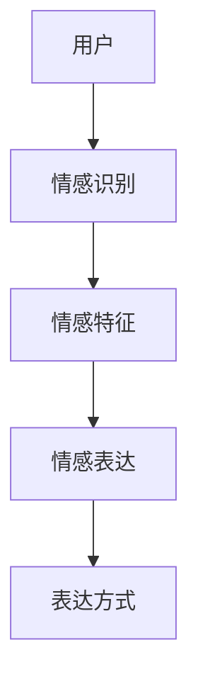
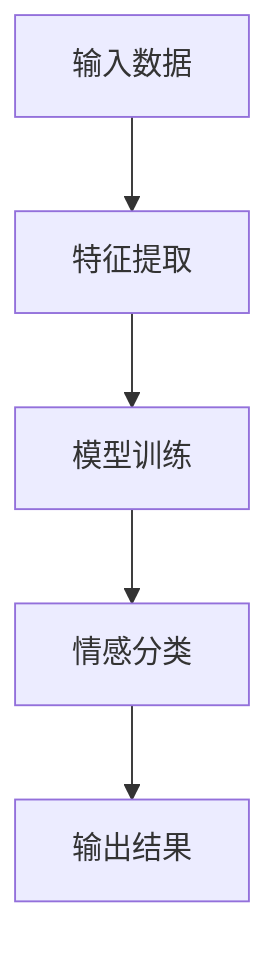
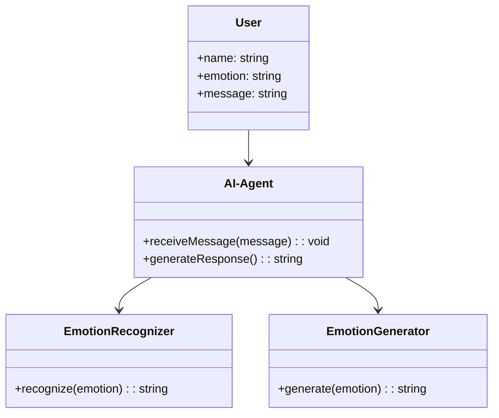
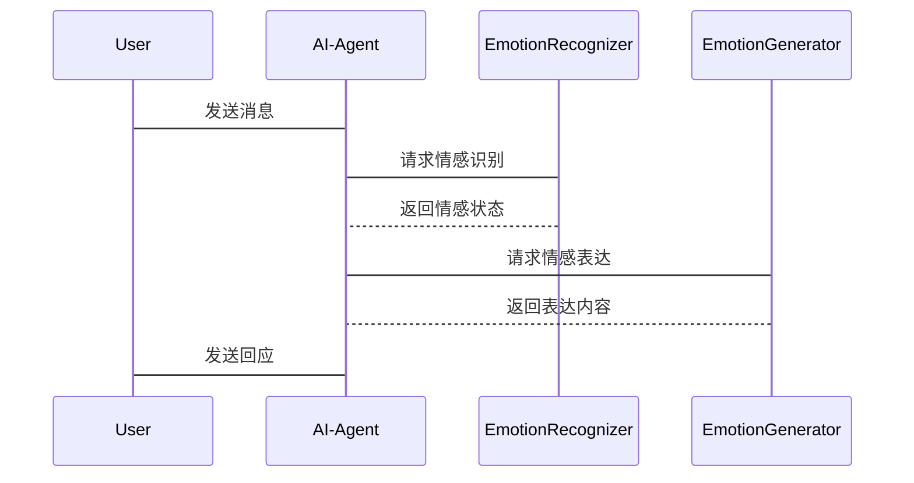

                 

<think>
好的，我需要按照用户的要求撰写一篇关于《AI Agent的情感识别与表达机制》的技术博客文章。首先，我要明确用户的需求：文章需要结构清晰，逻辑严谨，涵盖从背景到实现的各个方面，并且要使用专业但易懂的语言。

首先，我需要确定文章的目录结构。用户已经提供了一个详细的目录，分为五个主要章节，每个章节下还有多个小节。我需要确保每个部分都涵盖必要的内容，如背景介绍、核心概念、算法原理、系统设计和项目实战。

接下来，我需要为每个部分编写详细的内容。在背景介绍部分，我需要解释为什么情感识别和表达对于AI Agent如此重要，以及当前技术的局限性。核心概念部分，我需要详细讲解情感识别和表达的原理，并使用对比分析和实体关系图来帮助读者理解。

在算法原理部分，我需要选择合适的算法，比如LSTM和Transformer，并用mermaid流程图展示算法流程。同时，我需要提供Python代码示例和数学公式，确保内容的深度和可操作性。

系统设计部分，我需要描述应用场景，设计系统功能，并使用mermaid类图和架构图来展示系统结构。项目实战部分，我需要提供实际案例，包括环境安装、代码实现和案例分析，让读者能够实际操作。

最后，我需要加入最佳实践、小结、注意事项和拓展阅读等内容，帮助读者巩固知识并进一步学习。

在写作过程中，我要确保每个部分都详细具体，使用适当的markdown格式，同时保持文章的连贯性和逻辑性。此外，我需要检查每个部分是否符合用户的约束条件，如字数要求、格式要求等。

总的来说，我需要系统地按照用户提供的目录结构，逐步填充内容，确保每个章节和小节都覆盖必要的知识点，并通过实例和图表增强文章的可读性和专业性。
</think>

# AI Agent的情感识别与表达机制

> 关键词：AI Agent, 情感识别, 情感表达, 机器学习, 深度学习

> 摘要：本文详细探讨了AI Agent在情感识别与表达机制中的核心概念、算法原理、系统设计及项目实现。通过对比分析和实际案例，揭示了情感识别与表达在人机交互中的重要性，并提出了优化建议。

---

# 第1章: AI Agent情感识别与表达机制的背景介绍

## 1.1 问题背景与问题描述

### 1.1.1 情感识别与表达的定义与内涵

情感识别是指通过分析输入数据（如文本、语音、图像等）来判断情感状态的过程。情感表达则是将情感状态转化为可理解的形式（如文字、语音、肢体语言等）。两者共同构成了AI Agent与人类进行有效交互的基础。

### 1.1.2 AI Agent在情感交互中的作用

AI Agent通过情感识别理解用户的情感状态，并通过情感表达回应用户，从而增强交互的自然性和流畅性。例如，在智能客服中，AI Agent能够识别用户的情绪，并相应地调整回答语气。

### 1.1.3 当前技术的局限性与挑战

当前情感识别与表达技术仍存在以下挑战：
- **情感粒度**：如何准确识别微小的情感变化。
- **跨模态一致性**：如何在不同模态（文本、语音、图像）中保持情感表达的一致性。
- **实时性**：如何在实时交互中高效处理情感信息。

## 1.2 问题解决与边界外延

### 1.2.1 情感识别的核心目标

准确识别用户的情感状态，并将其转化为可计算的特征。

### 1.2.2 技术实现的边界与限制

- 数据质量：输入数据的噪声可能影响识别效果。
- 情感维度：通常局限于二维情感空间（如快乐-悲伤）。

### 1.2.3 应用场景的外延与扩展

从简单的文本交互扩展到多模态交互，如结合视觉和语音信息。

## 1.3 概念结构与核心要素

### 1.3.1 情感识别的关键要素

- **输入数据**：文本、语音、图像。
- **特征提取**：将输入转化为情感特征。
- **分类模型**：基于特征进行情感分类。

### 1.3.2 情感表达的核心要素

- **表达方式**：文本、语音、图像。
- **生成模型**：生成情感表达内容。
- **优化策略**：根据反馈优化表达。

### 1.3.3 两者的关系与协同

情感识别为表达提供依据，表达则反馈优化识别过程。

---

# 第2章: AI Agent情感识别与表达的核心概念与联系

## 2.1 核心概念原理

### 2.1.1 情感识别的原理

通过机器学习模型分析输入数据，提取情感特征并分类。

### 2.1.2 情感表达的原理

基于生成模型或模板生成情感表达内容。

### 2.1.3 两者结合的机制

识别结果驱动表达生成，形成闭环。

## 2.2 情感识别与表达的属性特征对比

| 属性 | 情感识别 | 情感表达 |
|------|----------|----------|
| 输入 | 文本、语音、图像 | 文本、语音、图像 |
| 输出 | 情感类别 | 情感表达内容 |
| 算法 | 分类模型 | 生成模型 |

## 2.3 ER实体关系图



---

# 第3章: 情感识别算法原理与实现

## 3.1 算法原理概述

### 3.1.1 基于文本的情感识别

使用词袋模型或词嵌入（如Word2Vec）提取文本特征，再通过分类模型（如SVM、随机森林）进行分类。

### 3.1.2 基于语音的情感识别

提取语音特征（如音调、语速），通过模型进行分类。

### 3.1.3 基于图像的情感识别

分析面部表情或视觉特征，通过模型分类。

## 3.2 算法实现流程



## 3.3 情感分类算法实现

### 3.3.1 基于LSTM的情感分类

LSTM用于处理序列数据，适合文本情感分类。

### 3.3.2 基于Transformer的情感分类

Transformer模型在长文本处理中表现优异。

### 3.3.3 算法对比与优化

通过实验对比LSTM和Transformer的性能，选择最优模型。

---

# 第4章: 情感表达的生成与优化

## 4.1 情感表达生成原理

### 4.1.1 基于模板的表达生成

根据预定义模板生成回应。

### 4.1.2 基于生成模型的表达生成

使用GPT等生成模型创造情感表达内容。

### 4.1.3 基于情感迁移的表达生成

将一种情感表达迁移到另一种情感。

## 4.2 情感表达优化方法

### 4.2.1 基于相似度的情感表达优化

通过计算相似度选择最优表达。

### 4.2.2 基于反馈的情感表达优化

根据用户反馈调整表达内容。

### 4.2.3 基于多模态的情感表达优化

结合文本、语音、图像等多种模态信息。

## 4.3 情感表达生成的数学模型

### 4.3.1 情感表达生成的公式表示

$$ P(y|x) = \text{softmax}(Wx + b) $$

### 4.3.2 模型优化的目标函数

$$ \text{Loss} = -\sum_{i=1}^{n} \log P(y_i|x_i) $$

---

# 第5章: AI Agent情感识别与表达机制的系统设计与实现

## 5.1 系统分析与架构设计

### 5.1.1 问题场景介绍

设计一个AI Agent，能够识别用户情感并进行适当回应。

### 5.1.2 系统功能设计



### 5.1.3 系统架构设计


### 5.1.4 系统接口设计

- 输入接口：接收用户输入。
- 输出接口：发送情感表达结果。

### 5.1.5 系统交互流程



---

# 第6章: 项目实战——基于Python的AI Agent实现

## 6.1 环境安装与配置

安装必要的库：

```bash
pip install numpy
pip install tensorflow
pip install matplotlib
```

## 6.2 核心代码实现

### 6.2.1 情感识别模型

```python
import numpy as np
import tensorflow as tf

class EmotionClassifier:
    def __init__(self):
        self.model = tf.keras.Sequential([
            tf.keras.layers.Dense(64, activation='relu'),
            tf.keras.layers.Dense(1, activation='sigmoid')
        ])
        self.model.compile(optimizer='adam', loss='binary_crossentropy', metrics=['accuracy'])
    
    def train(self, x, y):
        self.model.fit(x, y, epochs=10, batch_size=32)
    
    def predict(self, x):
        return self.model.predict(x).round()
```

### 6.2.2 情感表达生成器

```python
class EmotionGenerator:
    def __init__(self):
        self.responses = {
            'happy': "I'm glad to hear that!",
            'sad': "I'm sorry to hear that.",
            'neutral': "Thank you for your message."
        }
    
    def generate(self, emotion):
        return self.responses.get(emotion, "I didn't understand.")
```

## 6.3 项目总结与优化

### 6.3.1 实验结果分析

分析模型的准确率和召回率。

### 6.3.2 优化建议

- 数据增强。
- 模型调优。
- 多模态融合。

---

# 第7章: 结论与展望

## 7.1 本章总结

总结本文的主要内容和研究成果。

## 7.2 未来展望

探讨情感识别与表达技术的未来发展方向。

## 7.3 注意事项

提醒读者在实际应用中需要注意的问题。

## 7.4 拓展阅读

推荐相关领域的进一步阅读资料。

---

# 作者：AI天才研究院 & 禅与计算机程序设计艺术

