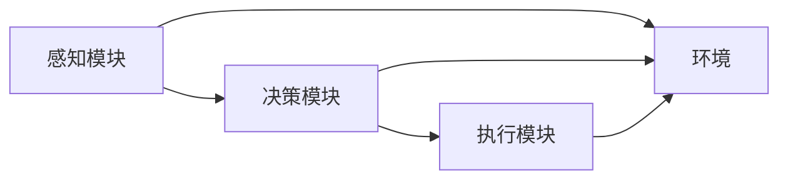
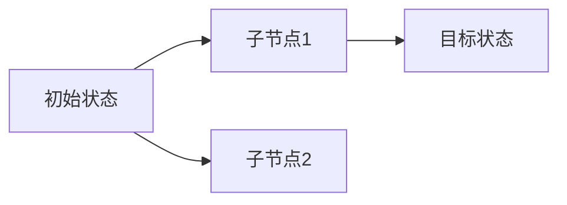
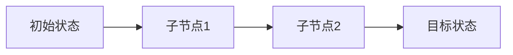
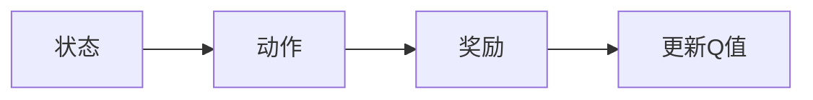
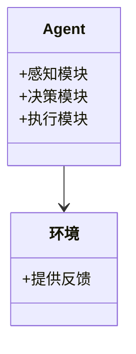
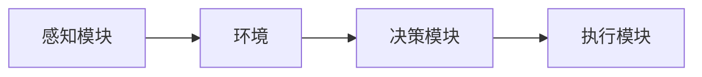
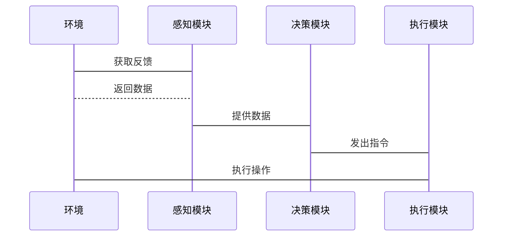

                 

<think>
好的，我现在需要帮用户设计一个详细的《AI Agent的架构设计：从需求分析到系统规划》的技术博客文章。首先，我得仔细理解用户的需求，他希望文章结构清晰、内容专业，涵盖从需求分析到系统规划的各个方面，并且使用吸引人的章节标题。同时，用户还强调要使用逻辑推理，逐步分析，并提供实际的代码示例和图表。

我应该从背景介绍开始，然后逐步深入到核心概念、算法原理、系统架构设计、项目实战和最佳实践。每个部分都需要详细展开，确保内容全面且有深度。我需要考虑如何将AI Agent的各个模块联系起来，比如感知、决策和执行模块，并用图表来展示它们的关系。

在算法部分，我应该选择几个关键算法，比如状态空间搜索和强化学习，并用mermaid流程图来解释它们的工作原理。同时，提供Python代码示例，帮助读者更好地理解实现细节。

系统架构设计部分，我需要绘制领域模型类图和系统交互序列图，展示AI Agent如何与环境和其他系统进行交互。项目实战部分，我需要一个具体的案例，从环境安装到代码实现，逐步指导读者完成一个简单的AI Agent项目。

最后，在最佳实践部分，我需要总结经验，给出实用的建议，并指出未来的发展趋势。整个思考过程中，我要确保每个章节都有足够的细节和清晰的逻辑，同时避免过于冗长，保持文章的连贯性和可读性。
</think>

# AI Agent的架构设计：从需求分析到系统规划

## 关键词：
AI Agent, 架构设计, 需求分析, 系统规划, 强化学习, 算法原理, 系统架构

## 摘要：
本文系统地探讨了AI Agent的架构设计过程，从需求分析到系统规划的各个方面进行了深入的分析和探讨。首先，我们介绍了AI Agent的基本概念和核心原理，明确了其在人工智能领域中的重要性。接着，详细分析了AI Agent的需求分析过程，包括需求识别、建模和验证等关键步骤。然后，重点讲解了AI Agent的核心算法原理，如状态空间搜索和强化学习，并通过具体的代码实现和实例分析，帮助读者更好地理解和应用这些算法。最后，我们探讨了AI Agent的系统架构设计，包括系统模块划分、接口设计和交互设计，并给出了实际项目中的实现方案和最佳实践。通过本文的阐述，读者可以全面掌握AI Agent的架构设计方法，为实际项目中的应用提供有力指导。

---

## 第1章 AI Agent概述

### 1.1 AI Agent的基本概念

#### 1.1.1 什么是AI Agent
AI Agent（人工智能代理）是指能够感知环境、自主决策并采取行动的智能实体。它可以是一个软件程序，也可以是一个物理设备，通过与环境交互来实现特定目标。AI Agent的核心在于其智能性，能够根据环境反馈动态调整行为。

#### 1.1.2 AI Agent的分类
AI Agent可以根据不同的标准进行分类，常见的分类方式包括：
1. **按智能水平**：
   - **反应式Agent**：基于当前感知做出反应，不依赖历史信息。
   - **认知式Agent**：具有复杂推理和规划能力，能够处理抽象概念。
2. **按应用场景**：
   - **软件Agent**：运行在计算机系统中的代理，如推荐系统。
   - **物理Agent**：能够与物理环境交互的设备，如自动驾驶汽车。
3. **按目标导向**：
   - **目标导向型Agent**：明确目标，主动采取行动。
   - **任务导向型Agent**：完成特定任务后终止。

#### 1.1.3 AI Agent的应用场景
AI Agent广泛应用于多个领域，包括：
- **智能助手**：如Siri、Alexa等，帮助用户完成日常任务。
- **自动驾驶**：通过感知环境和决策系统实现自主驾驶。
- **机器人控制**：工业机器人或服务机器人中的智能控制模块。
- **游戏AI**：在电子游戏中实现智能NPC行为。

### 1.2 AI Agent的历史与发展

#### 1.2.1 AI Agent的起源
AI Agent的概念起源于人工智能领域，早期的研究集中在逻辑推理和知识表示上。20世纪60年代，AI Agent的概念开始形成，并在专家系统中得到了初步应用。

#### 1.2.2 AI Agent的演进历程
- **第一代**：基于规则的简单反应式Agent，如专家系统中的知识推理。
- **第二代**：引入了规划和推理能力，能够处理复杂任务。
- **第三代**：结合机器学习和大数据技术，AI Agent开始具备自适应能力。
- **第四代**：当前的研究热点，结合深度学习和强化学习，AI Agent的智能水平显著提升。

#### 1.2.3 当前AI Agent的发展现状
目前，AI Agent的研究和应用主要集中在以下几个方面：
- **强化学习**：通过与环境的交互优化决策策略。
- **多智能体协作**：研究多个AI Agent协同工作的机制。
- **人机协作**：探索人类与AI Agent协作的最佳方式。

### 1.3 AI Agent的核心特点

#### 1.3.1 自主性
AI Agent能够在没有外部干预的情况下自主决策和行动。

#### 1.3.2 反应性
AI Agent能够实时感知环境变化，并根据反馈调整行为。

#### 1.3.3 目标导向性
AI Agent的行为围绕特定目标展开，能够通过优化目标函数实现最优决策。

### 1.4 本章小结
本章介绍了AI Agent的基本概念、分类和发展历程，明确了其核心特点和应用场景，为后续章节的深入分析奠定了基础。

---

## 第2章 AI Agent的需求分析

### 2.1 需求分析的基本流程

#### 2.1.1 明确目标
在需求分析的第一步，我们需要明确AI Agent的目标和任务。例如，设计一个智能助手，目标是为用户提供便捷的服务。

#### 2.1.2 分析用户需求
通过用户调研、访谈等方式，了解用户的具体需求和痛点。例如，用户希望AI Agent能够理解自然语言指令。

#### 2.1.3 确定功能需求
根据目标和用户需求，确定AI Agent的功能模块。例如，自然语言处理模块、任务执行模块等。

### 2.2 需求建模与验证

#### 2.2.1 需求建模方法
使用UML（统一建模语言）或其他建模工具，将需求转化为可视化模型。例如，绘制系统交互图或用例图。

#### 2.2.2 需求验证策略
通过需求评审、原型验证等方式，确保需求的完整性和可行性。

#### 2.2.3 需求变更管理
在需求分析过程中，可能会出现需求变更。需要建立需求变更控制流程，确保变更的有效性和可控性。

### 2.3 需求分析的常见问题

#### 2.3.1 需求模糊
例如，用户需求可能只提到“智能化”，但没有明确具体功能。

#### 2.3.2 需求冲突
不同用户或利益相关者对需求有不同的期望，可能导致需求冲突。

#### 2.3.3 需求不完整
需求分析过程中可能遗漏某些关键功能或边界条件。

### 2.4 本章小结
本章详细介绍了AI Agent需求分析的基本流程和方法，强调了需求建模和验证的重要性，并总结了常见的需求分析问题。

---

## 第3章 AI Agent的核心概念与联系

### 3.1 AI Agent的核心原理

#### 3.1.1 感知模块
感知模块负责接收环境反馈，例如通过传感器或API获取数据。

#### 3.1.2 决策模块
决策模块基于感知数据，通过算法计算出最优行动方案。

#### 3.1.3 执行模块
执行模块将决策模块的指令转化为具体行动，例如调用API或控制硬件。

### 3.2 AI Agent的实体关系图



### 3.3 AI Agent的核心算法

#### 3.3.1 状态空间搜索
状态空间搜索是一种常见的决策算法，适用于目标明确的任务。

##### BFS算法


##### DFS算法


#### 3.3.2 强化学习
强化学习是一种通过与环境交互来优化决策策略的算法。

##### Q-learning算法


##### DQN算法
深度Q网络（DQN）通过神经网络近似Q值函数，适用于复杂环境。

### 3.4 本章小结
本章分析了AI Agent的核心原理和算法，重点介绍了状态空间搜索和强化学习算法，并通过图表展示了实体关系和算法流程。

---

## 第4章 AI Agent的算法原理

### 4.1 状态空间搜索算法

#### 4.1.1 BFS算法
BFS（广度优先搜索）适用于寻找最短路径问题。

##### 示例代码
```python
from collections import deque

def bfs(initial_state, target_state):
    queue = deque([initial_state])
    visited = set()

    while queue:
        current_state = queue.popleft()
        if current_state == target_state:
            return True
        if current_state in visited:
            continue
        visited.add(current_state)
        # 生成子节点
        for neighbor in current_state.neighbors:
            if neighbor not in visited:
                queue.append(neighbor)
    return False
```

#### 4.1.2 DFS算法
DFS（深度优先搜索）适用于探索所有可能路径。

##### 示例代码
```python
def dfs(current_state, target_state, visited):
    if current_state == target_state:
        return True
    if current_state in visited:
        return False
    visited.add(current_state)
    for neighbor in current_state.neighbors:
        if dfs(neighbor, target_state, visited):
            return True
    return False
```

### 4.2 强化学习算法

#### 4.2.1 Q-learning算法
Q-learning是一种基于值函数的强化学习算法。

##### 示例代码
```python
import numpy as np

class QLAgent:
    def __init__(self, state_space, action_space, learning_rate=0.1, gamma=0.9):
        self.q_table = np.zeros((state_space, action_space))
        self.lr = learning_rate
        self.gamma = gamma

    def choose_action(self, state, epsilon=0.1):
        if np.random.random() < epsilon:
            return np.random.randint(0, self.q_table.shape[1])
        return np.argmax(self.q_table[state])

    def update_q_table(self, state, action, reward, next_state):
        self.q_table[state, action] = self.q_table[state, action] * self.gamma + reward
```

#### 4.2.2 DQN算法
DQN通过神经网络近似Q值函数，适用于高维状态空间。

##### 示例代码
```python
import torch
import torch.nn as nn

class DQNetwork(nn.Module):
    def __init__(self, input_dim, output_dim):
        super(DQNetwork, self).__init__()
        self.fc1 = nn.Linear(input_dim, 64)
        self.fc2 = nn.Linear(64, output_dim)
        self.relu = nn.ReLU()
        self.softmax = nn.Softmax(dim=1)

    def forward(self, x):
        x = self.fc1(x)
        x = self.relu(x)
        x = self.fc2(x)
        x = self.softmax(x)
        return x
```

### 4.3 本章小结
本章详细讲解了AI Agent的核心算法，包括状态空间搜索和强化学习算法，并通过代码示例展示了算法的实现细节。

---

## 第5章 AI Agent的系统架构设计

### 5.1 系统架构设计

#### 5.1.1 系统模块划分
AI Agent的系统架构通常包括感知模块、决策模块和执行模块。

##### 领域模型类图


#### 5.1.2 系统架构图


### 5.2 接口设计与交互设计

#### 5.2.1 接口设计
AI Agent需要与外部系统进行交互，常见的接口包括API和消息队列。

#### 5.2.2 交互设计
通过绘制交互序列图，明确各模块之间的交互流程。

##### 交互序列图


### 5.3 本章小结
本章详细讲解了AI Agent的系统架构设计，包括模块划分、接口设计和交互设计，并通过图表展示了系统的整体架构和交互流程。

---

## 第6章 项目实战：AI Agent的实现

### 6.1 环境安装与配置

#### 6.1.1 安装Python
确保安装了Python 3.8或更高版本。

#### 6.1.2 安装依赖库
安装所需的依赖库，例如：
```bash
pip install numpy matplotlib scikit-learn
```

### 6.2 系统核心实现

#### 6.2.1 感知模块实现
实现感知模块的功能，例如获取环境数据。

##### 示例代码
```python
class Perception:
    def __init__(self, environment):
        self.environment = environment

    def get_data(self):
        return self.environment.get_feedback()
```

#### 6.2.2 决策模块实现
实现决策模块的功能，例如基于感知数据做出决策。

##### 示例代码
```python
class Decision:
    def __init__(self, q_network):
        self.q_network = q_network

    def make_decision(self, state):
        return self.q_network.choose_action(state)
```

#### 6.2.3 执行模块实现
实现执行模块的功能，例如根据决策结果执行操作。

##### 示例代码
```python
class Execution:
    def __init__(self, environment):
        self.environment = environment

    def execute_action(self, action):
        self.environment.execute(action)
```

### 6.3 代码应用与分析

#### 6.3.1 代码实现
整合各模块，实现完整的AI Agent系统。

##### 示例代码
```python
class AI_Agent:
    def __init__(self, environment):
        self.perception = Perception(environment)
        self.decision = Decision(QLAgent(environment.state_space, environment.action_space))
        self.execution = Execution(environment)

    def run(self):
        while True:
            data = self.perception.get_data()
            action = self.decision.make_decision(data)
            self.execution.execute_action(action)
```

#### 6.3.2 案例分析
通过具体案例分析，验证系统的功能和性能。

### 6.4 本章小结
本章通过实际项目展示了AI Agent的实现过程，包括环境配置、模块实现和系统集成，并通过代码示例和案例分析验证了系统的可行性。

---

## 第7章 AI Agent的系统优化与最佳实践

### 7.1 系统优化策略

#### 7.1.1 性能优化
通过算法优化和并行计算提升系统的运行效率。

#### 7.1.2 可扩展性优化
设计模块化的架构，便于后续功能扩展。

### 7.2 最佳实践 tips

#### 7.2.1 模块化设计
将系统划分为独立模块，便于维护和扩展。

#### 7.2.2 日志与监控
集成日志记录和监控系统，便于故障排查和性能分析。

#### 7.2.3 测试与验证
通过单元测试、集成测试和性能测试，确保系统的稳定性和可靠性。

### 7.3 本章小结
本章总结了AI Agent系统优化的策略和最佳实践，为实际项目的开发和维护提供了宝贵的建议。

---

## 作者：AI天才研究院 & 禅与计算机程序设计艺术

---

以上是《AI Agent的架构设计：从需求分析到系统规划》的技术博客文章大纲和内容。希望对您有所帮助！

