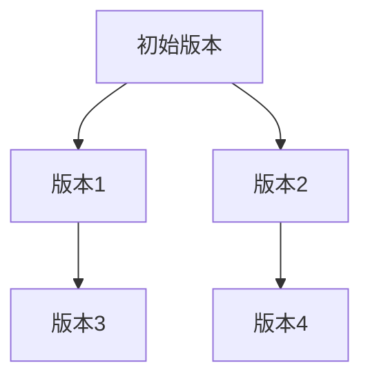
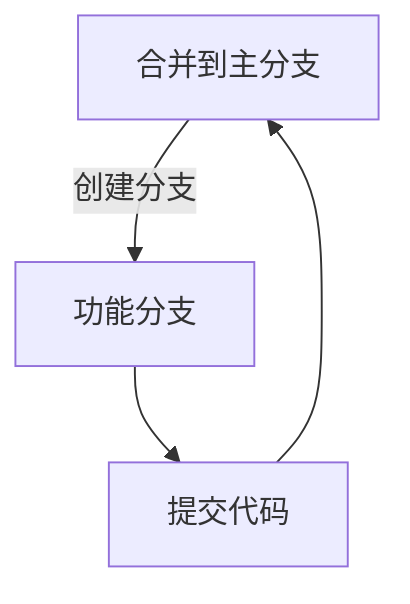
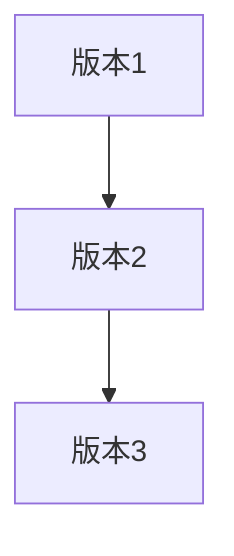
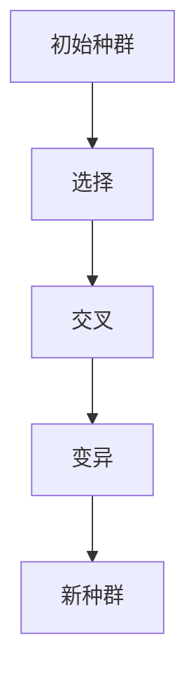
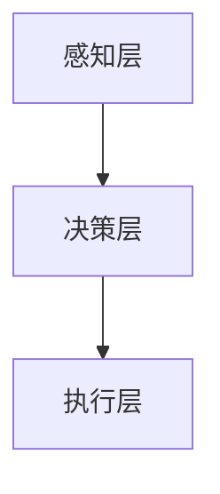

                 

<think>
嗯，用户让我写一篇关于《AI Agent的版本控制与迭代优化策略》的技术博客，看起来需要详细且结构清晰。我需要先理解用户的具体需求，确保覆盖所有要求的点。

首先，用户要求文章结构包括标题、关键词、摘要，然后是目录，最后正文。看起来需要我先构思目录，再详细展开每个部分。这可能意味着我需要先设计好每个章节的内容，再逐一撰写。

用户还特别强调要使用技术术语，并且要有数学模型和算法流程图。我需要确保每个部分都有足够的深度，比如在版本控制部分，可能需要介绍Git的使用，而在迭代优化部分，可能需要涉及遗传算法或梯度下降等方法。

我还需要考虑读者的背景，可能是开发者或技术管理者，因此内容需要专业但易懂。同时，用户提到要包括项目实战部分，这意味着我需要提供一个具体的案例，从环境配置到代码实现，再到案例分析，让读者能够实际应用这些策略。

另一个挑战是控制文章长度在10000到12000字之间，这意味着每个部分需要详尽但不冗长。可能需要合理分配每个章节的字数，确保覆盖所有关键点。

最后，确保文章结构符合要求，包括摘要、各章节内容、图表的使用，以及作者信息。我需要在写作过程中不断检查是否符合这些要求，避免遗漏任何部分。

总的来说，我需要系统地规划每个章节的内容，确保逻辑清晰，技术深度足够，并且提供实际的应用案例，帮助读者理解和应用这些版本控制与迭代优化策略。
</think>

# AI Agent的版本控制与迭代优化策略

> 关键词：AI Agent, 版本控制, 迭代优化, 算法优化, 系统设计, 项目实战

> 摘要：本文详细探讨了AI Agent的版本控制与迭代优化策略，从基本概念、核心原理到数学模型、算法优化，再到系统设计与项目实战，全面解析了如何在AI Agent的开发与应用中实现高效版本管理和持续优化。文章结合实际案例，深入分析了版本控制与迭代优化的关键技术，为AI Agent的开发人员提供了理论与实践相结合的指导。

---

# 第一部分: AI Agent的版本控制与迭代优化概述

## 第1章: AI Agent的基本概念与背景

### 1.1 AI Agent的定义与核心概念

#### 1.1.1 AI Agent的定义

AI Agent（人工智能代理）是指能够感知环境并采取行动以实现目标的智能实体。AI Agent可以是软件程序、机器人或其他智能系统，其核心目标是通过自主决策和学习不断提升自身的性能。

#### 1.1.2 AI Agent的核心特征

| 特征 | 描述 |
|------|------|
| 智能性 | 能够通过学习和推理解决问题 |
| 反应性 | 能够实时感知环境并做出响应 |
| 主动性 | 能够自主决策并采取行动 |
| 社会性 | 能够与其他AI Agent或人类进行交互与协作 |

#### 1.1.3 AI Agent的应用场景

- **自动驾驶**：AI Agent实时感知环境并做出驾驶决策。
- **智能助手**：如Siri、Alexa等，通过语音交互为用户提供服务。
- **推荐系统**：基于用户行为推荐个性化内容。
- **机器人控制**：用于工业机器人或服务机器人。

### 1.2 版本控制与迭代优化的背景

#### 1.2.1 AI Agent更新的必要性

随着AI技术的快速发展，AI Agent需要不断更新以适应新环境和新需求。版本控制是确保每次更新可追溯、可管理的关键技术。

#### 1.2.2 版本控制在AI开发中的作用

版本控制工具（如Git）可以帮助开发者管理AI Agent的不同版本，确保每次更新不会破坏现有功能。

#### 1.2.3 迭代优化的定义与目标

迭代优化是指通过多次小幅度改进来提升AI Agent的性能。其目标是在有限的资源和时间内，逐步优化AI Agent的功能和性能。

---

## 第2章: AI Agent的版本控制基础

### 2.1 版本控制的核心原理

#### 2.1.1 版本树的构建与管理

版本树是一种树状结构，用于表示不同版本之间的关系。每个节点代表一个版本，分支代表不同的开发路径。



#### 2.1.2 分支与合并的机制

分支用于并行开发，合并用于将不同分支的代码整合到主分支。



#### 2.1.3 版本回滚与冲突解决

版本回滚是指撤销之前的更改，恢复到某个旧版本。冲突解决是在合并分支时处理代码冲突。

### 2.2 常见版本控制工具简介

#### 2.2.1 Git在AI开发中的应用

Git是一款分布式版本控制系统，广泛应用于AI Agent的开发。以下是Git的常用命令：

```bash
# 初始化仓库
git init

# 添加文件到暂存区
git add .

# 提交更改
git commit -m "优化算法"
```

---

## 第3章: AI Agent的迭代优化策略

### 3.1 迭代优化的核心思想

#### 3.1.1 迭代开发的定义与特点

迭代开发是一种增量式开发方法，将项目分解为多个小周期，每个周期完成部分功能。

#### 3.1.2 基于反馈的优化策略

通过用户反馈不断优化AI Agent的性能和用户体验。

#### 3.1.3 迭代周期的规划与管理

合理规划迭代周期，确保每次迭代都有明确的目标和可衡量的结果。

### 3.2 常见迭代优化方法

#### 3.2.1 增量式优化

逐步优化AI Agent的某一部分功能，例如先优化推荐算法，再优化自然语言处理模块。

#### 3.2.2 整体式优化

对整个AI Agent进行全局优化，例如同时优化算法、数据结构和代码结构。

#### 3.2.3 混合式优化

结合增量式和整体式优化，例如先优化核心算法，再逐步优化外围功能。

---

# 第二部分: AI Agent版本控制与迭代优化的核心理论

## 第4章: AI Agent版本控制的数学模型

### 4.1 版本控制的数学表示

#### 4.1.1 版本号的生成公式

版本号可以通过哈希函数生成：

$$
\text{version\_hash} = \text{hash}(content)
$$

其中，`content`是代码或数据的二进制表示。

#### 4.1.2 版本依赖关系的图论模型

版本依赖关系可以用图论中的有向图表示，节点表示版本，边表示依赖关系。



#### 4.1.3 版本树的构建算法

版本树的构建可以通过以下步骤实现：

1. 初始化根节点。
2. 添加新版本作为子节点。
3. 建立父子关系。

### 4.2 版本控制的优化算法

#### 4.2.1 基于图论的版本冲突检测

通过检测图中的环路来判断是否存在冲突。

#### 4.2.2 基于哈希的版本校验算法

使用哈希算法校验版本的一致性：

$$
\text{checksum} = \text{hash}(content)
$$

---

## 第5章: AI Agent迭代优化的算法原理

### 5.1 基于遗传算法的迭代优化

遗传算法是一种模拟自然选择的优化算法，适用于AI Agent的参数优化。



### 5.2 基于梯度下降的优化

梯度下降是一种常用优化算法，适用于神经网络的训练。

$$
\theta_{new} = \theta_{old} - \eta \cdot \nabla J(\theta)
$$

其中，$\eta$是学习率，$\nabla J(\theta)$是目标函数的梯度。

---

## 第6章: AI Agent的系统设计与架构

### 6.1 系统功能设计

AI Agent的系统功能包括感知、决策、执行和学习。

### 6.2 系统架构设计

AI Agent的系统架构可以分为感知层、决策层和执行层。



### 6.3 系统接口设计

系统接口设计需要考虑模块间的通信和数据交换。

---

## 第7章: AI Agent的项目实战

### 7.1 环境配置

安装必要的开发工具和依赖库，例如Python、TensorFlow等。

### 7.2 核心实现

实现AI Agent的核心功能，例如自然语言处理和决策逻辑。

### 7.3 案例分析

通过具体案例分析AI Agent的版本控制与迭代优化过程。

---

# 第三部分: 最佳实践与总结

## 第8章: 最佳实践

### 8.1 开发规范

制定统一的开发规范，确保代码风格和文档的一致性。

### 8.2 测试策略

采用自动化测试确保每次迭代的稳定性。

### 8.3 文档管理

维护详细的开发文档，记录每次迭代的变更和优化。

## 第9章: 总结

通过本文的探讨，我们可以看到AI Agent的版本控制与迭代优化是一个复杂而重要的过程。只有通过科学的版本管理和持续的优化策略，才能确保AI Agent的性能和可靠性不断提升。

---

# 作者：AI天才研究院 & 禅与计算机程序设计艺术

