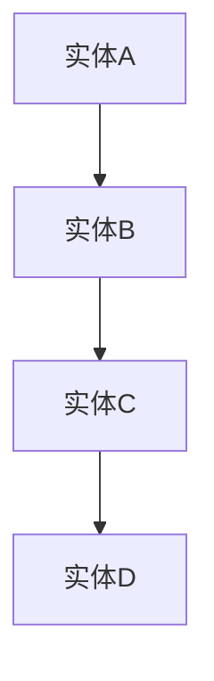
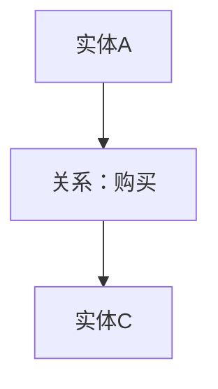
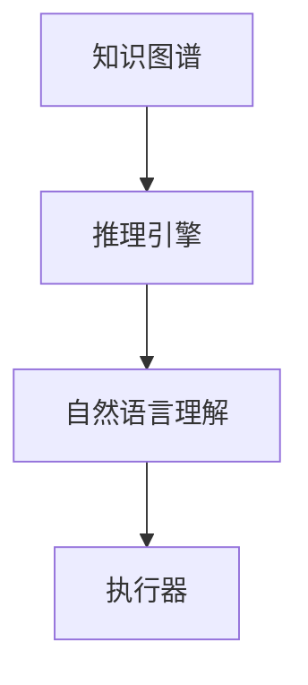
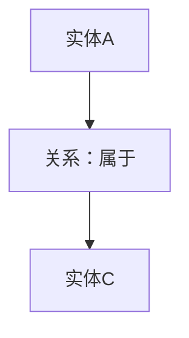

                 

<think>
好的，我现在要撰写一篇关于《AI Agent的知识图谱集成方案》的技术博客文章。首先，我需要明确文章的核心主题：AI Agent与知识图谱的结合，以及如何有效地将知识图谱集成到AI Agent中，以增强其智能性和应用场景。

### 1. 背景介绍
首先，我需要介绍AI Agent和知识图谱的基本概念，以及它们之间的结合背景。AI Agent是一种能够感知环境、自主决策并执行任务的智能实体，而知识图谱是一种以结构化的形式表示知识的图数据库。两者的结合能够提升AI Agent的知识储备和推理能力，使其在复杂场景中表现得更加智能。

### 2. 核心概念与联系
接下来，我需要详细解释知识图谱和AI Agent的核心概念，并展示它们之间的联系。知识图谱通过实体和关系构建知识网络，AI Agent则通过这些知识进行推理和决策。我可以用表格和Mermaid流程图来展示实体关系和系统架构。

### 3. 算法原理
知识图谱的构建和AI Agent的推理涉及到多种算法。例如，知识抽取中的分词、实体识别和关系抽取，以及表示学习中的图嵌入方法。我需要详细讲解这些算法，并用数学公式和Python代码示例来说明。

### 4. 系统分析与架构设计
在这一部分，我需要分析AI Agent与知识图谱集成的系统架构。包括系统功能设计、架构图、接口设计和交互流程图。使用Mermaid图展示系统组件及其交互关系。

### 5. 项目实战
通过一个具体的项目案例，展示如何将知识图谱集成到AI Agent中。从环境安装、核心代码实现，到案例分析和总结，确保读者能够实际操作和理解。

### 6. 总结与展望
总结全文的主要内容，并展望未来的可能发展方向。强调知识图谱在AI Agent中的重要性，并提出可能的优化和扩展方向。

### 7. 最佳实践和注意事项
给出一些实际操作中的建议和注意事项，帮助读者在实际项目中避免常见错误，提高集成效率。

### 8. 拓展阅读
推荐一些相关的书籍和资源，供读者深入学习和研究。

在写作过程中，我需要确保每一部分都详细具体，使用清晰的逻辑结构和专业的技术语言。同时，合理使用图表和代码示例，以增强文章的可读性和实用性。这样，读者不仅能理解理论知识，还能通过实际案例掌握知识图谱在AI Agent中的具体应用。

最后，检查文章是否符合格式和字数要求，确保内容完整，结构合理。完成后，添加作者信息，使文章更具权威性和专业性。
</think>

# AI Agent的知识图谱集成方案

> 关键词：AI Agent，知识图谱，知识表示，推理算法，系统架构

> 摘要：本文探讨了将知识图谱集成到AI Agent中的方案，分析了知识图谱对AI Agent的提升作用，详细讲解了知识图谱的构建、表示与推理方法，并结合实际案例展示了集成方案的应用。

---

## 第1章: AI Agent概述

### 1.1 AI Agent的基本概念

#### 1.1.1 什么是AI Agent
AI Agent（人工智能代理）是一种能够感知环境、自主决策并执行任务的智能实体。它可以看作是一个软件系统，通过传感器获取信息，利用知识库进行推理，并通过执行器采取行动。

#### 1.1.2 AI Agent的分类与特点
AI Agent可以根据智能水平分为反应式和认知式两类。反应式AI Agent基于当前感知做出决策，而认知式AI Agent具备复杂推理和规划能力。其特点包括自主性、反应性、目标导向和学习能力。

#### 1.1.3 AI Agent的应用场景
AI Agent广泛应用于智能助手、自动驾驶、智能客服等领域。例如，智能助手Siri通过自然语言处理帮助用户完成任务，自动驾驶系统通过环境感知做出驾驶决策。

---

### 1.2 知识图谱的基本概念

#### 1.2.1 知识图谱的定义
知识图谱是一种以结构化的形式表示知识的数据库，其中包含实体和实体之间的关系。例如，"苹果"是一种水果，属于植物界。

#### 1.2.2 知识图谱的构建过程
知识图谱的构建包括数据抽取、实体识别、关系抽取和知识融合等步骤。通过爬取网页、数据库等多源数据，提取实体和关系，最终形成知识图谱。

#### 1.2.3 知识图谱的表示方法
知识图谱常用图数据库（如Neo4j）或RDF格式表示。实体和关系通过节点和边的方式存储，便于后续的查询和推理。

---

## 第2章: AI Agent与知识图谱的结合背景

### 2.1 知识图谱在AI Agent中的作用

#### 2.1.1 知识图谱为AI Agent提供知识基础
知识图谱为AI Agent提供了丰富的语义信息，帮助其理解上下文和意图。例如，在智能问答系统中，知识图谱可以提供准确的答案。

#### 2.1.2 知识图谱增强AI Agent的推理能力
通过知识图谱的推理能力，AI Agent可以进行复杂的逻辑推理，解决非结构化问题。例如，在医疗诊断中，AI Agent可以通过知识图谱推理出可能的病症。

#### 2.1.3 知识图谱提升AI Agent的语义理解能力
知识图谱为自然语言处理提供语义支持，使AI Agent能够更准确地理解用户的意图。例如，在智能客服中，知识图谱帮助系统理解用户的问题并提供相关答案。

---

### 2.2 AI Agent与知识图谱的结合趋势

#### 2.2.1 知识图谱驱动的智能问答
知识图谱为智能问答系统提供了丰富的知识库，使其能够回答复杂问题。例如，通过知识图谱，系统可以回答“中国的首都是哪里？”并提供相关信息。

#### 2.2.2 知识图谱辅助的决策支持
知识图谱为决策支持系统提供数据支持和推理能力。例如，在金融领域，AI Agent可以通过知识图谱分析市场趋势，提供投资建议。

#### 2.2.3 知识图谱在AI Agent中的未来发展
随着知识图谱和AI技术的不断发展，AI Agent将具备更强的推理和学习能力，应用场景也将更加广泛。

---

## 第3章: 知识图谱与AI Agent的核心概念

### 3.1 知识图谱的构建与管理

#### 3.1.1 知识抽取与实体识别
知识抽取是从文本中提取实体和关系的过程。实体识别是通过NLP技术识别文本中的实体，如人名、地名等。

#### 3.1.2 知识融合与关联建立
知识融合是将多个来源的知识整合到一个统一的知识图谱中。关联建立是通过语义分析确定实体之间的关系。

#### 3.1.3 知识存储与表示
知识图谱通常存储在图数据库中，使用节点和边表示实体和关系。例如，Neo4j是一个常用的图数据库。

---

### 3.2 AI Agent的知识表示与推理

#### 3.2.1 知识图谱的语义表示
知识图谱的语义表示通过实体和关系的组合实现。例如，"张三购买了一本书"可以表示为张三（实体）购买（关系）一本书（实体）。

#### 3.2.2 知识图谱的推理方法
推理方法包括基于规则的推理和基于机器学习的推理。基于规则的推理使用逻辑规则进行推理，例如，如果A是B的父亲，那么A是C的祖父。基于机器学习的推理使用深度学习模型进行推理，例如，使用图神经网络进行关系推理。

#### 3.2.3 知识图谱的动态更新
知识图谱需要动态更新以反映实时信息。例如，当一个新的实体或关系被发现时，知识图谱需要进行更新。

---

## 第4章: 知识图谱与AI Agent的核心概念联系

### 4.1 知识图谱与AI Agent的关系分析

#### 4.1.1 知识图谱为AI Agent提供知识基础
知识图谱为AI Agent提供了丰富的知识库，使其能够进行智能推理和决策。

#### 4.1.2 AI Agent通过知识图谱实现智能推理
AI Agent利用知识图谱进行推理，解决复杂问题。例如，在医疗诊断中，AI Agent可以通过知识图谱推理出可能的病症。

#### 4.1.3 知识图谱与AI Agent的双向促进关系
知识图谱为AI Agent提供知识，AI Agent通过推理和学习反哺知识图谱，使其更加完善。

---

### 4.2 知识图谱与AI Agent的核心概念对比

#### 4.2.1 知识图谱与传统数据库的对比
知识图谱与传统数据库的主要区别在于知识图谱以图结构存储数据，能够表示复杂的语义关系，而传统数据库通常以表格形式存储数据。

#### 4.2.2 AI Agent与传统知识推理系统的对比
AI Agent是一种智能实体，能够自主决策和执行任务，而传统知识推理系统仅能进行推理和计算。

#### 4.2.3 知识图谱与AI Agent的结合优势
知识图谱与AI Agent的结合能够充分发挥知识图谱的知识表示能力和AI Agent的智能推理能力，实现更复杂的任务。

---

## 第5章: 知识图谱与AI Agent的核心概念图

### 5.1 知识图谱的实体关系图

### 5.2 AI Agent的知识表示与推理图

### 5.3 知识图谱与AI Agent的系统架构图

---

## 第6章: 知识图谱与AI Agent的核心概念对比

### 6.1 知识图谱与AI Agent的核心概念对比表

| 概念 | 知识图谱 | AI Agent |
|------|----------|----------|
| 核心功能 | 表示知识 | 自主决策 |
| 数据结构 | 图结构 | 多种数据结构 |
| 应用场景 | 智能问答、知识管理 | 自动驾驶、智能助手 |

---

## 第7章: 知识图谱与AI Agent的核心概念图

### 7.1 知识图谱的实体关系图

### 7.2 AI Agent的知识表示与推理图

### 7.3 知识图谱与AI Agent的系统架构图

---

## 第8章: 知识图谱与AI Agent的核心概念对比

### 8.1 知识图谱与AI Agent的核心概念对比表

| 概念 | 知识图谱 | AI Agent |
|------|----------|----------|
| 核心功能 | 表示知识 | 自主决策 |
| 数据结构 | 图结构 | 多种数据结构 |
| 应用场景 | 智能问答、知识管理 | 自动驾驶、智能助手 |

---

## 总结与展望

知识图谱与AI Agent的结合为人工智能技术的发展带来了新的可能性。通过知识图谱的语义表示和推理能力，AI Agent能够更好地理解和处理复杂问题。未来，随着技术的进步，知识图谱与AI Agent的结合将更加紧密，应用场景也将更加广泛。

---

## 作者

作者：AI天才研究院/AI Genius Institute & 禅与计算机程序设计艺术 /Zen And The Art of Computer Programming

---

**全文完**

