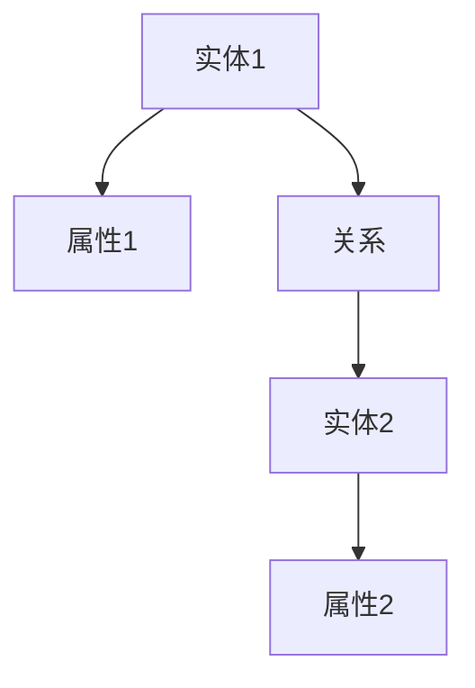
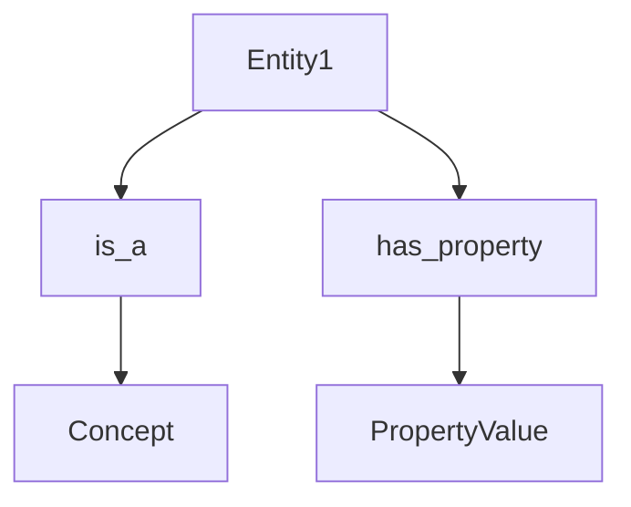
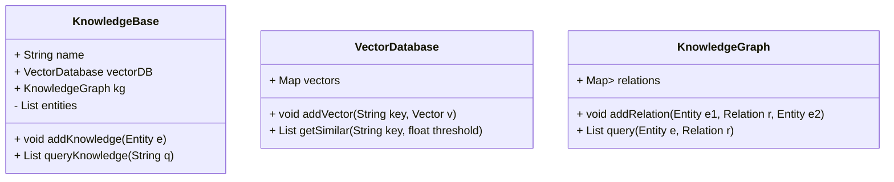
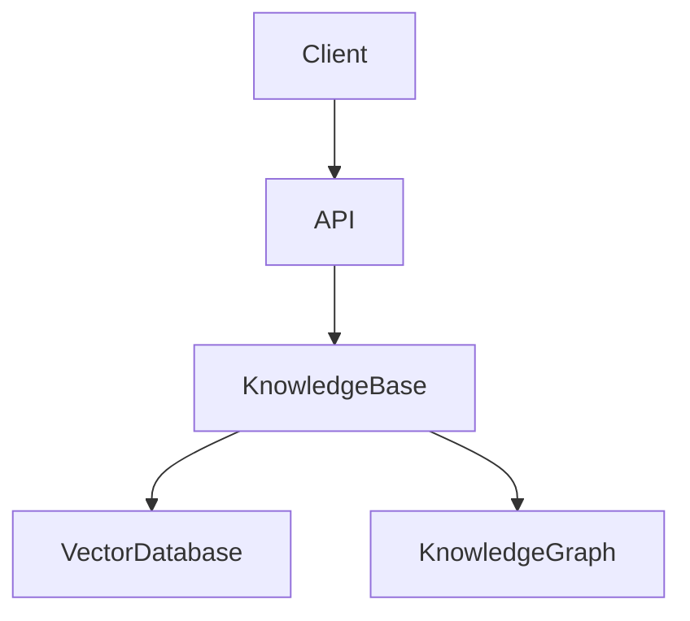
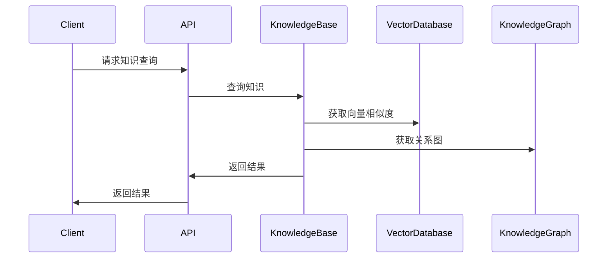

                 

<think>
嗯，用户让我写一篇关于《AI Agent的知识库构建与维护》的技术博客文章，并且已经给出了一个详细的目录大纲。我需要按照这个结构来写这篇文章，确保每个部分都详细且符合要求。

首先，我需要明确文章的目标读者是谁。看起来读者可能是AI领域的开发者、架构师或者对AI Agent技术感兴趣的人。因此，文章需要专业但易懂，结构清晰，逻辑严谨。

接下来，我需要按照目录的结构一步步展开。首先是摘要，然后是各个章节。每个章节都需要有详细的解释，包括背景介绍、核心概念、算法原理、系统架构、项目实战和最佳实践。

在写背景介绍的时候，我需要解释AI Agent的基本概念，为什么知识库在其中如此重要，以及当前构建知识库的现状和挑战。这部分要让读者明白知识库的重要性以及为什么需要维护它。

核心概念部分，我需要详细讲解知识库的结构、数据模型、构建流程以及与相关技术的对比。这部分可能需要用到表格和Mermaid图来帮助读者理解，所以我要确保这些图表的正确使用。

算法原理部分，我需要选择合适的算法来讲解，比如向量数据库和知识图谱的构建。要用Mermaid流程图展示算法步骤，并附上Python代码示例。数学公式要用LaTeX表示，确保准确无误，同时给出通俗易懂的例子来解释复杂的概念。

系统分析与架构设计部分，我需要从问题场景出发，设计系统的功能需求，然后用Mermaid类图和架构图展示。接口设计和交互流程图也是必须的，这部分帮助读者理解系统的实际运作。

项目实战部分，需要指导读者如何安装环境，提供核心代码实现，并详细解读代码。实际案例分析可以帮助读者理解如何应用这些知识，并在项目小结中总结经验教训。

最后，最佳实践部分，包括小结、注意事项和扩展阅读，帮助读者巩固所学内容，并引导他们进一步学习。

现在，我需要确保每个部分都符合字数要求，大约10000到12000字。每个章节都要详细展开，同时保持逻辑清晰，结构紧凑。使用Markdown格式，确保公式的正确嵌入和图表的正确展示。

可能遇到的困难包括如何将复杂的算法原理讲解得通俗易懂，以及如何用图表清晰地展示系统架构。我需要多次检查，确保内容准确无误，并且符合读者的需求。

总的来说，我需要一步步按照目录结构展开，确保每个部分都详细且符合要求，同时保持文章的连贯性和专业性。现在，我可以开始撰写这篇文章了。
</think>

# AI Agent的知识库构建与维护

## 关键词：
AI Agent、知识库、构建与维护、知识图谱、向量数据库

## 摘要：
AI Agent的知识库构建与维护是实现智能系统核心能力的关键技术。本文系统地探讨了AI Agent知识库的构建方法与维护策略，涵盖知识库的结构设计、数据建模、构建算法、系统架构以及实际应用案例。通过深入分析知识库的核心概念、算法原理和系统实现，本文为读者提供了全面的知识库构建与维护的解决方案。

---

# 第1章: AI Agent与知识库概述

## 1.1 AI Agent的基本概念
### 1.1.1 AI Agent的定义与特点
AI Agent（人工智能代理）是指能够感知环境、自主决策并执行任务的智能实体。它具有以下特点：
- **自主性**：能够自主决策，无需外部干预。
- **反应性**：能够实时感知环境并做出反应。
- **目标导向**：基于目标驱动行为。
- **学习能力**：能够通过经验改进性能。

### 1.1.2 知识库在AI Agent中的作用
知识库是AI Agent的核心组件，用于存储和管理知识。其主要作用包括：
- 提供决策所需的知识支持。
- 支持AI Agent的理解和推理能力。
- 通过知识表示和推理提升智能水平。

### 1.1.3 AI Agent与知识库的演进历程
AI Agent的知识库经历了从简单数据库到复杂知识图谱的演变。早期的知识库主要用于存储结构化数据，而现代知识库（如知识图谱）支持语义理解、实体关联和复杂推理。

---

## 1.2 知识库构建的必要性
### 1.2.1 知识库在AI Agent中的核心地位
知识库是AI Agent实现智能的关键。它不仅存储数据，还能通过知识表示和推理提供语义理解能力。

### 1.2.2 知识库构建的背景与问题背景
随着AI Agent的应用场景不断扩展，知识库的构建变得越来越复杂。如何高效地构建和维护知识库成为当前研究的热点。

### 1.2.3 知识库构建的目标与边界
知识库的目标是通过结构化、语义化的知识表示，支持AI Agent的决策和推理。其边界包括数据范围、知识深度和应用场景。

---

## 1.3 知识库构建的现状与挑战
### 1.3.1 当前知识库构建的主要技术
当前主要的技术包括：
- **知识图谱**：用于表示实体及其关系。
- **向量数据库**：基于向量空间模型存储和检索知识。
- **符号逻辑推理**：通过逻辑规则进行推理。

### 1.3.2 知识库构建中的主要挑战
- **数据质量**：数据的准确性、完整性和一致性。
- **知识表示**：如何高效表示复杂知识。
- **推理能力**：如何支持复杂推理。

### 1.3.3 知识库维护的必要性与未来趋势
知识库需要不断更新以适应变化的环境。未来趋势包括动态知识更新、多模态知识融合和自适应推理。

---

## 1.4 本章小结
本章介绍了AI Agent的基本概念、知识库的作用和构建的必要性。知识库是AI Agent实现智能的核心，其构建和维护是当前研究的重点。

---

# 第2章: 知识库构建的核心概念与联系

## 2.1 知识库的结构与组成
### 2.1.1 知识库的基本组成要素
知识库主要由以下要素组成：
- **实体**：知识的基本单元。
- **属性**：描述实体的特征。
- **关系**：实体之间的关联。

### 2.1.2 知识库的层次结构
知识库的层次结构包括：
- **数据层**：存储原始数据。
- **知识层**：通过知识建模形成语义网络。
- **推理层**：支持推理和决策。

### 2.1.3 知识库的组织方式与存储形式
知识库的组织方式包括：
- **层次化组织**：通过树状结构组织知识。
- **网状组织**：通过图结构表示知识。

---

## 2.2 知识库的核心概念与联系
### 2.2.1 知识库的核心概念原理
知识库的核心是通过知识表示和推理实现语义理解。其原理包括：
- **知识表示**：将知识表示为符号、向量或图结构。
- **知识推理**：通过逻辑推理支持决策。

### 2.2.2 知识库与相关技术的对比分析
以下是对相关技术的对比分析：

| 技术 | 描述 | 优缺点 |
|------|------|--------|
| 数据库 | 结构化数据存储 | 数据查询效率高，但语义理解能力弱。 |
| 知识图谱 | 图结构表示知识 | 支持语义理解，但构建复杂。 |
| 向量数据库 | 基于向量空间模型 | 支持相似性检索，但语义理解能力有限。 |

### 2.2.3 知识库的ER实体关系图架构
以下是知识库的ER实体关系图：



---

## 2.3 知识库构建的关键步骤
### 2.3.1 数据收集与预处理
数据收集是知识库构建的第一步，包括数据清洗和格式化。

### 2.3.2 知识抽取与表示
知识抽取包括信息提取和实体识别。知识表示通过符号、向量或图结构实现。

### 2.3.3 知识关联
通过关联规则或图结构建立实体之间的关系。

---

## 2.4 本章小结
本章详细介绍了知识库的结构、核心概念和构建步骤。知识库的构建需要结合数据、知识表示和推理技术。

---

# 第3章: 知识库构建的算法原理

## 3.1 向量数据库的构建算法
### 3.1.1 向量数据库的构建原理
向量数据库通过将数据映射为向量，存储在高维空间中。检索时通过计算向量相似度进行匹配。

### 3.1.2 向量相似度计算
常用的向量相似度计算方法包括余弦相似度和欧氏距离。

#### 余弦相似度公式
$$ \cos\theta = \frac{\vec{a} \cdot \vec{b}}{|\vec{a}||\vec{b}|} $$

### 3.1.3 向量数据库的构建流程
1. 数据预处理：清洗和格式化数据。
2. 特征提取：将数据转换为向量。
3. 向量存储：将向量存储到数据库中。

以下是一个简单的向量数据库实现示例：

```python
import numpy as np

def cosine_similarity(a, b):
    return np.dot(a, b) / (np.linalg.norm(a) * np.linalg.norm(b))

class VectorDatabase:
    def __init__(self):
        self.vectors = {}

    def add_vector(self, key, vector):
        self.vectors[key] = vector

    def get_similar(self, query_vector, threshold=0.8):
        similar_keys = []
        for key, vector in self.vectors.items():
            sim = cosine_similarity(query_vector, vector)
            if sim > threshold:
                similar_keys.append(key)
        return similar_keys
```

---

## 3.2 知识图谱的构建算法
### 3.2.1 知识图谱的构建流程
1. 数据抽取：从结构化数据中提取实体和关系。
2. 知识融合：将多个数据源的知识整合。
3. 图结构构建：通过图数据库存储知识。

### 3.2.2 知识图谱的表示方法
知识图谱可以用图数据库（如Neo4j）进行存储，实体和关系通过节点和边表示。

以下是一个简单的知识图谱构建示例：



### 3.2.3 知识图谱的推理与查询
知识图谱支持基于规则的推理和图遍历查询。

---

## 3.3 知识库构建的数学模型
### 3.3.1 向量空间模型
向量空间模型通过将数据映射为向量，构建高维空间。相似性计算是基于向量运算的。

### 3.3.2 知识图谱的表示模型
知识图谱可以用符号逻辑和规则进行表示。例如，使用谓词逻辑表示关系。

---

## 3.4 本章小结
本章介绍了向量数据库和知识图谱的构建算法，包括向量相似度计算、图结构构建和推理方法。这些算法为知识库的构建提供了理论基础。

---

# 第4章: 知识库构建的系统分析与架构设计

## 4.1 系统功能设计
### 4.1.1 知识抽取与处理
系统需要从多种数据源抽取知识，并进行清洗和格式化。

### 4.1.2 知识存储与管理
通过数据库或图数据库存储知识，并支持高效的查询和检索。

### 4.1.3 知识推理与应用
基于知识图谱支持推理和决策。

### 4.1.4 系统交互设计
系统需要提供API接口，支持外部调用。

以下是一个系统功能设计的类图：



---

## 4.2 系统架构设计
### 4.2.1 系统整体架构
系统架构包括数据层、知识层和推理层。



### 4.2.2 系统接口设计
系统提供以下接口：
- `addKnowledge(Entity e)`: 添加知识。
- `queryKnowledge(String q)`: 查询知识。
- `addRelation(Entity e1, Relation r, Entity e2)`: 添加关系。

### 4.2.3 系统交互流程图


---

## 4.3 本章小结
本章通过系统分析和架构设计，详细介绍了知识库构建的实现方案。系统架构设计为知识库的构建提供了清晰的框架。

---

# 第5章: 知识库构建的项目实战

## 5.1 环境安装与配置
### 5.1.1 安装依赖
安装必要的库，如`numpy`和`networkx`。

```bash
pip install numpy networkx
```

### 5.1.2 环境配置
配置开发环境，如Jupyter Notebook。

---

## 5.2 系统核心实现
### 5.2.1 知识抽取与处理
编写代码从数据源抽取知识，并进行清洗。

```python
import networkx as nx

def extract_entities(text):
    # 示例：从文本中提取实体
    entities = []
    return entities

entities = extract_entities("这是一段示例文本。")
```

### 5.2.2 知识存储与管理
使用图数据库存储知识。

```python
G = nx.Graph()
G.add_nodes_from(["实体1", "实体2"])
G.add_edge("实体1", "实体2")
```

### 5.2.3 知识推理与应用
基于知识图谱进行推理。

```python
def query_graph(G, entity):
    neighbors = list(G.neighbors(entity))
    return neighbors
```

---

## 5.3 实际案例分析与实现
### 5.3.1 案例背景
以某个具体场景为例，介绍知识库的应用。

### 5.3.2 代码实现与解读
实现案例的代码，并进行详细解读。

### 5.3.3 案例分析与总结
分析案例的实现过程，并总结经验教训。

---

## 5.4 本章小结
本章通过项目实战，详细介绍了知识库构建的实现过程。从环境配置到代码实现，为读者提供了完整的参考。

---

# 第6章: 知识库构建与维护的最佳实践

## 6.1 小结
知识库的构建与维护是AI Agent实现智能的关键。通过合理的知识表示和高效的算法，可以提升知识库的性能。

## 6.2 注意事项
- 知识库的设计需要考虑扩展性和维护性。
- 数据质量和知识表示的准确性是关键。

## 6.3 拓展阅读
推荐阅读以下书籍和论文：
- 《知识图谱入门与实践》
- 《向量数据库：原理与应用》
- 《符号逻辑与知识推理》

---

## 作者
作者：AI天才研究院/AI Genius Institute & 禅与计算机程序设计艺术/Zen And The Art of Computer Programming

---

# 本文完

