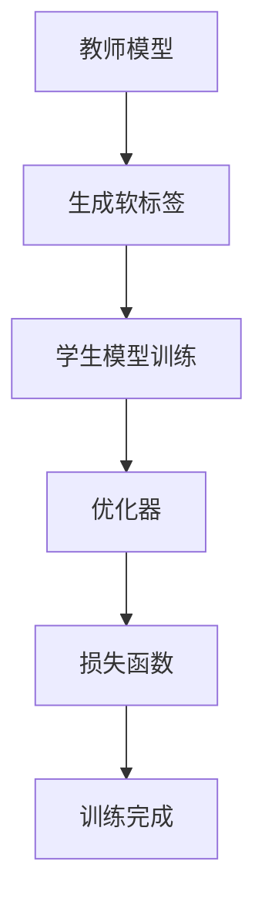
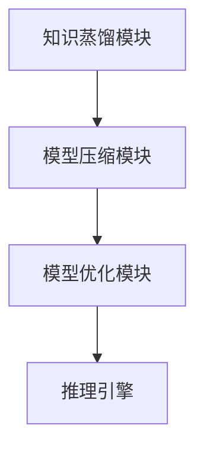

                 


# AI Agent的知识蒸馏与模型压缩

## 关键词：AI Agent, 知识蒸馏, 模型压缩, 深度学习, 模型优化

## 摘要：  
随着AI技术的快速发展，AI Agent在各个领域的应用日益广泛。然而，大型深度学习模型的计算成本和资源需求也急剧增加，这限制了其在资源受限环境中的应用。知识蒸馏与模型压缩作为两项核心技术，能够有效地降低模型的复杂性，提升计算效率，同时保持或甚至提升模型性能。本文将详细探讨AI Agent中的知识蒸馏与模型压缩技术，从基本原理到实际应用，结合数学公式、算法流程图和代码示例，系统性地解析这两项技术的实现与优化方法。

---

## 第一部分：引言

### 第1章：AI Agent的基本概念与应用背景

#### 1.1 AI Agent的定义与核心特征
- **1.1.1 什么是AI Agent**
  AI Agent（人工智能代理）是指能够感知环境、采取行动以实现特定目标的智能实体。AI Agent可以是软件程序、机器人或其他智能系统，其核心目标是通过与环境交互来优化自身行为，以达到预设的目标。

- **1.1.2 AI Agent的核心特征**
  AI Agent具有以下核心特征：
  - **自主性**：能够在没有外部干预的情况下自主决策。
  - **反应性**：能够实时感知环境并做出响应。
  - **目标导向性**：基于预设目标或学习目标进行行动。
  - **学习能力**：能够通过学习不断优化自身行为。

- **1.1.3 AI Agent的应用场景**
  AI Agent广泛应用于多个领域，包括：
  - 自然语言处理（如智能对话系统）
  - 机器人控制（如工业机器人）
  - 自动驾驶（如自动驾驶汽车）
  - 游戏AI（如智能NPC）

#### 1.2 知识蒸馏与模型压缩的背景
- **1.2.1 深度学习模型的局限性**
  随着深度学习模型（如BERT、GPT）的广泛应用，模型的复杂性和计算成本也在不断增加。大型模型通常需要大量的计算资源和存储空间，这限制了其在资源受限环境中的应用。

- **1.2.2 知识蒸馏的提出与目的**
  知识蒸馏是一种通过将复杂模型的知识迁移到简单模型的技术。其核心思想是通过教师模型（复杂模型）指导学生模型（简单模型）进行学习，从而实现模型的轻量化。知识蒸馏的核心目标是降低模型的复杂性，同时保持或提升模型的性能。

- **1.2.3 模型压缩的必要性与应用价值**
  模型压缩是通过减少模型的参数数量或简化模型结构来降低计算需求的技术。模型压缩能够使模型在资源受限的环境中高效运行，同时保持较高的性能。模型压缩的主要方法包括剪枝、量化和知识蒸馏辅助的压缩方法。

#### 1.3 本书的核心目标与结构安排
- **1.3.1 本书的核心目标**
  本书旨在系统性地介绍AI Agent中的知识蒸馏与模型压缩技术，从基本原理到实际应用，结合数学公式、算法流程图和代码示例，系统性地解析这两项技术的实现与优化方法。

- **1.3.2 目录结构概述**
  本书分为以下几个部分：
  - **引言**：介绍AI Agent的基本概念与应用背景。
  - **知识蒸馏的核心概念与原理**：详细讲解知识蒸馏的基本原理、关键步骤和优缺点。
  - **模型压缩的核心概念与原理**：介绍模型压缩的主要方法和实现原理。
  - **算法原理讲解**：使用mermaid流程图和数学公式详细说明蒸馏和压缩的算法步骤。
  - **系统分析与架构设计方案**：展示如何将这些技术应用于实际系统中。
  - **项目实战**：提供一个具体的项目案例，展示如何从环境搭建到代码实现，再到结果分析。
  - **总结与展望**：回顾本书内容，并展望未来的发展方向。

- **1.3.3 阅读本书的前置知识**
  读者需要具备基本的深度学习和编程知识，熟悉Python和深度学习框架（如TensorFlow、PyTorch）。

---

## 第二部分：知识蒸馏的核心概念与原理

### 第2章：知识蒸馏的基本原理

#### 2.1 知识蒸馏的定义与核心思想
- **2.1.1 知识蒸馏的定义**
  知识蒸馏是一种通过教师模型（复杂模型）指导学生模型（简单模型）进行学习的技术。其核心思想是将教师模型的知识迁移到学生模型，使学生模型能够在低资源环境下实现高性能。

- **2.1.2 知识蒸馏的核心思想**
  知识蒸馏的核心思想是通过软标签损失和硬标签损失的结合，使学生模型不仅学习到标签信息，还能捕获教师模型的中间特征，从而实现知识的迁移。

- **2.1.3 知识蒸馏与传统迁移学习的区别**
  知识蒸馏与传统迁移学习的区别在于，知识蒸馏不仅利用标签信息，还利用教师模型的中间特征，从而实现更高效的知识迁移。

#### 2.2 知识蒸馏的关键步骤
- **2.2.1 确定教师模型与学生模型**
  知识蒸馏的第一步是确定教师模型和学生模型。教师模型通常是复杂的深度学习模型，而学生模型是简单的小模型。

- **2.2.2 知识表示与传递机制**
  知识蒸馏的关键是知识的表示与传递。通常，教师模型的中间特征被提取出来，并通过软标签或硬标签的形式传递给学生模型。

- **2.2.3 蒸馏过程中的损失函数设计**
  知识蒸馏的损失函数通常包括软标签损失和硬标签损失。软标签损失用于捕获教师模型的中间特征，而硬标签损失用于监督学生模型的输出。

#### 2.3 知识蒸馏的优缺点
- **2.3.1 知识蒸馏的优点**
  - 知识蒸馏能够有效地将复杂模型的知识迁移到简单模型。
  - 知识蒸馏可以在保持模型性能的同时，显著降低模型的复杂性。
  - 知识蒸馏适用于各种深度学习任务。

- **2.3.2 知识蒸馏的缺点**
  - 知识蒸馏需要训练教师模型，通常需要大量的计算资源。
  - 知识蒸馏的效果依赖于教师模型的质量，如果教师模型性能不佳，学生模型的性能也无法保证。

- **2.3.3 知识蒸馏的适用场景**
  知识蒸馏适用于以下场景：
  - 在资源受限的环境中部署高性能模型。
  - 快速训练轻量级模型以应对实时任务。
  - 在边缘计算和物联网设备中部署深度学习模型。

---

## 第三部分：模型压缩的核心概念与原理

### 第3章：模型压缩的基本原理

#### 3.1 模型压缩的定义与核心目标
- **3.1.1 模型压缩的定义**
  模型压缩是一种通过减少模型的参数数量或简化模型结构来降低计算需求的技术。

- **3.1.2 模型压缩的核心目标**
  模型压缩的核心目标是降低模型的复杂性，同时保持或提升模型的性能。

- **3.1.3 模型压缩与知识蒸馏的关系**
  模型压缩与知识蒸馏密切相关。模型压缩通常需要结合知识蒸馏技术，以进一步优化模型的性能和计算效率。

#### 3.2 模型压缩的主要方法
- **3.2.1 参数剪枝**
  参数剪枝是一种通过删除模型中冗余的参数来减少模型复杂性的方法。通常，参数剪枝可以通过L1或L2正则化来实现。

- **3.2.2 参数量化**
  参数量化是将模型中的浮点数参数量化为低精度整数（如8位或4位整数）的过程。量化可以显著减少模型的存储空间和计算成本。

- **3.2.3 知识蒸馏辅助的压缩方法**
  知识蒸馏可以与参数剪枝和量化结合，进一步优化模型的性能和计算效率。通过知识蒸馏，学生模型可以继承教师模型的知识，从而在模型剪枝和量化后仍保持高性能。

#### 3.3 模型压缩的实现步骤
- **3.3.1 确定压缩目标**
  确定模型压缩的目标，如减少参数数量、降低计算成本或提高推理速度。

- **3.3.2 选择压缩方法**
  根据压缩目标选择合适的压缩方法，如参数剪枝、量化或知识蒸馏辅助的压缩方法。

- **3.3.3 压缩后的模型优化**
  在压缩模型后，需要对模型进行进一步优化，如微调模型以恢复性能或优化模型结构以提高推理效率。

---

## 第四部分：算法原理讲解

### 第4章：知识蒸馏的算法原理

#### 4.1 知识蒸馏的数学模型
知识蒸馏的数学模型通常包括软标签损失和硬标签损失。软标签损失用于捕获教师模型的中间特征，而硬标签损失用于监督学生模型的输出。

软标签损失可以表示为：
$$L_{soft} = -\sum_{i}^{n} p_i \log q_i$$

硬标签损失可以表示为：
$$L_{hard} = -\sum_{i}^{n} y_i \log q_i$$

其中，\( p_i \) 是教师模型的软标签，\( q_i \) 是学生模型的输出，\( y_i \) 是真实标签。

#### 4.2 知识蒸馏的算法流程
知识蒸馏的算法流程如下：
1. 训练教师模型，生成软标签。
2. 初始化学生模型。
3. 训练学生模型，最小化软标签损失和硬标签损失。
4. 调整温度参数，重复训练过程，直到学生模型收敛。

#### 4.3 知识蒸馏的mermaid流程图


#### 4.4 知识蒸馏的Python实现
以下是一个简单的知识蒸馏的Python实现示例：
```python
import torch
import torch.nn as nn
import torch.optim as optim

# 定义教师模型和学生模型
teacher = nn.Sequential(...)
student = nn.Sequential(...)

# 定义损失函数
criterion_soft = nn.KLDivLoss(reduction='batchmean')
criterion_hard = nn.CrossEntropyLoss()

# 定义优化器
optimizer = optim.SGD(student.parameters(), lr=0.01)

# 训练过程
for epoch in range(num_epochs):
    for batch_input, batch_target in dataloader:
        # 前向传播
        teacher_output = teacher(batch_input)
        student_output = student(batch_input)
        
        # 计算软标签损失
        soft_loss = criterion_soft(student_output, teacher_output)
        
        # 计算硬标签损失
        hard_loss = criterion_hard(student_output, batch_target)
        
        # 总损失
        total_loss = soft_loss + hard_loss
        
        # 反向传播和优化
        optimizer.zero_grad()
        total_loss.backward()
        optimizer.step()
```

---

### 第5章：模型压缩的算法原理

#### 5.1 参数剪枝的数学模型
参数剪枝通常通过L1或L2正则化来实现。L1正则化可以表示为：
$$L_{L1} = \lambda \sum_{i}^{n} |w_i|$$

L2正则化可以表示为：
$$L_{L2} = \lambda \sum_{i}^{n} w_i^2$$

其中，\( w_i \) 是模型的参数，\( \lambda \) 是正则化系数。

#### 5.2 参数量化的实现步骤
参数量化的过程如下：
1. 确定量化位数（如8位或4位）。
2. 对模型参数进行量化，通常使用归一化和缩放技术。
3. 将量化后的参数部署到目标设备上。

#### 5.3 知识蒸馏辅助的压缩算法
知识蒸馏辅助的压缩算法通常包括以下步骤：
1. 训练教师模型，生成软标签。
2. 初始化学生模型。
3. 进行参数剪枝或量化。
4. 使用知识蒸馏对学生模型进行优化。
5. 调整温度参数，重复训练过程，直到学生模型收敛。

---

## 第五部分：系统分析与架构设计方案

### 第6章：系统架构设计

#### 6.1 问题场景介绍
在资源受限的环境中，部署大型深度学习模型通常面临计算资源不足的问题。因此，需要通过知识蒸馏和模型压缩技术，将复杂模型的知识迁移到简单模型，以实现高效推理。

#### 6.2 系统功能设计
系统功能设计包括以下几个方面：
- **知识蒸馏模块**：实现教师模型与学生模型的知识迁移。
- **模型压缩模块**：实现参数剪枝和量化。
- **模型优化模块**：对压缩后的模型进行进一步优化。

#### 6.3 系统架构设计
以下是系统的架构设计图：


#### 6.4 系统接口设计
系统接口设计包括以下几个方面：
- **输入接口**：接收输入数据和教师模型的软标签。
- **输出接口**：输出优化后的模型和推理结果。

#### 6.5 系统交互流程
系统交互流程如下：
1. 知识蒸馏模块训练教师模型，生成软标签。
2. 模型压缩模块对模型进行剪枝或量化。
3. 模型优化模块对压缩后的模型进行优化。
4. 推理引擎使用优化后的模型进行推理。

---

## 第六部分：项目实战

### 第7章：知识蒸馏与模型压缩的实战应用

#### 7.1 环境安装
需要安装以下环境：
- Python 3.7+
- TensorFlow或PyTorch
- 其他依赖库（如scikit-learn、numpy等）

#### 7.2 系统核心实现源代码
以下是一个简单的知识蒸馏与模型压缩的Python实现示例：
```python
import torch
import torch.nn as nn
import torch.optim as optim

# 定义教师模型和学生模型
class TeacherModel(nn.Module):
    def __init__(self):
        super(TeacherModel, self).__init__()
        self.fc1 = nn.Linear(784, 512)
        self.fc2 = nn.Linear(512, 128)
        self.fc3 = nn.Linear(128, 10)
        
    def forward(self, x):
        x = x.view(-1, 784)
        x = torch.relu(self.fc1(x))
        x = torch.relu(self.fc2(x))
        x = torch.softmax(self.fc3(x), dim=1)
        return x

class StudentModel(nn.Module):
    def __init__(self):
        super(StudentModel, self).__init__()
        self.fc1 = nn.Linear(784, 128)
        self.fc2 = nn.Linear(128, 10)
        
    def forward(self, x):
        x = x.view(-1, 784)
        x = torch.relu(self.fc1(x))
        x = torch.softmax(self.fc2(x), dim=1)
        return x

# 定义损失函数
criterion_soft = nn.KLDivLoss(reduction='batchmean')
criterion_hard = nn.CrossEntropyLoss()

# 定义优化器
optimizer = optim.SGD(StudentModel().parameters(), lr=0.01)

# 训练过程
for epoch in range(num_epochs):
    for batch_input, batch_target in dataloader:
        # 前向传播
        teacher_output = TeacherModel()(batch_input)
        student_output = StudentModel()(batch_input)
        
        # 计算软标签损失
        soft_loss = criterion_soft(student_output, teacher_output)
        
        # 计算硬标签损失
        hard_loss = criterion_hard(student_output, batch_target)
        
        # 总损失
        total_loss = soft_loss + hard_loss
        
        # 反向传播和优化
        optimizer.zero_grad()
        total_loss.backward()
        optimizer.step()
```

#### 7.3 代码应用解读与分析
上述代码实现了一个简单的知识蒸馏过程。教师模型和学生模型分别定义了不同的网络结构，损失函数包括软标签损失和硬标签损失，优化器使用随机梯度下降算法。在训练过程中，学生模型通过同时最小化软标签损失和硬标签损失来学习教师模型的知识。

#### 7.4 实际案例分析和详细讲解剖析
以一个简单的图像分类任务为例，教师模型是一个复杂的多层感知机，学生模型是一个简化的多层感知机。通过知识蒸馏，学生模型能够从教师模型中学习到中间特征，从而在保持高性能的同时，显著降低模型的复杂性。

#### 7.5 项目小结
通过本项目，我们可以看到知识蒸馏与模型压缩技术在实际应用中的巨大潜力。通过这两项技术，可以在资源受限的环境中高效部署高性能的深度学习模型。

---

## 第七部分：总结与展望

### 第8章：总结与展望

#### 8.1 本章总结
知识蒸馏与模型压缩是两项核心技术，能够有效地降低深度学习模型的复杂性和计算成本，同时保持或提升模型的性能。知识蒸馏通过将复杂模型的知识迁移到简单模型，实现了模型的轻量化；模型压缩通过减少模型的参数数量或简化模型结构，进一步优化了模型的计算效率。

#### 8.2 未来展望
未来，知识蒸馏与模型压缩技术将更加成熟，并在更多领域得到广泛应用。随着AI Agent技术的发展，知识蒸馏与模型压缩将与其他技术（如联邦学习、边缘计算等）结合，进一步推动AI技术的普及和应用。

#### 8.3 最佳实践 tips
- 在实际应用中，应根据具体需求选择合适的知识蒸馏和模型压缩方法。
- 知识蒸馏和模型压缩通常需要结合使用，以实现最优效果。
- 在模型压缩过程中，应注重模型的可解释性和可扩展性。

---

## 作者信息

作者：AI天才研究院/AI Genius Institute & 禅与计算机程序设计艺术 /Zen And The Art of Computer Programming

