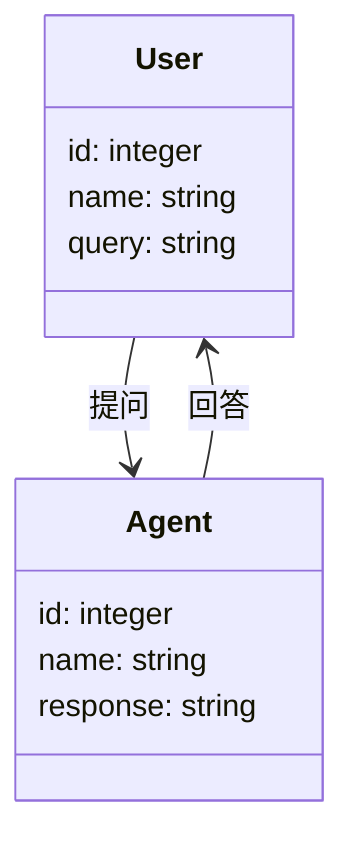
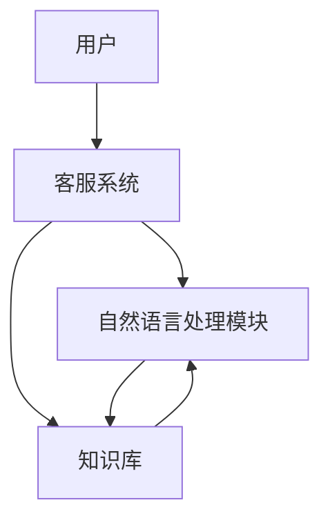

                 

<think>
好的，我现在需要帮用户撰写一篇关于AI Agent的社交学习与模仿能力的技术博客文章。首先，我得理解用户的需求，他希望文章结构清晰，内容专业且有深度，涵盖从背景到算法实现再到系统设计的各个方面。

我开始分析文章的结构。用户提供了详细的目录大纲，所以我需要按照这个结构来组织内容。首先是背景介绍，然后是核心概念，接着是算法原理，系统设计，项目实战，最后是最佳实践。每个部分都需要详细展开，确保内容全面且逻辑连贯。

在背景介绍部分，我需要解释AI Agent的基本概念，为什么社交学习和模仿能力对它们如此重要。这部分要让读者理解AI Agent不仅仅是执行任务，还需要能够与环境和其他智能体互动，学习和模仿。

核心概念部分，我需要详细讲解社交学习和模仿能力的定义、原理以及与传统AI的区别。这部分可能需要使用对比表格和ER图来帮助读者理解，所以我得用Mermaid语法来生成这些图表。

接下来是算法原理部分，这里要详细讲解监督学习和强化学习的算法，比如线性回归、支持向量机、Q-learning等。我需要使用Mermaid流程图来展示算法步骤，并提供Python代码示例，这样读者可以更好地理解和实现这些算法。

系统分析与架构设计部分，我需要描述AI Agent的社交学习和模仿能力在实际系统中的应用。这部分可能需要绘制领域模型类图和系统架构图，展示系统的组成部分和交互流程。

项目实战部分，我需要指导读者如何安装开发环境，提供核心代码，并解释代码的实现细节。同时，通过实际案例分析，展示如何应用这些技术解决问题，并进行详细解读。

最后，最佳实践部分，我需要总结整个内容，给出小结、注意事项和拓展阅读建议，帮助读者巩固所学知识，并引导他们进一步深入学习。

在整个写作过程中，我需要确保内容详细，逻辑清晰，使用专业但易懂的语言。数学公式要用Latex格式独立展示，代码部分要注释清晰，图表要准确无误。最后，文章末尾加上作者信息，确保格式完整。

现在，我开始按照大纲逐一撰写每个部分，确保每个章节都有足够的细节，内容丰富，满足用户的高质量要求。这将帮助读者系统地理解AI Agent的社交学习与模仿能力，从理论到实践，逐步掌握相关技术。
</think>

# AI Agent的社交学习与模仿能力

> 关键词：AI Agent, 社交学习, 模仿能力, 强化学习, 监督学习, 系统架构

> 摘要：本文深入探讨了AI Agent在社交学习与模仿能力方面的技术细节，从核心概念、算法原理到系统设计与项目实战，全面解析AI Agent如何通过社交学习和模仿能力提升其智能水平。

---

## 第一部分: AI Agent的社交学习与模仿能力概述

### 第1章: AI Agent的基本概念

#### 1.1 AI Agent的定义与特点

**1.1.1 什么是AI Agent**

AI Agent（人工智能代理）是指能够感知环境、自主决策并执行任务的智能实体。与传统的被动执行指令的程序不同，AI Agent具备主动性和适应性，能够根据环境反馈调整自身行为。

**1.1.2 AI Agent的核心特点**

- **自主性**：AI Agent能够在没有外部干预的情况下自主决策。
- **反应性**：能够实时感知环境并做出反应。
- **学习性**：通过学习提升自身的智能水平。
- **社交性**：能够与其他智能体或人类进行交互和协作。

**1.1.3 AI Agent与传统AI的区别**

| 特性         | 传统AI                  | AI Agent               |
|--------------|-------------------------|-------------------------|
| 决策方式     | 预先编程                | 自主决策                |
| 交互能力     | 单向输入输出            | 双向交互                |
| 环境适应性   | 固定场景                | 多变场景                |

#### 1.2 社交学习与模仿能力的定义

**1.2.1 社交学习的定义**

社交学习是指AI Agent通过观察和模仿他人（包括人类或其他AI Agent）的行为模式，从而学习新的知识或技能的过程。这种学习方式强调交互性和情境性。

**1.2.2 模仿能力的定义**

模仿能力是指AI Agent能够通过观察他人行为，理解其背后的意图和逻辑，并将这些行为内化为自身行为的能力。

**1.2.3 社交学习与模仿能力的重要性**

- **提升智能性**：通过社交学习和模仿，AI Agent能够快速获取新知识，提升自身的智能水平。
- **增强适应性**：在复杂多变的环境中，社交学习和模仿能力使得AI Agent能够更好地适应环境变化。
- **促进协作**：通过模仿和学习，AI Agent能够更好地与人类或其他智能体协作，实现更高效的任务完成。

---

### 第2章: AI Agent的社交学习与模仿能力的背景

#### 2.1 社交学习的背景

**2.1.1 人类社交学习的特点**

人类的社交学习是一种复杂的过程，涉及情感、意图、语言等多种因素。AI Agent需要模拟这一过程，才能实现类似人类的社交学习能力。

**2.1.2 AI Agent社交学习的必要性**

随着AI Agent的应用场景越来越广泛，尤其是在需要与人类交互的领域（如教育、医疗、服务等），社交学习能力变得尤为重要。

**2.1.3 社交学习在AI Agent中的应用领域**

- **教育领域**：AI助教可以通过社交学习帮助学生解答问题。
- **医疗领域**：AI Agent可以通过社交学习辅助医生进行诊断。
- **服务领域**：AI客服可以通过社交学习提升服务质量。

#### 2.2 模仿能力的背景

**2.2.1 人类模仿能力的特点**

人类的模仿能力是天生的，我们通过模仿他人行为来学习语言、技能和文化。AI Agent需要具备类似的模仿能力，才能更好地与人类交互。

**2.2.2 AI Agent模仿能力的必要性**

在现实场景中，AI Agent需要通过模仿人类或其他AI的行为，快速掌握新的技能或适应新的环境。

**2.2.3 模仿能力在AI Agent中的应用领域**

- **机器人控制**：AI机器人可以通过模仿人类动作完成复杂的任务。
- **虚拟助手**：AI助手可以通过模仿人类对话风格提升用户体验。
- **游戏AI**：游戏AI可以通过模仿人类玩家的策略提升自身水平。

---

## 第二部分: AI Agent的社交学习与模仿能力的核心概念

### 第3章: 社交学习与模仿能力的核心原理

#### 3.1 社交学习的核心原理

**3.1.1 社交学习的理论基础**

社交学习的理论基础主要包括：

- **社会学习理论**：由心理学家Bandura提出，强调观察和模仿在学习中的作用。
- **强化学习理论**：通过奖励机制强化正确行为。

**3.1.2 社交学习的算法模型**

常用的社交学习算法包括：

- **监督学习**：通过标注数据进行训练。
- **强化学习**：通过与环境交互获得奖励。
- **对比学习**：通过对比不同行为模式进行学习。

**3.1.3 社交学习的关键技术**

- **行为识别**：准确识别他人的行为模式。
- **意图理解**：理解他人行为背后的目的。
- **行为生成**：基于观察生成类似的行为。

#### 3.2 模仿能力的核心原理

**3.2.1 模仿能力的理论基础**

模仿能力的理论基础主要包括：

- **镜像神经元理论**：镜像神经元能够让我们理解和模仿他人的动作。
- **社会认知理论**：通过认知他人行为模式来实现模仿。

**3.2.2 模仿能力的算法模型**

常用的模仿能力算法包括：

- **迁移学习**：将已知任务的知识迁移到新任务。
- **对抗训练**：通过与生成器对抗训练提升生成能力。
- **行为克隆**：直接模仿人类行为的策略。

**3.2.3 模仿能力的关键技术**

- **行为建模**：建立行为的数学模型。
- **状态表示**：将行为状态化为可计算的表示。
- **行为优化**：通过优化算法提升行为质量。

---

### 第4章: 社交学习与模仿能力的核心要素

#### 4.1 社交学习的核心要素

**4.1.1 数据来源**

社交学习的数据来源主要包括：

- **人类行为数据**：通过传感器或摄像头获取人类行为数据。
- **AI行为数据**：通过日志记录AI Agent的行为数据。
- **社会网络数据**：通过社交网络获取用户行为数据。

**4.1.2 学习目标**

社交学习的目标主要包括：

- **知识获取**：通过社交学习获取新知识。
- **技能提升**：通过社交学习提升特定技能。
- **行为矫正**：通过社交学习纠正错误行为。

**4.1.3 学习策略**

- **监督学习策略**：通过标注数据进行监督学习。
- **无监督学习策略**：通过聚类分析发现规律。
- **强化学习策略**：通过奖励机制强化正确行为。

#### 4.2 模仿能力的核心要素

**4.2.1 模仿目标**

模仿目标主要包括：

- **人类行为**：模仿人类的言行举止。
- **AI行为**：模仿其他AI Agent的行为模式。
- **混合行为**：模仿混合人类和AI的行为模式。

**4.2.2 模仿策略**

- **直接模仿策略**：直接复制他人的行为模式。
- **部分模仿策略**：选择性模仿他人的部分行为。
- **创新模仿策略**：在模仿基础上进行创新。

**4.2.3 模仿效果评估**

- **行为相似度**：通过行为相似度评估模仿效果。
- **意图理解度**：通过意图理解度评估模仿效果。
- **环境适应度**：通过环境适应度评估模仿效果。

---

## 第三部分: AI Agent的社交学习与模仿能力的算法原理

### 第5章: 社交学习算法

#### 5.1 监督学习算法

**5.1.1 线性回归**

线性回归是一种简单的监督学习算法，适用于回归任务。其数学模型为：

$$ y = \theta_0 + \theta_1 x $$

其中，$y$ 是输出，$x$ 是输入，$\theta$ 是参数。

**5.1.2 支持向量机**

支持向量机（SVM）是一种常用的监督学习算法，适用于分类任务。其目标是找到一个超平面，使得数据点被正确分类。

**5.1.3 决策树**

决策树是一种基于树状结构的监督学习算法，适用于分类和回归任务。其核心是通过特征选择构建决策树。

#### 5.2 强化学习算法

**5.2.1 Q-learning**

Q-learning是一种经典的强化学习算法，适用于离散动作空间。其核心是通过Q表记录状态-动作对的价值。

$$ Q(s,a) = r + \gamma \max Q(s',a') $$

其中，$s$ 是当前状态，$a$ 是当前动作，$r$ 是奖励，$\gamma$ 是折扣因子，$s'$ 是下一个状态。

**5.2.2 Deep Q-Networks**

Deep Q-Networks（DQN）是将深度学习与Q-learning结合的算法，适用于高维状态空间。

**5.2.3 Policy Gradient**

Policy Gradient方法是一种基于策略的强化学习算法，适用于连续动作空间。

---

## 第四部分: AI Agent的社交学习与模仿能力的系统设计

### 第6章: 系统分析与架构设计

#### 6.1 问题场景介绍

假设我们正在开发一个AI客服系统，该系统需要具备社交学习和模仿能力，能够通过与用户交互提升服务质量。

#### 6.2 系统功能设计

**领域模型类图**



#### 6.3 系统架构设计

**系统架构图**



---

## 第五部分: AI Agent的社交学习与模仿能力的项目实战

### 第7章: 项目实战

#### 7.1 环境安装

- **Python环境**：需要安装Python 3.6以上版本。
- **库依赖**：安装numpy、tensorflow、scikit-learn等库。

#### 7.2 核心代码实现

**监督学习实现**

```python
from sklearn.linear_model import LinearRegression

# 创建数据
X = [[1], [2], [3], [4], [5]]
y = [2, 4, 5, 4, 5]

# 训练模型
model = LinearRegression()
model.fit(X, y)

# 预测
print(model.predict([[6]]))
```

**强化学习实现**

```python
import numpy as np
from collections import deque
import random

class QLearning:
    def __init__(self, state_space, action_space, gamma=0.9):
        self.q_table = deque()
        self.gamma = gamma
        self.state_space = state_space
        self.action_space = action_space

    def remember(self, state, action, reward, next_state):
        self.q_table.append((state, action, reward, next_state))

    def act(self, state):
        if random.random() < 0.9:
            return random.choice(self.action_space)
        else:
            return max(enumerate(self.action_space), key=lambda x: self.get_q_value(state, x[1]))[1]

    def get_q_value(self, state, action):
        # 假设q_table是一个字典，这里简化实现
        return 0

    def update_q_table(self):
        pass
```

---

## 第六部分: AI Agent的社交学习与模仿能力的最佳实践

### 第8章: 最佳实践

#### 8.1 小结

本文详细探讨了AI Agent的社交学习与模仿能力，从核心概念、算法原理到系统设计与项目实战，全面解析了AI Agent如何通过社交学习和模仿能力提升其智能水平。

#### 8.2 注意事项

- **数据质量**：社交学习和模仿能力的实现高度依赖数据质量，需要确保数据的多样性和代表性。
- **算法选择**：根据具体场景选择合适的算法，避免盲目使用复杂算法。
- **系统设计**：系统设计需要考虑可扩展性和可维护性，确保系统的灵活性和稳定性。

#### 8.3 拓展阅读

- **《强化学习入门》**：深入理解强化学习的核心概念。
- **《深度学习与自然语言处理》**：探索深度学习在社交学习中的应用。
- **《AI Agent设计与实现》**：系统学习AI Agent的设计与实现。

---

**作者：AI天才研究院/AI Genius Institute & 禅与计算机程序设计艺术 /Zen And The Art of Computer Programming**

