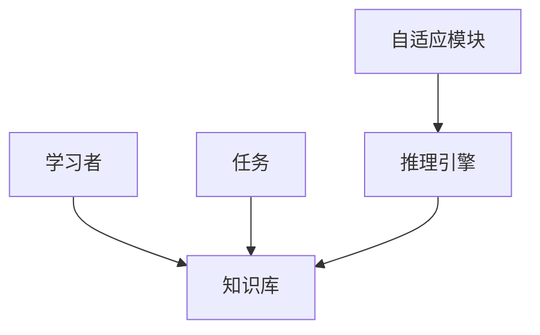
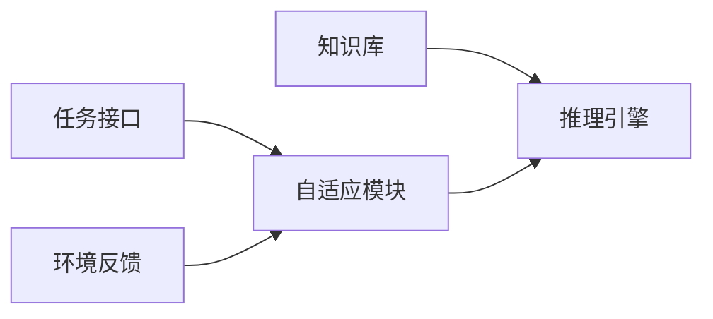
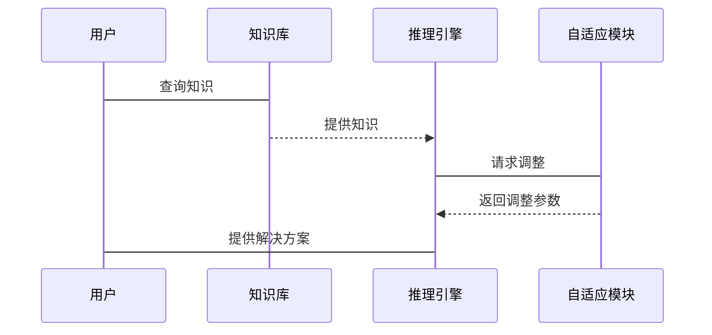

                 


# 第一部分: AI Agent的终身学习系统概述

## 第1章: 终身学习系统的核心概念

### 1.1 终身学习的背景与意义
#### 1.1.1 AI Agent的发展现状
人工智能代理（AI Agent）是实现智能系统的核心组件，广泛应用于自动驾驶、智能助手、推荐系统等领域。随着技术的发展，AI Agent需要具备更强的适应性和自主性，以应对复杂多变的环境。

#### 1.1.2 终身学习在AI Agent中的重要性
传统的AI系统通常依赖于预训练的数据和规则，难以应对新环境和未知问题。终身学习使得AI Agent能够不断更新知识和技能，适应动态变化的需求。

#### 1.1.3 终身学习系统的定义与目标
终身学习系统是指能够在不断变化的环境中，通过持续学习和自适应，提升自身性能和智能水平的系统。其目标是使AI Agent具备持续改进和自我优化的能力。

### 1.2 终身学习系统的背景与问题描述
#### 1.2.1 当前AI Agent面临的挑战
AI Agent在实际应用中面临数据稀疏性、环境不确定性、任务多样性等挑战，传统方法难以有效应对。

#### 1.2.2 终身学习系统的核心问题
如何实现知识的持续更新、多任务的学习与协调、以及高效的知识表示与推理。

#### 1.2.3 系统的边界与外延
终身学习系统的边界包括学习机制、知识表示、推理引擎等核心组件；外延则涉及数据源、任务目标、环境反馈等外部因素。

### 1.3 终身学习系统的核心要素
#### 1.3.1 自适应学习机制
通过元学习和迁移学习，使系统能够快速适应新任务和环境。

#### 1.3.2 知识表示与推理
采用符号逻辑和神经网络结合的方法，实现知识的有效表示和推理。

#### 1.3.3 持续学习策略
设计合理的学习策略，确保系统能够在不同任务之间切换，同时保持已有的知识和技能。

## 第2章: 终身学习系统的原理与联系

### 2.1 终身学习系统的基本原理
#### 2.1.1 元学习（Meta-Learning）的概念
元学习是一种通过学习如何学习的方法，旨在快速适应新任务。其核心思想是通过优化参数，使模型能够快速调整以适应新的数据分布。

#### 2.1.2 迁移学习（Transfer Learning）的原理
迁移学习是指将已学习的知识应用到新的任务中，通过共享特征或任务间的关系，减少新任务的学习成本。

#### 2.1.3 自适应学习（Adaptive Learning）的机制
自适应学习是一种动态调整学习策略的方法，根据环境反馈和任务需求，实时优化学习过程。

### 2.2 核心概念的对比分析
#### 2.2.1 元学习与迁移学习的对比
元学习关注如何快速适应新任务，而迁移学习关注如何利用已有知识解决新任务。两者在方法上有所不同，但目标一致。

#### 2.2.2 自适应学习与强化学习的联系
自适应学习通过调整策略应对变化，强化学习通过奖励机制优化行为。两者在动态环境中都有重要作用。

#### 2.2.3 知识表示与推理的关系
知识表示是推理的基础，有效的表示方式能够提升推理的效率和准确性。

### 2.3 终身学习系统的实体关系图


# 第二部分: 终身学习系统的算法原理

## 第3章: 元学习算法原理

### 3.1 元学习的基本概念
元学习通过优化元参数，使模型能够快速适应新任务。元参数控制模型如何调整参数以适应不同任务。

#### 3.1.1 元学习的数学模型
元学习的数学模型可以表示为：
$$\theta = f_{\phi}(\theta_{\text{init}})$$
其中，$\theta$ 是任务特定参数，$\phi$ 是元参数，$f$ 是元函数。

#### 3.1.2 元学习的优化目标
元学习的目标是最小化所有任务的损失之和：
$$\min_{\phi} \sum_{i=1}^{N} L_i(f_{\phi}(\theta_{\text{init}}))$$

### 3.2 元学习算法的实现
#### 3.2.1 Model-Agnostic Meta-Learning (MAML)
MAML通过在多个任务上优化共享参数，使模型能够快速适应新任务。

#### 3.2.2 Meta-SGD算法
Meta-SGD是一种基于梯度的元学习方法，通过计算梯度的梯度来更新参数。

#### 3.2.3 元学习的训练流程
1. 初始化模型参数$\theta$。
2. 在每个任务上计算梯度$\nabla L_i$。
3. 更新元参数$\phi$，使模型能够快速调整$\theta$以适应新任务。

### 3.3 元学习算法的代码实现
```python
import torch
import torch.nn as nn

class MetaLearner:
    def __init__(self, model, optimizer):
        self.model = model
        self.optimizer = optimizer
        self.loss_fn = nn.CrossEntropyLoss()

    def train(self, tasks, inner_steps=5, outer_steps=10):
        for _ in range(outer_steps):
            total_loss = 0
            for task in tasks:
                # Inner loop: Adapt to the task
                self.optimizer.zero_grad()
                for step in range(inner_steps):
                    x, y = task.get_data()
                    loss = self.loss_fn(self.model(x), y)
                    loss.backward()
                    self.optimizer.step()
                # Outer loop: Optimize for the meta-loss
                x_meta, y_meta = task.get_meta_data()
                loss_meta = self.loss_fn(self.model(x_meta), y_meta)
                loss_meta.backward()
                self.optimizer.zero_grad()
                self.optimizer.step()
            total_loss += loss_meta.item()
        return total_loss / len(tasks)
```

## 第4章: 自适应学习算法原理

### 4.1 自适应学习的基本概念
自适应学习通过动态调整学习策略，使模型能够应对环境的变化。

#### 4.1.1 自适应学习的数学模型
自适应学习模型通常包括状态、动作和奖励三个部分：
$$R(s, a) = r$$
其中，$s$ 是状态，$a$ 是动作，$r$ 是奖励。

### 4.2 自适应学习算法的实现
#### 4.2.1 自适应增强学习（ALE）
ALE通过调整策略参数，使模型能够适应新环境。

#### 4.2.2 自适应迁移学习（ATL）
ATL通过共享特征和任务间的关系，实现跨任务的自适应学习。

#### 4.2.3 自适应学习的训练流程
1. 初始化模型参数。
2. 在源任务上进行预训练。
3. 在目标任务上进行微调，通过自适应模块调整模型参数。

### 4.3 自适应学习算法的代码实现
```python
import torch
import torch.nn as nn

class AdaptiveLearner:
    def __init__(self, model, adapter):
        self.model = model
        self.adapter = adapter
        self.loss_fn = nn.CrossEntropyLoss()

    def train(self, source_tasks, target_tasks, epochs=10):
        for epoch in range(epochs):
            for task in source_tasks:
                x, y = task.get_data()
                loss = self.loss_fn(self.model(x), y)
                loss.backward()
                self.model.optimizer.step()
            for task in target_tasks:
                x, y = task.get_data()
                adapted_model = self.adapter.apply(self.model, task)
                loss = self.loss_fn(adapted_model(x), y)
                loss.backward()
                self.adapter.optimizer.step()
        return loss.item()
```

# 第三部分: 终身学习系统的系统分析与架构设计

## 第5章: 终身学习系统的架构设计

### 5.1 问题场景介绍
终身学习系统需要在动态环境中不断更新知识和技能，以应对新任务和挑战。

### 5.2 系统功能设计
#### 5.2.1 知识库管理模块
负责存储和管理知识，支持知识的更新和检索。

#### 5.2.2 推理引擎模块
基于知识库进行推理，生成解决方案。

#### 5.2.3 自适应学习模块
根据环境反馈调整学习策略，优化系统性能。

### 5.3 系统架构设计


### 5.4 系统接口设计
系统接口包括知识库接口、推理引擎接口和自适应模块接口，确保各模块之间的高效通信。

### 5.5 系统交互序列图


# 第四部分: 终身学习系统的项目实战

## 第6章: 终身学习系统的实现

### 6.1 环境安装
安装必要的库和工具，如TensorFlow、PyTorch等。

### 6.2 核心代码实现
实现终身学习系统的各模块，包括知识库、推理引擎和自适应模块。

### 6.3 代码应用解读与分析
详细解读代码实现，分析各模块的功能和交互。

### 6.4 实际案例分析
通过具体案例，展示终身学习系统在实际应用中的表现和效果。

### 6.5 项目小结
总结项目实现的经验和教训，提出改进建议。

# 第五部分: 总结与展望

## 第7章: 总结与展望

### 7.1 小结
总结终身学习系统的实现和应用，强调其重要性和潜力。

### 7.2 最佳实践 tips
提供一些实用的建议，帮助读者更好地理解和应用终身学习系统。

### 7.3 注意事项
提醒读者在实际应用中需要注意的问题和潜在的风险。

### 7.4 拓展阅读
推荐相关的书籍和论文，供读者进一步学习和研究。

---

# 作者：AI天才研究院（AI Genius Institute） & 禅与计算机程序设计艺术（Zen And The Art of Computer Programming）

---

**文章关键词**：AI Agent，终身学习，元学习，迁移学习，自适应学习，系统架构设计，项目实战

**摘要**：本文详细探讨了AI Agent的终身学习系统设计，从核心概念到算法原理，再到系统架构和项目实现，全面解析了终身学习系统的设计与实现。通过具体案例分析和代码实现，展示了如何构建一个高效、自适应的AI Agent系统。

