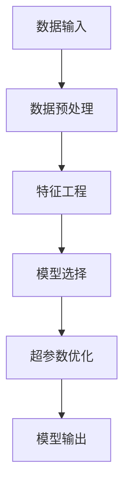
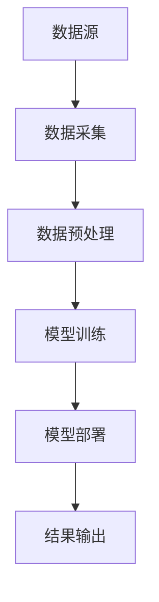
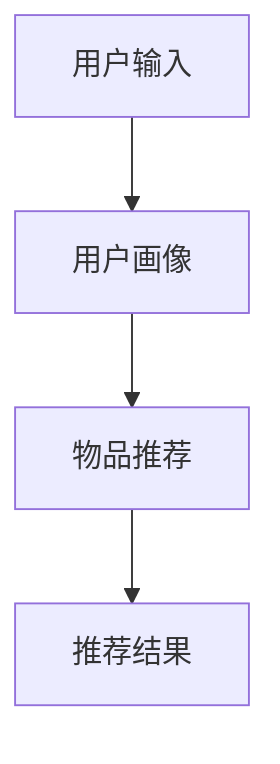

                 


# AI Agent的自动机器学习(AutoML)应用

> 关键词：AutoML，AI Agent，机器学习，自动化，人工智能

> 摘要：本文深入探讨了AI Agent在自动机器学习（AutoML）中的应用，分析了AutoML的核心技术原理，详细讲解了AI Agent与AutoML的结合方式，通过实际案例展示了如何设计和实现基于AutoML的AI Agent系统，最后展望了未来的发展趋势。

---

# 第1章: 引言

## 1.1 AutoML与AI Agent的基本概念

### 1.1.1 AutoML的定义与特点
AutoML（Automated Machine Learning）是指通过自动化技术来简化机器学习模型的构建过程，使得非专家也能轻松训练出高性能的模型。其特点包括：
- **自动化**：从数据预处理、特征工程到模型选择和调参，整个过程高度自动化。
- **高效性**：通过优化算法快速找到最优模型，减少人工干预。
- **可扩展性**：支持大规模数据和复杂任务的处理。

### 1.1.2 AI Agent的定义与核心能力
AI Agent（人工智能代理）是一种能够感知环境、自主决策并执行任务的智能体。其核心能力包括：
- **感知能力**：通过传感器或数据源获取环境信息。
- **决策能力**：基于感知信息，利用算法做出最优决策。
- **执行能力**：通过执行器或接口将决策转化为具体行动。

### 1.1.3 AutoML与AI Agent的结合应用
AutoML为AI Agent提供了强大的模型构建能力，而AI Agent则为AutoML提供了智能化的决策和执行能力。两者的结合使得机器学习模型的部署和优化更加智能化和自动化。

---

## 1.2 AutoML与AI Agent的应用背景

### 1.2.1 传统机器学习的局限性
传统的机器学习过程需要人工干预，包括特征工程、模型选择和调参等，耗时且复杂，尤其在处理大规模数据时效率低下。

### 1.2.2 AutoML的出现与意义
AutoML的出现解决了传统机器学习的痛点，使得机器学习技术能够快速落地，特别是在企业级应用中表现出色。

### 1.2.3 AI Agent在AutoML中的角色
AI Agent作为AutoML的“智能大脑”，负责协调和优化整个机器学习流程，包括数据采集、模型选择、调参和部署。

---

## 1.3 AutoML与AI Agent的应用现状

### 1.3.1 AutoML在企业中的应用案例
AutoML已在金融、医疗、电商等领域得到广泛应用，帮助企业快速构建预测模型。

### 1.3.2 AI Agent在AutoML中的实际应用
AI Agent通过自动化决策和执行，优化机器学习模型的部署和维护过程。

### 1.3.3 当前技术的挑战与不足
- 数据隐私问题
- 模型解释性不足
- 多目标优化的复杂性

---

## 1.4 本书内容与目标

### 1.4.1 本书的核心目标
通过理论与实践结合，深入讲解AI Agent在AutoML中的应用。

### 1.4.2 本书的章节安排
本书分为五章，涵盖AutoML与AI Agent的基本概念、核心技术、实现方法、实际案例和未来趋势。

### 1.4.3 本书的适用读者
适合机器学习工程师、AI Agent开发者以及对AutoML感兴趣的技术人员。

---

# 第2章: AutoML的核心原理

## 2.1 AutoML的基本原理

### 2.1.1 AutoML的定义与核心流程
AutoML的核心流程包括数据预处理、特征工程、模型选择和超参数优化。

### 2.1.2 AutoML的主要技术特点
- **自动化**：减少人工干预
- **高效性**：快速找到最优模型
- **可扩展性**：支持大规模数据

---

## 2.2 AutoML的核心算法

### 2.2.1 基于搜索的AutoML方法
基于搜索的AutoML方法通过搜索算法（如遗传算法）寻找最优模型。

### 2.2.2 基于超参数优化的AutoML方法
超参数优化方法（如随机搜索和网格搜索）通过优化模型超参数提升性能。

### 2.2.3 基于集成学习的AutoML方法
集成学习方法通过组合多个模型的结果，进一步提升性能。

---

## 2.3 AutoML的数学模型与公式

### 2.3.1 超参数优化的数学表达
$$ \text{目标函数} = f(\theta) $$
其中，θ表示模型的超参数。

### 2.3.2 搜索算法的数学表达
$$ \text{搜索空间} = S \subseteq \mathbb{R}^n $$
其中，n表示超参数的数量。

---

## 2.4 AutoML的系统架构

### 2.4.1 系统功能模块
- 数据预处理模块
- 特征工程模块
- 模型选择模块
- 超参数优化模块

### 2.4.2 系统架构图


---

# 第3章: AI Agent的核心能力

## 3.1 AI Agent的基本概念

### 3.1.1 AI Agent的定义与分类
AI Agent可以分为简单反射型、基于模型的反应型、目标驱动型和实用驱动型。

### 3.1.2 AI Agent的核心能力
- **感知能力**：通过传感器获取环境信息
- **决策能力**：基于感知信息做出决策
- **执行能力**：通过执行器执行决策

---

## 3.2 AI Agent的决策机制

### 3.2.1 基于规则的决策机制
通过预定义的规则进行决策。

### 3.2.2 基于模型的决策机制
通过机器学习模型进行预测和决策。

### 3.2.3 基于强化学习的决策机制
通过强化学习算法优化决策策略。

---

## 3.3 AI Agent的通信协议

### 3.3.1 HTTP协议
通过HTTP API进行通信。

### 3.3.2 WebSocket协议
通过WebSocket实现实时通信。

### 3.3.3 RESTful API
通过RESTful API实现标准化通信。

---

# 第4章: AutoML与AI Agent的结合

## 4.1 AutoML与AI Agent的结合方式

### 4.1.1 AI Agent作为AutoML的决策者
AI Agent负责协调AutoML的整个流程。

### 4.1.2 AutoML作为AI Agent的能力扩展
AutoML为AI Agent提供强大的模型构建能力。

---

## 4.2 AutoML与AI Agent的协同工作流程

### 4.2.1 数据采集
AI Agent通过传感器或API获取数据。

### 4.2.2 数据预处理
AutoML对数据进行清洗和特征工程。

### 4.2.3 模型训练
AutoML自动选择和训练模型。

### 4.2.4 模型部署
AI Agent将模型部署到实际场景中。

---

## 4.3 AutoML与AI Agent的系统架构

### 4.3.1 系统功能模块
- 数据采集模块
- 数据预处理模块
- 模型训练模块
- 模型部署模块

### 4.3.2 系统架构图


---

# 第5章: 项目实战

## 5.1 项目背景与需求分析

### 5.1.1 项目背景
以电商推荐系统为例，介绍项目背景和需求。

### 5.1.2 项目目标
通过AutoML和AI Agent实现个性化推荐。

---

## 5.2 系统设计与实现

### 5.2.1 系统功能设计
- 用户画像构建
- 物品推荐算法
- 推荐结果输出

### 5.2.2 系统架构设计


### 5.2.3 系统实现代码
```python
# 示例代码
from auto_ml import AutoML
from ai_agent import AI-Agent

# 初始化AutoML
automl = AutoML()

# 初始化AI Agent
agent = AI-Agent()

# 数据预处理
data = automl.preprocess(data)

# 模型训练
model = automl.train(data)

# 模型部署
agent.deploy(model)
```

---

## 5.3 系统测试与优化

### 5.3.1 系统测试
通过测试用例验证系统性能。

### 5.3.2 系统优化
根据测试结果优化模型和算法。

---

## 5.4 项目小结

通过项目实战，我们深入理解了AutoML与AI Agent的结合应用。

---

# 第6章: 未来展望

## 6.1 AutoML的未来发展趋势

### 6.1.1 多目标优化
AutoML将支持更多目标的优化。

### 6.1.2 分布式计算
AutoML将利用分布式计算提升效率。

---

## 6.2 AI Agent的未来发展趋势

### 6.2.1 更强的自主决策能力
AI Agent将具备更强的自主决策能力。

### 6.2.2 更广泛的应用场景
AI Agent将在更多领域得到应用。

---

## 6.3 AutoML与AI Agent的结合趋势

### 6.3.1 更深度的结合
AutoML与AI Agent将更深度地结合，形成更强大的智能系统。

### 6.3.2 更广泛的应用
AutoML与AI Agent的结合将在更多行业得到广泛应用。

---

# 作者：AI天才研究院 & 禅与计算机程序设计艺术

