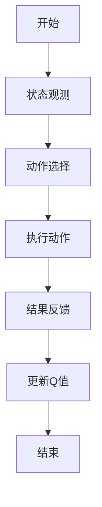
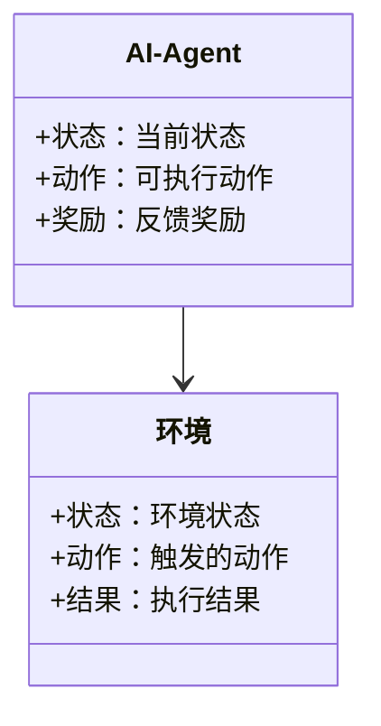
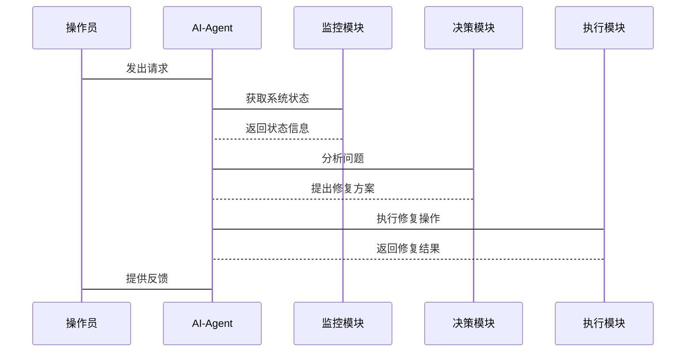

                 


# AI Agent的自我诊断与修复能力：提高系统稳定性

## 关键词：AI Agent, 自我诊断, 自我修复, 系统稳定性, 强化学习, 算法原理, 系统架构

## 摘要：  
AI Agent的自我诊断与修复能力是提升系统稳定性的关键。本文从AI Agent的核心概念出发，详细探讨其自我诊断与修复的机制，结合强化学习算法和系统架构设计，提供实际案例分析和最佳实践，帮助读者全面理解如何通过技术手段提高AI Agent的系统稳定性。

---

## 第一部分：AI Agent的背景与核心概念

### 第1章：AI Agent概述

#### 1.1 AI Agent的基本概念

AI Agent（智能体）是指在计算机系统中具有感知环境、自主决策和执行任务能力的实体。它可以是一个软件程序、机器人或其他智能设备，能够通过传感器或数据源获取信息，并根据预设目标或用户指令完成特定任务。

AI Agent的核心特点包括：
- **自主性**：无需外部干预，自主决策。
- **反应性**：能够实时感知环境变化并做出响应。
- **目标导向性**：基于目标驱动行为。
- **学习能力**：通过数据和经验不断优化性能。

**应用场景**：
- 智能客服：处理用户请求，解决常见问题。
- 智能推荐系统：根据用户行为推荐相关内容。
- 自动驾驶：实时处理交通数据，做出驾驶决策。

---

#### 1.2 自我诊断与修复能力的重要性

AI Agent在运行过程中可能会遇到各种问题，如数据错误、算法失效或外部干扰。这些问题可能导致系统崩溃或服务质量下降，影响用户体验和系统稳定性。因此，自我诊断与修复能力是AI Agent的重要特征。

**系统稳定性的重要性**：
- 系统稳定是确保AI Agent正常运行的基础。
- 稳定性差可能导致服务中断，造成经济损失或声誉损害。

**自我诊断与修复的必要性**：
- **故障预防**：通过实时监控，提前发现潜在问题。
- **快速响应**：在故障发生时，迅速定位问题并采取修复措施。
- **自适应能力**：根据环境变化调整系统参数，确保最佳性能。

---

## 第二部分：AI Agent的自我诊断与修复机制

### 第2章：自我诊断与修复的核心机制

#### 2.1 自我诊断机制

AI Agent的自我诊断机制包括以下几个方面：

**错误检测与识别**：
- **数据校验**：通过数据校验算法检测输入数据的准确性。
- **异常检测**：利用统计方法或机器学习模型识别异常行为。
- **日志分析**：解析系统日志，发现潜在问题。

**状态监控与分析**：
- **实时监控**：持续跟踪系统运行状态，包括CPU、内存、网络等资源使用情况。
- **性能指标分析**：分析关键性能指标（KPIs），如响应时间、错误率等。
- **关联分析**：将多个指标相关联，找出问题的根本原因。

**异常处理流程**：
- **故障隔离**：定位故障的具体模块或组件。
- **错误分类**：根据错误类型选择合适的处理策略。
- **告警机制**：当检测到严重问题时，触发告警通知相关人员。

#### 2.2 自我修复机制

AI Agent的自我修复机制旨在在发现问题后，自动采取修复措施，减少人工干预。

**自动修复策略**：
- **参数调整**：动态调整系统参数以优化性能。
- **冗余切换**：在主系统故障时，切换到备用系统。
- **错误重试**：对失败的操作进行重试，确保任务完成。

**系统恢复与优化**：
- **状态恢复**：在故障修复后，恢复系统到正常状态。
- **性能优化**：根据修复结果，优化系统配置以提高效率。
- **经验积累**：将修复过程中的经验记录下来，用于未来的问题处理。

**修复过程中的反馈机制**：
- **反馈收集**：收集修复过程中的数据，用于后续优化。
- **学习与改进**：利用反馈数据改进自我修复算法，提高修复效率和准确性。

---

## 第三部分：AI Agent自我诊断与修复的算法原理

### 第3章：基于强化学习的自适应修复算法

#### 3.1 算法原理

**强化学习的基本概念**：
- **状态（State）**：系统当前的运行状态。
- **动作（Action）**：AI Agent可以采取的操作。
- **奖励（Reward）**：系统对AI Agent行为的反馈，用于指导其学习。

**自适应修复算法的设计思路**：
- **状态观测**：AI Agent通过传感器或日志获取当前状态。
- **决策制定**：基于当前状态，选择最优修复动作。
- **动作执行**：执行选定的动作，并观察结果。
- **奖励机制**：根据修复结果调整奖励函数，优化决策策略。

**算法的数学模型与公式推导**：

**Q-learning算法**：
- 状态-动作价值函数：$$ Q(s, a) = r + \gamma \max Q(s', a') $$
- 其中，$$ s $$ 是当前状态，$$ a $$ 是动作，$$ r $$ 是奖励，$$ \gamma $$ 是折扣因子，$$ s' $$ 是下一个状态。

**策略迭代**：
- 策略 π：$$ \pi(a|s) = \arg \max_a Q(s, a) $$
- 通过不断更新Q值，优化策略，使AI Agent能够做出最优决策。

#### 3.2 算法流程图



---

## 第四部分：系统架构与设计

### 第4章：系统架构设计

#### 4.1 系统功能设计

**领域模型（ER图）**：


**系统架构设计（分层架构）**：


#### 4.2 接口设计

**AI Agent与环境的交互接口**：
- **输入接口**：接收环境状态和用户请求。
- **输出接口**：发送动作指令和修复结果。

**模块间的通信接口**：
- **诊断模块**：与监控模块通信，获取系统状态。
- **修复模块**：与执行模块通信，触发修复动作。

#### 4.3 交互流程图



---

## 第五部分：项目实战

### 第5章：项目实现与案例分析

#### 5.1 项目环境安装

**所需工具与库**：
- Python 3.8+
- TensorFlow 2.0+
- OpenAI API（可选）
- Mermaid CLI（用于生成图表）

**安装步骤**：
```bash
pip install numpy tensorflow scikit-learn mermaid
```

#### 5.2 核心代码实现

**AI Agent的诊断与修复模块**：
```python
class AI_Agent:
    def __init__(self):
        self.state = 'normal'
        self.reward = 0

    def observe_state(self):
        # 获取当前状态
        return self.state

    def take_action(self, action):
        # 执行动作并返回结果
        if action == 'fix_error':
            self.state = 'normal'
            return True
        else:
            return False

    def get_reward(self, result):
        # 返回奖励值
        if result:
            return 1
        else:
            return -1
```

**强化学习算法实现**：
```python
class QLearning:
    def __init__(self, states, actions):
        self.states = states
        self.actions = actions
        self.Q = { (s, a): 0 for s in states for a in actions }

    def choose_action(self, state):
        # 选择最大Q值的动作
        max_action = max(self.Q[(state, a)] for a in self.actions)
        for a in self.actions:
            if self.Q[(state, a)] == max_action:
                return a

    def update_Q(self, state, action, reward):
        # 更新Q值
        self.Q[(state, action)] += reward
```

#### 5.3 案例分析

**场景描述**：AI Agent在智能客服系统中运行，突然遇到大量用户请求导致系统崩溃。

**修复过程**：
1. **状态观测**：AI Agent检测到系统响应时间过长，进入异常状态。
2. **决策制定**：通过Q-learning算法选择“扩展资源”动作。
3. **动作执行**：触发扩展服务器资源，增加处理能力。
4. **结果反馈**：系统恢复，用户请求得到处理，AI Agent获得正向奖励。

**代码实现**：
```python
agent = AI_Agent()
q_learning = QLearning(['normal', 'error'], ['fix_error', 'do_nothing'])
agent.state = 'error'
action = q_learning.choose_action(agent.observe_state())
result = agent.take_action(action)
q_learning.update_Q(agent.observe_state(), action, agent.get_reward(result))
```

---

## 第六部分：总结与展望

### 第6章：总结与展望

**总结**：
本文详细探讨了AI Agent的自我诊断与修复能力，从核心概念、算法原理到系统架构设计，结合实际案例分析，展示了如何通过技术手段提高系统稳定性。

**最佳实践**：
- 定期进行系统检查和维护。
- 使用强化学习算法优化自我修复能力。
- 建立完善的监控和反馈机制。

**未来展望**：
- **自适应算法优化**：进一步提升AI Agent的自适应能力，使其能够应对更复杂的系统故障。
- **多Agent协作**：研究多AI Agent协作的自我诊断与修复机制，提高整体系统的稳定性和可靠性。
- **边缘计算应用**：在边缘计算环境中，探索AI Agent自我诊断与修复的新模式。

---

## 参考文献

- Russell, S., & Norvig, P. (2010). Artificial Intelligence: A Modern Approach.
- LeCun, Y., Bengio, Y., & Hinton, G. (2015). Deep learning.
- Sutton, R. S., & Barto, A. G. (2018). Reinforcement learning: An introduction.

---

## 作者：AI天才研究院/AI Genius Institute & 禅与计算机程序设计艺术/Zen And The Art of Computer Programming

---

以上是完整的目录和文章结构，涵盖了从基础概念到实际应用的各个方面，确保读者能够全面理解AI Agent的自我诊断与修复能力，并能够应用于实际项目中。

