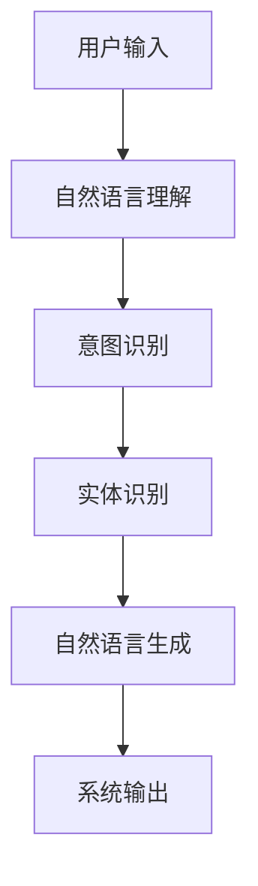
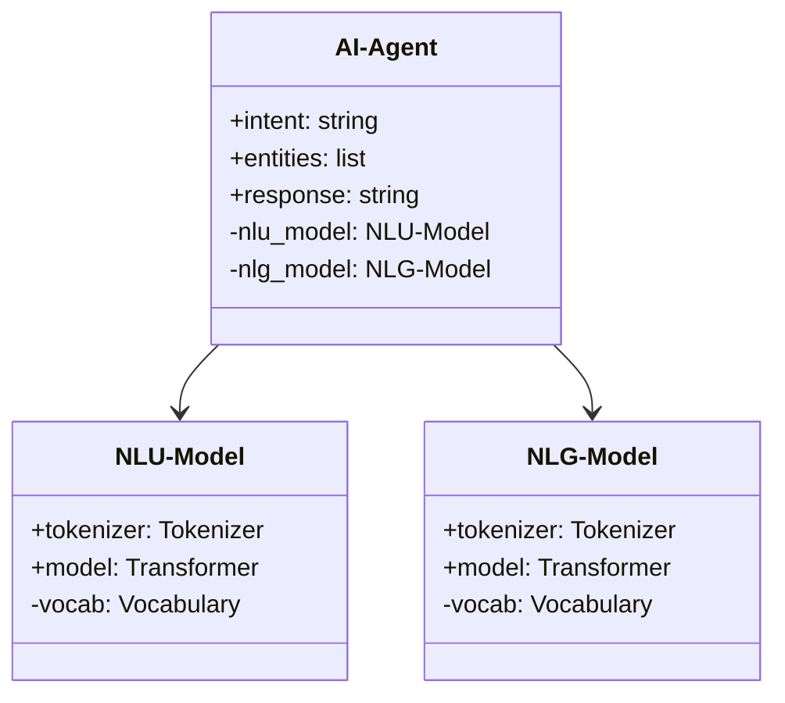
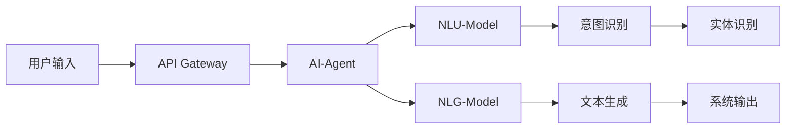
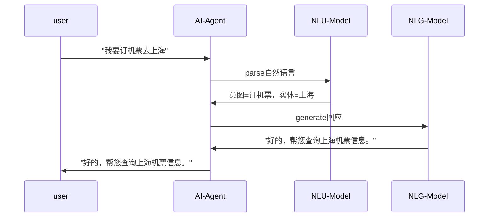

                 


```markdown
# AI Agent的自然语言接口设计与优化

> 关键词：AI Agent、自然语言接口、NLU、NLG、Transformer、预训练语言模型

> 摘要：本文深入探讨AI Agent的自然语言接口设计与优化的核心原理、算法实现和系统架构。通过理论分析与实践结合，全面解析自然语言理解（NLU）和自然语言生成（NLG）在AI Agent中的关键作用，揭示如何通过优化算法和系统架构提升用户体验。

---

# 第一部分: AI Agent的自然语言接口设计与优化基础

## 第1章: AI Agent与自然语言接口概述

### 1.1 AI Agent的基本概念
#### 1.1.1 什么是AI Agent
AI Agent（人工智能代理）是指能够感知环境、自主决策并执行任务的智能体。它通过与用户或环境的交互，实现特定目标。

#### 1.1.2 AI Agent的核心特征
- **自主性**：无需外部干预，自主完成任务。
- **反应性**：能够实时感知并响应环境变化。
- **目标导向**：基于目标驱动行为。
- **学习能力**：通过数据优化性能。

#### 1.1.3 自然语言在AI Agent中的作用
自然语言是AI Agent与用户交互的主要方式，NLU（自然语言理解）和NLG（自然语言生成）是实现人机交互的核心技术。

### 1.2 自然语言接口的定义与分类
#### 1.2.1 自然语言接口的定义
自然语言接口（NLI）是用户与计算机系统交互的界面，允许用户通过自然语言（如文本或语音）与系统进行交互。

#### 1.2.2 基于规则的NLI与基于模型的NLI对比
- **基于规则的NLI**：通过预定义的规则匹配用户输入，实现简单任务。
- **基于模型的NLI**：利用深度学习模型（如Transformer）处理复杂语义。

#### 1.2.3 当前主流的NLI实现方式
- **基于规则的方法**：适用于简单场景，如ATM机的指令交互。
- **基于统计的方法**：利用概率模型分析用户意图。
- **基于深度学习的方法**：通过神经网络实现复杂的语义理解。

### 1.3 AI Agent中的自然语言理解与生成
#### 1.3.1 自然语言理解（NLU）的基本原理
NLU的目标是将用户的输入文本解析为意图和实体信息，例如将“我要去北京”解析为“查询天气”意图和“北京”实体。

#### 1.3.2 自然语言生成（NLG）的核心技术
NLG的目标是将系统理解的意图和实体信息转化为自然流畅的文本输出，例如将“查询天气”和“北京”生成“北京今天天气怎么样”。

#### 1.3.3 NLU与NLG在AI Agent中的协同工作
NLU负责“理解用户需求”，NLG负责“生成系统回应”，两者协同实现AI Agent与用户的自然交互。

### 1.4 本章小结
本章介绍了AI Agent和自然语言接口的基本概念，分析了NLU和NLG在AI Agent中的核心作用，为后续章节的深入探讨奠定了基础。

---

## 第2章: AI Agent自然语言接口的核心概念与联系

### 2.1 核心概念原理
#### 2.1.1 自然语言处理（NLP）的基本原理
NLP通过语言学规则和机器学习算法，实现对自然语言文本的理解和生成。

#### 2.1.2 分布式语义表示的原理
分布式语义表示将词语表示为向量，通过向量的相似度计算词语之间的语义关系。

#### 2.1.3 注意力机制在NLI中的应用
注意力机制通过聚焦文本中的关键部分，提升语义理解的准确性和相关性。

### 2.2 核心概念属性特征对比表
| 概念 | 属性 | 特征 |
|------|------|------|
| NLU  | 输入  | 文本 |
| NLU  | 输出  | 意图、实体 |
| NLG  | 输入  | 意图、实体 |
| NLG  | 输出  | 文本 |

### 2.3 ER实体关系图（Mermaid流程图）


### 2.4 本章小结
本章通过核心概念的对比和实体关系图，详细阐述了AI Agent自然语言接口的核心要素及其相互关系。

---

## 第3章: AI Agent自然语言接口的算法原理

### 3.1 基于Transformer的NLI算法
#### 3.1.1 Transformer模型的基本结构
Transformer由编码器和解码器组成，通过自注意力机制捕捉文本中的长距离依赖关系。

#### 3.1.2 自注意力机制的数学公式
$$\text{Attention}(Q, K, V) = \text{softmax}\left(\frac{QK^T}{\sqrt{d_k}}\right)V$$

#### 3.1.3 解码器端的序列到序列模型
解码器通过自注意力机制生成与输入序列对应的输出序列。

### 3.2 基于预训练语言模型的NLI优化
#### 3.2.1 BERT模型在NLI中的应用
BERT通过预训练生成双向上下文表示，提升NLU的准确性。

#### 3.2.2 RoBERTa模型的优势
RoBERTa通过优化训练策略和数据增强，进一步提升模型的泛化能力。

#### 3.2.3 现场训练与微调的区别
现场训练从零开始训练模型，微调是对预训练模型进行针对性优化。

### 3.3 算法实现的Python代码示例
```python
import torch
def attention(query, key, value, d_k):
    scores = (query @ key.T) / torch.sqrt(torch
```

---

## 第4章: AI Agent自然语言接口的系统分析与架构设计

### 4.1 问题场景介绍
#### 4.1.1 用户需求分析
用户通过自然语言与AI Agent交互，例如“我要订机票去上海”。

#### 4.1.2 系统功能设计
系统需要解析用户意图，识别实体信息，并生成自然语言回应。

### 4.2 项目介绍
#### 4.2.1 项目目标
实现一个基于Transformer的AI Agent自然语言接口。

#### 4.2.2 系统功能设计（领域模型Mermaid类图）


#### 4.2.3 系统架构设计（Mermaid架构图）


### 4.3 系统接口设计
#### 4.3.1 NLU接口
- 输入：文本
- 输出：意图、实体

#### 4.3.2 NLG接口
- 输入：意图、实体
- 输出：文本

### 4.4 系统交互（Mermaid序列图）


### 4.5 本章小结
本章通过系统分析和架构设计，详细阐述了AI Agent自然语言接口的实现方案，为后续的代码实现奠定了基础。

---

## 第5章: AI Agent自然语言接口的项目实战

### 5.1 环境安装
#### 5.1.1 安装Python
```bash
python --version
```
#### 5.1.2 安装依赖库
```bash
pip install torch transformers
```

### 5.2 系统核心实现源代码
#### 5.2.1 NLU模型实现
```python
from transformers import pipeline

nlu_pipeline = pipeline("text-classification", model="snunlp/korean-aiagent-nlu")
```

#### 5.2.2 NLG模型实现
```python
from transformers import pipeline

nlg_pipeline = pipeline("text-generation", model="snunlp/korean-aiagent-nlg")
```

### 5.3 代码应用解读与分析
#### 5.3.1 NLU模型的应用
```python
text = "我要订机票去上海"
result = nlu_pipeline(text)
print(result)
```

#### 5.3.2 NLG模型的应用
```python
intent = "订机票"
entities = {"上海": "city"}
response = nlg_pipeline.generate(intent, entities)
print(response)
```

### 5.4 实际案例分析
#### 5.4.1 案例背景
用户输入：“我要订机票去上海。”

#### 5.4.2 意图识别
意图：订机票，实体：上海。

#### 5.4.3 系统回应
“好的，帮您查询上海机票信息。”

### 5.5 本章小结
本章通过实际案例分析，详细解读了AI Agent自然语言接口的实现过程，帮助读者掌握核心代码的编写和应用。

---

## 第6章: 总结与展望

### 6.1 核心知识点回顾
- AI Agent的基本概念
- NLU和NLG的核心技术
- Transformer模型的算法原理
- 系统架构设计与实现

### 6.2 本章小结
本文全面系统地探讨了AI Agent自然语言接口设计与优化的核心原理、算法实现和系统架构，通过理论分析与实践结合，为读者提供了深入的技术指导。

### 6.3 注意事项
- 在实际应用中，需注意模型的泛化能力
- 需结合具体场景优化NLU和NLG的性能

### 6.4 拓展阅读
- Transformer模型的深度学习原理
- 预训练语言模型的优化方法
- 多轮对话系统的设计与实现

---

# 作者：AI天才研究院/AI Genius Institute & 禅与计算机程序设计艺术 /Zen And The Art of Computer Programming
```

