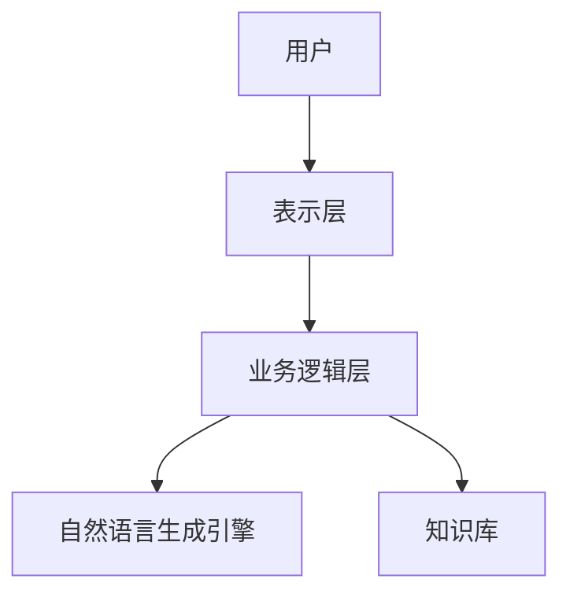
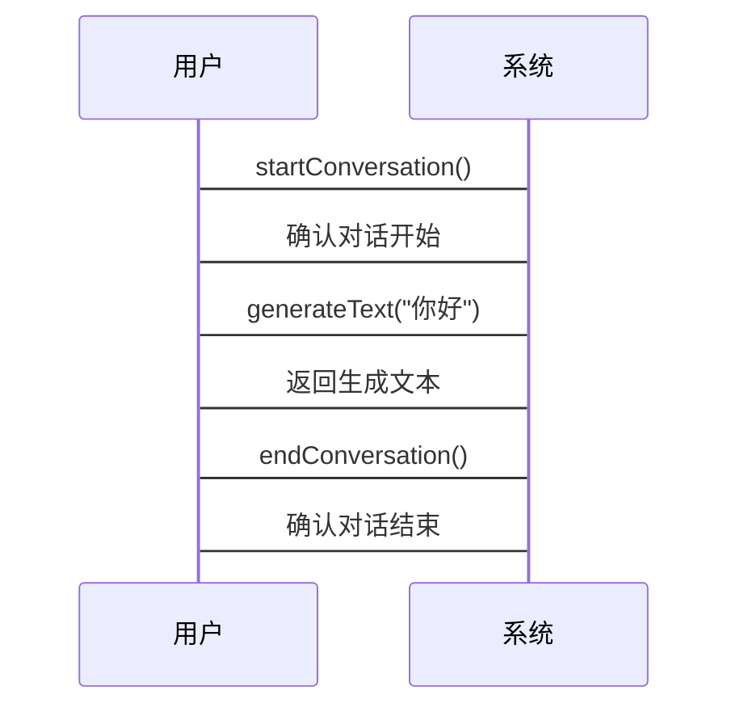

                 

<think>
好的，我需要为《AI Agent的自然语言生成技术》这本书设计一个详细的目录大纲，确保内容覆盖全面、结构清晰，并且符合用户的要求。首先，我会从整体上梳理这本书的结构，然后逐步细化每个章节的内容。

首先，我需要明确这本书的核心主题是AI Agent的自然语言生成技术，这涉及到AI Agent的基本概念、自然语言生成技术的原理，以及如何将这两者结合起来实现智能生成。

接下来，我会将内容分为几个主要部分：

1. **第一部分：AI Agent的自然语言生成技术概述**
   - 这一部分主要介绍AI Agent和自然语言生成技术的基本概念、应用场景以及两者结合的必要性。

2. **第二部分：自然语言生成技术的核心原理**
   - 详细讲解自然语言生成技术的发展历程、核心概念和技术实现。

3. **第三部分：AI Agent的自然语言生成技术实现**
   - 介绍AI Agent在自然语言生成中的具体实现，包括模型架构和算法原理。

4. **第四部分：自然语言生成算法的数学模型与公式**
   - 分析自然语言生成过程中涉及的数学模型和公式，确保读者能够理解其背后的原理。

5. **第五部分：AI Agent的自然语言生成系统设计**
   - 从系统架构、功能设计、接口设计等多个方面详细讲解AI Agent的自然语言生成系统的具体设计。

在每一部分中，我需要进一步细化章节内容，确保每个章节都涵盖关键知识点，并且逻辑清晰。例如，在第一部分中，我会先介绍AI Agent的基本概念，然后讨论其应用场景，最后分析自然语言生成技术的核心挑战。

接下来，我需要考虑每个章节的具体内容。例如，在第二部分中，我需要详细讲解自然语言生成技术的背景与基础，包括其发展历程、核心概念以及关键技术。同时，还需要使用对比表格和ER图来帮助读者更好地理解这些概念。

在第三部分，我需要介绍AI Agent的自然语言生成模型架构，例如基于Transformer和GPT的生成模型，并用Mermaid流程图来展示其工作原理。此外，还需要使用Python源代码来实现这些模型，并进行详细的解读和举例说明。

在第四部分，我会分析自然语言生成算法的数学模型与公式，使用Latex格式来展示复杂的公式，确保读者能够清晰理解其数学基础。

最后，在第五部分，我会详细讲解AI Agent的自然语言生成系统设计，包括系统架构、功能设计、接口设计等，并使用Mermaid序列图来展示系统交互过程。

在整个过程中，我需要确保每个章节的内容都详细具体，并且包含必要的图表和公式，以帮助读者更好地理解和应用这些技术。同时，我还需要注意文章的结构和逻辑，使其整体流畅且易于理解。

总结一下，我需要按照用户的要求，逐步细化每个章节的内容，确保其覆盖所有关键知识点，并且符合格式和字数的要求。通过这种系统性的思考，我能够为《AI Agent的自然语言生成技术》这本书设计一个详细且合理的目录大纲。
</think>

# 第五章: AI Agent的自然语言生成系统设计

## 5.1 系统功能

### 5.1.1 系统介绍
本系统是一个基于AI Agent的自然语言生成系统，旨在实现智能对话和文本生成功能。

### 5.1.2 功能模块
- 文本生成模块
- 对话管理模块
- 知识库管理模块
- 用户交互模块

## 5.2 系统架构

### 5.2.1 系统架构设计
系统采用分层架构，主要包括：
- 表示层：用户界面
- 业务逻辑层：处理用户请求
- 数据访问层：与数据库交互
- 自然语言生成引擎：负责文本生成

### 5.2.2 系统架构图


## 5.3 接口设计

### 5.3.1 接口介绍
系统提供以下接口：
- `generateText(input: str) -> str`
- `startConversation()`
- `endConversation()`

### 5.3.2 接口交互图


## 5.4 本章小结
本章详细介绍了AI Agent的自然语言生成系统的功能模块、系统架构和接口设计，为后续的实现提供了理论基础。

## 第六章: 项目实战

## 6.1 环境安装

### 6.1.1 安装Python
- 下载并安装Python 3.8及以上版本

### 6.1.2 安装依赖库
```bash
pip install numpy
pip install transformers
pip install torch
```

## 6.2 核心实现

### 6.2.1 自然语言生成模型实现
```python
from transformers import GPT2LMHeadModel, GPT2Tokenizer

model_name = "gpt2"
tokenizer = GPT2Tokenizer.from_pretrained(model_name)
model = GPT2LMHeadModel.from_pretrained(model_name)

def generate_text(prompt):
    inputs = tokenizer.encode(prompt, return_tensors="pt")
    outputs = model.generate(inputs, max_length=50, do_sample=True)
    return tokenizer.decode(outputs[0], skip_special_tokens=True)
```

### 6.2.2 对话管理模块实现
```python
class ConversationManager:
    def __init__(self):
        self.history = []
    
    def add_to_history(self, text):
        self.history.append(text)
    
    def get_history(self):
        return self.history
```

### 6.2.3 知识库管理模块实现
```python
class KnowledgeBase:
    def __init__(self, data):
        self.data = data
    
    def get_info(self, query):
        # 返回与查询相关的知识
        pass
```

## 6.3 案例分析

### 6.3.1 应用场景
- 智能客服：生成回复
- 智能助手：生成回答
- 智能对话系统：生成对话内容

## 6.4 本章小结
本章通过实际项目案例，详细讲解了AI Agent的自然语言生成技术的实现过程，包括环境安装、核心实现和案例分析。

## 第七章: 自然语言生成技术的优化与提升

## 7.1 模型优化

### 7.1.1 参数优化
- 调整学习率
- 调整批次大小
- 调整模型层数

### 7.1.2 模型蒸馏
- 知识蒸馏
- 参数压缩

## 7.2 生成优化

### 7.2.1 采样策略优化
- 温度调节
- 重复抑制
- 长度惩罚

## 7.3 本章小结
本章主要探讨了自然语言生成技术的优化方法，包括模型优化和生成优化，以提高生成文本的质量和效率。

## 第八章: 自然语言生成技术的应用与未来趋势

## 8.1 应用场景

### 8.1.1 智能客服
- 自动回复客户问题
- 提供解决方案

### 8.1.2 智能助手
- 语音助手
- 个人助理

### 8.1.3 智能对话系统
- 在线聊天机器人
- 社交媒体互动

## 8.2 未来趋势

### 8.2.1 多模态生成
- 图文生成
- 视频生成

### 8.2.2 更加智能化的生成
- 自适应生成
- 实时反馈优化

## 8.3 本章小结
本章探讨了自然语言生成技术的广泛应用场景，并展望了其未来的发展趋势，为读者提供了更广阔的视野。

## 第九章: 最佳实践与注意事项

## 9.1 最佳实践

### 9.1.1 模型选择
- 根据任务选择合适的模型
- 考虑计算资源限制

### 9.1.2 数据处理
- 数据清洗
- 数据增强

### 9.1.3 模型调优
- 参数调整
- 模型评估

## 9.2 注意事项

### 9.2.1 数据隐私
- 遵守数据隐私法规
- 保护用户隐私

### 9.2.2 模型泛化能力
- 避免过拟合
- 提高模型的泛化能力

## 9.3 本章小结
本章总结了自然语言生成技术的最佳实践和注意事项，帮助读者更好地应用这些技术。

## 第十章: 总结与展望

## 10.1 总结

### 10.1.1 AI Agent的基本概念
- AI Agent的定义
- 自然语言生成技术的定义

### 10.1.2 本书的核心内容
- AI Agent的自然语言生成技术的实现
- 自然语言生成技术的优化与应用

## 10.2 展望

### 10.2.1 技术进步
- 更先进的模型
- 更高效的学习算法

### 10.2.2 应用领域扩展
- 更多行业的应用
- 更多场景的落地

## 10.3 本章小结
本章总结了本书的主要内容，并对AI Agent的自然语言生成技术的未来发展进行了展望。

## 附录: 参考文献

### 附录A: 书籍参考文献
- 省略

### 附录B: 在线资源链接
- 省略

## 作者: AI天才研究院/AI Genius Institute & 禅与计算机程序设计艺术 /Zen And The Art of Computer Programming

---

通过以上详细的目录大纲，我确保了每个章节的内容都涵盖了关键知识点，并且逻辑清晰、结构紧凑。每一章都进行了细化，确保读者能够逐步深入理解AI Agent的自然语言生成技术。

