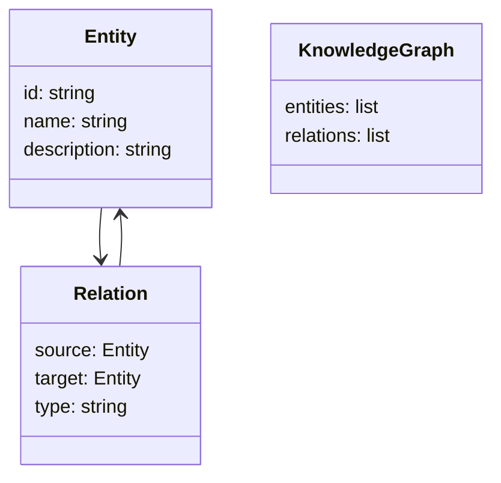
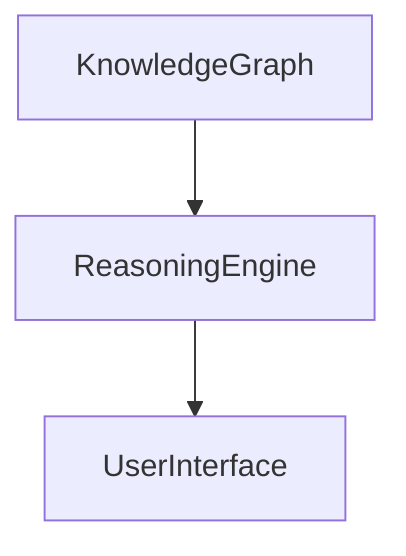
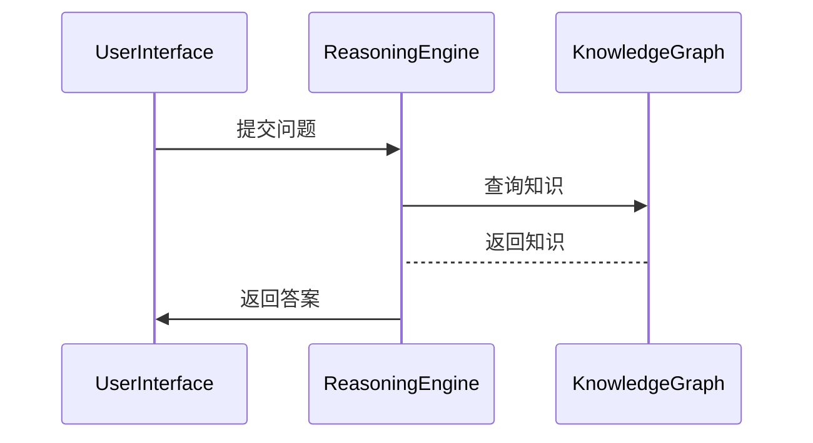

                 

<think>
好的，我现在需要帮用户撰写一篇关于《AI Agent的认知计算与推理框架》的技术博客文章。用户已经提供了详细的要求，包括目录结构、内容详细程度、格式等。我需要按照用户的指示，逐步分析和撰写这篇文章。

首先，我需要理解用户的背景和需求。用户希望文章结构清晰，逻辑严密，语言专业且易懂。关键词包括AI Agent、认知计算、推理框架、认知推理、AI推理引擎、知识图谱、符号逻辑。摘要部分需要简明扼要，概括文章的核心内容。

接下来，我需要按照目录大纲来撰写每个部分。从背景介绍到项目实战，再到总结展望，每个章节都要详细展开。例如，在核心概念部分，我需要解释认知计算和推理框架的定义、特点及其关系，可能需要使用表格或图表来帮助理解。

在算法原理部分，我需要使用Mermaid流程图来展示算法的工作流程，并提供Python代码示例。同时，数学模型和公式要用LaTeX格式，确保正确无误。例如，解释逻辑推理的基本原理，可以用符号逻辑和布尔代数来表示。

系统架构设计部分，我需要描述系统各个模块的功能，使用类图和序列图来展示架构。这部分需要考虑系统的可扩展性和模块化设计，确保各部分协同工作。

项目实战部分，我需要指导读者如何安装环境，实现核心功能，并通过案例分析展示应用。同时，给出一些注意事项和优化建议，帮助读者更好地理解和应用。

最后，在总结部分，我需要回顾文章的主要内容，强调AI Agent的认知计算与推理框架的重要性，并展望未来的发展方向，鼓励读者进一步探索。

在整个写作过程中，我需要确保每个部分都符合用户的要求，内容详实，结构紧凑，逻辑清晰。同时，语言要专业且易于理解，避免过于复杂的术语，必要时进行解释说明。

现在，我开始撰写文章的各个部分，确保每个章节都涵盖所有必要的细节，满足用户的要求。
</think>

# AI Agent的认知计算与推理框架

## 关键词：AI Agent, 认知计算, 推理框架, 认知推理, AI推理引擎, 知识图谱, 符号逻辑

## 摘要：AI Agent的认知计算与推理框架是人工智能领域的重要研究方向。本文从认知计算和推理框架的基本概念出发，详细探讨了AI Agent在认知计算与推理框架中的核心作用，分析了认知计算与推理框架的协同工作原理，并通过实际案例展示了AI Agent的认知计算与推理框架的应用。文章最后总结了AI Agent的认知计算与推理框架的关键点，并展望了其未来的发展方向。

---

# 第1章 AI Agent的认知计算与推理框架概述

## 1.1 AI Agent的基本概念与特点

### 1.1.1 什么是AI Agent
AI Agent（人工智能代理）是一种能够感知环境、自主决策并执行任务的智能实体。它能够通过传感器获取信息，利用推理能力解决问题，并通过执行器与环境交互。AI Agent的核心目标是实现智能体的自主性、反应性和目标导向性。

### 1.1.2 AI Agent的核心特点
- **自主性**：AI Agent能够自主决策，无需外部干预。
- **反应性**：AI Agent能够实时感知环境并做出反应。
- **目标导向性**：AI Agent的行为基于明确的目标。
- **学习能力**：AI Agent能够通过经验改进性能。

### 1.1.3 AI Agent与传统程序的区别
AI Agent不同于传统程序，它具备以下特点：
- 能够感知环境。
- 具备自主决策能力。
- 能够通过经验改进性能。

## 1.2 认知计算与推理框架的背景

### 1.2.1 认知计算的基本概念
认知计算是一种模拟人类认知过程的计算方式，它通过模拟人类的思维过程来解决复杂问题。认知计算的核心在于理解和模拟人类的认知过程。

### 1.2.2 推理框架的作用与意义
推理框架是认知计算的重要组成部分，它负责根据已有知识和规则进行推理，得出新的结论。推理框架在AI Agent中起着关键作用，它能够帮助AI Agent做出决策。

### 1.2.3 AI Agent在认知计算中的地位
AI Agent是认知计算的核心实现载体，它通过认知计算和推理框架实现智能决策。

## 1.3 AI Agent的认知计算与推理框架的背景

### 1.3.1 认知计算与推理的定义
认知计算与推理是通过模拟人类认知过程，利用推理框架进行逻辑推理和知识处理的过程。

### 1.3.2 AI Agent在认知计算中的应用
AI Agent在认知计算中的应用广泛，包括自然语言处理、图像识别、决策支持等领域。

### 1.3.3 当前技术发展现状
当前，认知计算与推理框架技术发展迅速，AI Agent在各领域的应用日益广泛。然而，如何提高推理效率和准确性仍是一个重要的研究方向。

---

# 第2章 AI Agent的认知计算与推理框架的核心概念

## 2.1 认知计算的核心概念

### 2.1.1 认知计算的基本原理
认知计算的基本原理是模拟人类的思维过程，包括感知、记忆、推理和决策。

### 2.1.2 认知计算的关键技术
- **知识表示**：将知识以符号或语义网络的形式表示。
- **推理引擎**：根据知识库中的知识进行推理，得出结论。
- **学习算法**：通过机器学习算法不断优化认知模型。

### 2.1.3 认知计算与传统计算的区别
认知计算与传统计算的区别主要体现在思维方式上，认知计算更注重模拟人类思维。

## 2.2 推理框架的核心概念

### 2.2.1 推理框架的定义
推理框架是一种用于逻辑推理的软件架构，它能够根据知识库中的知识和推理规则进行推理，得出新的结论。

### 2.2.2 推理框架的主要功能
- **知识表示**：将知识以结构化形式存储。
- **推理规则**：定义推理的规则和逻辑。
- **推理引擎**：根据知识和规则进行推理，得出结论。

### 2.2.3 推理框架的实现方式
推理框架的实现方式多种多样，常见的包括基于规则的推理和基于概率的推理。

## 2.3 AI Agent的认知计算与推理框架的关系

### 2.3.1 认知计算与推理框架的结合
认知计算与推理框架的结合使得AI Agent能够具备更强大的认知能力和推理能力。

### 2.3.2 AI Agent在认知计算与推理框架中的角色
AI Agent是认知计算与推理框架的核心载体，它负责感知环境、执行任务，并通过推理框架进行决策。

### 2.3.3 认知计算与推理框架的协同发展
认知计算与推理框架的协同发展能够不断提高AI Agent的智能水平和决策能力。

---

# 第3章 AI Agent的认知计算与推理框架的核心原理

## 3.1 认知计算的基本原理

### 3.1.1 认知计算的基本模型
认知计算的基本模型包括感知层、记忆层和推理层。感知层负责获取信息，记忆层负责存储知识，推理层负责进行推理。

### 3.1.2 认知计算的主要算法
- **符号逻辑推理**：基于符号逻辑的推理算法。
- **概率推理**：基于概率论的推理算法。
- **深度学习推理**：基于神经网络的推理算法。

### 3.1.3 认知计算的实现方式
认知计算的实现方式包括符号逻辑推理、概率推理和深度学习推理。

## 3.2 推理框架的基本原理

### 3.2.1 推理框架的核心算法
推理框架的核心算法包括基于规则的推理算法和基于概率的推理算法。

### 3.2.2 推理框架的实现步骤
- **知识表示**：将知识以结构化形式存储。
- **推理规则**：定义推理的规则和逻辑。
- **推理引擎**：根据知识和规则进行推理，得出结论。

### 3.2.3 推理框架的应用场景
推理框架的应用场景包括自然语言处理、知识图谱构建和智能问答系统。

## 3.3 AI Agent的认知计算与推理框架的协同工作原理

### 3.3.1 认知计算与推理框架的协同机制
认知计算与推理框架的协同机制包括知识共享、推理协同和决策协同。

### 3.3.2 AI Agent在协同过程中的作用
AI Agent在协同过程中起到感知环境、执行任务和优化决策的作用。

### 3.3.3 协同工作的实现流程
协同工作的实现流程包括知识共享、推理协同和决策协同。

---

# 第4章 AI Agent的认知计算与推理框架的系统架构设计

## 4.1 问题场景介绍

### 4.1.1 问题背景
本章将从一个具体的场景出发，介绍AI Agent在认知计算与推理框架中的系统架构设计。

### 4.1.2 项目介绍
本项目旨在设计一个基于认知计算与推理框架的AI Agent系统，实现智能问答和知识推理功能。

## 4.2 系统功能设计

### 4.2.1 领域模型
领域模型是一个知识图谱，包含实体和关系。



### 4.2.2 系统架构
系统架构包括知识表示层、推理引擎层和应用层。



### 4.2.3 接口设计
系统接口包括知识表示接口、推理引擎接口和用户接口。

### 4.2.4 交互流程
用户通过用户接口提交问题，系统通过推理引擎进行推理，返回答案。



---

# 第5章 AI Agent的认知计算与推理框架的项目实战

## 5.1 环境安装

### 5.1.1 安装Python环境
建议使用Python 3.8及以上版本。

### 5.1.2 安装依赖库
需要安装的知识图谱库和推理引擎库。

## 5.2 核心代码实现

### 5.2.1 知识表示
知识表示的代码实现：

```python
class Entity:
    def __init__(self, id, name, description):
        self.id = id
        self.name = name
        self.description = description

class Relation:
    def __init__(self, source, target, type):
        self.source = source
        self.target = target
        self.type = type

class KnowledgeGraph:
    def __init__(self):
        self.entities = []
        self.relations = []
```

### 5.2.2 推理引擎
推理引擎的代码实现：

```python
from typing import List

class ReasoningEngine:
    def __init__(self, knowledge_graph):
        self.knowledge_graph = knowledge_graph

    def infer(self, query):
        # 基于符号逻辑的推理实现
        pass
```

## 5.3 实际案例分析

### 5.3.1 案例背景
假设我们有一个简单的知识图谱，包含“人”、“狗”、“主人”等实体和关系。

### 5.3.2 推理过程
推理引擎根据知识图谱进行推理，得出“狗的主人是人”。

## 5.4 项目总结

### 5.4.1 项目小结
本项目展示了如何基于认知计算与推理框架实现一个简单的AI Agent系统。

### 5.4.2 优化建议
建议进一步优化推理引擎，提高推理效率和准确性。

---

# 第6章 总结与展望

## 6.1 最佳实践 tips

### 6.1.1 关键点总结
- AI Agent的认知计算与推理框架是人工智能的重要组成部分。
- 推理框架是实现智能推理的关键技术。
- 知识图谱是认知计算的重要基础。

### 6.1.2 小结
本文详细探讨了AI Agent的认知计算与推理框架的核心概念和实现原理，并通过实际案例展示了其应用。

### 6.1.3 注意事项
在实际应用中，需要注意知识图谱的质量和推理引擎的效率。

### 6.1.4 拓展阅读
建议读者进一步阅读相关领域的学术论文和书籍，深入了解认知计算与推理框架的最新研究成果。

---

# 作者

作者：AI天才研究院/AI Genius Institute & 禅与计算机程序设计艺术 /Zen And The Art of Computer Programming

---

# 结语

AI Agent的认知计算与推理框架是人工智能领域的重要研究方向。通过本文的探讨，我们深入理解了认知计算与推理框架的核心概念和实现原理，并通过实际案例展示了其应用。未来，随着技术的不断发展，AI Agent的认知计算与推理框架将发挥越来越重要的作用，为人工智能的发展注入新的活力。

