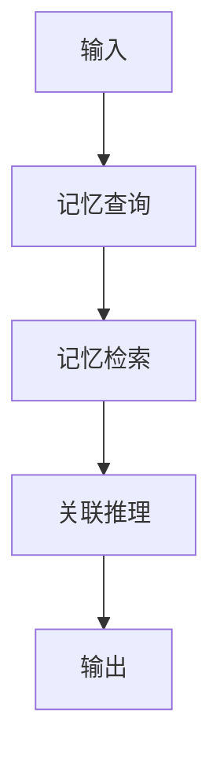
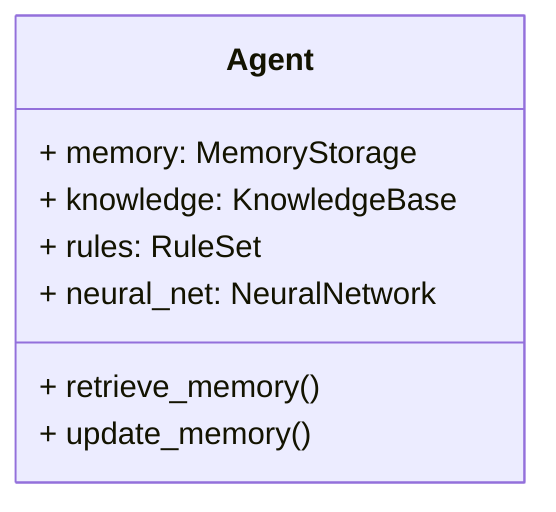
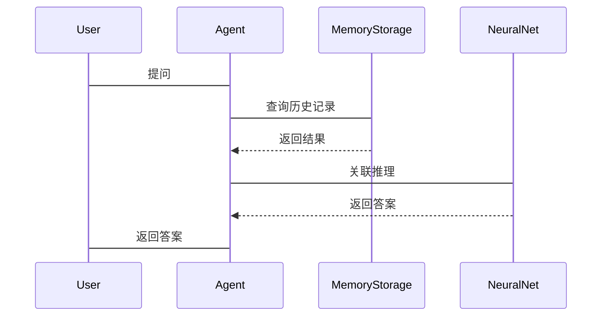
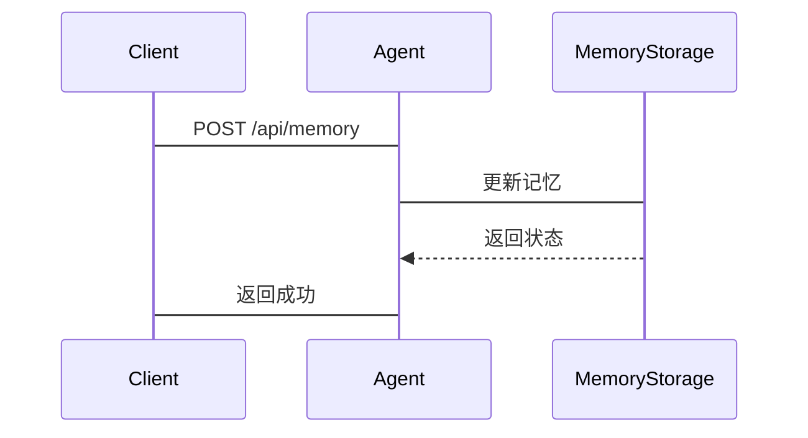

                 


# AI Agent的记忆机制：设计与实现

## 关键词：AI Agent，记忆机制，神经网络，知识图谱，系统架构

## 摘要：  
AI Agent的记忆机制是实现智能体持续学习和问题解决能力的核心技术。本文从记忆机制的基本概念出发，深入探讨了基于规则、知识图谱和神经网络的记忆模型，分析了设计原则与挑战，并通过实战项目展示了如何实现高效的AI Agent记忆系统。文章内容涵盖记忆机制的数学模型、算法实现、系统架构设计以及实际案例分析，为读者提供了从理论到实践的全面指导。

---

## 第1章: AI Agent记忆机制的基本概念

### 1.1 AI Agent的定义与分类  
AI Agent（智能体）是指能够感知环境、自主决策并采取行动的实体。根据智能体的智能水平，可以分为反应式智能体和认知式智能体。认知式智能体具备记忆能力，能够存储和检索信息以辅助决策。记忆机制是认知式AI Agent的核心组成部分。

### 1.2 记忆机制的核心要素  
- **数据存储结构**：包括数据库、图结构、神经网络等。  
- **数据关联方式**：通过语义关系、逻辑规则或神经网络连接实现数据关联。  
- **数据检索策略**：基于关键词、上下文或关联性进行信息检索。  

### 1.3 记忆机制在AI Agent中的作用  
- 提高决策效率：通过记忆快速检索相关信息，减少计算开销。  
- 支持持续学习：通过记忆存储经验，实现在线学习和模型优化。  
- 优化问题解决能力：通过关联性检索，发现隐含关系，提升问题解决能力。  

---

## 第2章: AI Agent记忆机制的模型与方法

### 2.1 基于规则的记忆模型  
- **规则的定义与存储**：将知识表示为条件-动作规则（如If-Then规则）。  
- **基于规则的推理过程**：通过匹配规则库中的条件，触发相应的动作。  
- **优缺点分析**：规则模型简单易懂，但难以处理复杂关联关系。  

### 2.2 基于知识图谱的记忆模型  
- **知识图谱的构建**：通过本体工程方法，构建领域知识图谱。  
- **知识图谱的存储与检索**：使用图数据库（如Neo4j）存储，并基于语义相似性进行检索。  
- **扩展性分析**：知识图谱模型具有良好的扩展性，适合处理复杂关系。  

### 2.3 基于神经网络的记忆模型  
- **神经网络记忆机制的原理**：通过记忆单元（如记忆网络）存储信息，并通过神经网络进行关联推理。  
- **实现方式**：结合循环神经网络（RNN）或Transformer结构，实现动态记忆更新。  
- **对比分析**：神经网络模型能够处理非结构化数据，但计算复杂度较高。  

---

## 第3章: AI Agent记忆机制的设计原则与挑战

### 3.1 设计原则  
- **模块化设计**：将记忆机制划分为存储、关联和检索三个模块。  
- **数据结构的选择**：根据需求选择合适的数据结构（如图结构、向量空间模型）。  
- **一致性与完整性**：确保数据存储和检索的一致性，避免数据冲突。  

### 3.2 设计中的常见挑战  
- **数据冗余问题**：如何避免重复存储相同信息？  
- **数据关联的复杂性**：如何处理多对多关联关系？  
- **数据隐私与安全**：如何确保存储数据的安全性？  

### 3.3 解决方案与优化策略  
- **数据压缩与去重技术**：使用哈希表或压缩编码减少存储空间。  
- **分布式存储与并行处理**：通过分布式系统提高存储和检索效率。  
- **数据加密与访问控制**：采用加密技术和访问控制策略保护数据隐私。  

---

## 第4章: 基于神经网络的记忆机制算法

### 4.1 神经网络记忆机制的数学模型  
- **记忆单元的数学表示**：  
  $$ M(t) = f(M(t-1), x(t)) $$  
  其中，$M(t)$ 表示第 $t$ 时刻的记忆状态，$x(t)$ 是输入，$f$ 是记忆更新函数。  

- **关联推理的数学模型**：  
  $$ y(t) = g(M(t), u(t)) $$  
  其中，$y(t)$ 是输出，$u(t)$ 是上下文信息，$g$ 是推理函数。  

### 4.2 基于记忆网络的算法实现  



- **代码实现**：  
  ```python
  def memory_update(memory, input):
      # 更新记忆状态
      new_memory = []
      for m in memory:
          if m['time'] == input['time']:
              m['value'] += input['delta']
              new_memory.append(m)
          else:
              new_memory.append(m)
      return new_memory
  
  def retrieve_memory(memory, query):
      # 基于查询检索记忆
      results = []
      for m in memory:
          if m['context'] == query['context']:
              results.append(m)
      return results
  ```

---

## 第5章: 系统架构设计与实现

### 5.1 问题场景介绍  
假设我们正在开发一个智能客服AI Agent，需要通过记忆机制存储用户历史对话记录和问题解决方案。

### 5.2 系统功能设计  



### 5.3 系统架构设计  



### 5.4 接口设计与交互  



---

## 第6章: 项目实战——AI Agent记忆系统实现

### 6.1 环境安装  
安装必要的库：  
```bash
pip install numpy tensorflow neo4j
```

### 6.2 核心代码实现  

```python
class MemoryAgent:
    def __init__(self, memory_store):
        self.memory_store = memory_store

    def update_memory(self, input):
        # 更新记忆
        self.memory_store.update(input)

    def retrieve_memory(self, query):
        # 检索记忆
        return self.memory_store.retrieve(query)

class MemoryStore:
    def __init__(self):
        self.memories = {}

    def update(self, input):
        key = input['id']
        self.memories[key] = input

    def retrieve(self, query):
        key = query['id']
        return self.memories.get(key, {})
```

### 6.3 项目总结  
通过实战项目，我们掌握了AI Agent记忆机制的实现过程，包括数据存储、检索和关联推理的实现。

---

## 第7章: 总结与展望

### 7.1 最佳实践Tips  
- 结合领域知识选择合适的记忆模型。  
- 定期优化记忆机制，提升检索效率。  
- 注意数据隐私和安全问题。  

### 7.2 未来展望  
- 更高效的神经网络记忆模型。  
- 结合边缘计算的分布式记忆机制。  
- 多模态记忆机制（结合文本、图像等多种数据类型）。  

---

## 作者：  
AI天才研究院/AI Genius Institute  
禅与计算机程序设计艺术 /Zen And The Art of Computer Programming

