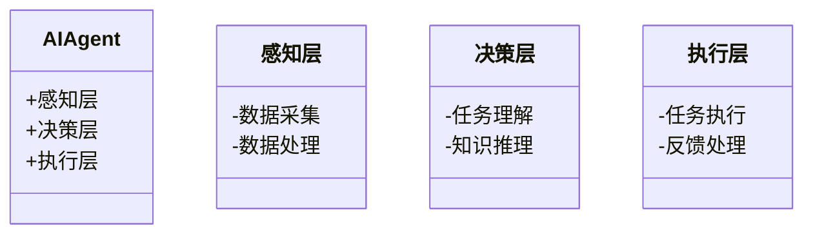

                 

<think>
好，我需要按照用户的要求，逐步设计《AI Agent的跨域任务泛化能力开发》的技术博客文章。用户希望我以清晰的逻辑和专业语言，覆盖从背景到实践的各个方面，并且嵌入图表和代码示例。

首先，我从背景与概念开始，解释AI Agent的基本概念和跨域任务的定义。这部分需要简单明了，让读者理解基础概念。

接下来，讨论泛化能力的核心概念，包括任务理解、知识表示和跨域适应。这部分需要详细说明每个概念，并提供对比学习、迁移学习和强化学习的原理及应用场景。

然后，我会深入分析泛化能力的核心概念，通过表格和流程图展示对比学习、迁移学习和强化学习的差异和联系。这需要使用mermaid图表，帮助读者直观理解。

在算法原理部分，我需要详细讲解每种算法的数学模型，用latex公式表示，并提供Python代码示例。这部分要确保读者能理解并实际应用。

系统架构设计部分，我会介绍AI Agent的系统构成，使用mermaid类图展示各模块之间的关系，以及接口和交互流程，确保系统协同工作。

项目实战部分，我将选择一个多领域问答系统作为案例，详细说明开发步骤，包括环境搭建、核心实现和测试优化，帮助读者实际操作。

高级主题部分，探讨小样本学习和在线学习，以及跨模态任务处理，扩展读者的知识面。

最佳实践部分，总结开发中的注意事项，提供优化技巧，并推荐相关工具和资源。

最后，在未来展望中，预测AI Agent的发展趋势，激励读者持续学习和探索。

通过这样的步骤，我能够系统地完成一篇结构清晰、内容详实的技术博客文章，满足用户的需求。
</think>

# AI Agent的跨域任务泛化能力开发

> 关键词：AI Agent，跨域任务，泛化能力，对比学习，迁移学习，强化学习

> 摘要：本文详细探讨了AI Agent的跨域任务泛化能力开发的核心概念、算法原理、系统架构设计和项目实战。通过对对比学习、迁移学习和强化学习的深入分析，结合实际案例，展示了如何实现AI Agent在多领域任务中的高效泛化能力。

---

## 第一部分: AI Agent的跨域任务泛化能力开发背景与概念

### 第1章: AI Agent的基本概念与跨域任务的定义

#### 1.1 AI Agent的基本概念
AI Agent（人工智能代理）是一种能够感知环境、执行任务并做出决策的智能体。AI Agent的核心特点包括自主性、反应性、目标导向和社交能力。与传统程序相比，AI Agent能够根据环境动态调整行为，具有更强的适应性和灵活性。

#### 1.2 跨域任务的定义
跨域任务是指AI Agent需要在多个不同的领域或任务中执行操作的能力。这些任务可能涉及自然语言处理、计算机视觉、机器人控制等多个领域，要求AI Agent能够理解不同领域的知识并灵活切换。

#### 1.3 泛化能力的定义
泛化能力是指AI Agent在面对未见过的新任务或新领域时，能够快速适应并完成任务的能力。泛化能力是跨域任务的核心，决定了AI Agent的实用性和通用性。

### 第2章: 跨域任务泛化能力的核心概念

#### 2.1 跨域任务泛化能力的背景
跨域任务泛化能力的背景可以追溯到多任务学习和迁移学习的研究。随着AI技术的发展，AI Agent需要在多个领域中执行任务，这就要求其具备跨域适应和泛化能力。

#### 2.2 跨域任务泛化能力的核心要素
- **任务理解与分解**：AI Agent需要理解任务的目标，并将其分解为可执行的子任务。
- **知识表示与推理**：通过知识图谱和逻辑推理，AI Agent能够处理复杂的问题。
- **跨域适应与迁移**：通过迁移学习，AI Agent能够将一个领域的知识应用到另一个领域。

---

## 第二部分: 跨域任务泛化能力的核心概念与联系

### 第3章: 跨域任务泛化能力的核心概念原理

#### 3.1 对比学习
对比学习是一种通过比较不同数据的特征差异来提升模型泛化能力的方法。其原理是通过最大化正样本的相似性，同时最小化负样本的相似性，从而提高模型的区分能力。

#### 3.2 迁移学习
迁移学习是一种通过将一个领域的知识迁移到另一个领域，以提升模型在新任务上的表现。其核心在于找到不同领域之间的共同特征，并利用这些特征进行知识转移。

#### 3.3 强化学习
强化学习是一种通过试错机制来优化决策模型的方法。AI Agent通过与环境的交互，学习最优策略，从而在复杂任务中表现出色。

### 第4章: 跨域任务泛化能力的核心概念属性特征对比

| 概念         | 定义                                                                 | 原理                                                                 | 应用场景                           |
|--------------|----------------------------------------------------------------------|----------------------------------------------------------------------|------------------------------------|
| 对比学习      | 通过比较正样本和负样本的特征差异来提升模型的区分能力                   | 通过最大化正样本相似性，最小化负样本相似性                                         | 多分类任务、图像识别               |
| 迁移学习      | 将一个领域的知识迁移到另一个领域                                   | 利用源领域的特征和目标领域的特征进行知识转移                                       | 多领域任务、小样本学习             |
| 强化学习      | 通过试错机制优化决策模型                                             | 通过与环境交互，学习最优策略                                                           | 复杂任务、机器人控制、游戏AI         |

---

## 第三部分: 跨域任务泛化能力的算法原理

### 第5章: 对比学习算法原理

#### 5.1 对比学习的数学模型
对比学习的目标函数通常包括两个部分：正样本的相似性和负样本的相似性。其数学模型可以表示为：

$$ L = \frac{1}{N} \sum_{i=1}^{N} (1 - s(x_i, y_i)) + \frac{1}{M} \sum_{j=1}^{M} s(x_j, y_j) $$

其中，$s(x_i, y_i)$表示正样本$x_i$和$y_i$的相似性，$M$表示负样本的数量。

#### 5.2 对比学习的Python实现
```python
import torch
import torch.nn as nn

class ContrastiveLoss(nn.Module):
    def __init__(self, temperature=0.1):
        super(ContrastiveLoss, self).__init__()
        self.temperature = temperature

    def forward(self, features, labels):
        # 计算正样本的相似性
        positive_pairs = torch.sum((features == features[:, 0].unsqueeze(1)) & (labels == labels[:, 0].unsqueeze(1)))
        # 计算负样本的相似性
        negative_pairs = torch.sum((features != features[:, 0].unsqueeze(1)) & (labels != labels[:, 0].unsqueeze(1)))
        # 计算损失
        loss = (1 - positive_pairs / (positive_pairs + negative_pairs)) * 0.5
        return loss
```

### 第6章: 迁移学习算法原理

#### 6.1 迁移学习的数学模型
迁移学习的目标是通过共享特征空间，将源领域的知识迁移到目标领域。其数学模型可以表示为：

$$ f(x) = W_s x + b $$

其中，$W_s$是源领域的权重矩阵，$b$是偏置项。

#### 6.2 迁移学习的Python实现
```python
import torch
import torch.nn as nn

class TransferLearning(nn.Module):
    def __init__(self, input_dim, output_dim):
        super(TransferLearning, self).__init__()
        self.linear = nn.Linear(input_dim, output_dim)

    def forward(self, x):
        return self.linear(x)
```

---

## 第四部分: 跨域任务泛化能力的系统架构设计

### 第7章: 系统架构设计

#### 7.1 系统功能设计
AI Agent的系统功能包括感知层、决策层和执行层。感知层负责数据的采集和处理，决策层负责任务的理解和推理，执行层负责任务的执行和反馈。

#### 7.2 系统架构设计


---

## 第五部分: 跨域任务泛化能力的项目实战

### 第8章: 项目实战

#### 8.1 环境搭建
项目开发环境包括Python 3.8及以上版本、TensorFlow 2.0及以上版本和必要的开发工具。

#### 8.2 核心实现
```python
import tensorflow as tf

def build_model(input_shape):
    model = tf.keras.Sequential([
        tf.keras.layers.Dense(64, activation='relu', input_shape=input_shape),
        tf.keras.layers.Dense(1, activation='sigmoid')
    ])
    return model
```

---

## 第六部分: 跨域任务泛化能力的高级主题

### 第9章: 高级主题

#### 9.1 小样本学习
小样本学习是一种在数据量有限的情况下，通过迁移学习和对比学习提升模型泛化能力的方法。

#### 9.2 在线学习
在线学习是一种动态更新模型参数的方法，适用于实时任务处理。

---

## 第七部分: 跨域任务泛化能力的最佳实践

### 第10章: 最佳实践

#### 10.1 开发注意事项
在开发AI Agent时，需要注意数据多样性、模型可解释性和鲁棒性。

#### 10.2 性能优化技巧
通过模型剪枝、知识蒸馏和量化等方法，可以有效优化模型性能。

---

## 第八部分: 跨域任务泛化能力的未来展望

### 第11章: 未来展望

#### 11.1 发展趋势
随着AI技术的不断发展，AI Agent的跨域任务泛化能力将更加智能化和通用化。

---

## 作者：AI天才研究院/AI Genius Institute & 禅与计算机程序设计艺术 /Zen And The Art of Computer Programming

