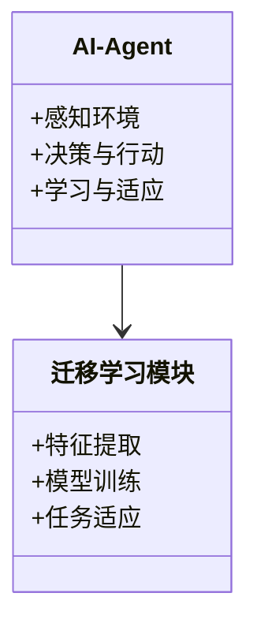
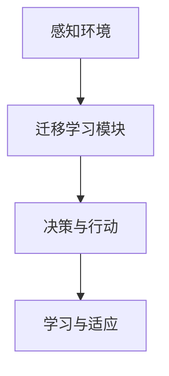
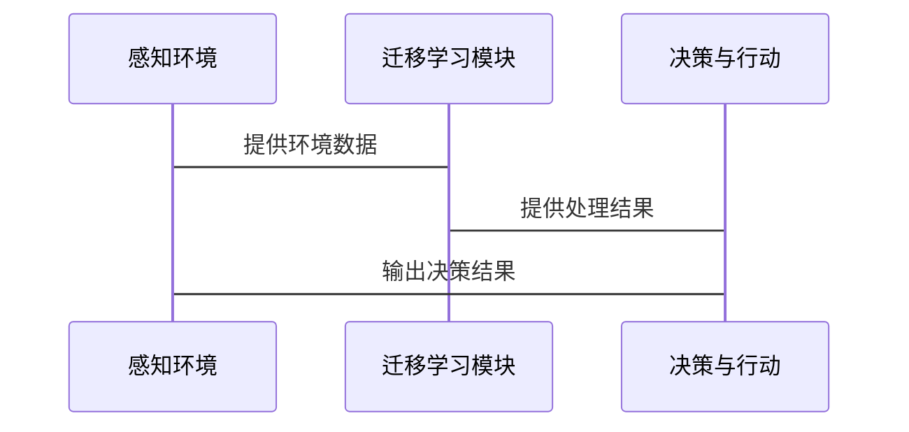

                 


# AI Agent的迁移学习技术应用

**关键词：** AI Agent, 迁移学习, 机器学习, 技术应用, 知识迁移

**摘要：** 这篇文章探讨了AI Agent中迁移学习技术的应用，分析了迁移学习的核心概念、算法原理以及其在不同场景下的应用。文章从基础理论到实际案例，详细阐述了迁移学习如何提升AI Agent的性能和适应性，并提供了丰富的技术细节和实战指导。

---

## 第1章: 迁移学习与AI Agent概述

### 1.1 迁移学习的基本概念

#### 1.1.1 迁移学习的定义
迁移学习是一种机器学习技术，允许模型在不同但相关的任务之间迁移知识。与传统机器学习不同，迁移学习能够利用已有任务中的经验，减少新任务的数据需求和计算成本。

#### 1.1.2 迁移学习的核心思想
迁移学习的核心思想在于通过共享特征或参数，使模型能够快速适应新任务，特别是在数据量有限的情况下。这种方法在处理相似任务时表现出色。

#### 1.1.3 迁移学习与传统机器学习的区别
- **数据需求：** 迁移学习需要相关任务的数据，而传统机器学习通常需要大量特定任务的数据。
- **任务相关性：** 迁移学习依赖任务之间的相似性，传统机器学习则不强调这一点。

### 1.2 AI Agent的基本概念

#### 1.2.1 AI Agent的定义
AI Agent是一种智能体，能够感知环境、执行任务并做出决策。它通常具备学习、推理和自适应能力。

#### 1.2.2 AI Agent的核心功能
- **感知环境：** 通过传感器或接口获取信息。
- **决策与行动：** 基于感知信息做出决策并执行动作。
- **学习与适应：** 通过学习提升性能，适应新环境或任务。

#### 1.2.3 AI Agent的应用场景
AI Agent广泛应用于自动驾驶、智能助手、机器人控制等领域，需要在动态环境中灵活应对多种任务。

### 1.3 迁移学习在AI Agent中的作用

#### 1.3.1 迁移学习如何提升AI Agent的性能
迁移学习使AI Agent能够在新任务中快速应用已学到的知识，减少数据依赖，提升效率。

#### 1.3.2 迁移学习在AI Agent中的应用场景
- **多任务学习：** 在多个任务之间迁移知识。
- **领域适应：** 在不同领域之间迁移模型。

#### 1.3.3 迁移学习对AI Agent的未来发展的影响
迁移学习将推动AI Agent从单一任务处理向多任务、自适应方向发展，提升其在复杂环境中的应用能力。

---

## 第2章: 迁移学习的核心概念与原理

### 2.1 迁移学习的分类

#### 2.1.1 基于参数的迁移学习
基于参数的迁移学习通过共享模型参数，使新任务能够利用已有模型的参数进行优化。

#### 2.1.2 基于非参数的迁移学习
基于非参数的迁移学习通过共享特征或分布，而非直接参数，进行知识迁移。

#### 2.1.3 基于实例的迁移学习
基于实例的迁移学习通过实例间的相似性进行知识迁移，适用于特定任务。

### 2.2 迁移学习的关键技术

#### 2.2.1 特征提取与表示学习
特征提取是迁移学习的关键，通过提取有用的特征，减少数据维度，提升模型性能。

#### 2.2.2 域适应与分布迁移
域适应技术帮助模型适应不同域的数据分布，分布迁移技术则处理数据分布的变化。

#### 2.2.3 迁移学习的评估与验证
评估指标包括准确率、F1分数等，验证方法包括交叉验证和性能对比。

### 2.3 迁移学习的数学模型

#### 2.3.1 迁移学习的数学表达式
$$ L_{total} = L_{source} + L_{target} $$

#### 2.3.2 迁移学习的优化目标
$$ \min_{\theta} \sum_{i} L(y_i, y_{pred}) + \lambda ||f_{source} - f_{target}||^2 $$

### 2.4 本章小结

---

## 第3章: AI Agent中的迁移学习技术

### 3.1 AI Agent的迁移学习框架

#### 3.1.1 框架的整体结构
迁移学习框架通常包括数据预处理、特征提取、模型训练和适应等步骤。

#### 3.1.2 框架的核心组件
- 数据源：提供迁移数据。
- 特征提取器：提取共享特征。
- 模型训练器：训练目标模型。

#### 3.1.3 框架的工作流程
1. 数据预处理：清洗和归一化。
2. 特征提取：提取共享特征。
3. 模型训练：在源任务上训练。
4. 迁移适应：在目标任务上微调。

### 3.2 基于参数的迁移学习在AI Agent中的应用

#### 3.2.1 参数迁移的基本原理
通过共享参数，使新任务能够利用已训练的参数，减少训练时间。

#### 3.2.2 参数迁移的具体实现
在神经网络中，共享部分层的权重，进行微调。

### 3.3 基于非参数的迁移学习在AI Agent中的应用

#### 3.3.1 非参数迁移的基本原理
通过共享分布或特征，而非参数，进行知识迁移。

#### 3.3.2 非参数迁移的具体实现
使用领域适应技术，调整数据分布，使其适用于目标任务。

### 3.4 本章小结

---

## 第4章: 迁移学习算法的数学模型与公式

### 4.1 基于参数的迁移学习算法

#### 4.1.1 参数迁移的数学表达式
$$ f_{target}(x) = W_{shared} x + W_{task} x $$

#### 4.1.2 参数迁移的优化目标
$$ \min_{W} \sum_{i} (y_i - f(x_i))^2 + \lambda ||W_{shared}||^2 $$

### 4.2 基于非参数的迁移学习算法

#### 4.2.1 非参数迁移的数学表达式
$$ p(y|x) = \sum_{i} \alpha_i p(y|x_i) $$

#### 4.2.2 非参数迁移的优化目标
$$ \min_{\alpha} \sum_{i} \alpha_i \sum_{j} (y_j - f(x_j))^2 + \lambda ||\alpha||^2 $$

---

## 第5章: 系统分析与架构设计方案

### 5.1 问题场景介绍
AI Agent需要在多任务环境中应用迁移学习，提升效率和性能。

### 5.2 项目介绍
设计一个基于迁移学习的AI Agent系统，应用于医疗诊断任务。

### 5.3 系统功能设计

#### 5.3.1 领域模型的Mermaid类图


### 5.4 系统架构设计的Mermaid架构图


### 5.5 系统接口设计
- 输入接口：接收环境数据和任务指令。
- 输出接口：输出决策结果和反馈信息。

### 5.6 系统交互的Mermaid序列图


---

## 第6章: 项目实战

### 6.1 环境安装
- 安装Python、TensorFlow、Keras等库。

### 6.2 核心实现代码

```python
import tensorflow as tf
from tensorflow.keras import layers

# 定义迁移学习模型
def create_model(input_shape):
    base_model = tf.keras.applications.VGG16(weights='imagenet', include_top=False, input_shape=input_shape)
    x = base_model.output
    x = layers.Flatten()(x)
    x = layers.Dense(256, activation='relu')(x)
    predictions = layers.Dense(num_classes, activation='softmax')(x)
    return base_model, predictions

# 迁移学习应用
def transfer_learning_application():
    base_model, model = create_model((224, 224, 3))
    for layer in base_model.layers:
        layer.trainable = False
    model.compile(optimizer='adam', loss='categorical_crossentropy', metrics=['accuracy'])
    model.fit(train_data, train_labels, epochs=10)
    return model
```

### 6.3 案例分析
在医疗诊断中，使用迁移学习技术，利用已有的医学图像数据，快速训练目标分类模型，提升诊断效率和准确率。

### 6.4 项目小结
通过实战项目，验证了迁移学习在AI Agent中的有效性，展示了其在实际应用中的优势。

---

## 第7章: 最佳实践与小结

### 7.1 最佳实践
- **数据预处理：** 确保数据质量和一致性。
- **任务相关性：** 选择相关性高的任务进行迁移。
- **模型选择：** 根据任务需求选择合适的迁移学习方法。

### 7.2 小结
迁移学习为AI Agent提供了强大的知识迁移能力，使其能够在多种任务中高效应用，提升性能和适应性。

### 7.3 注意事项
- 迁移学习可能会引入领域偏移，需谨慎处理。
- 数据质量和相关性对迁移效果影响显著。

### 7.4 拓展阅读
推荐阅读《迁移学习实战》和《深度学习中的迁移学习》等书籍。

---

**作者：AI天才研究院/AI Genius Institute & 禅与计算机程序设计艺术 /Zen And The Art of Computer Programming**

