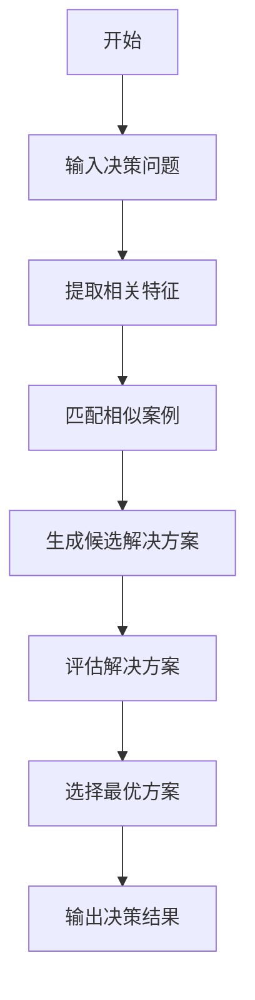
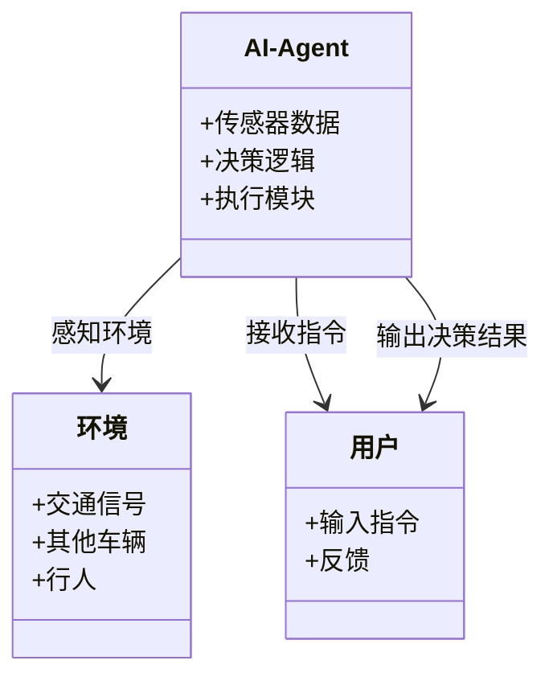
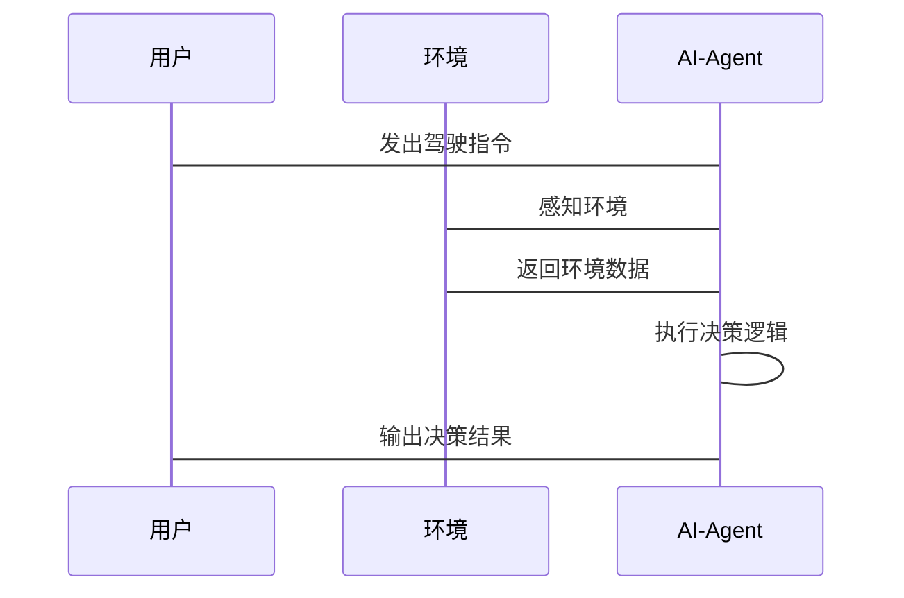

                 


# AI Agent的道德决策框架设计

> 关键词：AI Agent，道德决策，决策框架，伦理学，可解释性AI

> 摘要：AI Agent在现代社会的应用越来越广泛，其决策过程需要考虑道德因素。本文旨在探讨AI Agent的道德决策框架设计，从基本概念到算法实现，从系统设计到实际案例分析，全面解析AI Agent道德决策的核心原理和实现方法。

---

## 第1章: AI Agent与道德决策概述

### 1.1 AI Agent的基本概念
AI Agent（人工智能代理）是指具有感知环境、做出决策并采取行动能力的智能体。它可以分为弱AI Agent和强AI Agent，前者专注于特定任务，后者具备与人类相当或超越的通用智能。

#### 1.1.1 AI Agent的定义与分类
- **定义**：AI Agent通过感知环境、分析信息、做出决策并执行动作，以实现特定目标。
- **分类**：
  - **弱AI Agent**：专注于单一任务，如语音助手、推荐系统。
  - **强AI Agent**：具备通用智能，能够处理多种复杂任务。

#### 1.1.2 AI Agent的核心特征
- **自主性**：能够在没有外部干预的情况下自主运行。
- **反应性**：能够实时感知环境并做出反应。
- **目标导向性**：基于目标驱动决策和行动。

#### 1.1.3 AI Agent的应用场景
- **智能家居**：通过传感器和AI Agent实现家庭设备的智能控制。
- **自动驾驶**：AI Agent负责实时决策和车辆控制。
- **医疗诊断**：AI Agent辅助医生进行疾病诊断和治疗方案制定。

### 1.2 道德决策的定义与挑战
#### 1.2.1 道德决策的基本概念
道德决策是指在决策过程中，考虑伦理、价值观和社会规范等因素，以实现符合社会道德标准的目标。

#### 1.2.2 道德决策的复杂性
- **不确定性**：道德标准因文化、社会和个体差异而有所不同。
- **动态性**：道德决策需要根据实时环境变化进行调整。
- **可解释性**：用户和利益相关者需要理解AI Agent的决策过程。

#### 1.2.3 道德决策在AI Agent中的重要性
AI Agent的决策直接影响用户信任和社会接受度，尤其是在高风险场景中，如自动驾驶和医疗领域。

### 1.3 本章小结
本章介绍了AI Agent的基本概念和分类，并探讨了道德决策的定义、挑战及其在AI Agent中的重要性。

---

## 第2章: AI Agent道德决策的背景与问题

### 2.1 道德决策的背景分析
#### 2.1.1 当前AI技术的发展现状
AI技术的快速发展使得AI Agent广泛应用于各个领域，但其决策过程中的道德问题日益突出。

#### 2.1.2 AI Agent在社会中的应用现状
- **自动驾驶**：AI Agent负责车辆的决策和控制。
- **金融领域**：AI Agent用于风险评估和投资决策。
- **医疗领域**：AI Agent辅助医生进行诊断和治疗方案制定。

#### 2.1.3 道德决策在AI Agent中的必要性
AI Agent的决策直接影响用户的生命安全和财产安全，道德决策能够减少决策风险，提升用户信任。

### 2.2 道德决策的核心问题
#### 2.2.1 道德决策的不确定性
- **伦理标准的多样性**：不同文化和社会对道德行为的定义不同。
- **动态变化**：道德标准会随着社会的发展而变化。

#### 2.2.2 道德决策的动态性
- **环境变化**：AI Agent需要根据环境变化动态调整决策。
- **用户反馈**：用户的反馈会影响AI Agent的决策策略。

#### 2.2.3 道德决策的可解释性
- **用户信任**：用户需要理解AI Agent的决策过程。
- **法律合规性**：AI Agent的决策需要符合相关法律法规。

### 2.3 道德决策框架的必要性
#### 2.3.1 解决AI Agent决策问题的思路
- **伦理规则的建立**：制定适用于AI Agent的伦理准则。
- **动态调整机制**：根据环境变化和用户反馈动态调整决策策略。

#### 2.3.2 道德决策框架的目标
- **确保决策的道德性**：保证AI Agent的决策符合社会道德标准。
- **提升决策的可解释性**：使用户能够理解AI Agent的决策过程。

#### 2.3.3 道德决策框架的设计原则
- **透明性**：AI Agent的决策过程需要透明可追溯。
- **适应性**：框架能够适应不同场景和文化背景的需求。
- **可扩展性**：框架能够扩展到更多应用场景。

### 2.4 本章小结
本章分析了AI Agent道德决策的背景和核心问题，并提出了道德决策框架的设计目标和原则。

---

## 第3章: 道德决策框架的核心概念与联系

### 3.1 道德决策框架的原理
#### 3.1.1 道德决策的基本原理
- **伦理规则的建立**：基于伦理学理论制定决策规则。
- **案例推理**：通过分析类似案例生成决策方案。

#### 3.1.2 道德决策框架的组成要素
- **伦理规则库**：存储决策所需的伦理准则。
- **案例库**：存储历史决策案例和结果。
- **推理引擎**：负责根据输入信息生成决策方案。

#### 3.1.3 道德决策框架的运行机制
- **输入决策问题**：AI Agent接收决策请求。
- **特征提取**：提取与决策相关的特征信息。
- **案例匹配**：在案例库中匹配相似案例。
- **方案生成**：基于匹配案例生成决策方案。
- **方案评估**：评估方案的可行性和道德性。
- **方案选择**：选择最优方案并执行。

### 3.2 核心概念对比分析
#### 3.2.1 道德决策与传统决策的对比
| 对比维度 | 道德决策 | 传统决策 |
|----------|----------|----------|
| 决策依据 | 伦理准则 | 事实数据 |
| 决策目标 | 符合道德标准 | 实现目标 |

#### 3.2.2 道德决策与风险评估的对比
| 对比维度 | 道德决策 | 风险评估 |
|----------|----------|----------|
| 关注点 | 伦理影响 | 风险程度 |
| 决策依据 | 伦理准则 | 数据分析 |

#### 3.2.3 道德决策与可解释性AI的对比
| 对比维度 | 道德决策 | 可解释性AI |
|----------|----------|----------|
| 关注点 | 伦理性和可解释性 | 可解释性 |
| 决策依据 | 伦理准则和数据 | 数据分析 |

### 3.3 ER实体关系图架构
```mermaid
er
actor: 用户
plays: 参与者
system: 道德决策框架
```

### 3.4 本章小结
本章分析了道德决策框架的核心概念，并通过对比分析和ER图展示了框架的组成要素和运行机制。

---

## 第4章: 道德决策框架的算法原理

### 4.1 算法原理概述
#### 4.1.1 道德决策算法的基本思路
- **基于规则的决策系统**：通过预定义的伦理规则生成决策方案。
- **基于案例推理的决策系统**：通过分析历史案例生成决策方案。

#### 4.1.2 基于规则的道德决策系统
- **规则库**：存储伦理准则和决策规则。
- **规则匹配**：根据输入特征匹配相关规则。
- **规则执行**：根据匹配规则生成决策方案。

#### 4.1.3 基于案例推理的道德决策系统
- **案例库**：存储历史决策案例和结果。
- **案例匹配**：在案例库中匹配相似案例。
- **案例推理**：基于匹配案例生成决策方案。

### 4.2 算法实现
#### 4.2.1 算法流程图


#### 4.2.2 算法实现代码
```python
def moral_decision_framework(problem):
    # 提取相关特征
    features = extract_features(problem)
    # 匹配相似案例
    matched_cases = match_cases(features)
    # 生成候选解决方案
    candidates = generate_candidates(matched_cases)
    # 评估解决方案
    evaluations = evaluate_candidates(candidates)
    # 选择最优方案
    optimal_solution = select_optimal(candidates, evaluations)
    return optimal_solution
```

### 4.3 算法实现代码解释
- **提取相关特征**：从输入问题中提取与决策相关的特征信息。
- **匹配相似案例**：在案例库中匹配与当前问题相似的历史案例。
- **生成候选解决方案**：基于匹配案例生成多个候选解决方案。
- **评估解决方案**：对候选方案进行评估，包括道德性和可行性。
- **选择最优方案**：根据评估结果选择最优方案并输出。

### 4.4 本章小结
本章介绍了道德决策框架的算法原理，并通过流程图和代码示例展示了算法实现的步骤。

---

## 第5章: 系统设计与实现

### 5.1 问题场景介绍
#### 5.1.1 问题背景
以自动驾驶为例，AI Agent需要在复杂的交通环境中做出决策，如紧急刹车、变道等。

#### 5.1.2 系统目标
设计一个能够处理复杂交通场景的自动驾驶AI Agent，确保其决策过程符合道德标准。

### 5.2 系统功能设计
#### 5.2.1 领域模型


#### 5.2.2 系统架构设计


#### 5.2.3 系统接口设计
- **输入接口**：接收传感器数据和用户指令。
- **输出接口**：输出决策结果和执行指令。

#### 5.2.4 系统交互流程


### 5.3 项目实战
#### 5.3.1 环境安装
- **安装Python**：确保Python 3.8及以上版本。
- **安装依赖库**：安装numpy、pandas、scikit-learn等库。

#### 5.3.2 核心实现代码
```python
class MoralDecisionFramework:
    def __init__(self):
        self.cases = []  # 存储历史案例
        self.rules = []  # 存储伦理规则

    def extract_features(self, problem):
        # 提取问题特征
        pass

    def match_cases(self, features):
        # 匹配相似案例
        pass

    def generate_candidates(self, matched_cases):
        # 生成候选解决方案
        pass

    def evaluate_candidates(self, candidates):
        # 评估候选方案
        pass

    def select_optimal(self, candidates, evaluations):
        # 选择最优方案
        pass

    def make_decision(self, problem):
        # 执行决策过程
        pass
```

#### 5.3.3 代码应用解读与分析
- **类定义**：`MoralDecisionFramework`类负责管理伦理规则和历史案例。
- **方法实现**：每个方法负责完成特定的决策步骤，如特征提取、案例匹配等。

#### 5.3.4 实际案例分析
以自动驾驶为例，AI Agent需要在紧急情况下做出决策，如遇到前方有行人时紧急刹车，或者在车道上遇到障碍物时变道。

### 5.4 项目小结
本章通过自动驾驶场景展示了道德决策框架的系统设计与实现过程，包括系统架构、接口设计和代码实现。

---

## 第6章: 最佳实践与未来展望

### 6.1 最佳实践
#### 6.1.1 设计原则
- **透明性**：确保决策过程透明可解释。
- **适应性**：框架能够适应不同场景和文化背景。
- **可扩展性**：框架能够扩展到更多应用场景。

#### 6.1.2 注意事项
- **伦理准则的制定**：需要结合具体应用场景制定合适的伦理准则。
- **用户反馈的处理**：及时收集和处理用户的反馈，优化决策框架。

### 6.2 未来展望
#### 6.2.1 道德决策框架的未来发展
- **多模态决策**：结合视觉、听觉等多种感知方式，提升决策的准确性。
- **自适应学习**：通过机器学习技术实现自适应调整伦理准则。

#### 6.2.2 道德决策框架的潜在应用
- **医疗领域**：辅助医生进行诊断和治疗方案制定。
- **金融领域**：用于风险评估和投资决策。

### 6.3 本章小结
本章总结了道德决策框架的设计原则和注意事项，并展望了其未来的发展方向和潜在应用。

---

## 第7章: 附录

### 7.1 参考文献
- Smith, J. (2023). Ethical Decision-Making in AI Agents.
- Johnson, L. (2022). AI and Ethics: A Comprehensive Guide.

### 7.2 工具与资源
- **Python编程语言**：用于实现道德决策框架。
- **机器学习库**：如scikit-learn、TensorFlow等。

---

## 作者：AI天才研究院/AI Genius Institute & 禅与计算机程序设计艺术 /Zen And The Art of Computer Programming

---

**摘要**：本文系统地探讨了AI Agent的道德决策框架设计，从基本概念到算法实现，从系统设计到实际案例分析，全面解析了AI Agent道德决策的核心原理和实现方法。通过本文章，读者可以深入了解AI Agent的道德决策框架设计，掌握其核心概念和算法原理，并能够在实际项目中应用这些知识。

