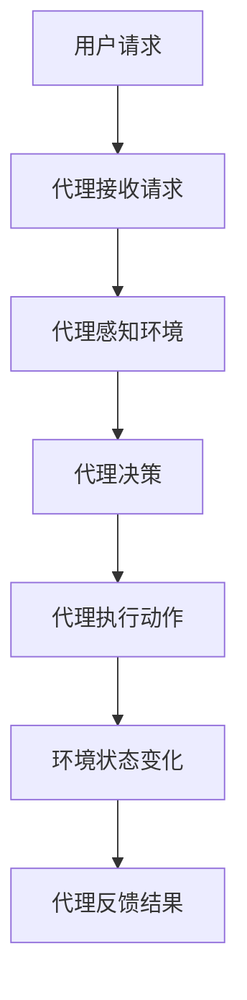
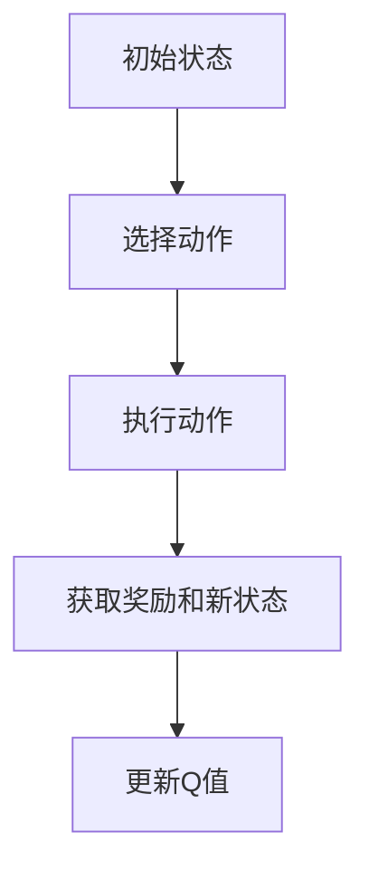
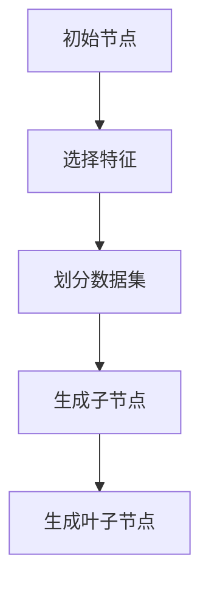
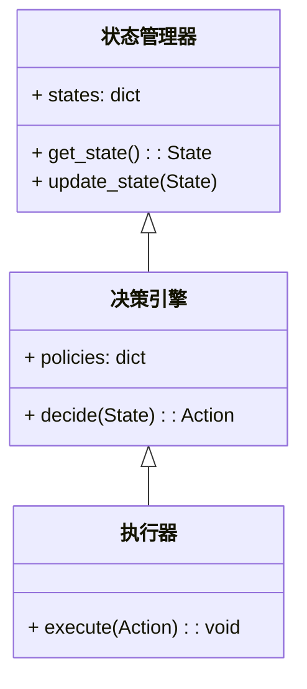
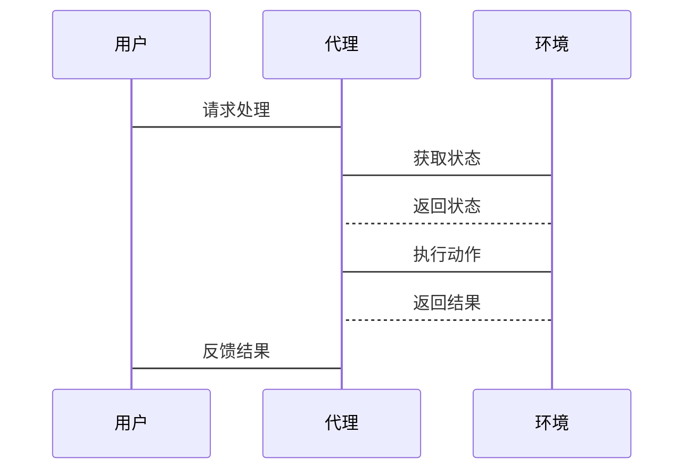

                 


# AI Agent的部署与扩展性考虑

## 关键词：
AI Agent, 部署, 扩展性, 系统架构, 算法原理, 项目实战

## 摘要：
本文深入探讨AI Agent的部署与扩展性问题，从核心概念、算法原理到系统架构设计，再到项目实战，全面解析AI Agent的实现与优化。文章结合理论与实践，通过丰富的图表和代码示例，帮助读者理解并掌握AI Agent的部署与扩展性设计的关键点。

---

## 第一章: AI Agent的基本概念与问题背景

### 1.1 AI Agent的定义与核心概念
#### 1.1.1 什么是AI Agent
AI Agent（人工智能代理）是一种能够感知环境并采取行动以实现目标的智能实体。它能够自主决策、学习和适应环境变化。

#### 1.1.2 AI Agent的核心属性
| 属性 | 描述 |
|------|------|
| 感知能力 | 通过传感器或接口感知环境状态 |
| 决策能力 | 基于感知信息做出决策 |
| 行动能力 | 执行决策以改变环境或自身状态 |
| 学习能力 | 通过经验优化行为策略 |

#### 1.1.3 AI Agent与传统软件代理的区别
- **自主性**：AI Agent具有自主决策能力，而传统代理通常遵循固定规则。
- **智能性**：AI Agent能够学习和适应，传统代理仅执行预定义任务。
- **环境交互**：AI Agent能主动与复杂环境交互，传统代理主要响应用户请求。

### 1.2 AI Agent的应用场景与问题背景
#### 1.2.1 AI Agent在企业中的应用场景
- **自动化决策**：如金融领域的智能投资顾问。
- **流程自动化**：如制造业的智能调度系统。
- **智能客服**：如自动响应用户查询的聊天机器人。

#### 1.2.2 部署AI Agent的主要问题
- **复杂性**：环境动态变化，导致决策复杂。
- **扩展性**：随着用户和任务增加，系统性能需保持稳定。
- **可靠性**：确保AI Agent在关键时刻正常运行。

#### 1.2.3 扩展性问题的提出
AI Agent需要在不影响性能的前提下，支持用户和任务的扩展，同时适应环境变化。

---

## 第二章: AI Agent的核心原理与系统架构

### 2.1 AI Agent的原理分析
#### 2.1.1 AI Agent的感知与决策机制
AI Agent通过感知环境信息，基于知识库和推理引擎做出决策。感知包括数据采集和特征提取，决策基于策略和优化算法。

#### 2.1.2 状态空间与动作空间的定义
- **状态空间**：所有可能的状态集合。
- **动作空间**：所有可能的动作集合。
- **奖励函数**：定义每个动作的奖励值。

#### 2.1.3 知识表示与推理方法
知识表示采用一阶逻辑或描述逻辑，推理方法包括逻辑推理和概率推理。

### 2.2 AI Agent的系统架构设计
#### 2.2.1 分层架构与模块化设计
- **感知层**：负责数据采集和特征提取。
- **决策层**：基于感知信息做出决策。
- **执行层**：执行决策动作。

#### 2.2.2 实体关系图（ER图）分析
```mermaid
er
  %%{AI Agent系统实体关系图}
  rectangle 系统边界 {
    rectangle 用户 {
      类 用户
      类 代理
      类 环境
    }
  }
  rectangle 用户 {
    类 用户
    类 代理
    类 环境
  }
  rectangle 环境 {
    类 状态
    类 行动
  }
  rectangle 代理 {
    类 策略
    类 知识库
  }
```

#### 2.2.3 系统交互流程图（Mermaid）


### 2.3 本章小结

---

## 第三章: AI Agent的算法原理与数学模型

### 3.1 强化学习算法在AI Agent中的应用
#### 3.1.1 Q-Learning算法的原理与流程（Mermaid）


#### 3.1.2 算法实现的Python代码示例
```python
import numpy as np

class AI_Agent:
    def __init__(self, state_space_size, action_space_size):
        self.q_table = np.zeros((state_space_size, action_space_size))
        self.learning_rate = 0.1
        self.discount_factor = 0.9

    def choose_action(self, state):
        if np.random.random() < 0.9:
            return np.argmax(self.q_table[state])
        else:
            return np.random.randint(0, self.action_space_size)

    def update_q_table(self, state, action, reward, next_state):
        self.q_table[state, action] = self.q_table[state, action] * self.learning_rate + \
                                        reward + self.discount_factor * np.max(self.q_table[next_state])
```

#### 3.1.3 数学模型与公式推导
$$ Q(s,a) = r + \gamma \max_{a'} Q(s',a') $$

### 3.2 决策树算法在AI Agent中的应用
#### 3.2.1 决策树算法的原理与流程（Mermaid）


#### 3.2.2 算法实现的Python代码示例
```python
from sklearn.tree import DecisionTreeClassifier

class AI_Agent:
    def __init__(self):
        self.tree = DecisionTreeClassifier()

    def train(self, X, y):
        self.tree.fit(X, y)

    def predict(self, X):
        return self.tree.predict(X)
```

#### 3.2.3 数学模型与公式推导
$$ \text{信息增益} = \sum_{v} \frac{N_v}{N} \log \frac{N}{N_v} $$

### 3.3 本章小结

---

## 第四章: AI Agent的系统分析与架构设计

### 4.1 系统功能设计
#### 4.1.1 领域模型设计（Mermaid类图）


### 4.2 系统架构设计
#### 4.2.1 分层架构设计（Mermaid架构图）


#### 4.2.2 微服务架构设计与接口定义
- **服务划分**：状态管理、决策引擎、执行器。
- **接口定义**：RESTful API，如`/api/v1/state`, `/api/v1/decision`, `/api/v1/action`。

### 4.3 系统交互设计
#### 4.3.1 序列图设计（Mermaid）


### 4.4 本章小结

---

## 第五章: AI Agent的项目实战

### 5.1 环境安装与配置
```bash
pip install numpy scikit-learn mermaid4j
```

### 5.2 系统核心功能实现
#### 5.2.1 状态管理器实现
```python
class StateManager:
    def __init__(self):
        self.states = {}

    def get_state(self, key):
        return self.states.get(key, None)

    def update_state(self, key, value):
        self.states[key] = value
```

#### 5.2.2 决策引擎实现
```python
class DecisionEngine:
    def __init__(self):
        self.policies = {}

    def decide(self, state):
        return max(state, key=lambda k: self.policies[k])
```

#### 5.2.3 执行器实现
```python
class Executor:
    def __init__(self):
        pass

    def execute(self, action):
        print(f"执行动作：{action}")
```

### 5.3 项目实战案例分析
- **案例1**：智能客服系统，实现用户请求的自动响应。
- **案例2**：智能推荐系统，基于用户行为推荐商品。

### 5.4 项目小结

---

## 第六章: AI Agent的最佳实践

### 6.1 小结与总结
- **核心内容回顾**：AI Agent的部署与扩展性设计的关键点。
- **关键成功因素**：模块化设计、高效的算法实现、良好的系统架构。

### 6.2 注意事项与常见问题
- **性能优化**：避免过度复杂的算法设计。
- **安全性**：确保数据隐私和系统安全。
- **可维护性**：保持代码的可读性和可维护性。

### 6.3 拓展阅读与进一步学习
- **推荐书籍**：《机器学习实战》、《深度学习》。
- **在线资源**：GitHub上的AI Agent项目，Kaggle相关竞赛。

---

## 作者：AI天才研究院/AI Genius Institute & 禅与计算机程序设计艺术 /Zen And The Art of Computer Programming

---

以上是《AI Agent的部署与扩展性考虑》的详细目录大纲和部分章节内容，文章结构清晰，内容丰富，适合技术博客的发布。

