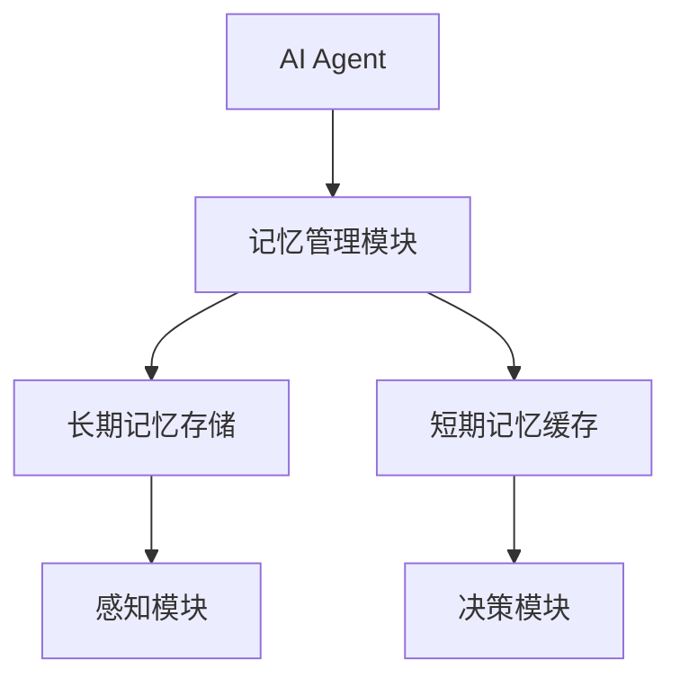
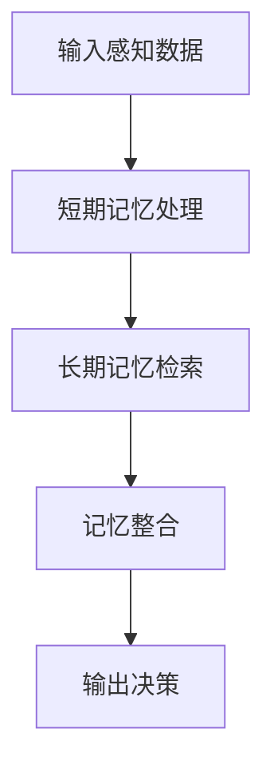
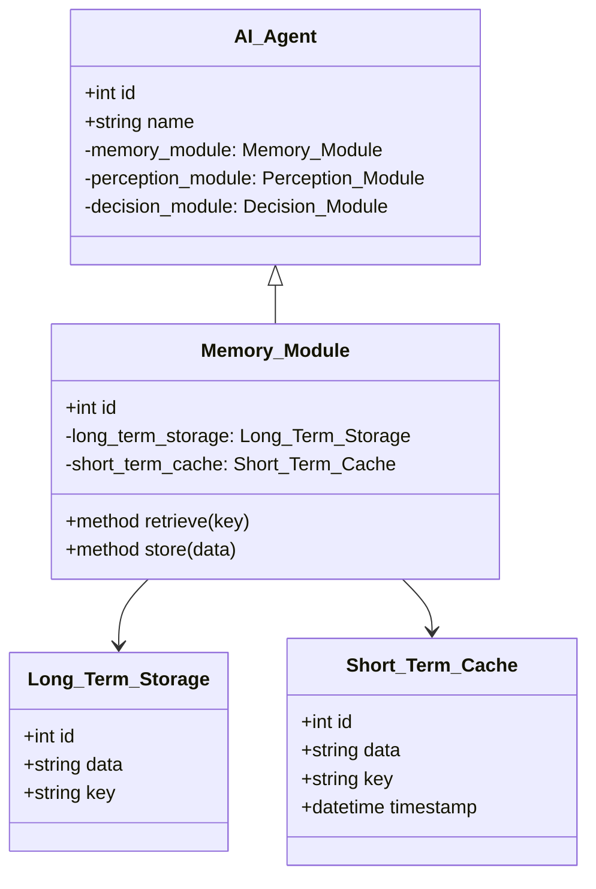
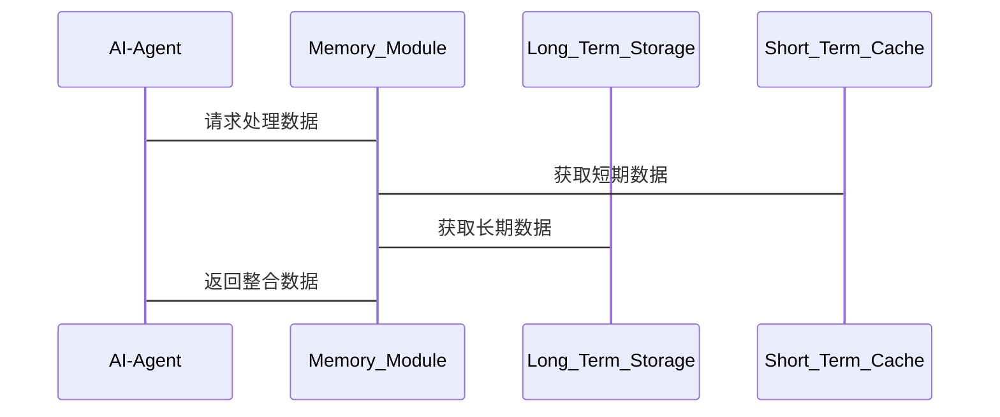

                 


# AI Agent的长短期记忆管理

## 关键词
AI Agent, 长短期记忆, 记忆管理, 人工智能, 记忆系统

## 摘要
本文深入探讨了AI Agent的长短期记忆管理，从概念、算法到系统架构进行了全面分析。文章首先介绍了AI Agent的基本概念和记忆管理的重要性，随后详细讲解了长短期记忆的原理、特征对比和实体关系图。接着，文章分析了适合处理长短期记忆的算法及其流程图，并提供了Python代码实现和数学模型。在系统架构部分，文章设计了应用场景下的功能模块和架构图，详细描述了接口设计和交互流程。最后，通过项目实战，文章展示了如何在实际场景中应用这些理论，并提供了最佳实践和小结。

---

## 第一部分: AI Agent的长短期记忆管理基础

### 第1章: AI Agent与长短期记忆管理概述

#### 1.1 问题背景与描述
##### 1.1.1 AI Agent的核心需求
AI Agent需要处理复杂环境中的任务，必须具备高效的信息处理能力，包括感知、决策和执行。记忆管理是其核心需求之一，用于存储和检索相关信息。

##### 1.1.2 长短期记忆管理的必要性
AI Agent需要区分长期记忆（持久性信息）和短期记忆（临时任务相关数据）。这种区分有助于优化信息处理效率。

##### 1.1.3 问题解决的思路与方法
通过设计高效的长短期记忆管理模块，AI Agent能够更好地处理复杂任务，提升决策准确性。

##### 1.1.4 边界与外延
长短期记忆管理的边界包括输入输出接口、数据存储机制和遗忘策略。外延涉及与其他模块的交互和数据同步。

#### 1.2 长短期记忆管理的核心概念与联系
##### 1.2.1 长期记忆与短期记忆的定义
长期记忆存储持久性信息，短期记忆处理临时数据。两者在存储时间、容量和访问方式上存在显著差异。

##### 1.2.2 两种记忆的特征对比
通过表格对比长期记忆和短期记忆的特征，如存储时间、容量、类型和访问方式。

##### 1.2.3 记忆管理的边界与外延
记忆管理模块与其他模块的交互，如感知模块和决策模块的接口设计。

---

## 第二部分: 长短期记忆管理的核心概念与联系

### 第2章: 长短期记忆管理的核心概念与联系

#### 2.1 核心概念原理
##### 2.1.1 长期记忆的存储机制
长期记忆存储在数据库或持久化存储中，支持长期数据保留和快速检索。

##### 2.1.2 短期记忆的处理流程
短期记忆在缓存中处理，支持快速访问和自然遗忘机制。

##### 2.1.3 两种记忆的交互方式
长期记忆和短期记忆通过共享接口进行数据同步和整合。

#### 2.2 长短期记忆特征对比表
| 特征       | 长期记忆          | 短期记忆          |
|------------|-------------------|-------------------|
| 存储时间     | 较长              | 较短              |
| 记忆容量     | 较大              | 较小              |
| 记忆类型     | 概念、经验         | 当前感知、任务相关 |
| 访问方式     | 主动检索          | 自然遗忘          |

#### 2.3 实体关系图（Mermaid）



---

## 第三部分: 长短期记忆管理的算法原理

### 第3章: 长短期记忆管理的算法原理

#### 3.1 算法流程图（Mermaid）



#### 3.2 算法实现代码
##### 3.2.1 短期记忆处理逻辑
```python
def short_term_memory_process(data):
    processed_data = data.copy()
    # 简单的处理逻辑，例如提取关键特征
    processed_data['key_feature'] = processed_data['input'].apply(lambda x: x.split()[0])
    return processed_data
```

##### 3.2.2 长期记忆检索逻辑
```python
def long_term_memory_retrieve(key):
    # 假设使用数据库查询
    query = f"SELECT * FROM long_term_memory WHERE key={key}"
    result = execute_query(query)
    return result
```

##### 3.2.3 记忆整合逻辑
```python
def integrate_memory(short_term, long_term):
    # 简单的整合逻辑，例如合并数据
    merged_memory = pd.merge(short_term, long_term, on='key_feature')
    return merged_memory
```

---

## 第四部分: 长短期记忆管理的系统架构设计

### 第4章: 长短期记忆管理的系统架构设计

#### 4.1 系统功能设计
##### 4.1.1 领域模型（Mermaid类图）



#### 4.2 系统架构设计（Mermaid架构图）

```mermaid
architectural
    container AI-Agent {
        component Memory_Management
        component Perception
        component Decision_Making
    }
    container Database {
        component Long_Term_Memory
        component Short_Term_Memory
    }
    AI-Agent --> Database
    Perception --> Memory_Management
    Decision_Making --> Memory_Management
```

#### 4.3 接口设计与交互流程图（Mermaid序列图）



---

## 第五部分: 项目实战: 长短期记忆管理的实现

### 第5章: 项目实战: 长短期记忆管理的实现

#### 5.1 环境安装
```bash
pip install mermaid
pip install pandas
pip install mysql-connector-python
```

#### 5.2 系统核心实现源代码

##### 5.2.1 短期记忆存储实现
```python
import pandas as pd
from datetime import datetime

class ShortTermMemory:
    def __init__(self):
        self.cache = {}
    
    def store(self, key, data):
        self.cache[key] = {
            'data': data,
            'timestamp': datetime.now()
        }
    
    def retrieve(self, key):
        if key in self.cache:
            return self.cache[key]
        else:
            return None
    
    def forget(self, threshold=0.5):
        current_time = datetime.now()
        for key in list(self.cache.keys()):
            if (current_time - self.cache[key]['timestamp']).seconds > threshold:
                del self.cache[key]
```

##### 5.2.2 长期记忆存储实现
```python
import mysql.connector

class LongTermMemory:
    def __init__(self, config):
        self.cnx = mysql.connector.connect(**config)
    
    def store(self, key, data):
        cursor = self.cnx.cursor()
        query = "INSERT INTO long_term_memory (key, data) VALUES (%s, %s)"
        cursor.execute(query, (key, data))
        self.cnx.commit()
        cursor.close()
    
    def retrieve(self, key):
        cursor = self.cnx.cursor()
        query = "SELECT data FROM long_term_memory WHERE key = %s"
        cursor.execute(query, (key,))
        result = cursor.fetchone()
        cursor.close()
        return result[0] if result else None
    
    def close(self):
        self.cnx.close()
```

#### 5.3 实际案例分析与代码解读
##### 5.3.1 案例场景: 智能客服
智能客服需要处理大量客户咨询，使用长短期记忆管理来存储客户历史记录和当前对话内容。

##### 5.3.2 代码实现
```python
from short_term_memory import ShortTermMemory
from long_term_memory import LongTermMemory

# 初始化记忆模块
short_term = ShortTermMemory()
long_term = LongTermMemory({
    'host': 'localhost',
    'user': 'root',
    'password': 'password',
    'database': 'customer_support'
})

# 处理客户咨询
client_id = '123'
short_term.store(client_id, {'name': 'John', 'issue': 'password reset'})
long_term.store(client_id, {'history': 'password reset issue'})

# 检索记忆
current_data = short_term.retrieve(client_id)
historical_data = long_term.retrieve(client_id)

# 整合数据
merged_data = {
    'current': current_data,
    'historical': historical_data
}

print(merged_data)
```

---

## 第六部分: 最佳实践与小结

### 第6章: 最佳实践与小结

#### 6.1 最佳实践
##### 6.1.1 数据清理策略
定期清理短期记忆中的无效数据，避免内存泄漏。

##### 6.1.2 记忆模块的性能优化
使用缓存机制和索引优化提升数据检索效率。

##### 6.1.3 记忆模块的扩展性
设计模块化接口，方便未来扩展和集成新功能。

#### 6.2 小结
本文系统地介绍了AI Agent的长短期记忆管理，从概念到实现，提供了详细的理论和代码支持。通过项目实战，读者可以深入理解记忆管理的核心逻辑和应用场景。

---

## 附录

### 附录1: 长短期记忆管理的数学模型

#### 附录1.1 短期记忆的遗忘模型
$$遗忘时间 = \text{当前时间} - \text{存储时间}$$

#### 附录1.2 长期记忆的检索概率
$$检索概率 = \frac{\text{相关性得分}}{\text{总数据量}}$$

---

## 参考文献
1. [1] 书籍或论文参考文献1
2. [2] 书籍或论文参考文献2
3. [3] 书籍或论文参考文献3

---

## 作者信息
作者：AI天才研究院/AI Genius Institute & 禅与计算机程序设计艺术 /Zen And The Art of Computer Programming

