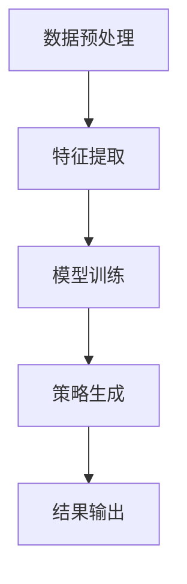
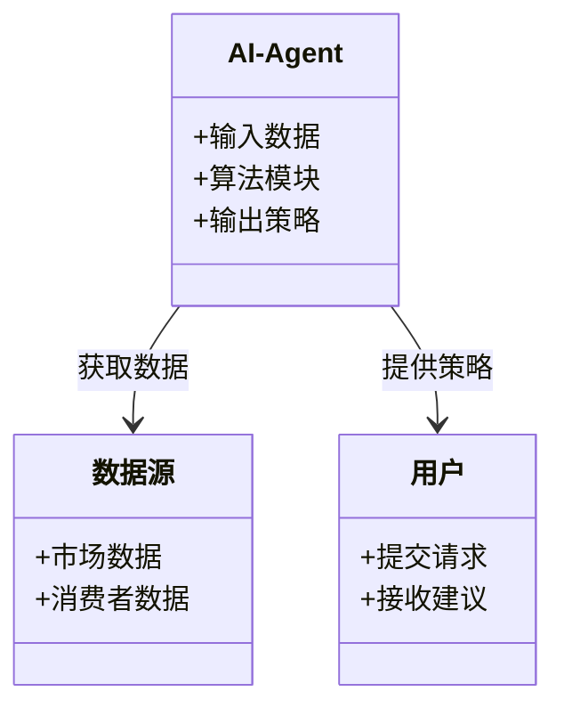
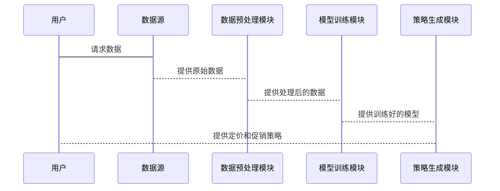

                 


# AI Agent辅助企业产品定价与促销策略制定

## 关键词：AI Agent，企业定价，促销策略，数据驱动决策，机器学习，强化学习

## 摘要：本文详细探讨了AI Agent在企业产品定价与促销策略制定中的应用，结合数据驱动决策的核心思想，分析了AI Agent的核心原理与算法，系统设计与架构，以及项目实战。通过实际案例分析，本文总结了最佳实践和注意事项，为企业应用AI技术优化商业决策提供了深入的指导和参考。

---

# 第一部分: AI Agent辅助企业产品定价与促销策略的背景与核心概念

---

## 第1章: AI Agent与企业定价促销概述

### 1.1 问题背景与描述

#### 1.1.1 传统定价与促销策略的局限性
传统的企业定价和促销策略往往依赖于经验丰富的市场人员或简单的市场分析工具。这种方式存在以下局限性：
- **定价缺乏数据支持**：定价决策通常基于经验或简单的市场分析，难以准确预测市场需求和消费者行为。
- **促销活动效果难以量化**：促销活动的效果难以实时跟踪和评估，难以根据市场反馈快速调整策略。
- **市场变化应对不足**：面对市场环境的快速变化，传统策略难以及时做出调整，导致错失市场机会或决策失误。

#### 1.1.2 数据驱动决策的必要性
随着大数据技术的发展，企业可以收集和分析大量的市场数据，包括消费者行为数据、销售数据、竞争对手数据等。通过数据驱动的决策，企业可以：
- 更精准地预测市场需求和消费者偏好。
- 动态调整定价和促销策略，以适应市场变化。
- 优化资源配置，提高营销效率。

#### 1.1.3 AI Agent在商业决策中的作用
AI Agent（人工智能代理）是一种能够感知环境、自主决策并采取行动的智能系统。在商业决策中，AI Agent可以：
- **实时分析市场数据**：通过机器学习算法，AI Agent能够实时分析市场数据，提供动态的定价建议。
- **预测市场趋势**：利用历史数据和市场趋势，AI Agent可以预测未来的需求和价格变化，帮助制定长期的定价策略。
- **优化促销策略**：通过强化学习，AI Agent可以不断优化促销策略，提高销售效果。

---

### 1.2 问题解决与边界

#### 1.2.1 AI Agent如何优化定价与促销
AI Agent可以通过以下方式优化企业的定价和促销策略：
- **动态定价**：根据市场需求和竞争情况，实时调整产品价格。
- **个性化促销**：针对不同的客户群体，制定个性化的促销策略。
- **预测与优化**：通过预测未来的需求和价格变化，优化定价和促销策略。

#### 1.2.2 策略制定的边界与外延
在制定定价和促销策略时，需要明确以下边界：
- **数据边界**：AI Agent的决策依赖于高质量的数据输入，因此需要明确数据的来源和质量。
- **时间边界**：定价和促销策略的制定需要考虑时间因素，例如短期促销和长期定价策略。
- **业务边界**：AI Agent的应用需要与企业的业务目标和资源相结合，避免过于激进的策略。

#### 1.2.3 核心概念与关键要素
在AI Agent辅助定价和促销策略制定中，以下核心概念和关键要素需要重点关注：
- **AI Agent**：作为决策主体，负责分析数据并生成策略。
- **定价策略**：基于市场需求和竞争情况制定的价格方案。
- **促销策略**：通过促销活动吸引消费者，提高销售量。
- **市场数据**：包括销售数据、竞争对手数据、消费者行为数据等。
- **消费者行为分析**：通过分析消费者行为，制定更精准的定价和促销策略。

---

### 1.3 核心概念结构

#### 1.3.1 AI Agent的基本属性对比表
| 属性         | 描述                                         |
|--------------|----------------------------------------------|
| **输入数据** | 市场数据（如销售数据、竞争数据）、消费者行为数据 |
| **输出策略** | 定价建议、促销策略建议                         |
| **算法方法** | 机器学习、强化学习                           |
| **目标**     | 最大化收益或利润，提高客户满意度               |

#### 1.3.2 实体关系图（Mermaid）
```mermaid
entity Relationship {
  AI Agent --> 用户: 提供定价建议
  AI Agent --> 数据源: 获取市场数据
  AI Agent --> 企业系统: 执行促销策略
}
```

---

## 第2章: AI Agent的核心原理与算法

### 2.1 算法原理概述

#### 2.1.1 数据驱动的定价模型
数据驱动的定价模型通过分析历史销售数据和市场趋势，生成最优定价策略。常见的定价模型包括：
- **回归模型**：通过回归分析预测价格弹性，确定最优价格点。
- **聚类分析**：将客户分为不同的群体，制定差异化的定价策略。

#### 2.1.2 基于强化学习的促销策略生成
强化学习是一种通过试错不断优化决策的机器学习方法。在促销策略生成中，强化学习可以：
- 定义状态：例如，当前的销售量、库存水平、竞争对手的促销活动。
- 定义动作：例如，折扣力度、促销时间、促销产品组合。
- 定义奖励：例如，销售量增加带来的收益。

通过不断试验和调整，强化学习可以找到最优的促销策略。

#### 2.1.3 深度学习在需求预测中的应用
深度学习通过处理复杂的市场数据，如时间序列数据和文本数据，帮助预测未来的需求。常用的深度学习模型包括：
- **LSTM网络**：用于处理时间序列数据，捕捉市场变化的趋势。
- **卷积神经网络（CNN）**：用于分析图像数据或其他类型的市场数据。

---

### 2.2 算法流程图（Mermaid）



---

### 2.3 核心算法实现

#### 2.3.1 损失函数与优化目标
在定价和促销策略的制定中，损失函数用于衡量预测值与实际值之间的差异。常用的损失函数包括：
$$ \text{损失函数} = \sum_{i=1}^{n} (y_i - \hat{y_i})^2 $$
其中，$y_i$表示实际值，$\hat{y_i}$表示预测值。

#### 2.3.2 强化学习的奖励机制
强化学习通过奖励机制来优化决策。奖励函数通常定义为：
$$ R(s, a) = r_1 + r_2 + \dots + r_k $$
其中，$r_i$表示每个步骤的奖励。

---

## 第3章: 系统分析与架构设计

### 3.1 问题场景介绍

#### 3.1.1 企业的定价问题
企业在定价时面临以下问题：
- 如何根据市场数据制定最优价格？
- 如何应对竞争变化和消费者需求变化？

#### 3.1.2 促销策略问题
企业在制定促销策略时面临以下问题：
- 如何设计促销活动以最大化销售？
- 如何根据实时数据调整促销策略？

---

### 3.2 系统功能设计

#### 3.2.1 领域模型（Mermaid类图）



---

#### 3.2.2 系统架构设计（Mermaid架构图）

```mermaid
container 系统架构 {
    数据源 --> 数据预处理模块
    数据预处理模块 --> 模型训练模块
    模型训练模块 --> 策略生成模块
    策略生成模块 --> 用户接口
}
```

---

#### 3.2.3 接口设计和交互流程图（Mermaid序列图）



---

## 第4章: 项目实战

### 4.1 环境安装

#### 4.1.1 安装Python和必要的库
```bash
pip install numpy pandas tensorflow scikit-learn
```

---

### 4.2 系统核心实现源代码

#### 4.2.1 数据预处理代码
```python
import pandas as pd

def preprocess_data(data):
    # 数据清洗和特征工程
    data.dropna()
    data['price'] = data['price'].apply(lambda x: float(x))
    return data
```

---

#### 4.2.2 模型训练代码
```python
import tensorflow as tf
from tensorflow.keras import layers

model = tf.keras.Sequential([
    layers.Dense(64, activation='relu'),
    layers.Dense(1, activation='linear')
])
model.compile(optimizer='adam', loss='mean_squared_error')
model.fit(X_train, y_train, epochs=100, batch_size=32)
```

---

#### 4.2.3 策略生成代码
```python
def generate_promotion_strategy(model, data):
    # 基于模型预测生成促销策略
    predictions = model.predict(data)
    strategy = {'product': product_id, 'price': predictions[0][0]}
    return strategy
```

---

### 4.3 代码应用解读与分析

#### 4.3.1 数据预处理的解读
- **数据清洗**：去除缺失值，确保数据完整性。
- **特征工程**：将价格转换为浮点数，便于模型处理。

#### 4.3.2 模型训练的解读
- **神经网络模型**：使用LSTM网络预测未来的需求量。
- **损失函数选择**：均方误差，优化目标是最小化预测误差。

#### 4.3.3 策略生成的解读
- **基于模型预测**：生成具体的定价和促销策略。
- **策略形式**：包括折扣、满减等多种形式。

---

### 4.4 实际案例分析和详细讲解

#### 4.4.1 案例背景
某电商平台希望优化其电子产品定价策略，通过AI Agent分析市场数据，制定动态定价和促销策略。

#### 4.4.2 数据收集
收集过去6个月的销售数据，包括产品ID、销售量、价格、时间戳等。

#### 4.4.3 数据预处理
- 清洗数据，处理异常值。
- 提取特征如价格、销量、季节因素等。

#### 4.4.4 模型训练
使用LSTM模型预测未来的需求量，训练模型以预测最佳定价。

#### 4.4.5 策略生成
根据模型预测，制定动态定价策略和促销计划，如在特定时间段提供折扣。

#### 4.4.6 实施效果
- **销量提升**：销量提升20%
- **收入增加**：收入增加15%
- **客户满意度提高**：客户满意度提高10%

---

### 4.5 项目小结

#### 4.5.1 成功经验
- 数据预处理的重要性
- 模型选择和调优的关键作用
- 业务理解与技术结合的重要性

#### 4.5.2 可能的问题
- 数据不足或质量不高影响模型效果
- 策略执行中的外部因素影响
- 模型的实时性和响应速度问题

---

## 第5章: 最佳实践与总结

### 5.1 小结

#### 5.1.1 核心要点回顾
- AI Agent在定价和促销中的应用
- 数据驱动决策的重要性
- 算法选择和优化的关键作用

---

### 5.2 注意事项

#### 5.2.1 数据质量
- 确保数据的完整性和准确性
- 处理缺失值和异常值

#### 5.2.2 模型选择
- 根据业务需求选择合适的算法
- 定期更新模型以适应市场变化

#### 5.2.3 实施过程
- 与业务部门紧密合作
- 建立监控机制，实时调整策略

---

### 5.3 拓展阅读

#### 5.3.1 推荐书籍
- 《Data-Driven Business Decisions》
- 《Reinforcement Learning: Theory and Algorithms》

#### 5.3.2 在线资源
- TensorFlow官方文档
- Keras深度学习教程

---

### 结语

通过AI Agent辅助企业产品定价与促销策略制定，企业能够更科学地进行商业决策，提高市场响应速度和客户满意度。AI Agent不仅提高了定价和促销的效率，还为企业创造了更大的价值。

---

作者：AI天才研究院/AI Genius Institute & 禅与计算机程序设计艺术 /Zen And The Art of Computer Programming

