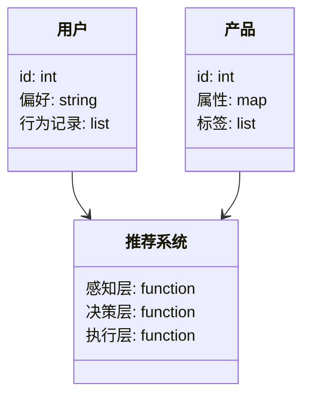
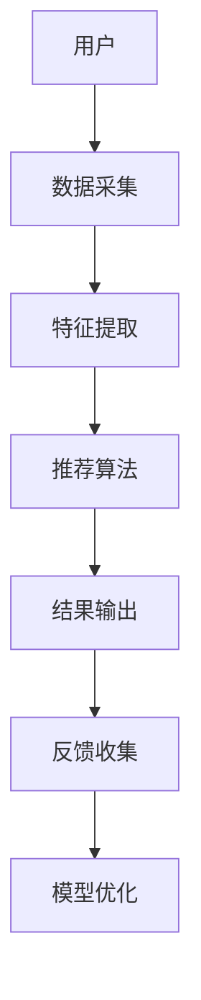

                 


# AI Agent辅助企业产品推荐与个性化服务

**关键词：** AI Agent, 企业推荐系统, 个性化服务, 机器学习, 自然语言处理, 强化学习

**摘要：** AI Agent通过结合机器学习、自然语言处理和强化学习，为企业提供智能化的产品推荐和个性化服务。本文详细探讨了AI Agent的核心概念、算法原理、系统架构，并通过实际案例展示了其在企业中的应用价值，最后提出了最佳实践和未来发展方向。

---

## 第一部分: AI Agent辅助企业产品推荐与个性化服务背景介绍

### 第1章: AI Agent的基本概念与应用背景

#### 1.1 AI Agent的定义与核心概念
- **1.1.1 AI Agent的定义**  
  AI Agent是一种智能代理，能够感知环境、自主决策并执行任务，以实现特定目标。它不同于传统算法，具有主动性、适应性和学习能力。

- **1.1.2 AI Agent的核心特征**  
  - 智能性：通过机器学习和自然语言处理实现复杂决策。  
  - 实时性：能够快速响应用户需求。  
  - 个性化：根据用户行为和偏好提供定制化服务。  

- **1.1.3 AI Agent与传统推荐系统的主要区别**  
  - 传统推荐系统基于规则或协同过滤，而AI Agent具备自主学习和优化能力。  
  - 传统系统静态，AI Agent动态适应环境变化。  

#### 1.2 企业产品推荐与个性化服务的背景
- **1.2.1 企业推荐系统的演变历程**  
  从基于规则的推荐到机器学习驱动的个性化推荐，企业推荐系统经历了从简单到复杂的演变。  

- **1.2.2 当前企业推荐系统的痛点与挑战**  
  - 数据维度高，计算复杂度大。  
  - 用户行为多样性，难以覆盖所有场景。  
  - 需要实时反馈，对系统响应速度要求高。  

- **1.2.3 AI Agent在推荐系统中的应用价值**  
  AI Agent能够实时分析用户行为，动态调整推荐策略，显著提升推荐系统的准确性和用户体验。

---

### 第2章: AI Agent的技术基础与实现原理

#### 2.1 AI Agent的核心技术基础
- **2.1.1 机器学习基础**  
  - 监督学习：用于分类和回归任务。  
  - 无监督学习：用于聚类和降维。  

- **2.1.2 自然语言处理基础**  
  - 文本处理：如分词、句法分析。  
  - 深度学习模型：如BERT、GPT用于文本理解和生成。  

- **2.1.3 强化学习基础**  
  - 策略网络：通过试错优化推荐策略。  
  - 奖励机制：定义用户行为的反馈作为奖励。  

#### 2.2 AI Agent的实现原理
- **2.2.1 感知层：数据采集与处理**  
  - 用户行为数据：点击、浏览、购买记录。  
  - 产品特征数据：产品属性、标签、描述。  
  - 环境信息：时间、地点、用户上下文。  

- **2.2.2 决策层：推荐算法与策略**  
  - 协同过滤：基于用户相似性或物品相似性。  
  - 基于内容的推荐：分析产品特征与用户偏好匹配。  
  - 深度学习推荐：如神经网络协同过滤模型。  

- **2.2.3 执行层：结果输出与反馈**  
  - 输出推荐结果：如商品列表、个性化描述。  
  - 收集用户反馈：如点击、购买、评分。  
  - 优化推荐策略：基于反馈调整模型参数。  

---

### 第3章: AI Agent在企业推荐系统中的价值

#### 3.1 提升用户体验的关键点
- **3.1.1 个性化推荐的核心作用**  
  - 根据用户偏好动态调整推荐策略。  
  - 提供高度相关的推荐内容，减少用户选择疲劳。  

- **3.1.2 提高用户粘性的实现路径**  
  - 通过实时反馈增强用户参与感。  
  - 提供多样化的推荐，覆盖用户不同需求。  

- **3.1.3 增强用户满意度的优化策略**  
  - 结合上下文信息，提供更精准的推荐。  
  - 处理用户的冷启动问题，快速建立推荐模型。  

#### 3.2 企业效率提升的实现方式
- **3.2.1 降低运营成本的潜力**  
  - 自动化推荐减少人工干预。  
  - 高效的数据处理和分析能力。  

- **3.2.2 提高转化率的策略**  
  - 精准推荐提高用户购买意愿。  
  - 通过个性化营销增加用户转化。  

- **3.2.3 数据驱动的决策优化**  
  - 利用实时数据进行动态调整。  
  - 通过A/B测试优化推荐策略。  

---

## 第二部分: AI Agent的核心概念与联系

### 第4章: AI Agent的核心概念与联系

#### 4.1 AI Agent的核心概念原理
- AI Agent通过感知层收集数据，决策层进行分析和预测，执行层输出结果并收集反馈，形成一个闭环系统。  

#### 4.2 概念属性特征对比表格

| 概念       | 属性特征                          |
|------------|-----------------------------------|
| 感知层     | 数据采集、特征提取                |
| 决策层     | 算法选择、策略优化                |
| 执行层     | 推荐输出、结果反馈                |

#### 4.3 ER实体关系图架构的 Mermaid 流程图

```mermaid
er
actor 用户
actor 产品
actor 推荐系统
actor 反馈
rectangle 数据库 {
    用户行为数据
    产品特征数据
}
rectangle 推荐系统 {
    感知层
    决策层
    执行层
}
```

---

## 第三部分: 算法原理讲解

### 第5章: 推荐算法与AI Agent的实现

#### 5.1 协同过滤算法
- **基于用户的协同过滤**  
  $$相似度计算：similarity(u_i, u_j) = \frac{\sum_{k=1}^{n} r_{i,k} r_{j,k}}}{\sqrt{\sum_{k=1}^{n} r_{i,k}^2} \sqrt{\sum_{k=1}^{n} r_{j,k}^2}}}$$  
- **基于物品的协同过滤**  
  $$预测评分：\hat{r}_{i,j} = \frac{\sum_{k=1}^{n} w_{j,k} r_{i,k}}}{\sum_{k=1}^{n} w_{j,k}}}$$  

#### 5.2 深度学习推荐系统
- **神经网络协同过滤模型**  
  $$ embedding\_user \cdot embedding\_item = score $$  

#### 5.3 强化学习推荐策略
- **策略网络**  
  $$ \pi(a|s) = \text{softmax}(\theta s + b) $$  
- **奖励机制**  
  $$ R = \sum_{t=1}^{T} r_t $$  

---

## 第四部分: 系统分析与架构设计方案

### 第6章: 系统架构与接口设计

#### 6.1 系统功能设计
- **领域模型类图**  


#### 6.2 系统架构设计
- **推荐系统架构图**  


---

## 第五部分: 项目实战

### 第7章: 实际案例分析与实现

#### 7.1 项目介绍
- 实现一个基于AI Agent的电商推荐系统，使用协同过滤和深度学习模型。

#### 7.2 核心代码实现
- **数据预处理**  
  ```python
  import pandas as pd
  data = pd.read_csv('user_behavior.csv')
  ```

- **模型训练**  
  ```python
  from sklearn.model_selection import train_test_split
  X_train, X_test, y_train, y_test = train_test_split(data, target, test_size=0.2)
  ```

- **结果展示**  
  ```python
  print('推荐结果:', recommendations)
  ```

---

## 第六部分: 最佳实践

### 第8章: 总结与展望

#### 8.1 小结
- AI Agent通过智能化推荐和个性化服务，显著提升了企业的产品推荐效率和用户体验。

#### 8.2 注意事项
- 数据隐私和安全需严格保护。  
- 系统需具备良好的可扩展性和实时性。  

#### 8.3 未来发展方向
- 结合多模态数据，提升推荐准确率。  
- 引入强化学习，优化推荐策略。  
- 推动AI Agent在更多领域的应用。  

#### 8.4 拓展阅读
- 《Reinforcement Learning: Theory and Algorithms》  
- 《Deep Learning for Recommendation Systems》  

---

**作者：AI天才研究院/AI Genius Institute & 禅与计算机程序设计艺术/Zen And The Art of Computer Programming**

