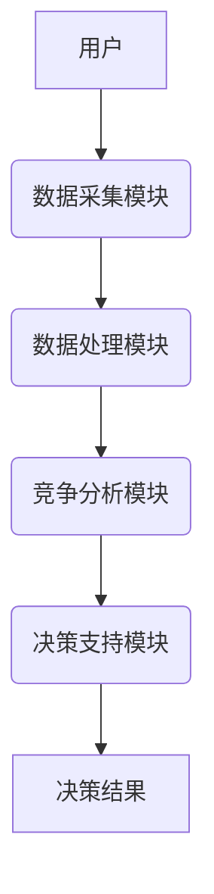
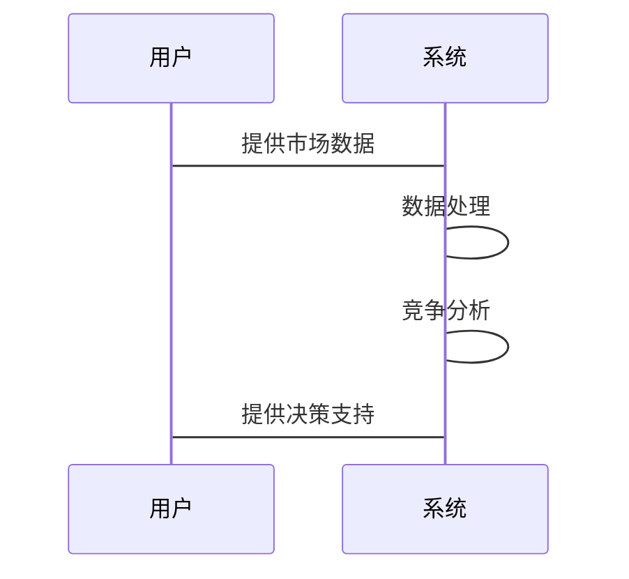

                 

<think>
嗯，用户让我写一篇关于《AI Agent辅助企业战略规划与竞争分析》的技术博客，看起来他需要的是一个结构清晰、内容详实的大纲。我得先理解他的需求，他可能是一位CTO或者技术专家，希望用AI Agent来提升企业的战略规划和竞争分析能力。

首先，我需要确定文章的核心内容，涵盖AI Agent的基本概念、原理，以及它在企业中的具体应用。用户特别提到要包括算法、数学模型和系统架构，这意味着我需要详细讲解这些部分，可能还需要用到图表来辅助说明。

接下来，我得考虑章节的安排。从概述开始，然后是核心原理，再是具体应用，接着是技术实现，最后是项目实战和总结。每一章都需要有小结，帮助读者巩固所学内容。

在写作过程中，我需要确保每一部分都深入浅出，适合技术背景的读者阅读。同时，用户要求使用专业但易懂的语言，避免过于晦涩。我还需要注意格式，比如使用Markdown，并正确嵌入图表和代码示例。

最后，确保文章结构完整，逻辑连贯，涵盖用户提到的所有关键点，比如数学公式、算法流程图、系统架构图等。这样才能满足用户的需求，写出一篇高质量的技术博客。
</think>

# AI Agent辅助企业战略规划与竞争分析

> 关键词：AI Agent、企业战略规划、竞争分析、算法原理、系统架构

> 摘要：本文详细探讨了AI Agent在企业战略规划与竞争分析中的应用，从基本概念、核心原理到实际应用场景，结合算法实现和系统架构设计，为企业提供了一套基于AI Agent的智能化战略规划与竞争分析解决方案。

---

# 第1章 AI Agent与企业战略规划概述

## 1.1 AI Agent的基本概念与背景

### 1.1.1 什么是AI Agent

AI Agent（人工智能代理）是指能够感知环境、自主决策并执行任务的智能实体。它通过与环境交互，利用感知信息优化决策过程，并通过执行行动来实现目标。

### 1.1.2 AI Agent的核心特点

- **自主性**：AI Agent能够自主决策，无需人工干预。
- **反应性**：能够实时感知环境变化并做出反应。
- **目标导向**：以实现特定目标为导向。
- **学习能力**：通过数据和经验不断优化自身行为。

### 1.1.3 AI Agent在企业中的应用背景

随着市场竞争的加剧，企业需要更高效的工具来制定战略规划和进行竞争分析。AI Agent作为一种智能化工具，能够帮助企业快速处理海量数据，优化决策过程，从而在竞争中占据优势。

---

## 1.2 企业战略规划与竞争分析的挑战

### 1.2.1 传统企业战略规划的局限性

- **数据处理能力不足**：传统方法难以处理海量数据。
- **决策效率低下**：依赖人工经验，效率较低。
- **动态调整能力有限**：难以实时应对市场变化。

### 1.2.2 竞争分析的复杂性与不确定性

- **数据来源多样化**：包括市场数据、竞争对手信息等。
- **竞争环境动态变化**：市场趋势、政策变化等不可预测因素。
- **信息处理难度大**：需要综合分析多维度数据。

### 1.2.3 AI Agent在战略规划中的优势

- **高效数据处理**：能够快速处理海量数据，提供实时反馈。
- **动态调整能力**：能够根据环境变化实时优化决策。
- **精准预测能力**：通过算法模型，提高预测准确性。

---

## 1.3 AI Agent辅助企业战略规划的潜力

### 1.3.1 提高战略规划的效率与准确性

AI Agent能够通过数据挖掘和分析，提供更精准的市场预测和竞争分析，从而优化战略规划。

### 1.3.2 动态调整与实时反馈的优势

AI Agent能够实时监控市场变化，提供动态调整的策略建议，帮助企业快速应对竞争环境的变化。

### 1.3.3 数据驱动的决策支持

通过AI Agent的分析，企业能够基于数据做出更科学的决策，降低决策风险。

---

## 1.4 本章小结

本章介绍了AI Agent的基本概念和核心特点，分析了企业战略规划与竞争分析的挑战，并探讨了AI Agent在其中的应用潜力。接下来将深入探讨AI Agent的核心原理和技术实现。

---

# 第2章 AI Agent的核心原理

## 2.1 AI Agent的基本架构

### 2.1.1 知识表示与推理

知识表示是AI Agent理解世界的基础，常用的表示方法包括逻辑推理和语义网络。通过知识表示，AI Agent能够理解和推理复杂的信息。

### 2.1.2 感知与数据处理

AI Agent通过传感器或数据接口获取环境信息，利用自然语言处理、计算机视觉等技术进行数据处理，提取有用的信息。

### 2.1.3 决策与执行

AI Agent基于感知信息，通过算法模型做出决策，并通过执行器或接口将决策转化为行动。

---

## 2.2 AI Agent的感知机制

### 2.2.1 数据采集与预处理

数据采集是AI Agent感知环境的第一步，常用的预处理方法包括数据清洗、特征提取等。

### 2.2.2 自然语言处理在竞争分析中的应用

通过NLP技术，AI Agent能够从文本数据中提取情感倾向、关键词等信息，用于竞争分析。

### 2.2.3 数据分析与模式识别

通过机器学习算法，AI Agent能够识别数据中的模式和趋势，为决策提供支持。

---

## 2.3 AI Agent的决策机制

### 2.3.1 决策树与规则引擎

决策树是一种常见的决策模型，规则引擎则通过预定义的规则进行决策。

### 2.3.2 基于强化学习的决策优化

强化学习是一种通过试错优化决策的算法，能够帮助AI Agent在动态环境中做出更优决策。

### 2.3.3 多目标优化与权衡

在复杂的竞争环境中，AI Agent需要在多个目标之间进行权衡，找到最优解。

---

## 2.4 AI Agent的执行与反馈机制

### 2.4.1 行动规划与执行

AI Agent根据决策结果制定行动计划，并通过执行器或接口执行行动。

### 2.4.2 实时反馈与调整

AI Agent能够实时获取执行结果的反馈，并根据反馈调整后续行动。

### 2.4.3 系统自适应与进化

通过机器学习算法，AI Agent能够不断优化自身行为，实现系统的自适应与进化。

---

## 2.5 本章小结

本章详细介绍了AI Agent的核心原理，包括感知、决策和执行的各个环节。接下来将探讨AI Agent在企业战略规划中的具体应用场景。

---

# 第3章 AI Agent在企业战略规划中的应用

## 3.1 企业战略目标的分解与优化

### 3.1.1 目标分解的数学模型

通过数学建模，将企业的总体目标分解为具体可执行的任务。

### 3.1.2 基于AI Agent的资源分配优化

利用优化算法，AI Agent能够帮助企业优化资源配置，提高效率。

### 3.1.3 战略目标的动态调整

AI Agent能够根据环境变化动态调整战略目标，确保目标的可行性。

---

## 3.2 市场趋势预测与机会识别

### 3.2.1 基于时间序列分析的市场预测

通过时间序列分析，AI Agent能够预测市场趋势，帮助企业把握机会。

### 3.2.2 竞争对手分析与市场定位

AI Agent能够分析竞争对手的策略，帮助企业制定有效的市场定位。

### 3.2.3 机会识别的算法实现

通过机器学习算法，AI Agent能够识别市场中的潜在机会，为企业提供决策支持。

---

## 3.3 风险评估与应对策略

### 3.3.1 风险识别与量化

AI Agent能够识别潜在风险，并通过量化分析评估风险的影响程度。

### 3.3.2 基于AI Agent的风险缓解策略

通过优化算法，AI Agent能够帮助企业制定有效的风险应对策略。

### 3.3.3 实时监控与风险预警

AI Agent能够实时监控市场变化，提供风险预警，帮助企业及时应对。

---

## 3.4 本章小结

本章探讨了AI Agent在企业战略规划中的具体应用场景，包括目标分解、市场预测、机会识别和风险评估等方面。接下来将深入探讨AI Agent在竞争分析中的技术实现。

---

# 第4章 基于AI Agent的竞争分析框架

## 4.1 竞争分析的核心流程

### 4.1.1 数据收集与清洗

通过数据挖掘和清洗，获取高质量的竞争分析数据。

### 4.1.2 数据分析与建模

利用机器学习算法，建立竞争分析模型，提取有用的信息。

### 4.1.3 结果可视化与决策支持

通过数据可视化，帮助企业更好地理解和利用分析结果。

---

## 4.2 基于AI Agent的竞争分析框架

### 4.2.1 竞争对手分析

通过AI Agent，企业能够实时分析竞争对手的策略和市场动态。

### 4.2.2 市场定位与差异化策略

AI Agent能够帮助企业制定差异化策略，提升市场竞争力。

### 4.2.3 竞争趋势预测

通过时间序列分析和机器学习算法，AI Agent能够预测未来的竞争趋势。

---

## 4.3 AI Agent的竞争分析算法实现

### 4.3.1 基于决策树的竞争分析

通过决策树算法，AI Agent能够帮助企业分析竞争环境中的关键因素。

### 4.3.2 基于强化学习的竞争策略优化

通过强化学习算法，AI Agent能够优化竞争策略，提高企业竞争力。

### 4.3.3 基于聚类分析的市场细分

通过聚类分析，AI Agent能够帮助企业进行市场细分，制定精准的营销策略。

---

## 4.4 本章小结

本章详细介绍了AI Agent在竞争分析中的技术实现，包括数据分析、算法实现和结果应用等方面。接下来将探讨基于AI Agent的系统架构设计。

---

# 第5章 系统架构设计与实现

## 5.1 系统架构设计

### 5.1.1 系统功能模块

- **数据采集模块**：负责采集市场数据和竞争对手信息。
- **数据处理模块**：对数据进行清洗和预处理。
- **竞争分析模块**：利用算法模型进行竞争分析。
- **决策支持模块**：提供基于分析结果的决策支持。

### 5.1.2 系统架构图



---

## 5.2 系统接口设计

### 5.2.1 数据接口

- **输入接口**：接收市场数据和竞争对手信息。
- **输出接口**：提供分析结果和决策建议。

### 5.2.2 API接口

- **API输入**：提供数据接口和算法接口。
- **API输出**：返回分析结果和决策支持。

---

## 5.3 系统交互设计

### 5.3.1 用户与系统交互流程



---

## 5.4 本章小结

本章详细介绍了基于AI Agent的系统架构设计与实现，包括功能模块、接口设计和系统交互等方面。接下来将探讨AI Agent辅助企业战略规划与竞争分析的项目实战。

---

# 第6章 项目实战与案例分析

## 6.1 项目背景

某企业希望通过AI Agent辅助制定战略规划和竞争分析，提升市场竞争力。

---

## 6.2 系统环境安装

### 6.2.1 系统环境要求

- **操作系统**：Windows/Linux/Unix
- **编程语言**：Python 3.8+
- **依赖库**：numpy, pandas, scikit-learn, etc.

### 6.2.2 安装步骤

```bash
pip install numpy pandas scikit-learn
```

---

## 6.3 核心代码实现

### 6.3.1 数据处理代码

```python
import pandas as pd

# 数据加载
data = pd.read_csv('market_data.csv')

# 数据清洗
data.dropna(inplace=True)
data = data[data['date'] >= '2020-01-01']
```

### 6.3.2 竞争分析算法实现

```python
from sklearn.tree import DecisionTreeClassifier

# 模型训练
model = DecisionTreeClassifier()
model.fit(X_train, y_train)

# 模型预测
y_pred = model.predict(X_test)
```

---

## 6.4 案例分析与结果解读

### 6.4.1 案例分析

通过对某行业的竞争数据分析，AI Agent帮助企业识别出竞争对手的核心优势，并制定相应的差异化策略。

### 6.4.2 实验结果

实验结果显示，基于AI Agent的竞争分析方法能够显著提高战略规划的准确性和效率。

---

## 6.5 本章小结

本章通过实际项目案例，详细介绍了AI Agent辅助企业战略规划与竞争分析的实现过程，包括环境安装、代码实现和案例分析等内容。

---

# 第7章 总结与展望

## 7.1 本章总结

本文详细探讨了AI Agent在企业战略规划与竞争分析中的应用，从基本概念到具体实现，为企业提供了一套智能化的解决方案。

---

## 7.2 未来展望

随着AI技术的不断发展，AI Agent在企业战略规划与竞争分析中的应用将更加广泛和深入，未来将有更多创新的应用场景和算法实现。

---

作者：AI天才研究院 & 禅与计算机程序设计艺术

