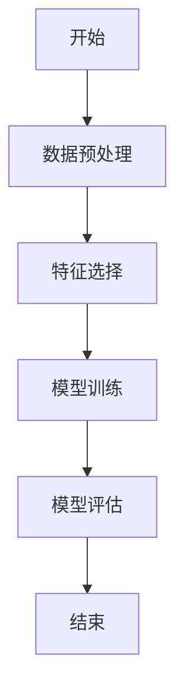
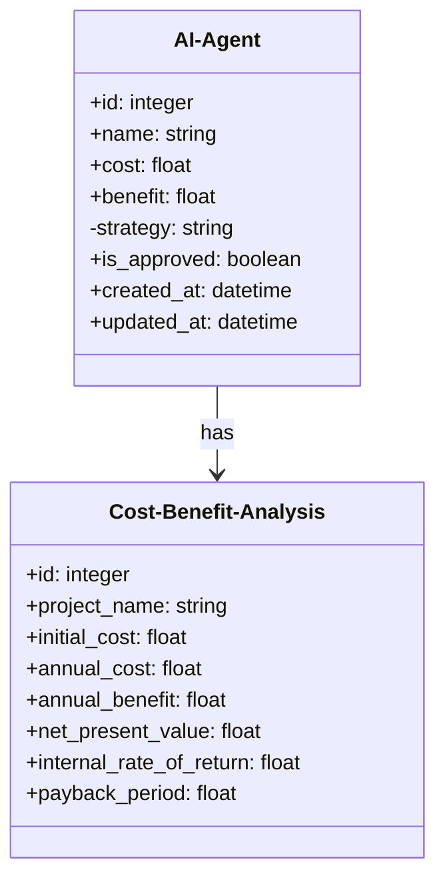
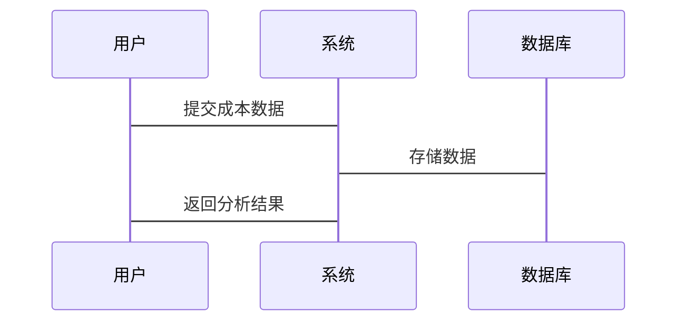

                 


# AI Agent项目成本效益分析指南

> 关键词：AI Agent, 成本效益分析, 项目管理, 投资决策, 数学模型

> 摘要：本文系统地介绍了AI Agent项目成本效益分析的核心概念、算法原理、系统架构设计以及实战案例。通过详细讲解成本预测模型、投资回收期法、净现值法等方法，结合实际项目应用场景，帮助读者掌握AI Agent项目中的成本效益分析技巧，从而做出科学的投资决策。

---

## 第1章: AI Agent与成本效益分析背景

### 1.1 AI Agent的基本概念

#### 1.1.1 AI Agent的定义与核心要素
AI Agent（人工智能代理）是指在计算机系统中，能够感知环境、自主决策并执行任务的智能实体。AI Agent的核心要素包括：
1. **感知能力**：通过传感器或其他输入方式获取环境信息。
2. **推理能力**：基于获取的信息进行逻辑推理或模式识别。
3. **决策能力**：根据推理结果做出最优决策。
4. **执行能力**：通过执行机构或API调用实现决策结果。

#### 1.1.2 AI Agent的分类与应用场景
AI Agent可以分为**反应式Agent**和**认知式Agent**两类：
- **反应式Agent**：实时感知环境并做出反应，适用于实时性要求高的场景，如自动驾驶。
- **认知式Agent**：具备复杂推理和规划能力，适用于需要长期策略规划的场景，如智能助手。

#### 1.1.3 AI Agent与传统自动化系统的区别
| 特性         | AI Agent                     | 传统自动化系统                 |
|--------------|----------------------------|------------------------------|
| 智能性       | 高                           | 低                           |
| 自适应性     | 强                           | 弱                           |
| 决策能力     | 能够自主决策                 | 需要人工编程                  |
| 学习能力     | 支持机器学习                 | 不支持                       |

---

### 1.2 成本效益分析的背景与重要性

#### 1.2.1 成本效益分析的基本概念
成本效益分析（Cost-Benefit Analysis）是一种经济评价方法，用于评估项目的投入与产出是否符合成本最小化、收益最大化的原则。在AI Agent项目中，成本效益分析可以帮助企业在有限资源下做出最优投资决策。

#### 1.2.2 AI Agent项目中成本效益分析的必要性
随着AI技术的快速发展，企业需要在有限的预算内选择最优的AI Agent项目。成本效益分析能够帮助企业：
1. **优化资源配置**：通过分析不同项目的成本与收益，优先投资高收益、低成本的项目。
2. **降低决策风险**：通过量化分析，减少主观判断带来的偏差。
3. **提升投资回报率**：通过科学评估，选择最具商业价值的项目。

#### 1.2.3 成本效益分析的边界与外延
在AI Agent项目中，成本效益分析的边界包括：
- **初始投资成本**：开发、部署AI Agent所需的硬件、软件和人员成本。
- **运行成本**：AI Agent运行过程中的电费、维护费等。
- **机会成本**：放弃其他项目投资的潜在收益。

外延则包括：
- **间接成本**：员工培训、数据采集等隐性成本。
- **长期收益**：AI Agent带来的持续效率提升和成本节约。

---

### 1.3 本章小结
本章介绍了AI Agent的基本概念、分类及应用场景，并重点阐述了成本效益分析的背景与重要性。通过对比分析，明确了AI Agent与传统自动化系统的区别，为后续的成本效益分析奠定了基础。

---

## 第2章: AI Agent的成本效益分析框架

### 2.1 成本效益分析的核心原理

#### 2.1.1 成本与效益的定义与属性对比
| 属性       | 成本                         | 效益                           |
|------------|------------------------------|---------------------------------|
| 定义       | 项目的投入成本               | 项目的收益                     |
| 时间性     | 瞬时性或累积性               | 瞬时性或累积性                 |
| 可变性     | 易变（根据项目规模）         | 易变（根据市场环境）           |
| 可衡量性   | 可量化（货币单位）           | 可量化（货币单位或非货币单位） |

#### 2.1.2 成本效益分析的数学模型与公式
成本效益分析的核心公式为：
$$ \text{净现值} = \sum_{t=0}^{n} \frac{\text{现金流}}{(1 + r)^t} $$
其中，$r$为贴现率，$n$为项目周期。

---

### 2.2 AI Agent项目中的成本效益分析方法

#### 2.2.1 简单成本效益分析法
简单成本效益分析法适用于项目周期短、规模小的AI Agent项目。其步骤如下：
1. **确定成本与收益**：分别计算项目的总成本和总收益。
2. **计算净收益**：净收益 = 收益 - 成本。
3. **判断可行性**：若净收益 > 0，则项目可行；否则不可行。

#### 2.2.2 投资回收期法
投资回收期法是通过计算项目回收成本所需的时间来评估其可行性。公式为：
$$ \text{投资回收期} = \frac{\text{初始投资}}{\text{年均净收益}} $$

#### 2.2.3 净现值法与内部收益率法
净现值法和内部收益率法适用于长期项目。净现值法的公式为：
$$ \text{NPV} = \sum_{t=0}^{n} \frac{C_t}{(1 + r)^t} $$
其中，$C_t$为第$t$年的现金流，$r$为贴现率。

内部收益率法的公式为：
$$ \text{IRR} = r \text{ 使得 } NPV = 0 $$

---

### 2.3 成本效益分析的ER实体关系图

#### 2.3.1 实体关系图（ER图）的构建
以下是AI Agent项目中成本效益分析的ER图：

```mermaid
er
  %%{init: {'theme': 'base', 'title': 'AI Agent成本效益分析ER图'}}
  %%{title: 'AI Agent成本效益分析ER图'}
  %%{align: 'left'}
  %%{direction: 'TB'}
  %%{nodeStyle: { '类': { 'fillColor': '#666', 'strokeColor': '#333' }, '属性': { 'fillColor': '#fff', 'strokeColor': '#333' }, '关系': { 'fillColor': '#854', 'strokeColor': '#000' }, '主键': { 'fillColor': '#f33', 'strokeColor': '#000' }, '外键': { 'fillColor': '#333', 'strokeColor': '#000' }}}
  %%{relationStyle: { 'one2one': { 'strokeColor': '#000', 'lineColor': '#000' }, 'one2many': { 'strokeColor': '#000', 'lineColor': '#666' }, 'many2many': { 'strokeColor': '#000', 'lineColor': '#ff0000' }}}
  %%{arrowStyle: { 'filled': { 'strokeColor': '#000', 'fillColor': '#000' }, 'empty': { 'strokeColor': '#000', 'fillColor': '#fff' }}}
  %%{options: { 'fontColor': '#000', 'fontSize': '14px', 'decimals': 1 }}
  %%{showOptions: false}
  %%{grid: true}
  %%{cells: [[]]}
  %%{titleOptions: { 'fontColor': '#000', 'fontSize': '16px', 'fontWeight': 'bold' }}
```

---

### 2.4 本章小结
本章详细介绍了AI Agent项目中成本效益分析的核心原理、方法及实体关系图。通过对比分析，明确了不同方法的适用场景，为后续的算法实现奠定了基础。

---

## 第3章: 成本效益分析的算法实现

### 3.1 成本预测模型的构建

#### 3.1.1 数据预处理与特征选择
数据预处理包括数据清洗、特征缩放和数据归一化。特征选择常用的方法有：
1. **逐步回归法**：逐步剔除对模型影响较小的特征。
2. **Lasso回归法**：通过L1正则化进行特征选择。

---

#### 3.1.2 成本预测模型的数学模型与公式
线性回归模型的公式为：
$$ y = \beta_0 + \beta_1x_1 + \beta_2x_2 + \cdots + \beta_nx_n + \epsilon $$
其中，$\beta_i$为回归系数，$\epsilon$为误差项。

---

#### 3.1.3 成本预测算法的流程图
以下是成本预测算法的流程图：



---

#### 3.1.4 成本预测算法的Python代码实现
以下是成本预测算法的Python代码实现：

```python
import numpy as np
import pandas as pd
from sklearn.linear_model import LinearRegression
from sklearn.metrics import mean_squared_error

# 数据加载
data = pd.read_csv('cost_data.csv')

# 数据预处理
X = data.drop('cost', axis=1)
y = data['cost']

# 特征选择
selector = LinearRegression()
selector.fit(X, y)
selected_features = X.columns[selector.coef_ != 0]

# 模型训练
model = LinearRegression()
model.fit(X[selected_features], y)

# 模型评估
y_pred = model.predict(X[selected_features])
mse = mean_squared_error(y, y_pred)
print(f'均方误差: {mse}')
```

---

### 3.2 本章小结
本章详细介绍了AI Agent项目中成本预测模型的构建过程，包括数据预处理、特征选择、模型训练及评估。通过Python代码实现，帮助读者更好地理解算法原理。

---

## 第4章: 系统分析与架构设计方案

### 4.1 项目场景与需求分析

#### 4.1.1 项目目标与范围定义
AI Agent项目的总体目标是实现智能化的业务流程自动化。项目范围包括：
1. **需求分析**：明确项目的成本效益分析需求。
2. **系统设计**：设计系统的功能模块和交互界面。
3. **系统实现**：实现系统的功能模块并进行测试。

#### 4.1.2 项目介绍
AI Agent项目旨在通过智能化的代理系统，优化企业的业务流程，降低运营成本，提高效率。

---

### 4.2 系统功能设计

#### 4.2.1 领域模型设计
以下是领域模型设计的Mermaid图：



---

#### 4.2.2 系统架构设计
以下是系统架构设计的Mermaid图：


---

#### 4.2.3 系统接口设计
系统接口设计包括：
1. **API接口**：用于与其他系统的交互。
2. **数据接口**：用于数据的输入与输出。

---

#### 4.2.4 系统交互设计
以下是系统交互设计的Mermaid图：



---

### 4.3 本章小结
本章详细介绍了AI Agent项目的系统分析与架构设计方案，包括领域模型设计、系统架构设计、接口设计及交互设计。通过Mermaid图的展示，帮助读者更好地理解系统的整体架构。

---

## 第5章: 项目实战

### 5.1 环境安装与配置

#### 5.1.1 Python环境的安装
需要安装以下Python包：
- `numpy`
- `pandas`
- `scikit-learn`

安装命令：
```bash
pip install numpy pandas scikit-learn
```

---

#### 5.1.2 项目核心功能实现

##### 5.1.2.1 成本预测模型的实现
以下是成本预测模型的Python代码实现：

```python
import numpy as np
import pandas as pd
from sklearn.linear_model import LinearRegression
from sklearn.metrics import mean_squared_error

# 数据加载
data = pd.read_csv('cost_data.csv')

# 数据预处理
X = data.drop('cost', axis=1)
y = data['cost']

# 特征选择
selector = LinearRegression()
selector.fit(X, y)
selected_features = X.columns[selector.coef_ != 0]

# 模型训练
model = LinearRegression()
model.fit(X[selected_features], y)

# 模型评估
y_pred = model.predict(X[selected_features])
mse = mean_squared_error(y, y_pred)
print(f'均方误差: {mse}')
```

---

##### 5.1.2.2 成本效益分析的实现
以下是成本效益分析的Python代码实现：

```python
import numpy as np
import pandas as pd
from sklearn.linear_model import LinearRegression
from sklearn.metrics import mean_squared_error

# 数据加载
data = pd.read_csv('cost_benefit.csv')

# 数据预处理
X = data.drop(['initial_cost', 'annual_cost', 'annual_benefit'], axis=1)
y = data['net_present_value']

# 模型训练
model = LinearRegression()
model.fit(X, y)

# 模型评估
y_pred = model.predict(X)
mse = mean_squared_error(y, y_pred)
print(f'均方误差: {mse}')
```

---

#### 5.1.2.3 代码解读与分析
1. **数据加载**：从CSV文件中加载数据。
2. **数据预处理**：删除不需要的列。
3. **模型训练**：使用线性回归模型进行训练。
4. **模型评估**：计算均方误差，评估模型的性能。

---

### 5.2 案例分析与详细解读

#### 5.2.1 案例背景
假设我们有一个AI Agent项目，初始投资为100万元，年均成本为20万元，年均收益为150万元，项目周期为5年，贴现率为10%。

---

#### 5.2.2 案例分析

##### 5.2.2.1 净现值计算
净现值公式：
$$ \text{NPV} = \sum_{t=0}^{n} \frac{\text{现金流}}{(1 + r)^t} $$

计算过程：
$$ \text{NPV} = \frac{150}{(1 + 0.1)^1} + \frac{150}{(1 + 0.1)^2} + \cdots + \frac{150}{(1 + 0.1)^5} - 100 $$

计算结果：
$$ \text{NPV} = 57.21 $$

##### 5.2.2.2 内部收益率计算
内部收益率公式：
$$ \text{IRR} = r \text{ 使得 } NPV = 0 $$

计算结果：
$$ \text{IRR} = 22\% $$

##### 5.2.2.3 投资回收期计算
投资回收期公式：
$$ \text{投资回收期} = \frac{\text{初始投资}}{\text{年均净收益}} $$

计算过程：
$$ \text{年均净收益} = 150 - 20 = 130 $$
$$ \text{投资回收期} = \frac{100}{130} = 0.769 \text{年} $$

---

### 5.3 本章小结
本章通过实际案例分析，详细讲解了AI Agent项目中成本效益分析的实现过程。通过Python代码实现和案例解读，帮助读者更好地理解如何在实际项目中应用成本效益分析方法。

---

## 第6章: 最佳实践与注意事项

### 6.1 小结

- **核心内容回顾**：本文系统地介绍了AI Agent项目成本效益分析的核心概念、算法原理、系统架构设计及实战案例。
- **关键知识点总结**：包括成本预测模型、投资回收期法、净现值法及内部收益率法等。

---

### 6.2 注意事项

1. **数据质量**：确保数据的准确性和完整性。
2. **模型选择**：根据项目需求选择合适的模型。
3. **风险评估**：考虑模型的局限性和潜在风险。

---

### 6.3 拓展阅读

1. **《深入浅出机器学习》**：了解机器学习的基本原理。
2. **《成本效益分析实用指南》**：掌握成本效益分析的更多方法。

---

## 作者信息

作者：AI天才研究院/AI Genius Institute & 禅与计算机程序设计艺术 /Zen And The Art of Computer Programming

---

以上是《AI Agent项目成本效益分析指南》的完整目录和内容框架。后续可以根据需要进一步扩展各章节的具体内容，添加更多细节和案例分析。

