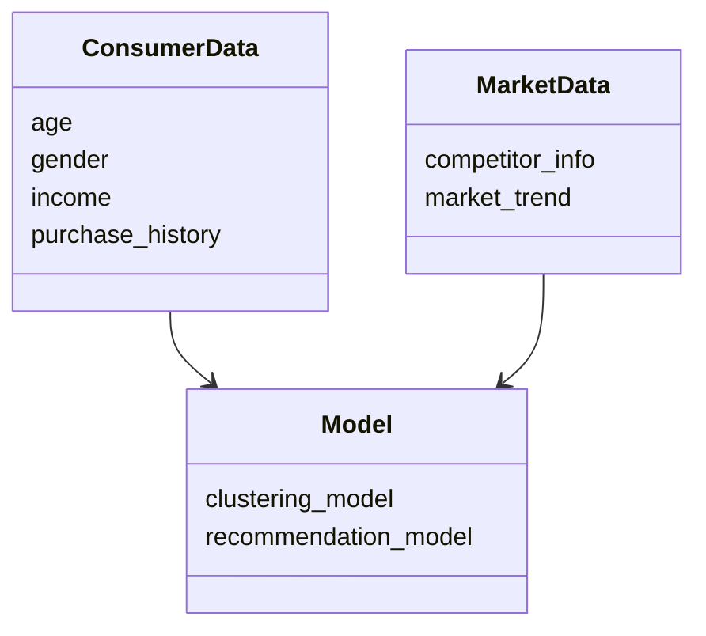
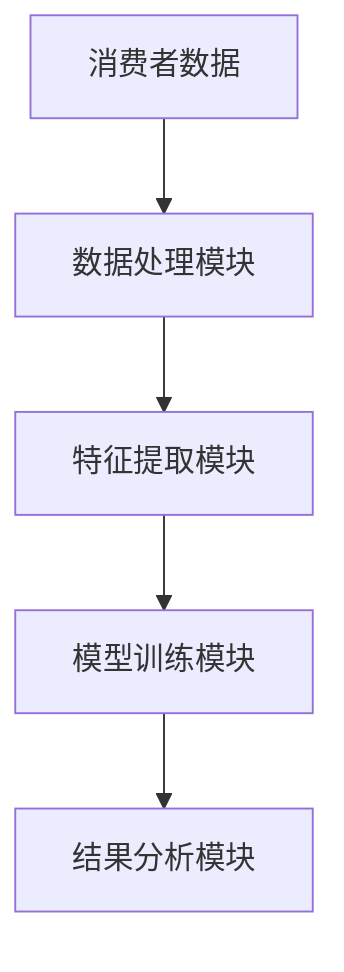
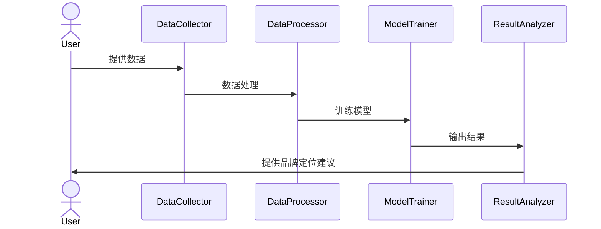

                 


---

# AI辅助企业品牌定位与差异化战略制定

## 关键词：AI、品牌定位、差异化战略、机器学习、自然语言处理

## 摘要：本文探讨了人工智能（AI）在企业品牌定位与差异化战略制定中的应用。通过分析AI技术的核心原理，结合实际案例，详细讲解了AI如何通过数据驱动的方式优化品牌定位和差异化策略，帮助企业在全球化竞争中脱颖而出。

---

# 第1章: AI辅助品牌定位与差异化战略的背景与概念

## 1.1 问题背景与挑战

### 1.1.1 传统品牌定位的局限性

传统品牌定位依赖于市场调研和人工分析，存在以下问题：
- 数据量有限，难以捕捉消费者行为的全貌。
- 分析耗时长，无法及时响应市场变化。
- 主观因素较多，导致定位不够精准。

### 1.1.2 差异化战略在市场竞争中的重要性

在竞争激烈的市场中，差异化战略是企业脱颖而出的关键：
- 通过独特的产品或服务吸引目标客户。
- 在价格战中保持竞争优势。
- 提升品牌忠诚度和市场占有率。

### 1.1.3 AI技术对企业战略决策的支持

AI技术通过以下方式提升企业决策能力：
- 大数据分析和处理能力，提高信息准确性。
- 自动化预测和推荐，优化市场策略。
- 实时反馈机制，快速调整营销方案。

## 1.2 AI在品牌定位中的应用前景

### 1.2.1 AI技术对企业品牌定位的潜在价值

- 提供精准的消费者画像和市场趋势分析。
- 优化品牌定位策略，提高市场响应速度。
- 降低市场调研成本，提升效率。

### 1.2.2 市场趋势与消费者行为分析的AI解决方案

- 利用自然语言处理技术分析消费者评论。
- 通过机器学习预测市场趋势。
- 结合图像识别技术分析视觉品牌元素。

### 1.2.3 企业差异化战略的AI辅助模式

- 数据驱动的市场细分与定位。
- AI支持的产品和服务创新。
- 智能推荐系统提升客户体验。

## 1.3 本章小结

- 介绍了传统品牌定位的局限性和差异化战略的重要性。
- 阐述了AI技术在品牌定位和差异化战略中的潜在价值。
- 总结了AI辅助品牌定位的初步框架。

---

# 第2章: 企业品牌定位与差异化战略的核心概念

## 2.1 品牌定位的定义与要素

### 2.1.1 品牌定位的定义

品牌定位是指确定品牌在目标市场中的位置，使其区别于竞争对手。

### 2.1.2 品牌定位的核心要素

| 核心要素 | 描述 |
|----------|------|
| 目标市场 | 消费者群体 |
| 品牌价值 | 核心价值主张 |
| 品牌形象 | 品牌在消费者心中的印象 |
| 竞争分析 | 竞争对手的优劣势 |

### 2.1.3 品牌定位与企业战略的关系

品牌定位是企业战略的核心组成部分，直接影响市场进入策略和资源配置。

## 2.2 差异化战略的定义与类型

### 2.2.1 差异化战略的定义

差异化战略是指通过提供独特的产品或服务，使品牌在竞争中占据优势。

### 2.2.2 差异化战略的类型

| 类型 | 描述 |
|------|------|
| 产品差异化 | 提供独特的产品或服务 |
| 价格差异化 | 实施差异化的定价策略 |
| 渠道差异化 | 选择独特的销售渠道 |
| 促销差异化 | 创新的市场推广活动 |

### 2.2.3 差异化战略与品牌定位的关系

差异化战略是品牌定位的延伸，旨在通过独特性吸引目标客户。

## 2.3 AI在品牌定位与差异化战略中的作用

### 2.3.1 数据驱动的品牌定位

AI通过大数据分析，帮助企业更精准地定位目标市场。

### 2.3.2 AI算法在差异化战略中的应用

- 利用机器学习分析消费者行为，制定个性化营销策略。
- 通过自然语言处理技术，优化品牌传播内容。

### 2.3.3 AI辅助品牌定位的优势与劣势

| 优势 | 劣势 |
|------|------|
| 高效性 | 技术复杂性高 |
| 精准性 | 数据依赖性 |
| 可扩展性 | 初始成本高 |

## 2.4 本章小结

- 阐述了品牌定位和差异化战略的核心概念。
- 对比了传统方法和AI辅助方法的差异。
- 总结了AI在品牌定位中的关键作用。

---

# 第3章: AI辅助品牌定位的算法原理与实现

## 3.1 品牌定位的AI算法原理

### 3.1.1 数据预处理与特征提取

- 数据清洗：去除无效数据，处理缺失值。
- 特征提取：从消费者数据中提取关键特征，如年龄、性别、消费习惯等。

### 3.1.2 机器学习模型的选择与训练

- 算法选择：根据数据类型选择合适的算法，如聚类分析（K-Means）用于市场细分。
- 模型训练：利用训练数据训练模型，优化参数。

### 3.1.3 模型评估与优化

- 评估指标：如准确率、召回率、F1分数。
- 超参数优化：通过网格搜索或随机搜索优化模型性能。

## 3.2 差异化战略的AI实现

### 3.2.1 数据挖掘与消费者行为分析

- 利用聚类分析识别消费者群体。
- 通过关联规则挖掘发现消费者偏好。

### 3.2.2 自然语言处理在品牌定位中的应用

- 情感分析：分析消费者评论，了解品牌声誉。
- 主题建模：提取消费者讨论的主要主题。

### 3.2.3 图论算法在差异化战略中的应用

- 社交网络分析：识别关键意见领袖（KOL）。
- 网络社区发现：划分消费者社区。

## 3.3 算法实现的代码示例

### 3.3.1 数据预处理代码

```python
import pandas as pd

# 加载数据
data = pd.read_csv('consumer_data.csv')

# 清洗数据
data.dropna(inplace=True)
data = data[~data.duplicated()]
```

### 3.3.2 机器学习模型训练代码

```python
from sklearn.cluster import KMeans

# 特征提取
X = data[['age', 'gender', 'income']]

# 模型训练
model = KMeans(n_clusters=3, random_state=42)
model.fit(X)
```

### 3.3.3 模型评估与优化代码

```python
from sklearn.metrics import silhouette_score
from sklearn.model_selection import GridSearchCV

# 超参数优化
param_grid = {'n_clusters': [2,3,4], 'random_state': [42]}
grid_search = GridSearchCV(KMeans(), param_grid, cv=5)
grid_search.fit(X)
best_model = grid_search.best_estimator_
```

## 3.4 本章小结

- 阐述了AI辅助品牌定位的算法原理。
- 通过代码示例展示了模型的实现过程。
- 总结了算法实现的关键点。

---

# 第4章: 基于AI的品牌定位系统架构设计

## 4.1 系统需求分析

### 4.1.1 问题场景介绍

- 企业需要精准定位目标市场，制定差异化的品牌战略。
- 数据来源多样，包括消费者数据、市场趋势数据等。

### 4.1.2 项目目标与范围

- 开发一个基于AI的品牌定位系统，帮助企业在竞争中获胜。
- 系统范围包括数据收集、模型训练、结果输出等功能。

### 4.1.3 系统功能需求

- 数据采集模块：从多个来源采集数据。
- 数据处理模块：清洗和预处理数据。
- 模型训练模块：训练机器学习模型。
- 结果分析模块：输出品牌定位建议和差异化战略。

## 4.2 系统功能设计

### 4.2.1 领域模型设计



### 4.2.2 系统架构设计



### 4.2.3 系统接口设计

- 输入接口：数据接口（消费者数据、市场数据）。
- 输出接口：定位结果、差异化建议。

### 4.2.4 系统交互设计



## 4.3 系统实现与部署

### 4.3.1 环境安装与配置

- 安装Python和必要的库：如scikit-learn、pandas、mermaid等。
- 配置开发环境：如Jupyter Notebook、IDE等。

### 4.3.2 系统核心功能实现

- 数据处理模块：实现数据清洗和特征提取。
- 模型训练模块：训练聚类模型，进行市场细分。
- 结果分析模块：输出品牌定位建议和差异化战略。

### 4.3.3 系统测试与优化

- 测试模型准确性，调整参数优化性能。
- 验证系统在不同场景下的适用性。

## 4.4 本章小结

- 介绍了系统的需求分析和功能设计。
- 使用Mermaid图展示了系统架构和交互流程。
- 总结了系统实现的关键点。

---

# 第5章: AI辅助品牌定位与差异化战略的实战案例

## 5.1 案例背景介绍

### 5.1.1 案例企业简介

- 一家中型快消品企业，面临市场竞争激烈，品牌定位不清晰的问题。

### 5.1.2 案例目标与需求

- 精准定位目标市场，制定差异化的品牌战略。
- 提升品牌忠诚度和市场占有率。

### 5.1.3 案例实施的背景条件

- 有丰富的消费者数据和市场数据。
- 有一定的技术团队支持AI系统的开发和应用。

## 5.2 案例分析与实施

### 5.2.1 数据收集与处理

- 从消费者数据库中提取数据，清洗和预处理。
- 通过自然语言处理技术分析消费者评论，提取关键词和情感倾向。

### 5.2.2 模型训练与优化

- 使用聚类分析将消费者分为不同的群体。
- 通过关联规则挖掘发现消费者的偏好和行为模式。

### 5.2.3 结果分析与策略制定

- 根据模型输出，确定目标市场和品牌定位。
- 制定差异化的市场推广策略，如针对不同群体设计不同的促销活动。

### 5.2.4 实施效果评估

- 监测品牌定位后的市场表现，评估策略的有效性。
- 根据反馈调整模型和策略，持续优化。

## 5.3 本章小结

- 展示了AI在实际案例中的应用过程。
- 总结了实施中的关键步骤和注意事项。
- 强调了AI辅助品牌定位的实际效果和价值。

---

# 结论

本文详细探讨了AI在企业品牌定位与差异化战略中的应用，从算法原理到系统架构设计，再到实战案例，全面展示了AI如何助力企业优化品牌定位和制定差异化战略。通过数据驱动的方式，企业能够更精准地洞察市场和消费者需求，从而在竞争激烈的市场中占据优势。

---

# 作者信息

作者：AI天才研究院/AI Genius Institute & 禅与计算机程序设计艺术/Zen And The Art of Computer Programming

