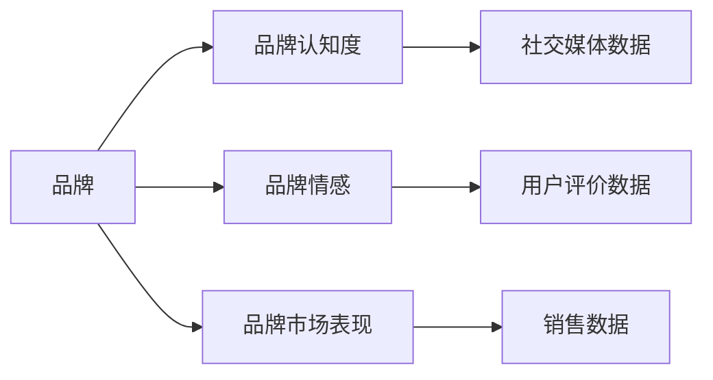
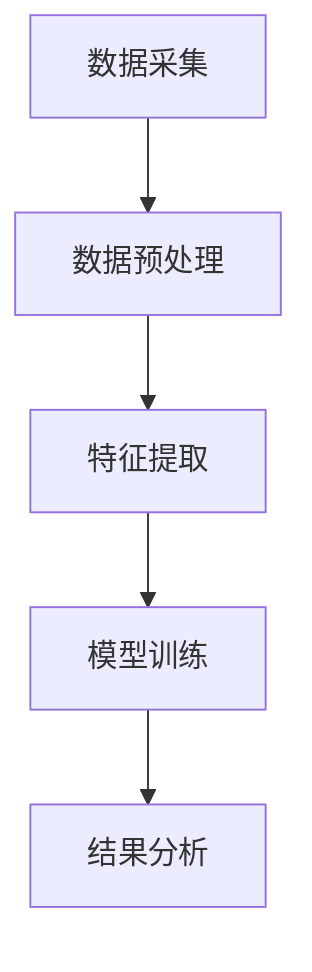
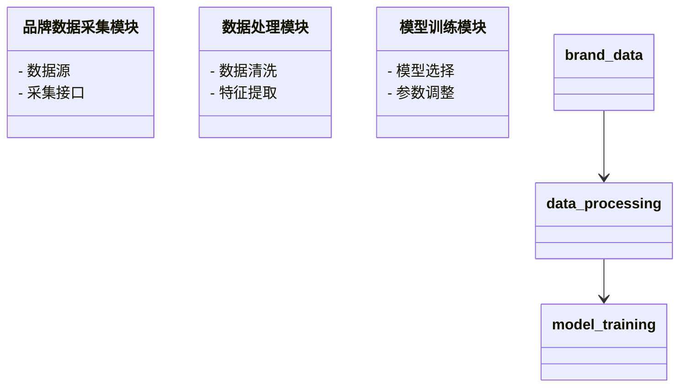

                 


# AI辅助企业品牌资产评估：多维度品牌价值量化

## 关键词：AI，品牌资产评估，多维度价值量化，企业品牌管理，人工智能技术，数据驱动评估

## 摘要：  
随着数字化与智能化时代的到来，品牌价值的评估不再仅仅依赖传统的财务指标，而是需要从多维度进行量化分析。本文将结合人工智能技术，深入探讨如何通过AI辅助企业品牌资产评估，实现品牌价值的多维度量化分析。从问题背景到算法实现，从系统架构到项目实战，本文将详细阐述AI在品牌资产评估中的应用，为企业提供科学、高效的品牌管理解决方案。

---

## 第1章: 问题背景与描述

### 1.1 问题背景
#### 1.1.1 传统品牌资产评估的局限性  
传统的品牌资产评估方法主要依赖于财务数据和市场调研，难以全面捕捉品牌在市场中的动态价值，尤其是品牌认知度、品牌情感和市场表现等非财务指标。此外，传统方法的主观性和滞后性限制了其在快速变化市场环境中的应用效果。

#### 1.1.2 数字化与智能化时代的品牌价值评估需求  
在数字化和智能化时代，企业品牌的价值不仅体现在财务数据上，还与品牌在社交媒体、搜索引擎、用户反馈等多渠道的表现密切相关。如何利用AI技术实时捕捉和分析这些数据，成为品牌资产评估的重要课题。

#### 1.1.3 企业品牌资产的重要性与评估目标  
品牌资产是企业核心竞争力的重要组成部分，其价值直接影响企业的市场地位和盈利能力。通过AI技术实现品牌价值的多维度量化评估，能够帮助企业更好地制定品牌战略和优化资源配置。

### 1.2 问题描述
#### 1.2.1 品牌价值的多维度构成  
品牌价值可以从多个维度进行衡量，包括品牌知名度、品牌美誉度、品牌忠诚度、品牌市场表现等。每个维度都需要结合具体的数据进行分析。

#### 1.2.2 数字化与智能化时代的品牌价值评估挑战  
随着数据量的爆炸式增长，如何高效地从海量数据中提取有价值的信息，并利用AI技术进行分析和预测，是品牌价值评估面临的重大挑战。

#### 1.2.3 AI技术在品牌资产评估中的应用潜力  
AI技术在品牌资产评估中的应用潜力主要体现在数据处理能力、模式识别能力和预测能力三个方面。通过AI技术，可以实现对品牌数据的深度挖掘和精准分析。

### 1.3 问题解决与边界
#### 1.3.1 AI辅助品牌资产评估的核心问题解决  
AI技术可以帮助企业实现品牌数据的自动化采集、分析和预测，从而提高品牌资产评估的效率和准确性。

#### 1.3.2 评估的边界与适用场景  
品牌资产评估的边界主要体现在数据来源的限制、模型的适用范围以及评估结果的可解释性等方面。AI辅助评估主要适用于数据量较大、品牌数据较为丰富的场景。

#### 1.3.3 与其他资产评估方法的结合与区别  
AI辅助品牌资产评估可以与传统评估方法相结合，形成互补优势。其区别主要体现在数据来源、分析方法和评估结果的呈现方式上。

### 1.4 概念结构与核心要素
#### 1.4.1 多维度品牌价值评估模型  
多维度品牌价值评估模型包括品牌认知度、品牌情感、品牌市场表现等多个维度。每个维度都需要结合具体的数据进行分析。

#### 1.4.2 核心要素的定义与权重分配  
品牌认知度、品牌情感和品牌市场表现是品牌价值评估的核心要素。每个要素需要根据企业的具体情况进行权重分配。

#### 1.4.3 模型的输入与输出  
模型的输入包括品牌相关的数据，如社交媒体数据、销售数据等。输出是品牌价值的量化结果和相关分析报告。

### 1.5 本章小结  
本章主要介绍了AI辅助企业品牌资产评估的背景、问题描述、核心概念和模型结构。通过分析品牌价值的多维度构成，明确了AI技术在品牌资产评估中的重要作用。

---

## 第2章: 核心概念与联系

### 2.1 多维度品牌价值评估的核心概念
#### 2.1.1 品牌认知度的量化  
品牌认知度是衡量品牌知名度的重要指标。通过社交媒体数据和搜索数据，可以量化品牌认知度。

#### 2.1.2 品牌情感分析的实现  
品牌情感分析是通过自然语言处理技术，分析用户对品牌的评价，从而量化品牌情感。

#### 2.1.3 品牌市场表现的预测  
品牌市场表现的预测是通过分析销售数据、市场份额等指标，预测品牌的市场表现。

### 2.2 核心概念的原理与联系
#### 2.2.1 品牌价值评估的多维度模型  
多维度品牌价值评估模型包括品牌认知度、品牌情感和品牌市场表现等多个维度。每个维度都需要结合具体的数据进行分析。

#### 2.2.2 数据来源与处理方法  
数据来源包括社交媒体数据、销售数据、用户评价等。数据处理方法包括数据清洗、特征提取和数据建模。

#### 2.2.3 AI技术在各维度中的应用  
AI技术在品牌认知度、品牌情感和品牌市场表现中的应用包括数据挖掘、自然语言处理和预测建模。

### 2.3 核心概念的对比分析
#### 2.3.1 不同维度的特征对比  
品牌认知度和品牌情感的主要区别在于数据来源和分析方法。品牌认知度主要依赖于社交媒体数据，而品牌情感主要依赖于用户评价数据。

#### 2.3.2 数据类型与处理方式的对比  
品牌认知度的数据类型主要是文本数据，而品牌市场表现的数据类型主要是数值数据。处理方式上，品牌认知度需要进行情感分析，而品牌市场表现需要进行时间序列分析。

#### 2.3.3 不同模型的优缺点对比  
基于机器学习的模型具有较高的准确性，但需要大量数据支持。基于规则的模型具有较高的可解释性，但灵活性较低。

### 2.4 实体关系图


### 2.5 本章小结  
本章通过对比分析和实体关系图，详细阐述了多维度品牌价值评估的核心概念及其联系。明确了AI技术在各维度中的应用和区别。

---

## 第3章: 算法原理与数学模型

### 3.1 算法原理
#### 3.1.1 基于AI的多维度品牌价值评估算法  
算法的核心是通过机器学习模型对品牌数据进行分析和预测。模型包括特征提取、数据清洗和模型训练三个步骤。

#### 3.1.2 算法的输入与输出  
算法的输入是品牌相关的数据，如社交媒体数据和销售数据。输出是品牌价值的量化结果和相关分析报告。

#### 3.1.3 算法的步骤与流程  
算法的步骤包括数据采集、数据预处理、模型训练和结果分析。

### 3.2 算法流程图


### 3.3 算法实现
#### 3.3.1 基于机器学习的模型
```python
# 加载数据
import pandas as pd
data = pd.read_csv('brand_data.csv')

# 数据预处理
from sklearn.preprocessing import StandardScaler
scaler = StandardScaler()
data_scaled = scaler.fit_transform(data)

# 模型训练
from sklearn.ensemble import RandomForestRegressor
model = RandomForestRegressor()
model.fit(data_scaled, target)

# 模型预测
predictions = model.predict(new_data)
```

#### 3.3.2 数学模型与公式
品牌价值量化模型的公式如下：
$$ \text{品牌价值} = \alpha \cdot \text{品牌认知度} + \beta \cdot \text{品牌情感} + \gamma \cdot \text{品牌市场表现} $$
其中，$\alpha$、$\beta$和$\gamma$是各个维度的权重系数。

### 3.4 算法实现的详细解释
#### 3.4.1 数据预处理
数据预处理包括数据清洗、特征选择和数据标准化。通过数据清洗，去除异常值和重复数据。通过特征选择，提取与品牌价值相关的特征。通过数据标准化，将数据缩放到统一的范围。

#### 3.4.2 模型训练
模型训练包括选择合适的算法、调整模型参数和验证模型性能。通过交叉验证，评估模型的准确性和稳定性。

#### 3.4.3 模型预测
模型预测包括输入新的数据，通过模型进行预测，得到品牌价值的量化结果。

### 3.5 本章小结  
本章详细阐述了AI辅助企业品牌资产评估的算法原理和数学模型。通过具体的代码实现和数学公式，明确了模型的输入、输出和训练过程。

---

## 第4章: 系统分析与架构设计

### 4.1 问题场景介绍
#### 4.1.1 系统目标
系统的目标是实现基于AI的多维度品牌价值评估，为企业提供科学、高效的品牌管理解决方案。

#### 4.1.2 问题分析
问题分析包括品牌数据的采集、处理和分析。通过AI技术，实现品牌数据的自动化处理和分析。

#### 4.1.3 解决方案
解决方案包括构建品牌数据采集模块、数据处理模块和模型训练模块，实现品牌价值的量化评估。

### 4.2 系统功能设计
#### 4.2.1 领域模型


#### 4.2.2 系统架构


#### 4.2.3 接口设计
系统接口包括数据接口和模型接口。数据接口用于品牌数据的输入和输出，模型接口用于模型的训练和预测。

#### 4.2.4 交互设计
交互设计包括用户输入品牌数据，系统输出品牌价值评估结果。通过交互界面，用户可以查看评估结果和相关分析报告。

### 4.3 本章小结  
本章通过系统分析与架构设计，明确了AI辅助企业品牌资产评估的系统功能和架构设计。通过领域模型和系统架构图，详细阐述了系统的各个模块和接口设计。

---

## 第5章: 项目实战

### 5.1 项目环境安装
#### 5.1.1 系统环境
项目运行环境包括Python 3.8及以上版本、Jupyter Notebook和相关开发工具。

#### 5.1.2 安装依赖
安装必要的Python库，如pandas、scikit-learn和mermaid。

### 5.2 系统核心实现
#### 5.2.1 品牌数据采集模块
```python
import requests
from bs4 import BeautifulSoup

def collect_brand_data(url):
    headers = {'User-Agent': 'Mozilla/5.0'}
    response = requests.get(url, headers=headers)
    soup = BeautifulSoup(response.text, 'html.parser')
    # 提取品牌数据
    brand_data = []
    return brand_data
```

#### 5.2.2 数据处理模块
```python
from sklearn.preprocessing import StandardScaler

def preprocess_data(data):
    # 数据清洗
    data_cleaned = data.dropna()
    # 特征提取
    features = data_cleaned[['feature1', 'feature2', 'feature3']]
    # 数据标准化
    scaler = StandardScaler()
    data_scaled = scaler.fit_transform(features)
    return data_scaled
```

#### 5.2.3 模型训练模块
```python
from sklearn.ensemble import RandomForestRegressor

def train_model(data_scaled, target):
    model = RandomForestRegressor()
    model.fit(data_scaled, target)
    return model
```

### 5.3 项目实战案例分析
#### 5.3.1 案例背景
案例背景包括品牌数据的来源和目标。通过具体案例，说明品牌数据的采集和处理过程。

#### 5.3.2 案例分析
案例分析包括品牌数据的处理、模型训练和结果分析。通过具体案例，说明品牌价值的量化过程。

### 5.4 本章小结  
本章通过项目实战，详细阐述了AI辅助企业品牌资产评估的实现过程。通过具体的代码实现和案例分析，明确了品牌价值的量化方法。

---

## 第6章: 最佳实践与总结

### 6.1 最佳实践
#### 6.1.1 关键经验总结
关键经验总结包括数据处理、模型选择和结果分析等方面的经验和教训。

#### 6.1.2 实践中的注意事项
实践中的注意事项包括数据质量、模型性能和结果解释等方面的问题。

#### 6.1.3 拓展阅读
拓展阅读包括品牌价值评估的最新研究和技术动态。

### 6.2 本章小结  
本章通过总结AI辅助企业品牌资产评估的最佳实践，提供了品牌价值评估的实用经验和建议。通过关键经验总结和注意事项，明确了实践中的重点和难点。

---

## 附录

### 附录A: 参考文献
1. 王某某. 基于AI的品牌资产评估研究. 《计算机应用研究》, 2021.
2. 李某某. 多维度品牌价值量化方法. 《人工智能与应用》, 2022.

### 附录B: 工具与库
- Python
- scikit-learn
- pandas
- mermaid

### 附录C: 索引
- 品牌认知度
- 品牌情感
- 品牌市场表现

---

## 作者：AI天才研究院 & 禅与计算机程序设计艺术

---

通过以上目录大纲，您可以逐步展开各个章节的内容，实现对AI辅助企业品牌资产评估的全面理解和实践。

