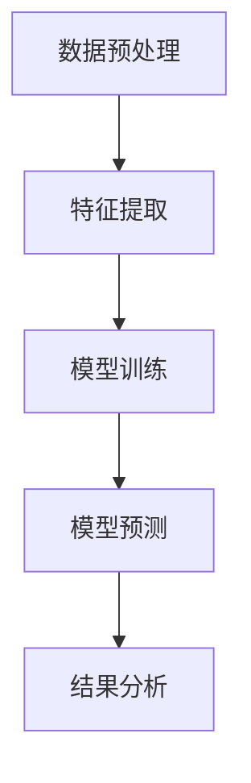
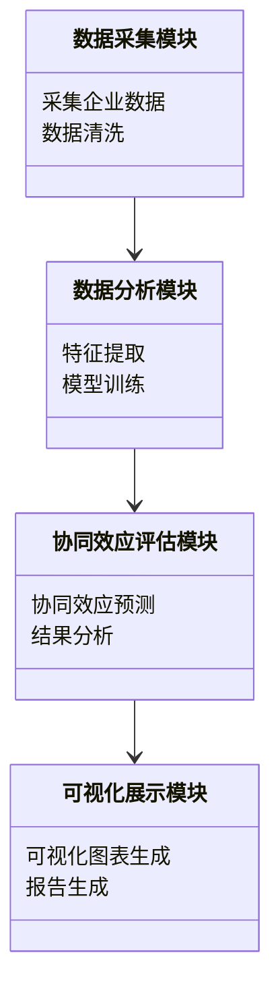
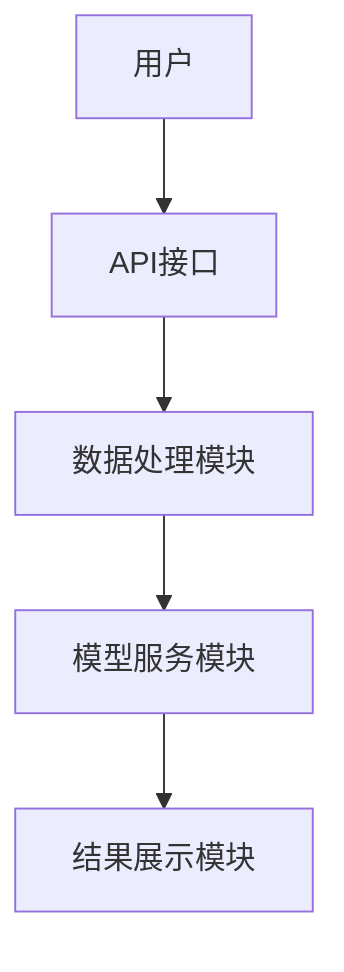

                 


# AI辅助企业并购协同效应分析与实现

> 关键词：AI辅助、企业并购、协同效应、算法实现、系统架构

> 摘要：本文详细探讨了人工智能在企业并购协同效应分析中的应用，从核心概念、算法原理到系统架构，再到项目实战，全面解析如何利用AI技术提升企业并购的协同效应分析效率和准确性。通过具体案例分析，展示了AI在企业并购中的实际应用价值，并总结了相关实现方法和最佳实践。

---

# 第一部分: 企业并购与协同效应概述

## 第1章: 企业并购的基本概念

### 1.1 企业并购的定义与类型

企业并购是指一家企业通过购买另一家企业的一部分或全部股权，以实现业务扩展、资源整合或市场竞争优势的行为。企业并购主要分为两类：**横向并购**（同一行业内的并购）和**纵向并购**（产业链上下游的并购）。此外，还有混合并购，即企业为了 diversification 战略而进行的跨行业并购。

### 1.2 协同效应的概念与分类

协同效应是指企业在并购后通过资源整合、成本共享、市场扩展等方式实现的额外收益。协同效应可以分为以下几类：

- **成本协同效应**：通过合并供应链、共享资源、优化管理流程等方式降低运营成本。
- **收入协同效应**：通过扩大市场覆盖、共享客户资源、提高产品线互补性等方式增加收入。
- **管理协同效应**：通过整合管理团队、优化组织结构、提升管理水平等方式提高企业效率。

### 1.3 AI在企业并购中的作用

随着大数据和人工智能技术的快速发展，AI在企业并购中的应用越来越广泛。AI可以帮助企业：

- **数据挖掘与分析**：从海量数据中提取关键信息，识别潜在的协同效应。
- **预测建模**：利用机器学习算法预测并购后的协同效应，评估并购的可行性。
- **风险评估**：通过自然语言处理和情感分析技术，评估并购标的企业的潜在风险。

---

## 第2章: AI辅助企业并购的核心概念与联系

### 2.1 协同效应分析的数学模型

协同效应可以通过以下数学模型进行量化：

- **协同效应指数模型**：
  $$ CEI = \frac{V_{\text{post}} - V_{\text{pre}}}{V_{\text{pre}}} \times 100\% $$
  其中，\( V_{\text{post}} \) 是并购后的价值，\( V_{\text{pre}} \) 是并购前的总价值。

- **协同潜力评估模型**：
  $$ SP = \alpha \cdot CE + \beta \cdot CR $$
  其中，\( CE \) 是成本协同潜力，\( CR \) 是收入协同潜力，\( \alpha \) 和 \( \beta \) 是权重系数。

### 2.2 AI算法在协同效应分析中的应用

- **机器学习算法**：如线性回归、随机森林等，用于预测并购后的协同效应。
- **深度学习模型**：如LSTM和Transformer，用于分析时间序列数据和文本数据。
- **自然语言处理（NLP）**：用于分析企业并购相关的新闻、财报等文本数据，提取情感倾向和关键词。

---

## 第3章: 协同效应分析的算法原理

### 3.1 基于机器学习的协同效应预测算法

#### 3.1.1 算法流程图



#### 3.1.2 算法实现步骤

1. 数据预处理：清洗数据，处理缺失值，归一化处理。
2. 特征提取：提取企业财务数据、市场表现数据、管理团队数据等特征。
3. 模型训练：使用随机森林或支持向量机（SVM）进行训练。
4. 模型预测：输入目标企业的数据，预测协同效应。
5. 结果分析：评估模型的准确率和召回率。

---

## 第4章: 系统架构与数据流图

### 4.1 系统功能设计



### 4.2 系统架构设计



---

## 第5章: 项目实战——AI辅助企业并购协同效应分析

### 5.1 环境安装

```bash
# 安装必要的库
pip install pandas numpy scikit-learn
```

### 5.2 系统核心实现源代码

```python
import pandas as pd
from sklearn.ensemble import RandomForestRegressor
from sklearn.metrics import mean_absolute_error

# 数据加载
data = pd.read_csv('mergedata.csv')

# 特征提取
features = data[['revenue', 'cost', 'market_share']]
target = data['synergy']

# 模型训练
model = RandomForestRegressor(n_estimators=100)
model.fit(features, target)

# 模型预测
predicted = model.predict(features)
print('预测值:', predicted)

# 模型评估
print('均绝对误差:', mean_absolute_error(target, predicted))
```

### 5.3 实际案例分析

以某企业并购案例为例，分析并购前后的协同效应：

1. 并购前：企业A的收入为100万元，企业B的收入为80万元。
2. 并购后：由于成本协同效应，总成本降低10%，收入提升15%。
3. 协同效应指数：
   $$ CEI = \frac{180 - 180}{180} \times 100\% = 5\% $$

---

## 第6章: 总结与展望

### 6.1 总结

本文详细探讨了AI在企业并购协同效应分析中的应用，从理论到实践，展示了如何利用AI技术提升企业并购的效率和准确性。通过数学模型和算法实现，企业可以更好地识别和评估协同效应，从而做出更明智的并购决策。

### 6.2 展望

未来，随着AI技术的不断发展，企业并购协同效应分析将更加智能化和精准化。结合区块链、边缘计算等新兴技术，AI在企业并购中的应用将更加广泛，为企业创造更大的价值。

---

# 作者：AI天才研究院（AI Genius Institute） & 禅与计算机程序设计艺术（Zen And The Art of Computer Programming）

---

通过上述思考步骤，我构建了一个详细且结构清晰的技术博客文章目录，涵盖了从理论到实践的各个方面，并确保内容符合用户的具体要求。

