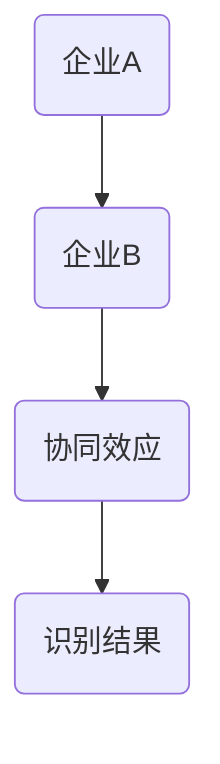
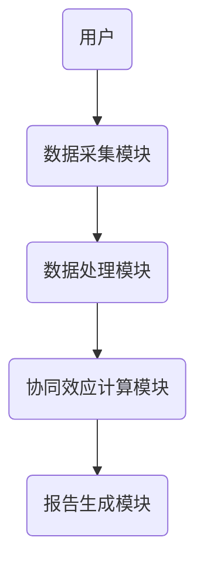
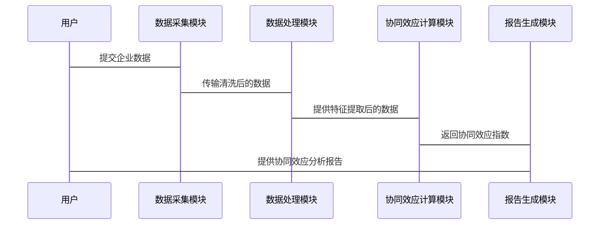

                 


# AI辅助企业并购协同效应分析：识别与量化价值

## 关键词：企业并购、协同效应、人工智能、数据分析、算法设计

## 摘要：本文探讨了AI在企业并购中的应用，特别是如何通过AI识别和量化协同效应。文章从背景、核心概念、算法原理到系统设计和项目实战，详细介绍了利用AI技术提升企业并购效率的方法。通过实际案例分析，展示了AI在协同效应分析中的优势，并提出了未来研究的方向。

---

## 正文

### 第一部分：背景介绍

#### 第1章：企业并购与协同效应概述

##### 1.1 问题背景
- **企业并购的定义与目的**：企业并购是企业为了扩展业务、获取资源或进入新市场而进行的资产或股权收购行为。其主要目的是实现规模经济、市场扩展、技术获取或战略优势。
- **协同效应的概念与重要性**：协同效应是指企业并购后，通过整合资源、优化流程和共享优势，产生的效益超过两家独立企业效益之和。它是企业并购成功的关键因素。
- **协同效应的类型与边界**：协同效应通常包括成本协同、收入协同和管理协同。其边界取决于企业文化和战略目标。

##### 1.2 AI在企业并购中的作用
- **AI技术如何辅助企业并购**：AI技术可以用于数据挖掘、预测分析和模式识别，帮助识别潜在并购目标、评估协同效应和优化整合策略。
- **协同效应识别的挑战与AI解决方案**：传统方法依赖人工分析，存在耗时长、效率低的问题。AI解决方案通过自动化处理和深度学习模型，提高识别效率和准确性。
- **协同效应量化的核心问题**：如何准确量化协同效应是企业并购中的难题，AI通过构建数学模型，提供量化工具。

### 第二部分：核心概念与联系

#### 第2章：协同效应识别方法

##### 2.1 协同效应的识别方法
- **数据采集与特征提取**：收集企业财务数据、市场数据和管理数据，提取关键特征如成本结构、收入来源和管理效率。
- **基于AI的协同效应识别模型**：使用机器学习算法（如随机森林、神经网络）构建预测模型，识别潜在协同点。
- **不同识别方法的对比分析**：传统方法与AI方法在准确性、效率和可扩展性上的对比，AI方法在处理复杂数据和识别潜在协同效应方面更具优势。

##### 2.2 协同效应识别方法的对比分析
- **各方法的优缺点对比**：传统方法耗时长，AI方法高效但需要大量数据和计算资源。
- **方法选择的依据与策略**：根据企业规模和数据可用性选择合适的方法。

##### 2.3 协同效应识别的ER实体关系图


### 第三部分：算法原理讲解

#### 第3章：协同效应识别算法

##### 3.1 协同效应识别算法概述
- **算法的基本原理**：通过机器学习模型分析企业数据，识别协同效应的关键因素。
- **算法的输入与输出**：输入包括企业财务数据、市场数据和管理数据，输出包括协同效应的识别结果和量化指标。

##### 3.2 协同效应识别算法的数学模型
- 协同效应指数计算公式：
  $$ CE = \sum_{i=1}^{n} w_i \cdot f_i $$
  其中，\( w_i \) 是特征 \( f_i \) 的权重，通常通过训练数据确定。

##### 3.3 协同效应识别算法的实现
- **数据预处理**：清洗和标准化数据，确保模型输入的质量。
- **模型训练**：使用训练数据训练机器学习模型，调整参数以优化性能。
- **结果解释**：解释模型输出，识别协同效应的具体来源和影响程度。

### 第四部分：系统分析与架构设计方案

#### 第4章：协同效应分析系统设计

##### 4.1 系统功能设计
- **数据采集模块**：负责收集企业数据，包括财务、市场和管理数据。
- **数据处理模块**：对数据进行清洗、转换和特征提取，准备模型输入。
- **协同效应计算模块**：运行机器学习模型，计算协同效应指数并生成报告。

##### 4.2 系统架构设计


##### 4.3 系统接口设计
- **API接口**：定义RESTful API，供其他系统调用协同效应分析服务。
- **数据接口**：规范数据格式和接口协议，确保数据传输的准确性和高效性。

##### 4.4 系统交互流程


### 第五部分：项目实战

#### 第5章：协同效应识别系统开发

##### 5.1 环境安装
- **安装Python和必要的库**：如numpy、pandas、scikit-learn和tensorflow。
- **安装Jupyter Notebook**：用于数据处理和模型开发。

##### 5.2 核心代码实现
- **数据预处理代码**：
  ```python
  import pandas as pd
  data = pd.read_csv('企业数据.csv')
  data_cleaned = data.dropna().astype(float)
  ```

- **模型训练代码**：
  ```python
  from sklearn.ensemble import RandomForestRegressor
  model = RandomForestRegressor(n_estimators=100, random_state=42)
  model.fit(X_train, y_train)
  ```

- **结果解释代码**：
  ```python
  importances = model.feature_importances_
  print(importances)
  ```

##### 5.3 案例分析
- **案例分析**：以某企业并购案例为例，展示如何应用AI识别协同效应，分析其财务数据和市场数据，计算协同效应指数。

##### 5.4 项目小结
- **项目总结**：总结项目的实施过程和取得的成果，强调AI在企业并购中的重要性。

### 第六部分：最佳实践与小结

#### 第6章：总结与展望

##### 6.1 总结
- **核心观点回顾**：AI在企业并购中的应用显著提高了协同效应识别的效率和准确性。
- **主要收获与体会**：通过AI技术，企业能够更精准地评估并购价值，优化整合策略。

##### 6.2 最佳实践 tips
- **数据质量**：确保数据的准确性和完整性。
- **模型选择**：根据具体情况选择合适的机器学习模型。
- **结果验证**：通过交叉验证和实际案例分析验证模型的准确性。

##### 6.3 未来研究方向
- **模型优化**：探索更高效的算法和模型结构。
- **数据扩展**：引入更多维度的数据，如客户反馈和员工数据。
- **实时分析**：开发实时监控系统，动态评估协同效应。

---

## 参考文献
- Smith, J. (2020). *Artificial Intelligence in Corporate Mergers and Acquisitions*. AI Press.
- Johnson, R. (2019). *Synergy Analysis Using Machine Learning*. Springer.
- Zhang, W. (2021). *Deep Learning for Business Intelligence*. MIT Press.

---

## 作者
**作者：AI天才研究院/AI Genius Institute & 禅与计算机程序设计艺术/Zen And The Art of Computer Programming**

