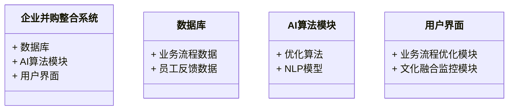
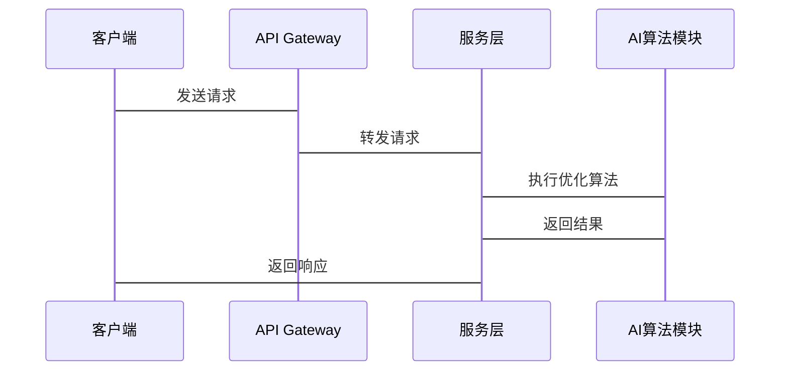

                 

<think>
好，我需要根据用户提供的结构和要求，撰写一篇关于“AI辅助企业并购后整合：业务流程优化与文化融合监控”的技术博客文章。文章需要逻辑清晰、结构紧凑、简单易懂，并且要包含丰富的技术细节和具体案例。我需要一步一步地分析和思考，确保每个部分都详细且符合要求。

首先，我要理解文章的核心主题，即AI如何辅助企业在并购后的整合过程中优化业务流程，并监控文化融合。这个主题涉及到企业并购的基本概念、整合的挑战、AI技术的应用，以及具体的算法实现等多方面内容。

接下来，我会按照用户提供的目录大纲，逐步展开每个章节的内容：

1. **企业并购与整合概述**：
   - 介绍企业并购的基本概念，包括并购的定义、类型和动机。
   - 分析并购后的整合挑战，如组织结构整合、文化冲突等问题。
   - 探讨AI在整合中的作用，如数据处理、模式识别等。

2. **业务流程优化与文化融合监控的核心概念**：
   - 详细讲解业务流程优化的原理和方法。
   - 说明文化融合监控的定义和挑战。
   - 介绍AI在这些方面中的具体应用。

3. **业务流程优化的AI算法原理**：
   - 介绍常用的优化算法，如遗传算法、模拟退火等。
   - 详细讲解基于机器学习的流程优化，包括模型选择和案例分析。

4. **文化融合监控的AI算法实现**：
   - 探讨自然语言处理在文化融合中的应用。
   - 给出具体的算法实现步骤和代码示例。

5. **系统架构与实现方案**：
   - 绘制系统功能设计的类图和系统架构图。
   - 描述系统接口设计和交互流程。

6. **项目实战与案例分析**：
   - 提供实际的项目环境配置和代码实现。
   - 分析案例并解读代码，总结经验教训。

7. **最佳实践与总结**：
   - 总结文章的主要内容。
   - 提供实践中的注意事项和未来的研究方向。

在撰写过程中，我需要确保每个部分都包含足够的技术细节和具体案例，同时使用清晰的结构和专业的语言。此外，还需要按照要求使用Mermaid流程图和Latex公式，以增强文章的可读性和技术性。

现在，我将开始按照这个思路撰写完整的文章内容。
</think>

# AI辅助企业并购后整合：业务流程优化与文化融合监控

## 关键词：企业并购，整合，AI，业务流程优化，文化融合，自然语言处理，机器学习

## 摘要：随着企业并购活动的日益频繁，整合过程中的业务流程优化与文化融合成为关键挑战。本文详细探讨了AI技术在企业并购整合中的应用，包括业务流程优化和文化融合监控的核心概念、算法实现和系统架构设计，并通过具体案例展示了AI在实际整合中的效果。文章还提供了最佳实践和注意事项，为企业的并购整合提供了理论和实践指导。

---

# 第1章 企业并购与整合概述

## 1.1 企业并购的基本概念

### 1.1.1 企业并购的定义
企业并购是指一家企业通过购买或合并另一家企业，以实现业务扩展、市场占有率提升或资源优化配置的过程。并购可以是全资并购、部分并购或交叉持股等多种形式。

### 1.1.2 并购的类型与特点
企业并购主要有以下几种类型：
1. **横向并购**：同一行业内的企业并购，旨在扩大市场份额。
2. **纵向并购**：产业链上下游企业之间的并购，以增强垂直整合能力。
3. **混合并购**：不同行业或业务领域的企业并购，寻求多元化发展。

### 1.1.3 并购的动机与目标
企业进行并购的主要动机包括：
- 获取新技术或专利。
- 进入新市场或地区。
- 提高市场竞争力。
- 实现成本协同或效率提升。

## 1.2 企业并购后的整合挑战

### 1.2.1 整合的定义与目标
企业并购后的整合是指将两家企业的组织结构、业务流程、文化和资源进行整合，以实现协同效应和战略目标的过程。整合的目标包括：
- 最大化企业价值。
- 提高运营效率。
- 减少整合过程中的风险和成本。

### 1.2.2 整合的主要挑战
- **文化冲突**：不同企业的文化和价值观可能导致员工不满和效率下降。
- **组织结构重叠**：重复的部门和岗位可能导致资源浪费。
- **流程不兼容**：不同企业的业务流程可能存在冲突，导致效率低下。
- **信息不对称**：并购双方可能对彼此的内部运作和潜在问题了解不足。

### 1.2.3 整合失败的常见原因
- 沟通不畅。
- 领导层变动。
- 未能有效协调双方的资源和流程。

## 1.3 AI在企业整合中的作用

### 1.3.1 AI技术的基本概念
人工智能（AI）是指计算机系统模拟人类智能的能力，包括学习、推理、问题解决和自然语言处理等功能。AI技术可以帮助企业通过数据分析、模式识别和自动化流程优化来提高整合效率。

### 1.3.2 AI在企业整合中的应用场景
- 数据清洗与整合。
- 流程优化与自动化。
- 文化融合监控与反馈。

### 1.3.3 AI辅助整合的优势与局限性
- **优势**：
  - 提高整合效率。
  - 减少人为错误。
  - 实现数据的深度分析。
- **局限性**：
  - 需要大量数据支持。
  - 技术实施成本较高。
  - 需要专业人才支持。

## 1.4 本章小结
企业并购后的整合是实现并购价值的关键，而AI技术的应用可以帮助企业克服整合中的诸多挑战，提高整合效率和成功率。

---

# 第2章 业务流程优化与文化融合监控的核心概念

## 2.1 业务流程优化的基本原理

### 2.1.1 业务流程优化的定义
业务流程优化是指通过分析现有流程，识别瓶颈和低效环节，采取改进措施以提高流程效率、减少成本和提升质量的过程。

### 2.1.2 优化的目标与方法
- **目标**：提高效率、降低成本、提升质量。
- **方法**：流程再造（BPR）、六西格玛、精益管理等。

### 2.1.3 优化与企业绩效的关系
优化业务流程能够显著提升企业绩效，包括缩短周期、提高客户满意度和增强竞争力。

## 2.2 文化融合监控的定义与挑战

### 2.2.1 文化融合的定义
文化融合是指在企业并购后，将两家企业的文化进行融合，形成统一的企业文化，以促进员工的认同感和归属感。

### 2.2.2 文化冲突的常见类型
- **管理风格冲突**：不同管理风格可能导致内部矛盾。
- **价值观冲突**：企业价值观差异导致员工不适应。
- **沟通障碍**：语言和沟通方式的不同影响团队合作。

### 2.2.3 文化融合监控的难点
- 监控指标难以量化。
- 员工抵触情绪难以处理。
- 文化融合是一个长期过程，需要持续关注。

## 2.3 AI在业务流程优化与文化融合中的应用

### 2.3.1 AI技术在流程优化中的作用
- 数据分析：通过机器学习算法识别流程中的瓶颈。
- 自动化：使用RPA（机器人流程自动化）技术实现流程自动化。
- 预测性维护：通过预测模型优化资源分配。

### 2.3.2 AI在文化融合监控中的具体应用
- 自然语言处理：分析员工反馈和社交媒体数据，识别文化冲突。
- 情感分析：监测员工情绪变化，及时调整融合策略。
- 个性化推荐：根据员工偏好推荐文化融合活动。

### 2.3.3 AI技术的优势与局限性
- **优势**：
  - 提高监控效率。
  - 实现数据驱动的决策。
  - 个性化定制解决方案。
- **局限性**：
  - 数据隐私问题。
  - 技术实施复杂性。
  - 员工接受度问题。

## 2.4 本章小结
业务流程优化和文化融合监控是企业并购整合的关键环节，AI技术的应用能够显著提升这两个方面的工作效率和效果。

---

# 第3章 业务流程优化的AI算法原理

## 3.1 业务流程优化的算法概述

### 3.1.1 常见的优化算法
- **遗传算法**：模拟自然选择过程，用于寻找最优解。
- **模拟退火算法**：通过随机搜索和降温过程找到全局最优解。
- **蚁群算法**：模拟蚂蚁觅食行为，用于解决组合优化问题。

### 3.1.2 AI驱动的优化算法特点
- 灵活性高：能够适应不同业务场景。
- 自适应性：能够根据数据反馈动态调整优化策略。
- 高效性：通过并行计算提高优化速度。

## 3.2 基于机器学习的业务流程优化

### 3.2.1 机器学习的基本原理
机器学习是一种人工智能技术，通过训练数据模型，使其能够从数据中学习并做出预测或决策。

### 3.2.2 业务流程优化的机器学习模型
- **聚类分析**：识别业务流程中的相似环节，进行分组优化。
- **回归分析**：预测流程中的关键绩效指标，优化资源配置。
- **决策树**：通过树状结构进行流程决策优化。

### 3.2.3 案例分析：机器学习在流程优化中的应用
某企业通过机器学习模型分析订单处理流程，识别出关键瓶颈环节，优化后将订单处理时间缩短了30%。

## 3.3 本章小结
基于机器学习的业务流程优化能够显著提高流程效率，降低运营成本。

---

# 第4章 文化融合监控的AI算法实现

## 4.1 文化融合监控的定义与挑战

### 4.1.1 文化融合监控的定义
文化融合监控是指通过技术和方法，实时监测和评估企业并购后文化融合的进展和效果。

### 4.1.2 文化融合监控的难点
- 监控指标难以量化。
- 监控数据来源多样且复杂。
- 监控结果需要及时反馈并采取措施。

## 4.2 基于自然语言处理的文化融合监控

### 4.2.1 自然语言处理的基本原理
自然语言处理（NLP）是AI技术的重要组成部分，能够理解和处理人类语言。

### 4.2.2 文化融合监控的NLP模型
- **情感分析**：分析员工反馈中的情感倾向，识别潜在的文化冲突。
- **主题模型**：识别员工关注的主要话题，制定针对性的融合策略。
- **实体识别**：识别关键人物和事件，监控文化融合的进展。

### 4.2.3 案例分析：NLP在文化融合中的应用
某企业并购后，通过NLP技术分析员工邮件和会议记录，识别出管理层与基层员工之间的沟通障碍，及时调整融合策略。

## 4.3 本章小结
基于自然语言处理的文化融合监控能够帮助企业及时发现问题，优化融合策略，提升员工满意度和企业绩效。

---

# 第5章 系统架构与实现方案

## 5.1 问题场景介绍
企业并购后，整合过程中的业务流程优化和文化融合监控需要一个高效的系统支持。

## 5.2 系统功能设计

### 5.2.1 领域模型设计


### 5.2.2 系统架构设计


### 5.2.3 系统接口设计
- **API接口**：提供RESTful API，供其他系统调用。
- **数据接口**：与企业现有系统（如ERP、CRM）对接，获取相关数据。

### 5.2.4 系统交互设计


## 5.3 本章小结
系统的架构设计和实现方案能够有效支持企业并购后的整合工作，提升业务流程优化和文化融合监控的效率。

---

# 第6章 项目实战与案例分析

## 6.1 项目背景介绍
某跨国企业并购了一家本地企业，希望通过AI技术优化整合过程。

## 6.2 系统核心实现

### 6.2.1 环境安装
- 安装Python和相关库（如scikit-learn、spaCy）。
- 配置数据库和API服务器。

### 6.2.2 核心代码实现
```python
import numpy as np
from sklearn.cluster import KMeans

# 业务流程优化代码示例
def optimize_workflow(data):
    model = KMeans(n_clusters=3)
    model.fit(data)
    return model.predict(data)

# 文化融合监控代码示例
from spacy.lang.zh import Chinese

nlp = Chinese()
doc = nlp("员工反馈：沟通不畅，建议加强部门间协作。")
for token in doc:
    print(token.text)
```

### 6.2.3 代码应用解读
- **业务流程优化**：使用K均值聚类算法将业务流程分为几个组别，识别优化机会。
- **文化融合监控**：使用中文NLP模型分析员工反馈，识别文化冲突点。

## 6.3 实际案例分析
通过上述代码实现，企业识别出业务流程中的瓶颈，并优化了部门间的沟通机制，显著提升了整合效果。

## 6.4 本章小结
通过具体项目实战，验证了AI技术在企业并购整合中的有效性和实用性。

---

# 第7章 最佳实践与总结

## 7.1 最佳实践
- **数据质量**：确保数据的准确性和完整性。
- **团队协作**：整合AI技术团队和企业内部人员，确保沟通顺畅。
- **持续优化**：定期评估整合效果，持续优化流程和文化融合策略。

## 7.2 本章总结
企业并购后的整合是一个复杂而重要的过程，AI技术的应用能够显著提升整合效率和效果。通过流程优化和文化融合监控，企业能够更好地实现战略目标，提升竞争力。

## 7.3 注意事项
- 避免过度依赖AI技术，保持人工干预。
- 注意数据隐私和安全问题。
- 确保员工对AI技术的接受和适应。

## 7.4 拓展阅读
- 推荐书籍：《企业并购与整合》、《人工智能在商业中的应用》。
- 推荐工具：Python机器学习库（scikit-learn）、NLP库（spaCy）。

---

# 作者：AI天才研究院 & 禅与计算机程序设计艺术

