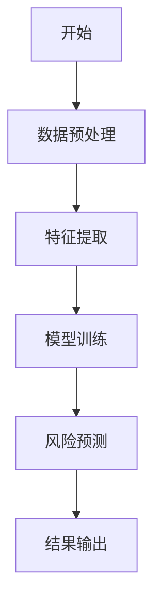

                 


# AI辅助企业并购尽职调查：自动化文档分析与风险识别

> 关键词：AI，企业并购，尽职调查，文档分析，风险识别，NLP，机器学习

> 摘要：本文探讨了AI技术在企业并购尽职调查中的应用，重点分析了基于自然语言处理和机器学习的文档自动化分析方法，以及如何通过知识图谱构建和风险评估模型实现高效的风险识别。文章详细介绍了AI辅助尽职调查的核心概念、算法原理、系统架构设计及实际应用场景，为企业并购中的风险管理和效率提升提供了新的思路。

---

## 第一部分：AI辅助企业并购尽职调查的背景与意义

### 第1章：企业并购尽职调查的背景与挑战

#### 1.1 企业并购的背景与重要性

##### 1.1.1 企业并购的基本概念
企业并购（Mergers and Acquisitions, M&A）是指两个或多个企业之间的合并或收购行为。并购是企业扩大规模、优化资源配置、增强竞争力的重要手段。

##### 1.1.2 并购过程中的核心问题
企业在并购过程中需要解决以下核心问题：
- **资产评估**：准确评估目标企业的资产价值。
- **风险识别**：发现潜在的法律、财务或经营风险。
- **信息整合**：整合目标企业的历史数据和业务信息。

##### 1.1.3 尽职调查在并购中的作用
尽职调查是企业并购过程中至关重要的一环，其目的是通过全面、深入的调查，评估目标企业的健康状况，识别潜在风险，为并购决策提供依据。

---

#### 1.2 尽职调查的传统模式与局限性

##### 1.2.1 传统尽职调查的流程
传统尽职调查通常包括以下几个步骤：
1. **初步调查**：收集目标企业的基本信息。
2. **详细调查**：对目标企业的财务、法律、税务等方面进行深入调查。
3. **风险评估**：根据调查结果，评估并购风险。

##### 1.2.2 传统模式中的效率问题
传统尽职调查模式存在以下效率问题：
- **人工工作量大**：需要大量的人力资源和时间。
- **主观性较强**：依赖调查人员的经验和判断。
- **信息更新不及时**：难以快速响应市场变化。

##### 1.2.3 人工分析的局限性
人工分析存在以下局限性：
- **易出错**：由于人为疏忽可能导致遗漏重要信息。
- **缺乏深度分析**：难以对海量数据进行深度挖掘和分析。

---

#### 1.3 AI技术在尽职调查中的应用潜力

##### 1.3.1 AI技术的基本概念
人工智能（AI）是模拟人类智能的计算机系统，能够通过数据学习、模式识别和决策优化来完成复杂任务。

##### 1.3.2 AI在文档分析中的优势
AI在文档分析中的优势包括：
- **自动化处理**：快速处理大量文档，提高效率。
- **精准识别**：通过自然语言处理技术准确提取关键信息。
- **持续学习**：能够根据新数据不断优化分析模型。

##### 1.3.3 AI在风险识别中的创新应用
AI在风险识别中的创新应用包括：
- **智能风险预警**：通过机器学习模型预测潜在风险。
- **关联分析**：利用知识图谱发现隐含的关联关系。

---

### 第2章：AI辅助尽职调查的核心概念与框架

#### 2.1 AI辅助尽职调查的基本框架

##### 2.1.1 框架的整体结构
AI辅助尽职调查的基本框架包括以下几个模块：
1. **文档管理模块**：负责文档的存储、分类和检索。
2. **信息抽取模块**：通过自然语言处理技术提取关键信息。
3. **风险评估模块**：基于机器学习模型评估潜在风险。
4. **知识图谱模块**：构建企业知识图谱，支持关联分析。

##### 2.1.2 各模块的功能与作用
- **文档管理模块**：确保文档的高效管理和快速检索。
- **信息抽取模块**：准确提取文档中的关键信息。
- **风险评估模块**：量化风险，为决策提供支持。
- **知识图谱模块**：发现隐含关系，提高分析深度。

---

#### 2.2 关键技术与核心概念

##### 2.2.1 自然语言处理（NLP）
自然语言处理（NLP）是AI技术的重要组成部分，用于理解和处理人类语言。在尽职调查中，NLP技术可以用于：
- **文本分类**：将文档按照主题分类。
- **实体识别**：识别文档中的关键实体（如公司名称、金额等）。
- **语义分析**：理解文本的深层含义。

##### 2.2.2 机器学习与风险评估
机器学习是AI的核心技术，广泛应用于风险评估。通过机器学习模型，可以：
- **预测风险**：基于历史数据预测潜在风险。
- **分类风险**：将风险分为高、中、低三类。
- **优化模型**：通过反馈不断优化模型性能。

##### 2.2.3 知识图谱与关联分析
知识图谱是一种结构化的知识表示方法，能够将分散的信息整合成一张网络。通过关联分析，可以发现文档之间的隐含关系，提高分析的深度。

---

#### 2.3 核心概念的属性对比与ER图

##### 2.3.1 核心概念属性对比表
| 概念       | 属性                   | 描述                         |
|------------|------------------------|------------------------------|
| 文档       | 类型                   | 合同、财务报表、法律文件等   |
| 实体       | 类型                   | 公司名称、金额、时间等       |
| 风险       | 类型                   | 财务风险、法律风险、经营风险等 |
| 关联关系   | 类型                   | 文档包含实体，实体之间存在关联 |

##### 2.3.2 ER实体关系图
```mermaid
er
    actor: 投资者
    document: 并购文档
    entity: 关键实体
    risk: 风险点
    relation: 关联关系
    actor --> document: 提交
    document --> entity: 包含
    entity --> risk: 引发
    risk --> relation: 关联
```

---

## 第二部分：AI辅助尽职调查的算法原理

### 第3章：AI辅助尽职调查的算法原理

#### 3.1 自然语言处理（NLP）算法

##### 3.1.1 基于BERT的文本表示
BERT（Bidirectional Encoder Representations from Transformers）是一种预训练语言模型，能够生成高质量的文本表示。在文档分析中，BERT可以用于：
- **文本摘要**：提取文档的核心内容。
- **语义相似度计算**：判断文档之间的相似性。

##### 3.1.2 实体识别（NER）流程
实体识别（Named Entity Recognition, NER）是NLP中的一个重要任务，用于识别文本中的命名实体。NER流程包括：
1. **分词**：将文本分割成词语。
2. **标注**：为每个词语标注实体类型（如人名、地名、组织名等）。
3. **识别**：基于标注结果，识别出所有命名实体。

##### 3.1.3 文本分类与主题建模
文本分类是将文本按类别进行划分的过程。在尽职调查中，文本分类可以用于：
- **文档分类**：将文档按照主题分类。
- **主题建模**：发现文档中的潜在主题。

---

#### 3.2 风险评估的机器学习模型

##### 3.2.1 数据预处理与特征提取
数据预处理包括：
- **清洗数据**：去除噪声数据。
- **特征提取**：提取文本中的关键词和短语。

##### 3.2.2 基于XGBoost的风险分类
XGBoost（Extreme Gradient Boosting）是一种高效的梯度提升算法，常用于分类和回归问题。在风险分类中，XGBoost可以用于：
- **分类预测**：预测文档中的潜在风险。
- **特征重要性分析**：找出影响风险的关键因素。

##### 3.2.3 模型调优与评估指标
模型调优包括：
- **参数优化**：调整模型参数以提高性能。
- **交叉验证**：通过交叉验证评估模型的泛化能力。

---

#### 3.3 算法流程图


---

## 第三部分：系统架构与设计

### 第4章：系统架构与设计

#### 4.1 系统功能模块设计

##### 4.1.1 文档管理模块
文档管理模块负责文档的存储、分类和检索。其功能包括：
- **文档上传**：支持多种格式的文档上传。
- **文档分类**：根据文档内容自动分类。
- **文档检索**：支持关键词检索和分类检索。

##### 4.1.2 信息抽取模块
信息抽取模块基于NLP技术，从文档中提取关键信息。其功能包括：
- **实体识别**：识别文档中的命名实体。
- **信息提取**：提取文档中的关键信息（如金额、时间等）。

##### 4.1.3 风险评估模块
风险评估模块基于机器学习模型，对文档进行风险评估。其功能包括：
- **风险分类**：将文档中的风险分为高、中、低三类。
- **风险预警**：根据风险等级发出预警。

---

#### 4.2 系统架构设计

##### 4.2.1 问题场景介绍
在企业并购过程中，目标企业可能涉及大量的文档，包括合同、财务报表、法律文件等。传统的人工分析效率低、成本高，且容易出错。

##### 4.2.2 系统功能设计
系统功能设计包括：
1. **文档管理**：支持文档的上传、存储和检索。
2. **信息抽取**：基于NLP技术提取关键信息。
3. **风险评估**：基于机器学习模型评估潜在风险。

##### 4.2.3 系统架构图


---

## 第四部分：项目实战

### 第5章：项目实战

#### 5.1 环境安装

##### 5.1.1 安装Python
```bash
# 安装Python
sudo apt-get install python3 python3-dev
```

##### 5.1.2 安装NLP库
```bash
pip install transformers
pip install spacy
```

#### 5.2 系统核心实现

##### 5.2.1 文档预处理代码
```python
import spacy

nlp = spacy.load("en_core_web_sm")

def preprocess(document):
    doc = nlp(document)
    return [token.text for token in doc]
```

##### 5.2.2 风险分类代码
```python
import xgboost

def train_model(X, y):
    model = xgboost.XGBClassifier()
    model.fit(X, y)
    return model
```

#### 5.3 实际案例分析

##### 5.3.1 案例背景
某企业计划并购一家科技公司，需要对目标公司的财务报表、合同和法律文件进行分析。

##### 5.3.2 分析过程
1. **文档上传**：将目标公司的文档上传至系统。
2. **信息抽取**：提取关键信息（如财务数据、合同条款）。
3. **风险评估**：基于机器学习模型评估潜在风险。

---

## 第五部分：最佳实践与总结

### 第6章：最佳实践与总结

#### 6.1 小结
通过AI技术，企业并购的尽职调查可以实现自动化和智能化，显著提高效率和准确性。

#### 6.2 注意事项
- **数据隐私**：确保数据的安全性和隐私性。
- **模型优化**：不断优化模型以提高准确性。

#### 6.3 拓展阅读
- **书籍推荐**：《Python机器学习实战》。
- **技术博客**：[Towards Data Science](https://towardsdatascience.com/)

---

## 作者：AI天才研究院/AI Genius Institute & 禅与计算机程序设计艺术 /Zen And The Art of Computer Programming

---

**感谢您的阅读！如需进一步探讨或合作，请随时联系！**

