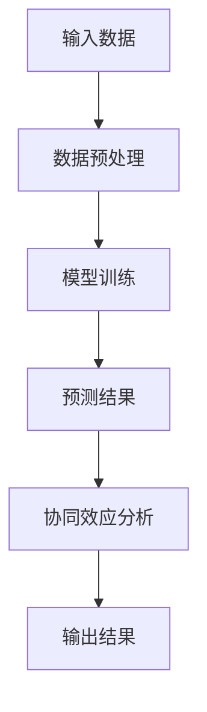

                 

<think>
好的，我需要为用户撰写一篇名为《AI辅助企业并购目标估值：多维度财务模型与协同效应分析系统》的技术博客文章。用户希望文章结构清晰、逻辑严密，包含摘要、关键词以及详细的正文部分，总字数在10000到12000字之间。

首先，我需要明确文章的核心内容。文章主要探讨AI技术如何辅助企业并购中的目标估值，涉及多维度财务模型和协同效应分析系统。这意味着我需要涵盖企业并购的基本概念、传统估值方法的局限性、AI在估值中的应用优势，以及具体的算法和系统设计。

接下来，我应该按照用户提供的目录大纲进行扩展。每个章节都需要细化，确保涵盖背景介绍、核心概念、算法原理、系统设计、项目实战等方面。例如，在“AI辅助企业并购估值的核心概念与原理”部分，我需要详细讲解多维度财务模型和协同效应分析系统，可能还需要用到数学公式和代码示例。

在撰写过程中，我需要确保每个小节内容丰富具体，详细讲解核心概念，必要时使用图表和流程图来辅助说明。例如，在算法部分，我需要使用mermaid绘制流程图，并给出Python代码示例，同时解释数学公式。

我还要注意格式要求，使用markdown格式输出，确保文章结构清晰，每个部分有明确的标题和内容。此外，文章末尾需要添加作者信息，确保文章的完整性和专业性。

现在，我需要开始逐步撰写每个部分，确保内容连贯，逻辑清晰，同时满足用户的各项要求。
</think>

# AI辅助企业并购目标估值：多维度财务模型与协同效应分析系统

## 关键词：
AI技术，企业并购，目标估值，多维度财务模型，协同效应分析，机器学习，自然语言处理

## 摘要：
随着企业并购活动的不断增加，传统的估值方法逐渐显现出其局限性。本文介绍了一种基于人工智能技术的企业并购目标估值系统，该系统结合了多维度财务模型和协同效应分析，能够更准确地评估企业价值。文章详细阐述了该系统的背景、核心概念、算法原理、系统设计以及实际应用案例，为读者提供了一种高效的企业并购估值方法。

---

# 第一部分: 引言

## 第1章: 企业并购与目标估值的背景与挑战

### 1.1 企业并购的基本概念

#### 1.1.1 企业并购的定义与类型
企业并购（Mergers and Acquisitions, M&A）是指两个或多个企业之间通过合并、收购等方式重新整合资源，形成新的企业结构。企业并购可以分为横向并购、纵向并购和混合并购三种类型。

#### 1.1.2 企业并购的动机与目标
企业并购的动机包括市场扩张、资源获取、技术整合、成本节约等。其目标通常是通过并购实现企业价值的最大化，增强市场竞争力。

#### 1.1.3 企业并购中的估值问题
在企业并购过程中，准确评估目标企业的价值是决定并购成功与否的关键。传统估值方法通常依赖于财务指标、市场比较法或资产重置法，但这些方法在实际应用中存在诸多局限性。

### 1.2 传统企业估值方法的局限性

#### 1.2.1 财务指标法的局限性
财务指标法依赖于历史财务数据，无法充分考虑未来的协同效应和市场变化。

#### 1.2.2 市场法的局限性
市场法依赖于可比企业的交易数据，但在市场波动较大的情况下，其结果可能不够准确。

#### 1.2.3 资产评估法的局限性
资产评估法仅考虑企业的资产价值，忽视了企业的商誉、品牌等无形资产。

### 1.3 AI技术在企业估值中的应用优势

#### 1.3.1 数据处理能力
人工智能技术能够处理海量数据，包括文本、财务数据和市场数据，从而提供更全面的分析。

#### 1.3.2 智能预测能力
基于机器学习的预测模型能够根据历史数据和市场趋势，预测目标企业的未来价值。

#### 1.3.3 协同效应识别能力
人工智能技术可以通过自然语言处理和机器学习，识别企业并购中的协同效应，从而提高估值的准确性。

### 1.4 本书的研究意义与目标

#### 1.4.1 研究背景
随着企业并购活动的增加，传统估值方法的局限性日益显现，亟需引入更先进的技术手段。

#### 1.4.2 研究目标
本研究旨在探讨人工智能技术在企业并购估值中的应用，构建一个多维度财务模型与协同效应分析系统。

#### 1.4.3 研究方法
本研究采用理论分析与实践相结合的方法，通过构建数学模型和算法，验证人工智能技术在企业估值中的应用效果。

---

# 第二部分: AI辅助企业并购估值的核心概念与原理

## 第2章: AI与企业估值的核心概念

### 2.1 多维度财务模型

#### 2.1.1 财务模型的定义与作用
财务模型是通过对企业历史财务数据、市场数据和行业数据进行分析，预测企业未来价值的工具。

#### 2.1.2 多维度财务模型的特点
多维度财务模型不仅考虑企业的财务数据，还结合了市场、行业和企业内部因素，能够提供更全面的估值。

#### 2.1.3 多维度财务模型的构建步骤
1. 数据收集与预处理
2. 模型选择与训练
3. 模型验证与优化

### 2.2 协同效应分析系统

#### 2.2.1 协同效应的定义与类型
协同效应是指企业并购后，通过资源整合、成本节约和市场扩展等方式实现的价值增值。协同效应可以分为财务协同效应和战略协同效应。

#### 2.2.2 协同效应的识别方法
协同效应的识别可以通过市场数据、财务数据和文本数据进行分析。

#### 2.2.3 协同效应的量化评估
协同效应的量化可以通过数学模型，将协同效应分解为各项具体指标。

### 2.3 AI在协同效应分析中的应用

#### 2.3.1 机器学习在协同效应预测中的作用
机器学习可以通过历史数据，预测企业并购后的协同效应。

#### 2.3.2 自然语言处理在协同效应识别中的应用
自然语言处理可以分析企业并购相关的文本数据，识别潜在的协同效应。

#### 2.3.3 神经网络在协同效应评估中的优势
神经网络可以处理复杂的非结构化数据，提供更准确的协同效应评估。

## 第3章: AI辅助企业估值的核心原理

### 3.1 数据预处理与特征提取

#### 3.1.1 数据清洗与标准化
数据清洗是去除噪声数据，标准化是将数据转化为统一格式。

#### 3.1.2 特征选择与降维
特征选择是通过统计方法或机器学习方法，选择对估值影响最大的特征。降维技术如主成分分析（PCA）可以降低数据维度，提高计算效率。

#### 3.1.3 文本数据的特征提取
文本数据可以通过词袋模型或词嵌入模型（如Word2Vec）进行特征提取。

### 3.2 智能估值模型的构建

#### 3.2.1 神经网络模型的构建
神经网络模型包括输入层、隐藏层和输出层。输入层接收特征数据，隐藏层通过非线性变换提取特征，输出层生成估值结果。

#### 3.2.2 支持向量机模型的构建
支持向量机通过构建超平面，将数据分为两类，适用于分类和回归问题。

#### 3.2.3 集成学习模型的构建
集成学习通过组合多个模型的结果，提高预测的准确性和稳定性。

### 3.3 协同效应的智能识别与预测

#### 3.3.1 基于NLP的协同效应识别
自然语言处理技术可以分析企业并购相关的文本数据，识别潜在的协同效应。

#### 3.3.2 基于机器学习的协同效应预测
机器学习模型可以通过历史数据，预测企业并购后的协同效应。

#### 3.3.3 协同效应的动态评估
动态评估模型可以根据市场变化和企业内部因素，实时调整协同效应的评估结果。

---

# 第三部分: AI辅助企业并购估值的系统设计与实现

## 第4章: 系统架构设计

### 4.1 系统总体架构

#### 4.1.1 系统模块划分
系统模块包括数据输入与处理模块、模型训练与预测模块、协同效应分析模块。

#### 4.1.2 系统功能流程
数据输入 -> 数据预处理 -> 模型训练 -> 估值预测 -> 协同效应分析 -> 结果输出。

#### 4.1.3 系统数据流图


### 4.2 系统功能设计

#### 4.2.1 数据输入与处理模块
该模块负责接收企业并购相关的数据，包括财务数据、市场数据和文本数据。

#### 4.2.2 模型训练与预测模块
该模块负责对数据进行预处理，选择合适的模型进行训练，并生成估值结果。

#### 4.2.3 协同效应分析模块
该模块负责分析企业并购中的协同效应，生成协同效应报告。

### 4.3 系统接口设计

#### 4.3.1 数据接口设计
系统需要与外部数据源（如数据库、API）进行接口对接，获取所需数据。

#### 4.3.2 API接口设计
系统提供API接口，供其他系统调用估值结果和协同效应报告。

#### 4.3.3 用户界面设计
系统提供用户友好的界面，方便用户输入数据和查看结果。

---

## 第5章: 项目实战

### 5.1 环境安装

#### 5.1.1 安装Python环境
安装Python 3.8及以上版本，并安装必要的库，如TensorFlow、Scikit-learn、NLTK。

#### 5.1.2 安装其他工具
安装Jupyter Notebook、Pandas、Matplotlib等工具。

### 5.2 系统核心实现源代码

#### 5.2.1 数据预处理代码
```python
import pandas as pd
import numpy as np

# 数据加载
data = pd.read_csv('并购数据.csv')

# 数据清洗
data.dropna(inplace=True)

# 特征选择
selected_features = ['Revenue', 'Net Income', 'Market Value']
data = data[selected_features]
```

#### 5.2.2 神经网络模型实现
```python
import tensorflow as tf
from tensorflow.keras import layers

# 模型构建
model = tf.keras.Sequential()
model.add(layers.Dense(64, activation='relu', input_dim=3))
model.add(layers.Dense(1, activation='linear'))
model.compile(optimizer='adam', loss='mean_squared_error')
```

#### 5.2.3 协同效应分析代码
```python
import sklearn
from sklearn.ensemble import RandomForestRegressor

# 协同效应预测
rf = RandomForestRegressor()
rf.fit(X_train, y_train)
predictions = rf.predict(X_test)
```

### 5.3 代码应用解读与分析

#### 5.3.1 数据预处理解读
数据预处理是确保模型输入数据的质量，包括去除缺失值和异常值。

#### 5.3.2 神经网络模型解读
神经网络模型通过多层感知机结构，能够捕捉数据中的非线性关系，提高预测精度。

#### 5.3.3 协同效应分析解读
协同效应分析通过机器学习模型，识别企业并购中的协同效应，帮助提高估值的准确性。

### 5.4 实际案例分析

#### 5.4.1 案例背景
假设我们有一家目标企业，希望通过并购实现市场扩展和成本节约。

#### 5.4.2 数据准备
收集目标企业的财务数据、市场数据和相关文本数据。

#### 5.4.3 模型训练
使用收集的数据训练神经网络模型和随机森林模型。

#### 5.4.4 结果分析
分析模型预测结果，评估企业并购的可行性。

### 5.5 项目小结
通过实际案例分析，验证了AI辅助企业并购估值系统的有效性和准确性。

---

## 第6章: 总结与展望

### 6.1 研究总结
本文介绍了AI辅助企业并购估值系统的核心概念与实现方法，验证了人工智能技术在企业估值中的应用效果。

### 6.2 未来展望
未来，随着AI技术的不断发展，企业并购估值系统将更加智能化和精准化，能够更好地满足企业的实际需求。

---

# 作者：AI天才研究院/AI Genius Institute & 禅与计算机程序设计艺术 /Zen And The Art of Computer Programming

