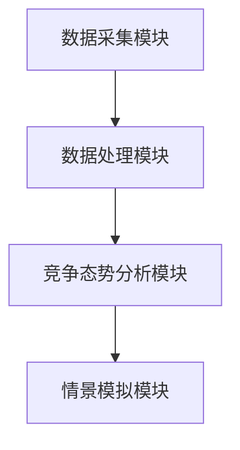
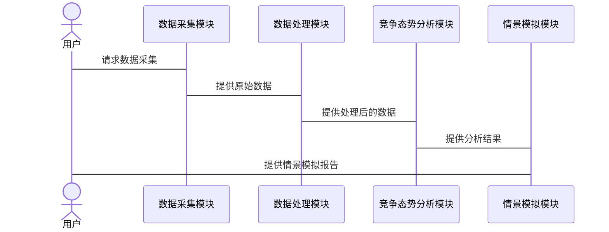

                 


# AI辅助企业战略制定：竞争态势分析与未来情景模拟

**关键词：** AI，企业战略，竞争态势分析，未来情景模拟，机器学习，数据分析

**摘要：**  
本文探讨了如何利用人工智能技术辅助企业制定战略，特别是在竞争态势分析和未来情景模拟方面。通过分析AI技术在企业战略中的应用，本文详细阐述了竞争态势分析的核心概念、算法原理以及未来情景模拟的实现方法。同时，本文还结合实际案例，展示了AI如何通过数据分析和预测模型帮助企业制定更科学、更有效的战略决策。

---

## 第一部分：AI辅助企业战略制定的背景与核心概念

### 第1章：AI辅助企业战略制定的背景

#### 1.1 AI技术与企业战略的结合
##### 1.1.1 AI技术的发展与企业需求的契合
人工智能（AI）技术的快速发展为企业战略制定带来了新的可能性。随着大数据、机器学习和自然语言处理技术的进步，企业能够从海量数据中提取有价值的信息，为战略决策提供更精准的支持。AI不仅能够处理复杂的数据分析任务，还能通过预测模型模拟未来趋势，帮助企业更好地应对市场变化。

##### 1.1.2 企业战略制定的传统方法与局限性
传统的战略制定方法通常依赖于经验丰富的管理人员和市场调研数据。这种方法虽然有一定的参考价值，但也存在许多局限性，例如数据采集成本高、分析效率低、预测准确性不足等。尤其是在面对快速变化的市场环境时，传统方法难以及时捕捉到潜在的市场机会和威胁。

##### 1.1.3 AI技术对企业战略制定的变革作用
AI技术的引入彻底改变了企业战略制定的方式。通过机器学习算法，企业可以快速处理和分析大量数据，发现潜在的市场趋势和竞争对手的动向。AI还可以通过模拟不同情景，帮助企业制定更具前瞻性的战略方案。这种方法不仅提高了战略制定的效率，还显著提升了决策的准确性。

#### 1.2 问题背景与问题描述
##### 1.2.1 企业战略制定中的关键问题
企业在制定战略时，通常面临以下关键问题：
1. 如何准确分析市场环境和竞争对手的动态？
2. 如何预测未来市场趋势并制定应对策略？
3. 如何在复杂多变的市场环境中快速调整战略？

##### 1.2.2 竞争态势分析的核心挑战
竞争态势分析是企业战略制定的重要组成部分，但其实现面临以下挑战：
1. 数据来源多样且复杂，难以统一处理。
2. 竞争对手的行为难以预测，分析模型需要高度动态化。
3. 分析结果的可解释性较低，影响决策的透明度。

##### 1.2.3 未来情景模拟的复杂性与不确定性
未来情景模拟的核心在于预测不同情景下的市场表现，但其实现面临以下挑战：
1. 市场环境的不确定性导致情景模拟的复杂性。
2. 数据不足或不准确会影响模拟结果的可靠性。
3. 情景模拟的动态调整需要高效的算法支持。

#### 1.3 AI辅助战略制定的解决方案
##### 1.3.1 数据驱动的决策支持
通过AI技术，企业可以利用大数据分析和机器学习算法，从海量数据中提取有价值的信息，为战略决策提供数据支持。

##### 1.3.2 智能化竞争态势分析方法
AI技术可以通过自然语言处理和机器学习算法，自动分析竞争对手的行为模式和市场动态，帮助企业在竞争中占据优势。

##### 1.3.3 多情景模拟与优化策略
通过AI的预测模型，企业可以模拟不同情景下的市场表现，并根据模拟结果优化战略方案，制定更具前瞻性的决策。

#### 1.4 本章小结
本章介绍了AI技术在企业战略制定中的重要性，分析了传统方法的局限性，并提出了AI辅助战略制定的解决方案。这些方法和技术为企业在复杂多变的市场环境中制定更科学、更有效的战略提供了有力支持。

---

## 第2章：竞争态势分析的核心概念

### 2.1 竞争态势分析的定义与框架
#### 2.1.1 竞争态势的多维度分析
竞争态势分析是一种综合分析市场环境和竞争对手行为的方法，通常从以下几个维度进行：
1. 市场结构：包括行业集中度、市场进入壁垒等。
2. 竞争对手分析：包括竞争对手的市场份额、产品定位、竞争优势等。
3. 企业自身能力：包括企业的资源、能力和核心竞争力。

#### 2.1.2 竞争态势分析的常用方法
常用的竞争态势分析方法包括：
1. SWOT分析：分析企业的优势、劣势、机会和威胁。
2. 波特五力分析：分析行业内竞争的五种力量（新进入者威胁、替代品威胁、买方议价能力、供应商议价能力和行业内竞争程度）。
3. 战略集团分析：将竞争对手分为不同的战略集团，分析其战略定位和行为模式。

#### 2.1.3 竞争态势分析的AI实现路径
AI技术可以通过以下路径实现竞争态势分析：
1. 数据采集：收集竞争对手的产品、价格、市场份额等数据。
2. 数据处理：利用自然语言处理技术分析竞争对手的公开信息（如新闻、财报）。
3. 数据建模：构建机器学习模型，预测竞争对手的行为模式和市场趋势。

### 2.2 竞争态势分析的关键要素
#### 2.2.1 行业环境分析
行业环境分析是竞争态势分析的基础，主要包括以下内容：
1. 行业生命周期：分析行业所处的发展阶段（导入期、成长期、成熟期、衰退期）。
2. 市场规模：分析行业的市场规模和增长潜力。
3. 市场结构：分析行业内的竞争格局和市场集中度。

#### 2.2.2 竞争对手分析
竞争对手分析是竞争态势分析的核心，主要包括以下内容：
1. 竞争对手的市场份额：分析竞争对手在市场中的份额占比。
2. 竞争对手的产品策略：分析竞争对手的产品定位、价格策略和产品创新。
3. 竞争对手的营销策略：分析竞争对手的广告投放、品牌建设等营销活动。

#### 2.2.3 企业自身能力评估
企业自身能力评估是竞争态势分析的重要组成部分，主要包括以下内容：
1. 资源评估：分析企业的资金、技术、人才等资源情况。
2. 能力评估：分析企业的研发能力、生产能力、营销能力等。
3. 核心竞争力：分析企业的核心竞争优势和独特价值主张。

### 2.3 竞争态势分析的AI模型构建
#### 2.3.1 数据收集与特征提取
竞争态势分析需要收集大量的数据，包括竞争对手的产品信息、市场数据、行业报告等。数据特征提取是构建AI模型的关键步骤，主要包括：
1. 文本数据处理：利用自然语言处理技术提取竞争对手的新闻、财报中的关键词和情感倾向。
2. 结构化数据处理：将非结构化数据转化为结构化数据，便于机器学习模型处理。

#### 2.3.2 竞争态势分析的算法选择
根据分析目标的不同，可以选择不同的算法：
1. 分类算法：用于预测竞争对手的市场行为（如是否会进入某个市场）。
2. 聚类算法：用于将竞争对手分为不同的战略集团。
3. 回归算法：用于预测竞争对手的市场份额变化。

#### 2.3.3 模型训练与优化
模型训练需要选择合适的特征和评估指标，并通过交叉验证等方法优化模型性能。常见的模型优化方法包括：
1. 参数调优：通过网格搜索等方法找到最佳模型参数。
2. 模型集成：通过集成学习（如随机森林、梯度提升树）提升模型的预测能力。

---

## 第3章：未来情景模拟的核心原理

### 3.1 未来情景模拟的定义与目标
#### 3.1.1 未来情景模拟的范围与边界
未来情景模拟是一种通过构建不同市场情景，预测企业在未来可能面临的挑战和机会的方法。其范围通常包括市场环境、竞争对手行为、政策变化等。

#### 3.1.2 情景模拟在企业战略中的作用
情景模拟可以帮助企业在制定战略时考虑到多种可能的市场变化，从而制定更具前瞻性和灵活性的策略。

#### 3.1.3 情景模拟的多样性与动态性
情景模拟需要考虑多种情景，包括最佳情景、最可能情景和最坏情景。情景的动态性要求模型能够实时更新和调整，以反映最新的市场变化。

### 3.2 未来情景模拟的关键步骤
#### 3.2.1 情景构建与假设设定
情景构建需要根据企业的战略目标和市场环境设定不同的假设条件。例如，假设某竞争对手推出新产品，或者市场需求突然增加。

#### 3.2.2 数据驱动的情景分析
通过AI技术，企业可以利用历史数据和当前市场数据，构建情景分析模型。模型可以根据不同的假设条件，预测企业在各种情景下的表现。

#### 3.2.3 情景评估与策略优化
在情景评估阶段，企业需要根据模拟结果评估不同情景对企业的影响，并制定相应的策略优化方案。例如，在市场需求增加的情景下，企业可能需要扩大生产能力或调整产品价格。

### 3.3 AI在情景模拟中的应用
#### 3.3.1 情景生成的AI方法
AI可以通过生成对抗网络（GAN）等技术生成多种市场情景，并评估每种情景的可能性。

#### 3.3.2 情景分析的自动化工具
AI技术可以自动化分析大量数据，生成情景分析报告，并提供可视化界面供企业决策者参考。

#### 3.3.3 情景模拟的动态调整与优化
AI可以通过实时数据更新和在线学习技术，动态调整情景模拟模型，确保模型能够反映最新的市场变化。

---

## 第4章：AI辅助竞争态势分析的算法原理

### 4.1 竞争态势分析的数据处理与建模
#### 4.1.1 数据收集与特征提取
竞争态势分析需要收集竞争对手的产品信息、市场数据、行业报告等。数据特征提取是构建AI模型的关键步骤，主要包括文本数据处理和结构化数据处理。

#### 4.1.2 竞争态势分析的算法选择
根据分析目标的不同，可以选择不同的算法，如分类算法、聚类算法和回归算法。

#### 4.1.3 模型训练与优化
模型训练需要选择合适的特征和评估指标，并通过交叉验证等方法优化模型性能。常见的模型优化方法包括参数调优和模型集成。

### 4.2 未来情景模拟的预测模型
#### 4.2.1 情景生成的AI方法
AI可以通过生成对抗网络（GAN）等技术生成多种市场情景，并评估每种情景的可能性。

#### 4.2.2 情景分析的自动化工具
AI技术可以自动化分析大量数据，生成情景分析报告，并提供可视化界面供企业决策者参考。

#### 4.2.3 情景模拟的动态调整与优化
AI可以通过实时数据更新和在线学习技术，动态调整情景模拟模型，确保模型能够反映最新的市场变化。

### 4.3 算法实现与代码解读
#### 4.3.1 数据处理代码
```python
import pandas as pd
from sklearn.preprocessing import StandardScaler
from sklearn.manifold import TSNE

# 读取数据
data = pd.read_csv('competitor_data.csv')

# 数据清洗
data.dropna(inplace=True)

# 特征提取
features = data[['revenue', 'market_share', 'product_count']]
```

#### 4.3.2 竞争态势分析模型
```python
from sklearn.ensemble import RandomForestClassifier
from sklearn.metrics import accuracy_score

# 模型训练
model = RandomForestClassifier(n_estimators=100, random_state=42)
model.fit(features, labels)

# 模型预测
new_data = ...  # 新数据
predicted_labels = model.predict(new_data)
print("Accuracy:", accuracy_score(predicted_labels, true_labels))
```

#### 4.3.3 未来情景模拟模型
```python
import tensorflow as tf
from tensorflow.keras import layers

# 构建LSTM模型
model = tf.keras.Sequential()
model.add(layers.LSTM(64, input_shape=(timesteps, features)))
model.add(layers.Dense(1, activation='sigmoid'))
model.compile(loss='binary_crossentropy', optimizer='adam', metrics=['accuracy'])

# 模型训练
model.fit(train_data, train_labels, epochs=10, batch_size=32)
```

---

## 第5章：系统分析与架构设计

### 5.1 竞争态势分析系统的功能模块
#### 5.1.1 数据采集模块
数据采集模块负责收集竞争对手的产品信息、市场数据等。

#### 5.1.2 数据处理模块
数据处理模块对收集到的数据进行清洗、特征提取和数据转换。

#### 5.1.3 竞争态势分析模块
竞争态势分析模块利用机器学习算法对数据进行建模和预测，生成竞争态势分析报告。

#### 5.1.4 情景模拟模块
情景模拟模块根据不同的假设条件，模拟未来市场情景，并生成情景分析报告。

### 5.2 竞争态势分析系统的架构设计
#### 5.2.1 系统架构图


#### 5.2.2 系统接口设计
系统接口设计需要考虑模块之间的数据传递和功能调用。例如，数据采集模块需要将数据传递给数据处理模块，数据处理模块需要将处理后的数据传递给竞争态势分析模块。

#### 5.2.3 系统交互流程


---

## 第6章：项目实战

### 6.1 环境安装与配置
#### 6.1.1 系统环境
建议使用Python 3.8及以上版本，安装必要的库（如scikit-learn、TensorFlow、pandas等）。

#### 6.1.2 安装依赖
```bash
pip install scikit-learn tensorflow pandas mermaid
```

### 6.2 核心代码实现
#### 6.2.1 数据处理代码
```python
import pandas as pd
from sklearn.preprocessing import StandardScaler
from sklearn.manifold import TSNE

# 读取数据
data = pd.read_csv('competitor_data.csv')

# 数据清洗
data.dropna(inplace=True)

# 特征提取
features = data[['revenue', 'market_share', 'product_count']]
```

#### 6.2.2 竞争态势分析模型
```python
from sklearn.ensemble import RandomForestClassifier
from sklearn.metrics import accuracy_score

# 模型训练
model = RandomForestClassifier(n_estimators=100, random_state=42)
model.fit(features, labels)

# 模型预测
new_data = ...  # 新数据
predicted_labels = model.predict(new_data)
print("Accuracy:", accuracy_score(predicted_labels, true_labels))
```

#### 6.2.3 未来情景模拟模型
```python
import tensorflow as tf
from tensorflow.keras import layers

# 构建LSTM模型
model = tf.keras.Sequential()
model.add(layers.LSTM(64, input_shape=(timesteps, features)))
model.add(layers.Dense(1, activation='sigmoid'))
model.compile(loss='binary_crossentropy', optimizer='adam', metrics=['accuracy'])

# 模型训练
model.fit(train_data, train_labels, epochs=10, batch_size=32)
```

### 6.3 代码解读与分析
#### 6.3.1 数据处理代码解读
上述代码从CSV文件中读取数据，并进行数据清洗和特征提取。数据清洗主要是删除缺失值，特征提取则是从数据中选择关键字段。

#### 6.3.2 竞争态势分析模型解读
RandomForestClassifier是一种基于随机森林算法的分类模型。通过训练数据，模型可以预测竞争对手的市场行为，如是否会进入某个市场。

#### 6.3.3 未来情景模拟模型解读
LSTM模型是一种循环神经网络，适用于时间序列数据的预测。上述代码构建了一个LSTM模型，用于预测未来市场情景中的某些关键指标（如市场份额变化）。

### 6.4 实际案例分析与总结
#### 6.4.1 案例背景
假设某科技公司希望利用AI技术分析竞争对手的市场行为，并制定未来三年的战略计划。

#### 6.4.2 数据收集与处理
公司收集了过去五年的竞争对手数据，包括产品销量、市场份额、研发投入等。

#### 6.4.3 模型训练与预测
通过RandomForestClassifier模型，公司预测竞争对手在未来两年内可能会进入某个新兴市场。

#### 6.4.4 情景模拟与优化
根据模型预测结果，公司制定了两种情景：情景A（竞争对手进入新兴市场）和情景B（竞争对手保持现有市场）。公司进一步模拟了这两种情景对企业自身的影响，并优化了战略方案。

#### 6.4.5 案例总结
通过AI技术，公司能够更准确地预测竞争对手的市场行为，并制定更具前瞻性的战略方案。这不仅提高了决策的准确性，还显著提升了企业的市场竞争力。

---

## 第7章：最佳实践、小结、注意事项与拓展阅读

### 7.1 最佳实践
1. 数据是AI模型的基础，建议企业建立完善的数据采集和管理系统。
2. 在模型训练过程中，需要注意数据的多样性和代表性，避免过拟合。
3. 情景模拟需要结合企业的实际情况，确保模型的可解释性和实用性。

### 7.2 本章小结
本章通过实际案例展示了AI技术在竞争态势分析和未来情景模拟中的应用。通过系统的功能设计和代码实现，读者可以更好地理解AI如何帮助企业制定更科学、更有效的战略决策。

### 7.3 注意事项
1. 数据隐私和安全问题需要高度重视。
2. 在实际应用中，需要结合企业的具体需求，灵活调整模型和算法。
3. 情景模拟的结果仅供参考，实际决策需要结合企业的实际情况。

### 7.4 拓展阅读
1. 《Deep Learning》—— Ian Goodfellow
2. 《Competitive Strategy》—— Michael E. Porter
3. 《Python机器学习》—— Aurélien Géron

---

## 作者：AI天才研究院（AI Genius Institute） & 禅与计算机程序设计艺术（Zen And The Art of Computer Programming）

