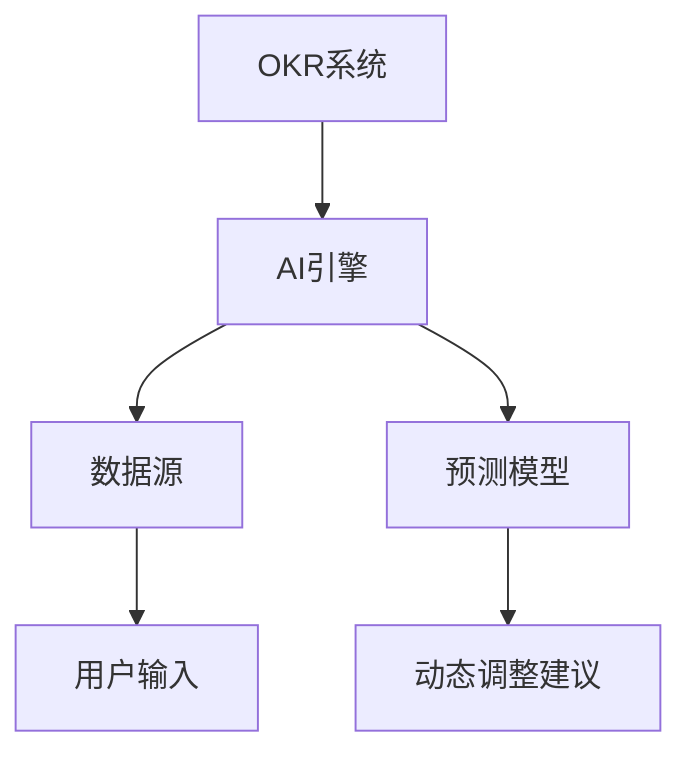

                 

<think>
嗯，我现在需要帮用户设计一本名为《AI辅助企业战略执行：OKR自动化跟踪与动态调整系统》的目录大纲。首先，我得理解这本书的核心主题是什么。看起来是关于如何利用AI来辅助企业战略执行，特别是OKR（目标与关键成果）的自动化跟踪和动态调整。

我应该先分解这个主题。首先，用户可能需要从背景介绍开始，解释什么是OKR，它在企业中的作用，以及为什么需要自动化跟踪和动态调整。这部分可能需要一章来概述。

接下来，核心概念部分，可能需要详细讲解OKR和AI的结合，比如AI如何帮助设定、跟踪和调整OKR。这部分可能需要单独的章节，包括概念原理、属性对比和实体关系图。

然后，算法原理是关键。我需要考虑使用哪些算法，比如机器学习模型，来预测OKR的达成情况。这部分可能需要详细讲解数学模型和公式，比如线性回归或神经网络，并用mermaid流程图展示算法步骤。

系统架构设计也是重要部分。我需要设计一个系统，包括前端、后端和AI引擎，展示它们之间的交互。这部分可能需要使用mermaid的架构图和序列图来说明。

项目实战部分，用户可能需要实际的代码示例，比如用Python实现一个简单的OKR跟踪系统。这部分需要详细说明环境安装、代码实现和案例分析。

最后，总结与展望，回顾整个系统，并展望未来的发展方向，比如与其他企业系统的集成。

我还需要确保目录结构完整，包含背景、核心概念、算法、系统架构、项目实战和总结，每章下要有足够的子章节，细化到三级目录。同时，要满足用户的要求，包括数学公式、代码示例和图表，确保内容全面且结构清晰。

嗯，听起来挺复杂的，但我可以一步步来。首先，确认每章的重点，然后细化每个小节的内容，确保涵盖所有必要的部分。这样用户就能得到一个详细且逻辑清晰的目录大纲，帮助他们撰写一篇高质量的技术博客文章。
</think>

# AI辅助企业战略执行：OKR自动化跟踪与动态调整系统

> **关键词**：AI, 企业战略, OKR, 自动化跟踪, 动态调整, 机器学习, 系统架构

> **摘要**：本文探讨了AI技术在企业战略执行中的应用，特别是OKR（目标与关键成果）的自动化跟踪与动态调整。通过分析OKR的核心概念、AI辅助的实现原理、算法模型的设计与实现、系统架构的构建以及实际项目案例，本文详细阐述了如何利用AI技术提升企业战略执行的效率和效果。本文旨在为企业提供一种创新的方法，以应对复杂多变的商业环境中的战略管理挑战。

---

## 目录

### 第一章: AI辅助企业战略执行的背景与意义

#### 1.1 企业战略执行的挑战

- 1.1.1 传统企业战略执行的痛点
  - 策略制定的主观性
  - 执行过程的复杂性
  - 结果评估的滞后性

- 1.1.2 OKR在企业战略管理中的作用
  - OKR的定义与核心价值
  - OKR与企业战略目标的关系
  - OKR在敏捷组织中的重要性

- 1.1.3 AI技术如何赋能OKR管理
  - 数据驱动的决策支持
  - 智能化的目标跟踪与调整
  - 预测性分析提升执行效率

#### 1.2 OKR的核心概念与特点

- 1.2.1 OKR的定义与基本结构
  - O（目标）的层次分解
  - K（关键成果）的量化指标

- 1.2.2 OKR与KPI的区别与联系
  - KPI的局限性与OKR的优势
  - OKR在目标设定中的灵活性

- 1.2.3 OKR在现代企业的应用现状
  - 成功案例分析
  - 常见问题与解决方案

#### 1.3 AI辅助OKR管理的必要性

- 1.3.1 数据驱动的OKR管理需求
  - 数据收集与分析的重要性
  - 数据驱动的决策优势

- 1.3.2 AI在OKR动态调整中的优势
  - 自动化跟踪与实时反馈
  - 智能预测与风险预警

- 1.3.3 OKR自动化跟踪的技术实现路径
  - 数据接口与API设计
  - AI模型的训练与部署

#### 1.4 本章小结

---

### 第二章: OKR与AI的核心概念联系

#### 2.1 OKR的结构化表示

- 2.1.1 OKR的层级分解
  - 企业级OKR
  - 部门级OKR
  - 个人级OKR

- 2.1.2 OKR的关键成果的量化指标
  - 数量化与非数量化成果
  - 成果的可衡量性

- 2.1.3 OKR与企业战略目标的关系
  - 战略目标的分解与执行
  - OKR作为战略执行的抓手

#### 2.2 AI在OKR管理中的应用场景

- 2.2.1 AI辅助OKR目标设定
  - 数据驱动的目标建议
  - 智能推荐功能

- 2.2.2 AI辅助OKR执行跟踪
  - 实时数据监控
  - 进度预测与预警

- 2.2.3 AI辅助OKR动态调整
  - 根据数据反馈优化目标
  - 自动调整优先级与资源分配

#### 2.3 OKR与AI的实体关系图



#### 2.4 本章小结

---

### 第三章: AI辅助OKR管理的算法原理

#### 3.1 基于机器学习的OKR预测模型

- 3.1.1 算法原理概述
  - 机器学习在OKR预测中的应用
  - 时间序列预测模型

- 3.1.2 特征工程在OKR预测中的作用
  - 数据清洗与特征提取
  - 特征选择与降维

- 3.1.3 模型训练与优化
  - 线性回归模型
  - 神经网络模型

#### 3.2 算法实现步骤

- 3.2.1 数据预处理
  - 数据清洗
  - 特征标准化

- 3.2.2 模型训练
  - 线性回归模型
  - 神经网络模型

- 3.2.3 模型评估与优化
  - 模型评估指标
  - 超参数调优

#### 3.3 机器学习模型的数学公式

- 线性回归模型：
  $$ y = \beta_0 + \beta_1x + \epsilon $$

- 神经网络模型：
  ```mermaid
  graph LR
      input --> layer1
      layer1 --> layer2
      layer2 --> output
  ```

#### 3.4 本章小结

---

### 第四章: 系统架构与实现

#### 4.1 系统功能模块划分

- 4.1.1 用户界面模块
  - 目标设定界面
  - 执行跟踪界面
  - 动态调整建议界面

- 4.1.2 数据处理模块
  - 数据采集与存储
  - 数据分析与处理
  - 数据可视化

- 4.1.3 AI引擎模块
  - 预测模型服务
  - 动态调整建议生成
  - 实时数据监控

#### 4.2 系统架构设计

- 4.2.1 系统架构图
  ```mermaid
  graph LR
      client --> api_gateway
      api_gateway --> db
      api_gateway --> predictor
      predictor --> notifier
  ```

- 4.2.2 系统交互流程
  ```mermaid
  graph LR
      client --> api_gateway
      api_gateway --> db
      api_gateway --> predictor
      predictor --> client
  ```

#### 4.3 本章小结

---

### 第五章: 项目实战与案例分析

#### 5.1 项目背景与目标

- 5.1.1 项目背景
  - 某企业的战略目标设定与执行问题
  - 引入AI辅助OKR管理的必要性

- 5.1.2 项目目标
  - 构建一个基于AI的OKR自动化跟踪与动态调整系统

#### 5.2 系统实现

- 5.2.1 环境安装
  - Python版本要求
  - 依赖库安装（如TensorFlow、Pandas等）

- 5.2.2 核心代码实现
  - 数据预处理代码
  - 模型训练代码
  - 系统接口开发代码

#### 5.3 项目案例分析

- 5.3.1 案例背景
  - 某科技企业的OKR管理现状
  - 引入AI辅助系统后的效果对比

- 5.3.2 实施过程
  - 数据收集与模型训练
  - 系统部署与测试
  - 用户反馈与系统优化

#### 5.4 本章小结

---

### 第六章: 总结与展望

#### 6.1 本章总结

- AI在OKR管理中的应用价值
- 系统实现的关键技术与创新点

#### 6.2 未来展望

- OKR与AI的深度融合
- 系统的扩展与优化方向
- 在更多企业场景中的应用潜力

---

### 作者

**作者：AI天才研究院/AI Genius Institute & 禅与计算机程序设计艺术 /Zen And The Art of Computer Programming**

---

希望这个目录大纲能满足您的需求。如果需要进一步补充或调整，请随时告诉我！

