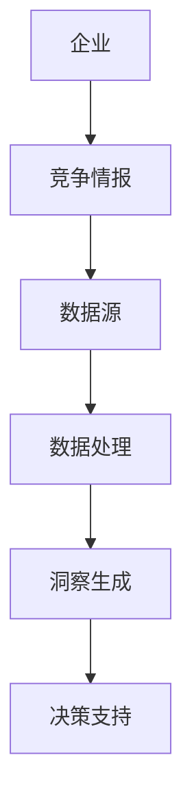
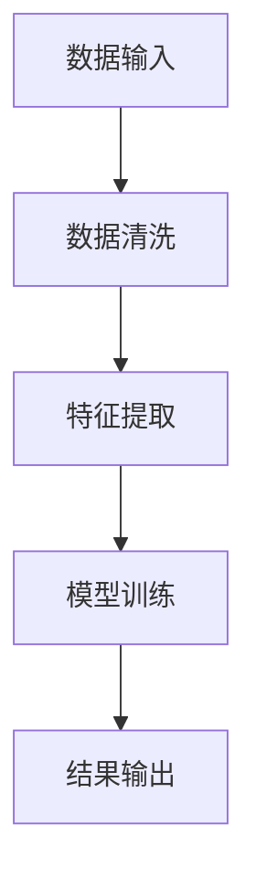
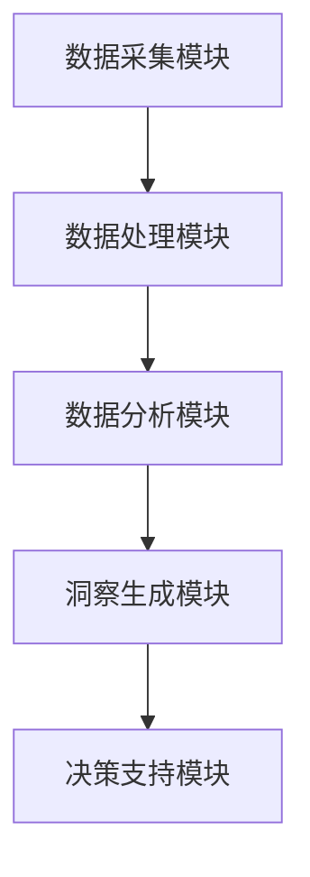
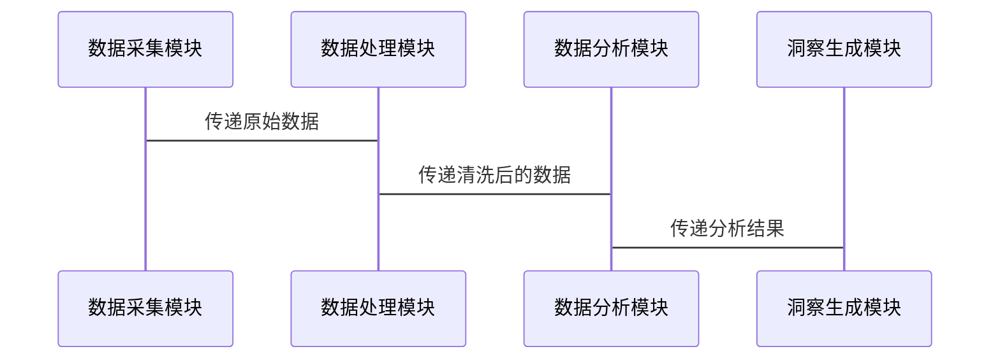

                 


# AI辅助企业竞争情报分析：自动化数据收集与洞察生成系统

> 关键词：AI，竞争情报分析，数据收集，自动化，洞察生成

> 摘要：随着企业竞争的日益激烈，竞争情报分析在帮助企业制定战略决策中扮演着越来越重要的角色。本文将深入探讨如何利用人工智能技术构建自动化数据收集与洞察生成系统，为企业提供高效、精准的竞争情报分析支持。通过分析系统的核心概念、算法原理、系统架构设计以及项目实战，本文旨在为企业提供一套完整的解决方案，助力企业在竞争中占据优势。

---

# 第1章: AI辅助企业竞争情报分析的背景与问题概述

## 1.1 企业竞争情报分析的定义与重要性

### 1.1.1 什么是企业竞争情报分析

企业竞争情报分析是指通过收集、整理、分析和利用竞争对手及其市场环境的相关信息，为企业制定战略决策提供支持的过程。竞争情报分析不仅关注竞争对手的产品、市场策略和运营模式，还包括行业趋势、市场动态、客户行为等多方面的信息。

### 1.1.2 竞争情报分析在企业中的作用

竞争情报分析在企业中的作用主要体现在以下几个方面：
- **制定战略决策**：通过了解竞争对手的动态，帮助企业制定更具针对性的市场进入策略、产品开发计划和定价策略。
- **优化资源配置**：识别市场竞争中的机会和威胁，帮助企业合理分配资源，提高效率。
- **提升竞争力**：通过分析竞争对手的核心优势和劣势，帮助企业找到自身竞争优势，增强市场竞争力。

### 1.1.3 当前竞争情报分析的主要挑战

尽管竞争情报分析的重要性不言而喻，但在实际应用中仍然面临诸多挑战：
- **数据来源广泛**：竞争情报涉及的数据来源广泛，包括公开数据、内部数据、社交媒体数据等，如何高效收集和整合这些数据是一个难题。
- **数据处理复杂**：数据可能存在噪声、格式不一致、语义复杂等问题，如何进行有效的数据清洗和预处理是关键。
- **分析效率低下**：传统的竞争情报分析主要依赖人工操作，效率低且容易出错，难以满足企业对实时分析的需求。

---

## 1.2 AI技术在竞争情报分析中的应用潜力

### 1.2.1 AI技术如何赋能竞争情报分析

人工智能技术的快速发展为企业竞争情报分析带来了新的可能性：
- **自动化数据收集**：通过自然语言处理（NLP）和机器学习算法，AI可以自动从多种数据源中提取有用信息，大大提高了数据收集的效率。
- **智能数据处理**：AI能够自动识别数据中的噪声，进行数据清洗、转换和标注，为后续分析提供高质量的数据支持。
- **自动化分析与洞察生成**：通过机器学习模型，AI可以自动分析数据，识别潜在的市场机会和威胁，生成洞察报告。

### 1.2.2 数据驱动的决策优势

数据驱动的决策模式相比传统经验驱动的决策模式具有显著优势：
- **精准性**：基于大量数据的分析结果更具客观性和准确性。
- **实时性**：AI技术能够实时处理数据，提供实时的市场洞察。
- **可扩展性**：AI系统可以同时处理海量数据，适用于大规模的市场分析。

### 1.2.3 自动化分析的效率提升

AI技术的应用显著提升了竞争情报分析的效率：
- **自动化数据采集**：通过爬虫技术自动获取竞争对手的产品信息、市场动态等数据。
- **自动化数据处理**：利用NLP技术对文本数据进行分词、实体识别、情感分析等处理。
- **自动化报告生成**：基于机器学习模型的分析结果，自动生成竞争情报报告，减少人工干预。

---

## 1.3 本章小结

本章主要介绍了企业竞争情报分析的定义、作用及其面临的挑战，重点探讨了人工智能技术在竞争情报分析中的应用潜力。通过AI技术的赋能，竞争情报分析的效率和准确性得到了显著提升，为企业制定战略决策提供了强有力的支持。

---

# 第2章: AI辅助竞争情报分析的核心概念与联系

## 2.1 核心概念原理

### 2.1.1 竞争情报分析的流程

竞争情报分析的流程通常包括以下几个步骤：
1. **数据收集**：从多种数据源（如竞争对手网站、行业报告、社交媒体等）收集相关信息。
2. **数据处理**：对收集到的数据进行清洗、转换和标注，提取有用的信息。
3. **数据分析**：利用NLP和机器学习技术对数据进行分析，识别市场趋势、竞争对手的优势和劣势等。
4. **洞察生成**：基于分析结果，生成竞争情报报告，为企业制定战略决策提供支持。

### 2.1.2 AI在数据收集与处理中的作用

AI技术在竞争情报分析中的作用主要体现在数据收集和处理阶段：
- **数据收集**：通过爬虫技术自动获取竞争对手的产品信息、市场动态等数据。
- **数据处理**：利用NLP技术对文本数据进行分词、实体识别、情感分析等处理，提取关键信息。

### 2.1.3 自动化分析系统的架构

自动化分析系统的架构包括以下几个关键部分：
- **数据采集模块**：负责从多种数据源中获取数据。
- **数据处理模块**：对数据进行清洗、转换和标注。
- **数据分析模块**：利用NLP和机器学习技术对数据进行分析。
- **洞察生成模块**：基于分析结果，生成竞争情报报告。

---

## 2.2 核心概念属性特征对比表

以下是竞争情报分析中几个核心概念的属性特征对比表：

| 概念         | 属性       | 特征                                                                 |
|--------------|------------|----------------------------------------------------------------------|
| 数据收集     | 来源       | 公开数据、内部数据、社交媒体数据                                           |
| 数据处理     | 方法       | 数据清洗、数据转换、数据标注                                             |
| 洞察生成     | 技术       | NLP、机器学习、知识图谱                                                   |

---

## 2.3 实体关系图（ER图）

以下是竞争情报分析系统的核心实体关系图：



从图中可以看出，企业的竞争情报分析过程涉及到多个实体，包括数据源、数据处理、洞察生成等模块。

---

## 2.4 本章小结

本章主要介绍了AI辅助竞争情报分析的核心概念与联系，通过对比表和实体关系图展示了各个概念之间的关系。通过对核心概念的深入分析，为后续的算法原理和系统设计奠定了基础。

---

# 第3章: AI辅助竞争情报分析的算法原理

## 3.1 竞争情报分析中的关键算法

### 3.1.1 文本挖掘算法

文本挖掘算法在竞争情报分析中主要用于从文本数据中提取有用信息。常用的文本挖掘算法包括：
- **分词算法**：将文本分割成词语或短语，常用工具如jieba。
- **实体识别算法**：识别文本中的命名实体（如人名、地名、组织名）。
- **情感分析算法**：分析文本中的情感倾向，判断文本是正面、负面还是中性。

### 3.1.2 机器学习算法

机器学习算法在竞争情报分析中主要用于模式识别和分类。常用的机器学习算法包括：
- **朴素贝叶斯分类器**：基于概率的分类算法，常用于文本分类。
- **支持向量机（SVM）**：常用于分类和回归问题。
- **随机森林**：基于决策树的集成学习算法，常用于分类和回归问题。

### 3.1.3 知识图谱构建算法

知识图谱构建算法主要用于将分散的实体和关系组织成一个结构化的知识网络。常用的算法包括：
- **实体识别**：识别文本中的实体。
- **关系抽取**：识别实体之间的关系。
- **知识融合**：将多个来源的知识进行整合。

---

## 3.2 算法流程图

以下是竞争情报分析中的算法流程图：



从图中可以看出，算法的流程包括数据输入、数据清洗、特征提取、模型训练和结果输出五个阶段。

---

## 3.3 算法数学模型

### 3.3.1 朴素贝叶斯分类器

朴素贝叶斯分类器是一种基于概率的分类算法，其公式如下：

$$ P(c|d) = \frac{P(d|c)P(c)}{P(d)} $$

其中，\( P(c|d) \) 表示在数据 \( d \) 下类别 \( c \) 的概率，\( P(d|c) \) 表示在类别 \( c \) 下数据 \( d \) 的概率，\( P(c) \) 表示类别 \( c \) 的先验概率，\( P(d) \) 表示数据 \( d \) 的全概率。

### 3.3.2 TF-IDF计算

TF-IDF（Term Frequency-Inverse Document Frequency）是一种用于衡量一个词语在文档中的重要性的统计方法，其公式如下：

$$ TF-IDF(t, d) = TF(t, d) \times IDF(t) $$

其中，\( TF(t, d) \) 表示词语 \( t \) 在文档 \( d \) 中的词频，\( IDF(t) \) 表示词语 \( t \) 的逆文档频率。

---

## 3.4 本章小结

本章主要介绍了竞争情报分析中的关键算法，包括文本挖掘算法、机器学习算法和知识图谱构建算法，并通过流程图和数学公式对算法的原理进行了详细讲解。

---

# 第4章: 系统分析与架构设计方案

## 4.1 系统功能设计

### 4.1.1 数据采集模块

数据采集模块负责从多种数据源（如竞争对手网站、行业报告、社交媒体等）中获取数据。常用的爬虫工具包括Scrapy和BeautifulSoup。

### 4.1.2 数据处理模块

数据处理模块对采集到的数据进行清洗、转换和标注。常用的数据处理工具包括Pandas和NumPy。

### 4.1.3 洞察生成模块

洞察生成模块基于机器学习模型的分析结果，生成竞争情报报告。常用的机器学习框架包括Scikit-learn和TensorFlow。

---

## 4.2 系统架构设计

以下是竞争情报分析系统的架构图：



从图中可以看出，系统包括数据采集模块、数据处理模块、数据分析模块和洞察生成模块四个主要模块。

---

## 4.3 系统接口设计

系统接口设计主要涉及模块之间的数据传递和调用关系。以下是系统接口的序列图：



---

## 4.4 本章小结

本章主要介绍了竞争情报分析系统的功能设计、架构设计和接口设计，为后续的项目实施提供了理论基础。

---

# 第5章: 项目实战

## 5.1 环境安装

以下是项目实战所需的环境安装步骤：
1. 安装Python 3.x
2. 安装必要的Python库（如Scrapy、Pandas、Scikit-learn、TensorFlow等）。

## 5.2 核心代码实现

以下是竞争情报分析系统的核心代码实现：

```python
# 竞争情报分析系统核心代码
import requests
from bs4 import BeautifulSoup
import pandas as pd
from sklearn.feature_extraction.text import TfidfVectorizer
from sklearn.naive_bayes import MultinomialNB

# 数据采集模块
def collect_data(url):
    response = requests.get(url)
    html_content = response.text
    soup = BeautifulSoup(html_content, 'html.parser')
    # 提取文本内容
    text = soup.get_text()
    return text

# 数据处理模块
def preprocess_data(text):
    # 分词
    words = jieba.lcut(text)
    # 去除停用词
    stopwords = set(jieba.analyse.get_stopwords())
    filtered_words = [word for word in words if word not in stopwords]
    return ' '.join(filtered_words)

# 数据分析模块
def analyze_data(text):
    vectorizer = TfidfVectorizer()
    tfidf_matrix = vectorizer.fit_transform([text])
    # 模型训练
    model = MultinomialNB()
    model.fit(tfidf_matrix, [0])
    return model

# 洞察生成模块
def generate_insight(model, text):
    tfidf_matrix = vectorizer.fit_transform([text])
    prediction = model.predict(tfidf_matrix)
    return prediction

# 主函数
def main():
    url = 'https://example.com'
    text = collect_data(url)
    processed_text = preprocess_data(text)
    model = analyze_data(processed_text)
    insight = generate_insight(model, processed_text)
    print(insight)

if __name__ == '__main__':
    main()
```

---

## 5.3 代码应用解读与分析

上述代码实现了一个简单的竞争情报分析系统，包括数据采集、数据处理、数据分析和洞察生成四个模块。通过使用Scrapy和jieba进行数据采集和分词，利用TF-IDF和朴素贝叶斯算法进行数据分析，最终生成竞争情报洞察。

---

## 5.4 实际案例分析

以下是竞争情报分析系统的实际案例分析：

**案例背景**：某公司想要分析竞争对手的产品评论，以了解市场对其产品的看法。

**案例分析**：
1. 数据采集：从竞争对手的产品评论页面中获取评论数据。
2. 数据处理：对评论进行分词和去停用词处理。
3. 数据分析：利用TF-IDF算法提取评论中的关键词，分析用户的关注点。
4. 洞察生成：基于分析结果，生成竞争情报报告，指出竞争对手产品的优势和劣势。

---

## 5.5 项目小结

本章通过项目实战的方式，详细讲解了竞争情报分析系统的实现过程，包括环境安装、核心代码实现、代码应用解读与分析以及实际案例分析。

---

# 第6章: 最佳实践、小结与展望

## 6.1 最佳实践

在实际应用中，建议企业采取以下最佳实践：
- **数据安全**：确保数据采集和处理过程中的数据安全，防止数据泄露。
- **模型优化**：定期对模型进行优化，提高分析结果的准确性。
- **多源数据融合**：结合多种数据源进行分析，提高洞察的全面性。

## 6.2 本章小结

通过对竞争情报分析系统的深入分析和项目实战，我们得出以下结论：
- AI技术能够显著提升竞争情报分析的效率和准确性。
- 竞争情报分析系统的实现需要结合多种技术，包括数据采集、数据处理、数据分析和洞察生成。
- 通过不断优化系统架构和算法模型，可以进一步提升竞争情报分析的能力。

## 6.3 展望

随着AI技术的不断发展，竞争情报分析系统将变得更加智能化和高效化。未来的研究方向包括：
- **实时分析**：实现实时数据采集和分析，提供实时的竞争情报。
- **多语言支持**：支持多种语言的文本分析，扩大数据采集范围。
- **自适应学习**：实现模型的自适应学习，提高分析结果的准确性。

---

# 作者：AI天才研究院/AI Genius Institute & 禅与计算机程序设计艺术 /Zen And The Art of Computer Programming

---

感谢您的耐心阅读！希望本文能为您提供有价值的信息和启发。如果对内容有任何疑问或建议，请随时与我们联系。

