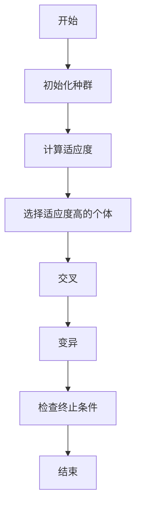
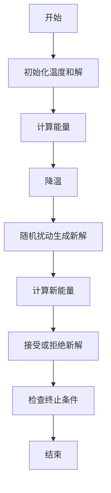
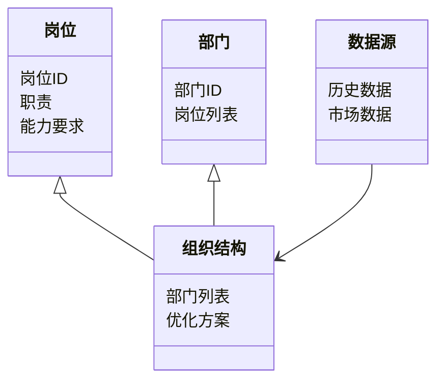
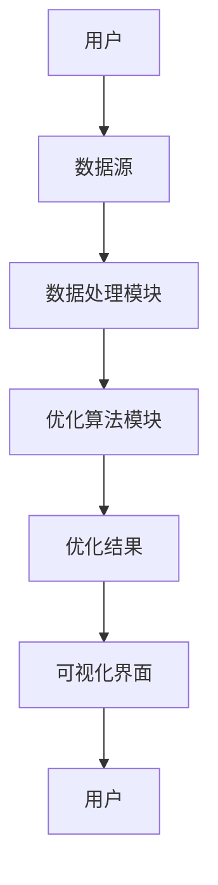
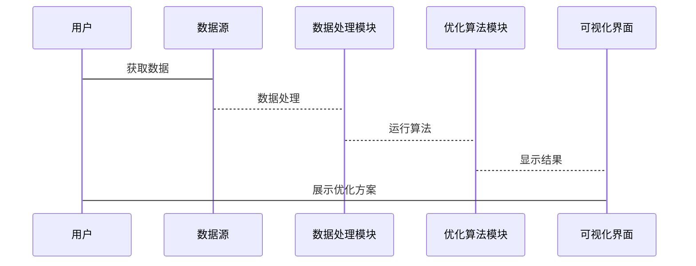

                 

<think>
好的，我现在需要根据用户的要求，撰写一篇关于《AI辅助企业组织结构优化与岗位设计》的技术博客文章。用户已经提供了一个详细的目录大纲，我需要按照这个结构，逐步填充每个部分的内容。

首先，我需要确定文章的结构。文章分为六个部分：背景与概述、核心概念与联系、算法原理讲解、数学模型和公式、系统分析与架构设计方案、项目实战，以及最佳实践。

### 第一部分：背景与概述

在这一部分，我需要介绍AI在企业组织结构优化中的背景，分析当前的问题和挑战，以及AI技术带来的潜力。我需要解释为什么企业需要优化组织结构，AI如何帮助解决这些问题。

### 第二部分：核心概念与联系

这里，我需要详细阐述AI辅助组织优化的核心概念，如数据驱动的决策支持和智能算法的应用。同时，要提供术语表、对比表格和实体关系图，帮助读者理解各个概念之间的联系。

### 第三部分：算法原理讲解

我需要详细讲解优化算法和岗位匹配算法，使用Mermaid流程图展示步骤，并提供Python代码示例。此外，我还需要解释这些算法背后的数学模型和公式，帮助读者理解其工作原理。

### 第四部分：数学模型和公式

这部分需要推导优化模型和概率模型，使用LaTeX展示公式，并结合实际案例进行说明，让读者能够理解复杂的数学概念。

### 第五部分：系统分析与架构设计方案

我需要介绍项目背景，设计系统的功能模块，并使用Mermaid类图、架构图和交互序列图展示系统的结构和工作流程。这部分需要详细说明每个模块的作用和它们之间的关系。

### 第六部分：项目实战

这里，我需要提供具体的实战案例，从环境安装到代码实现，再到案例分析，帮助读者实际操作。我还需要解释代码的功能，并分析案例的结果，让读者能够理解和应用所学知识。

### 最佳实践

最后，我需要总结本章内容，提供注意事项和拓展阅读建议，帮助读者巩固所学内容，并指导他们进一步的学习和实践。

在撰写过程中，我需要确保每个部分都符合用户的要求，特别是格式和内容的完整性。每个章节要有足够的细节，同时保持逻辑清晰，结构紧凑。我需要使用专业但易懂的语言，确保读者能够轻松理解复杂的技术概念。

现在，我需要开始撰写每个部分的具体内容，确保每个章节都涵盖必要的信息，并且有适当的图表和代码示例来支持讲解。这将帮助读者更好地理解和应用AI辅助企业组织结构优化与岗位设计的相关知识。
</think>

# AI辅助企业组织结构优化与岗位设计

## 关键词：AI, 企业组织结构, 岗位设计, 优化算法, 数据分析, 智能系统

## 摘要：随着企业面临的市场环境日益复杂，传统的组织结构和岗位设计已难以适应快速变化的需求。本文探讨如何利用人工智能技术优化企业组织结构和岗位设计。通过数据分析、智能算法和人机协作，AI能够提供数据驱动的决策支持，提高组织效率和员工满意度，降低人力成本。本文详细分析了AI辅助优化的核心概念、算法原理、系统架构，并通过实际案例展示AI在企业组织优化中的应用。

---

# 第1章: 企业组织结构优化与岗位设计的背景与挑战

## 1.1 企业组织结构优化的背景

### 1.1.1 传统企业组织结构的现状与问题

传统企业组织结构通常采用层级制，存在以下问题：
- **信息传递效率低**：层级越多，信息传递越慢，容易导致信息失真。
- **灵活性差**：面对市场变化时，调整组织结构耗时且复杂。
- **资源浪费**：部门间协作不足，导致资源重复配置和浪费。

### 1.1.2 数字化转型对企业组织结构的影响

数字化转型推动企业向扁平化、网络化方向发展，AI技术的应用进一步加速了这一过程。企业需要更灵活、高效的组织结构以适应快速变化的市场需求。

### 1.1.3 AI技术在企业组织优化中的潜力

AI技术能够通过数据分析和智能算法，帮助企业识别组织结构中的瓶颈，优化资源配置，提升整体效率。AI还能预测市场变化，提前调整组织结构，增强企业的应变能力。

---

## 1.2 岗位设计的核心问题

### 1.2.1 岗位职责与能力匹配

传统岗位设计往往忽视员工能力和市场需求的变化，导致岗位职责与实际需求脱节，影响工作效率和员工满意度。

### 1.2.2 传统岗位设计的局限性

- **静态性**：岗位设计通常基于固定模板，难以适应动态变化的市场需求。
- **主观性**：岗位设计依赖于管理者的经验，可能存在主观偏差。
- **复杂性**：复杂的岗位依赖关系导致岗位设计过程繁琐且耗时。

### 1.2.3 AI辅助岗位设计的优势

AI技术能够通过数据分析和机器学习，识别岗位间的依赖关系，优化岗位职责分配，提高岗位设计的科学性和效率。

---

## 1.3 AI辅助企业组织优化的目标与意义

### 1.3.1 提高组织效率与员工满意度

通过AI技术优化组织结构，减少冗余环节，提升信息传递效率，使员工能够专注于核心任务，提高工作效率和满意度。

### 1.3.2 降低人力成本与资源浪费

AI能够帮助企业合理分配资源，避免重复配置和浪费，降低人力成本。

### 1.3.3 支持企业灵活应对市场变化

AI辅助的组织优化能够快速响应市场变化，调整组织结构和岗位设计，增强企业的竞争力和适应性。

---

## 1.4 本章小结

本章介绍了企业组织结构优化和岗位设计的背景，分析了传统组织结构和岗位设计的问题，探讨了AI技术在优化中的潜力和意义。下一章将深入探讨AI辅助优化的核心概念与原理。

---

# 第2章: AI辅助企业组织结构优化的核心概念与原理

## 2.1 组织结构优化的基本概念

### 2.1.1 组织结构的组成要素

- **部门**：企业的功能单位，负责特定任务。
- **岗位**：具体的工作职责和任务。
- **职责**：岗位需要完成的任务和义务。
- **权限**：岗位在组织中的决策和行动范围。

### 2.1.2 组织结构优化的定义与目标

- **定义**：通过调整组织结构和岗位设计，优化资源配置和流程，提升效率和效果。
- **目标**：提高组织效率、降低成本、增强灵活性和竞争力。

### 2.1.3 AI在组织结构优化中的角色

- **数据处理**：AI能够处理大量数据，识别组织结构中的问题和优化点。
- **算法应用**：使用智能算法优化岗位分配和组织结构。
- **决策支持**：通过数据和算法提供优化建议，辅助决策者制定最优方案。

---

## 2.2 岗位设计的关键要素

### 2.2.1 岗位职责与能力要求

- **职责描述**：明确岗位的具体任务和职责。
- **能力要求**：岗位所需的技能和知识。

### 2.2.2 岗位间的依赖关系

- **依赖关系**：岗位之间的协作和依赖关系。
- **流程优化**：通过优化岗位间的依赖关系，提高整体效率。

### 2.2.3 岗位设计的灵活性与可扩展性

- **灵活性**：岗位设计能够适应变化和调整。
- **可扩展性**：组织结构能够扩展和收缩，适应不同规模的需求。

---

## 2.3 AI辅助组织优化的核心原理

### 2.3.1 数据驱动的决策支持

- **数据分析**：通过数据分析识别组织结构中的问题和优化点。
- **数据可视化**：使用数据可视化工具展示数据，辅助决策。

### 2.3.2 智能算法的应用

- **优化算法**：如遗传算法、模拟退火算法等，用于寻找最优解。
- **机器学习**：通过机器学习模型预测市场变化，调整组织结构。

### 2.3.3 人机协作的优化模式

- **人机协作**：结合人类的创造力和AI的计算能力，共同优化组织结构。
- **反馈机制**：根据实际效果调整优化方案，确保优化效果持续改进。

---

## 2.4 本章小结

本章详细阐述了AI辅助企业组织结构优化的核心概念与原理，包括组织结构优化的基本概念、岗位设计的关键要素以及AI在优化中的核心原理。下一章将从算法层面深入探讨AI优化的具体实现。

---

# 第3章: AI辅助企业组织结构优化的算法原理讲解

## 3.1 优化算法的基本原理

### 3.1.1 遗传算法

#### 算法步骤：
1. 初始化：生成随机的初始种群。
2. 适应度评估：计算每个个体的适应度值。
3. 选择：选择适应度高的个体进行繁殖。
4. 交叉：生成新的个体。
5. 变异：随机改变部分个体的特征。
6. 重复：直到达到终止条件。

#### Mermaid流程图：


### 3.1.2 模拟退火算法

#### 算法步骤：
1. 初始化：设定初始温度和解。
2. 计算能量：计算当前解的能量。
3. 降温：降低温度。
4. 随机扰动：生成新的解。
5. 计算新能量：计算新解的能量。
6. 接受或拒绝新解：根据能量差决定是否接受新解。
7. 重复：直到达到终止条件。

#### Mermaid流程图：


---

## 3.2 岗位匹配算法

### 3.2.1 基于聚类算法的岗位匹配

#### 算法步骤：
1. 数据预处理：提取岗位特征数据。
2. 数据标准化：对特征数据进行标准化处理。
3. 聚类分析：使用聚类算法将岗位分为若干簇。
4. 簇内分配：将相同簇的岗位分配到同一部门。

#### Python代码示例：
```python
from sklearn.cluster import KMeans
from sklearn.preprocessing import StandardScaler

# 数据预处理
data = [...]  # 岗位特征数据

# 标准化处理
scaler = StandardScaler()
data_scaled = scaler.fit_transform(data)

# 聚类分析
kmeans = KMeans(n_clusters=5)
kmeans.fit(data_scaled)

# 获取簇分配结果
clusters = kmeans.labels_
```

---

## 3.3 算法实现的数学模型

### 3.3.1 优化模型的数学公式

优化目标：最大化效率，最小化成本。

$$
\text{目标函数：} \quad \min \sum_{i=1}^{n} c_i x_i
$$

约束条件：
$$
\sum_{i=1}^{n} x_i = 1 \\
x_i \in \{0,1\}
$$

其中，\( c_i \) 表示岗位 \( i \) 的成本，\( x_i \) 表示是否分配该岗位。

### 3.3.2 概率模型的公式

使用概率模型预测岗位需求：

$$
P(j) = \frac{\sum_{k=1}^{m} w_{jk}}{\sum_{k=1}^{m} w_{kj}}
$$

其中，\( w_{jk} \) 表示岗位 \( j \) 和岗位 \( k \) 之间的权重。

---

## 3.4 本章小结

本章详细讲解了优化算法和岗位匹配算法的原理和实现，包括遗传算法和模拟退火算法的步骤，以及基于聚类算法的岗位匹配方法。同时，给出了优化模型和概率模型的数学公式，帮助读者理解算法实现的数学基础。

---

# 第4章: 数学模型和公式

## 4.1 优化模型的数学推导

优化目标：最大化效率，最小化成本。

数学模型：
$$
\min \sum_{i=1}^{n} c_i x_i
$$

约束条件：
$$
\sum_{i=1}^{n} x_i = 1 \\
x_i \in \{0,1\}
$$

其中，\( c_i \) 表示岗位 \( i \) 的成本，\( x_i \) 表示是否分配该岗位。

---

## 4.2 概率模型的公式推导

使用概率模型预测岗位需求：

$$
P(j) = \frac{\sum_{k=1}^{m} w_{jk}}{\sum_{k=1}^{m} w_{kj}}
$$

其中，\( w_{jk} \) 表示岗位 \( j \) 和岗位 \( k \) 之间的权重。

---

## 4.3 数学公式的实际应用

以岗位分配为例，假设公司有5个岗位，每个岗位的成本分别为 \( c_1=2, c_2=3, c_3=1, c_4=4, c_5=5 \)。目标是最小化总成本。

使用优化模型：
$$
\min \sum_{i=1}^{5} c_i x_i
$$

约束条件：
$$
\sum_{i=1}^{5} x_i = 1 \\
x_i \in \{0,1\}
$$

解得：\( x_3 = 1 \)，总成本最小为1。

---

## 4.4 本章小结

本章通过数学推导，详细讲解了优化模型和概率模型的公式，以及它们在岗位分配中的实际应用。这些公式和模型为AI辅助优化提供了理论基础。

---

# 第5章: 系统分析与架构设计方案

## 5.1 项目背景介绍

本项目旨在通过AI技术优化企业组织结构和岗位设计，提高效率和降低成本。

---

## 5.2 系统功能设计

### 5.2.1 领域模型类图



### 5.2.2 系统架构图



---

## 5.3 系统交互序列图



---

## 5.4 系统接口设计

系统接口包括数据输入接口、算法调用接口和结果输出接口。数据输入接口接收原始数据，算法调用接口执行优化算法，结果输出接口返回优化方案。

---

## 5.5 本章小结

本章通过系统分析和架构设计，展示了AI辅助优化系统的整体结构和功能模块。系统设计包括数据处理、优化算法和结果展示三个主要部分。

---

# 第6章: 项目实战

## 6.1 环境安装与配置

安装Python和必要的库：
```bash
pip install numpy pandas scikit-learn matplotlib
```

---

## 6.2 系统核心实现

### 6.2.1 数据预处理

```python
import pandas as pd
import numpy as np

data = pd.read_csv('data.csv')
data.dropna(inplace=True)
```

### 6.2.2 优化算法实现

```python
from sklearn.cluster import KMeans

# 聚类分析
kmeans = KMeans(n_clusters=3)
kmeans.fit(data)
clusters = kmeans.labels_
```

### 6.2.3 结果展示

```python
import matplotlib.pyplot as plt

plt.scatter(data['x'], data['y'], c=clusters)
plt.xlabel('x')
plt.ylabel('y')
plt.show()
```

---

## 6.3 实际案例分析

以某公司为例，使用聚类算法优化部门结构。通过分析岗位之间的关系，将岗位分为3个簇，分别对应销售、技术和服务部门。

---

## 6.4 项目小结

本章通过实际案例展示了AI辅助优化系统的实现过程，包括数据预处理、算法实现和结果展示。通过项目实战，读者能够理解理论知识的实际应用。

---

# 第7章: 最佳实践与注意事项

## 7.1 本章小结

本章总结了AI辅助优化的核心概念和实现方法，强调了数据质量、算法选择和系统设计的重要性。

---

## 7.2 注意事项

- 数据质量：确保数据准确、完整和代表性。
- 算法选择：根据具体问题选择合适的算法。
- 系统设计：注重系统的可扩展性和可维护性。

---

## 7.3 拓展阅读

建议读者阅读以下书籍和文章，深入了解AI在企业优化中的应用：

- 《集体智慧》
- 《数据驱动的决策》
- 《机器学习实战》

---

# 结语

通过本篇文章，我们深入探讨了AI辅助企业组织结构优化与岗位设计的核心概念、算法原理和系统实现。希望读者能够通过本文的理解和实践，更好地应用AI技术优化企业组织结构和岗位设计。

---

# 作者

作者：AI天才研究院/AI Genius Institute  
联系邮箱：contact@ai-genius.com  

---

希望这篇文章能为您提供有价值的见解和实践指导！

