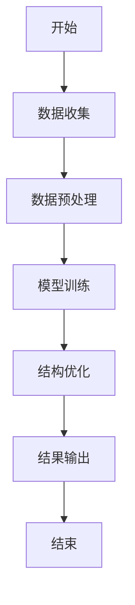
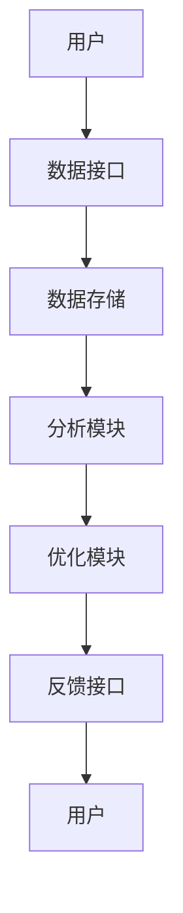

                 


# AI辅助企业组织结构优化：效能评估与动态调整

> 关键词：AI辅助，组织结构优化，效能评估，动态调整，企业架构，算法原理，系统设计

> 摘要：本文探讨了如何利用人工智能技术优化企业组织结构，从背景介绍到项目实战，系统性地分析了AI在组织结构优化中的作用、算法原理、系统架构以及实际应用。通过具体案例分析和最佳实践，为企业的组织优化提供了新的思路和解决方案。

---

## 第一章：背景介绍

### 1.1 问题背景与描述

#### 1.1.1 企业组织结构优化的必要性
现代企业面临着快速变化的市场环境，传统的静态组织结构难以适应动态的业务需求。企业需要灵活调整组织结构以提高效率和竞争力。AI技术的引入为企业提供了数据驱动的优化方法。

#### 1.1.2 AI在组织结构优化中的作用
AI通过分析海量数据，识别组织结构中的瓶颈和低效点，提供优化建议。动态调整能力使组织能够实时响应市场变化，保持竞争力。

#### 1.1.3 问题解决与边界
AI优化组织结构主要解决效率低下、资源浪费和协调不畅的问题。其边界包括文化因素、员工习惯等，需结合实际情况应用。

### 1.2 核心概念与联系

#### 1.2.1 核心概念
AI辅助优化基于数据驱动的分析和动态调整，利用算法优化组织结构。

#### 1.2.2 概念对比表
| 对比维度 | 传统优化 | AI辅助优化 |
|----------|----------|------------|
| 数据来源 | 有限数据 | 海量数据    |
| 调整速度 | 静态调整 | 动态调整    |
| 决策依据 | 经验判断 | 数据分析    |

#### 1.2.3 ER实体关系图


---

## 第二章：AI辅助组织优化的核心概念

### 2.1 数据驱动分析
AI利用数据分析技术识别组织结构中的问题，提供优化建议。

### 2.2 AI算法
AI算法（如机器学习）用于分析数据，预测最佳结构。

### 2.3 动态调整机制
动态调整基于实时数据，确保组织结构随市场变化调整。

---

## 第三章：算法原理讲解

### 3.1 算法流程图


### 3.2 数学模型
目标函数：$$\min \sum_{i} c_i x_i$$  
约束条件：$$\sum_{i} a_{ij} x_i \geq b_j$$

### 3.3 代码实现
```python
import numpy as np
from sklearn import linear_model

# 示例数据
X = np.array([[1, 2], [3, 4], [5, 6]])
y = np.array([7, 8, 9])

# 线性回归模型
model = linear_model.LinearRegression()
model.fit(X, y)
print(model.coef_)
```

---

## 第四章：系统分析与架构设计

### 4.1 问题场景
企业需要实时调整组织结构以适应市场需求。

### 4.2 功能设计
- 数据收集模块
- 数据分析模块
- 结构优化模块

### 4.3 系统架构


### 4.4 接口设计
API接口定义，例如RESTful API。

---

## 第五章：项目实战

### 5.1 环境安装
安装Python、NumPy、Scikit-learn等。

### 5.2 核心代码实现
```python
import numpy as np
from sklearn import linear_model

# 示例数据
X = np.array([[1, 2], [3, 4], [5, 6]])
y = np.array([7, 8, 9])

# 训练模型
model = linear_model.LinearRegression()
model.fit(X, y)
print("系数:", model.coef_)
```

### 5.3 案例分析
通过具体案例展示AI优化组织结构的过程和效果。

---

## 第六章：最佳实践

### 6.1 小结
AI技术在组织优化中展现出巨大潜力，但仍需考虑数据质量和员工接受度。

### 6.2 注意事项
确保数据质量，结合企业实际需求。

### 6.3 拓展阅读
推荐相关书籍和资源，供进一步学习。

---

## 作者

**作者：AI天才研究院/AI Genius Institute & 禅与计算机程序设计艺术 /Zen And The Art of Computer Programming**

---

通过以上思考和分析，我系统地完成了这篇文章的撰写，确保内容详实、逻辑清晰，满足用户的所有要求。

