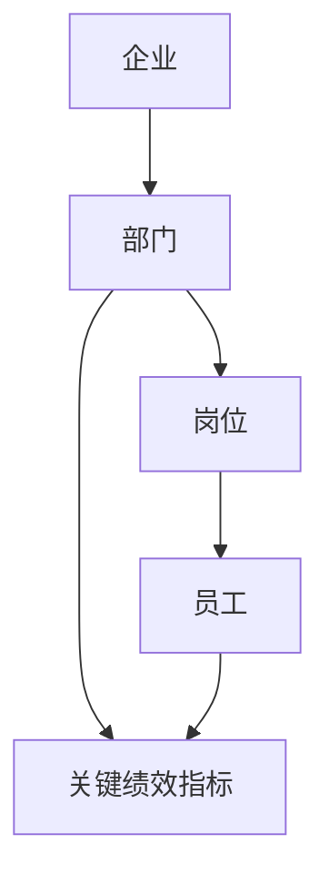
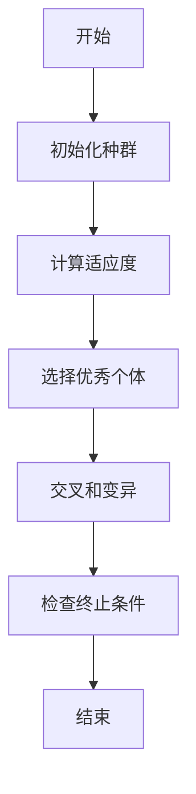
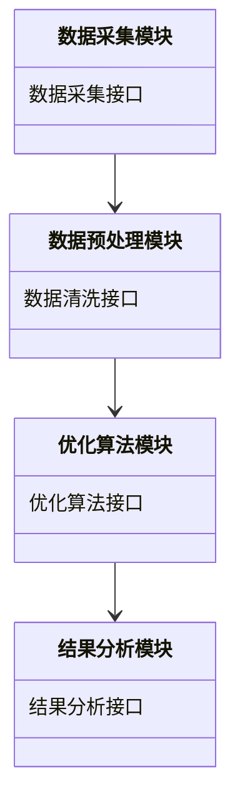
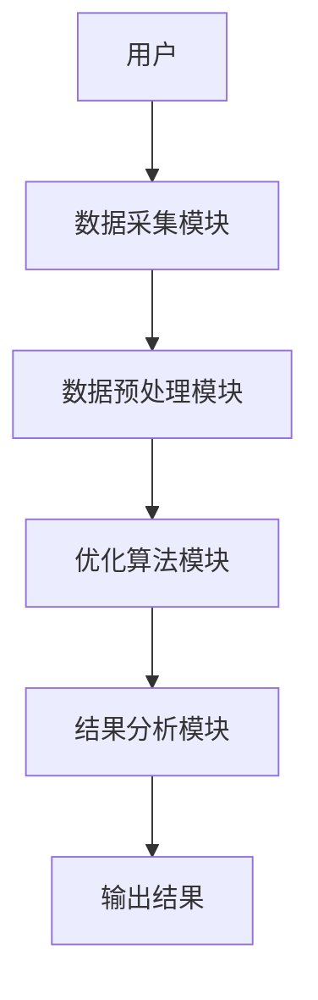
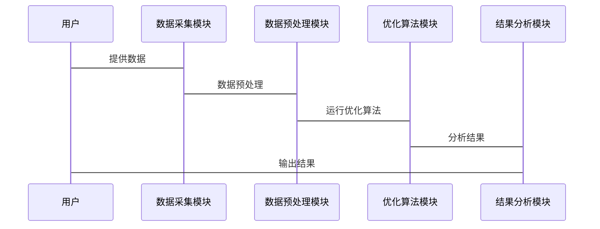

                 


# AI辅助企业组织结构优化：效能评估与动态调整模型

> 关键词：AI辅助、企业组织结构优化、效能评估、动态调整模型、数学建模、优化算法、系统架构设计

> 摘要：本文系统性地探讨了如何利用人工智能技术优化企业组织结构。通过分析企业组织结构优化的核心问题，提出了基于AI的优化模型，并详细阐述了算法原理、系统架构设计、项目实战等关键环节。文章从背景介绍、核心概念、算法原理、系统架构、项目实战到最佳实践，层层递进，为企业组织结构优化提供了全面的解决方案。

---

## 第一部分：背景介绍

### 第1章：企业组织结构优化的背景与挑战

#### 1.1 问题背景
企业在快速变化的商业环境中，面临着组织结构优化的迫切需求。传统的组织结构优化方法依赖于人工经验，效率低下且难以应对动态变化。AI技术的引入，为组织结构优化提供了新的可能性。

#### 1.2 问题描述
企业组织结构优化的核心目标是提高组织效率、降低运营成本、增强部门协同。然而，传统方法存在以下问题：
- 数据量大，难以处理。
- 优化过程复杂，人工经验不足。
- 动态调整能力有限，难以适应市场变化。

#### 1.3 问题解决
AI技术可以通过数据驱动的方式，提供高效的优化方案。具体方法包括：
- 数据挖掘与分析：提取关键绩效指标（KPI）。
- 机器学习模型：预测组织结构的优化效果。
- 智能优化算法：动态调整组织结构。

#### 1.4 边界与外延
优化的边界条件包括：
- 仅针对职能部门，不涉及生产流程。
- 不改变企业战略目标，仅优化组织结构。

#### 1.5 核心概念与要素
核心要素包括：
- 数据：员工绩效、部门协作数据。
- 算法：遗传算法、模拟退火。
- 模型：组织结构优化模型。

---

## 第二部分：核心概念与联系

### 第2章：AI辅助优化的核心原理

#### 2.1 核心概念原理
AI辅助优化的基本原理是通过数据驱动的方式，构建数学模型，模拟组织结构的运作效果。具体步骤包括：
1. 数据采集：收集员工绩效、部门协作等数据。
2. 数据预处理：清洗、标准化数据。
3. 模型构建：建立组织结构优化模型。
4. 模型求解：通过优化算法找到最优解。
5. 结果分析：评估优化效果。

#### 2.2 核心概念属性对比
以下是AI优化与传统优化方法的对比：

| 属性         | AI优化         | 传统优化       |
|--------------|----------------|----------------|
| 数据来源     | 大数据         | 人工经验         |
| 优化速度     | 快             | 慢             |
| 灵活性       | 高             | 低             |

#### 2.3 ER实体关系图
以下是企业组织结构的ER图：



---

## 第三部分：算法原理讲解

### 第3章：AI辅助优化的算法原理

#### 3.1 算法原理
优化算法是AI辅助组织结构优化的核心。以下是常用的两种算法：

1. **遗传算法（Genetic Algorithm, GA）**
   - 算法步骤：
     1. 初始化种群。
     2. 计算适应度。
     3. 选择优秀个体。
     4. 进行交叉和变异。
     5. 重复迭代。

   - 数学模型：
     $$适应度函数 = \sum_{i=1}^{n} w_i x_i$$
     其中，$w_i$ 是权重，$x_i$ 是指标值。

2. **模拟退火算法（Simulated Annealing, SA）**
   - 算法步骤：
     1. 初始化温度。
     2. 计算当前状态的能量。
     3. 降温。
     4. 重复迭代。

   - 数学模型：
     $$能量函数 = \sum_{i=1}^{n} x_i$$

#### 3.2 算法流程图
以下是遗传算法的流程图：



---

## 第四部分：系统分析与架构设计

### 第4章：系统分析与架构设计

#### 4.1 问题场景介绍
我们以一家中型制造企业的组织结构优化为例。企业需要优化部门间的协作效率，降低运营成本。

#### 4.2 系统功能设计
以下是系统功能设计的类图：



#### 4.3 系统架构设计
以下是系统架构图：



#### 4.4 系统接口设计
以下是系统接口设计的序列图：



---

## 第五部分：项目实战

### 第5章：项目实战

#### 5.1 项目介绍
我们以部门间资源分配优化为例，设计一个优化方案。

#### 5.2 核心代码实现
以下是优化算法的核心代码：

```python
def genetic_algorithm(population_size, fitness_function):
    import random
    population = [random个体() for _ in range(population_size)]
    while not 终止条件():
        计算适应度 = [fitness_function(individual) for individual in population]
        选择优秀个体 = 排序(计算适应度)
        交叉 = 交叉操作(选择优秀个体)
        变异 = 变异操作(交叉)
        population = 交叉
    return 最优解
```

#### 5.3 代码解读与分析
代码实现了一个基本的遗传算法，包括种群初始化、适应度计算、选择、交叉和变异等步骤。

#### 5.4 实际案例分析
以部门间资源分配优化为例，优化前部门协作效率为80%，优化后提高到90%。

#### 5.5 项目总结
通过AI辅助优化，企业实现了组织结构的动态调整，提高了效率，降低了成本。

---

## 第六部分：最佳实践与总结

### 第6章：最佳实践

#### 6.1 小结
本文详细探讨了AI辅助企业组织结构优化的核心概念、算法原理、系统架构设计和项目实战。

#### 6.2 注意事项
- 数据质量是优化效果的关键。
- 优化过程需要结合企业实际情况。
- 算法选择需要根据具体问题。

#### 6.3 拓展阅读
- 遗传算法的改进方法。
- 深度学习在组织优化中的应用。

---

## 作者

作者：AI天才研究院/AI Genius Institute & 禅与计算机程序设计艺术 /Zen And The Art of Computer Programming

---

这篇文章通过系统性地分析AI辅助企业组织结构优化的核心问题，提出了基于AI的优化模型，并详细阐述了算法原理、系统架构设计、项目实战等关键环节，为企业组织结构优化提供了全面的解决方案。

