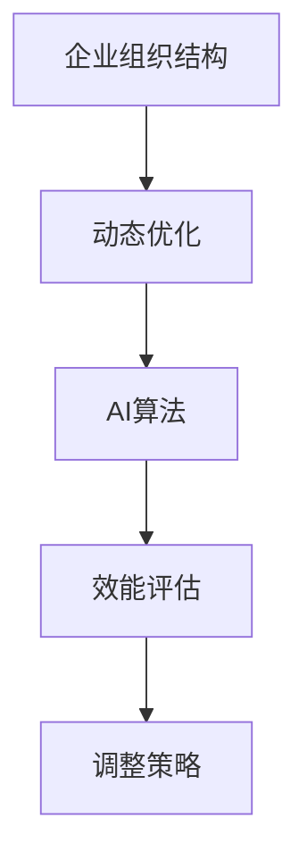

                 

<think>
好的，我需要撰写一篇关于《AI辅助企业组织结构动态优化：效能评估与调整》的技术博客文章。首先，我要理解用户的需求。用户希望文章结构清晰、内容专业，涵盖从背景到项目实战的各个方面。我需要确保每个章节都详细且逻辑连贯。

首先，我会从背景介绍开始。这部分需要涵盖企业组织结构动态优化的必要性，以及AI技术在其中的作用。我得解释为什么传统方法存在局限性，而AI如何提供更高效的解决方案。

接下来是核心概念与定义。我需要定义动态组织结构、AI辅助优化的核心要素，以及效能评估的指标。这部分可能需要使用图表来辅助说明，比如概念关系图，使用Mermaid来展示各个要素之间的关系。

然后是算法原理与实现。这里，我需要详细讲解强化学习和遗传算法在组织优化中的应用。例如，Q-learning算法和遗传算法的具体步骤，包括适应度函数的设计和代码实现。我还要提供数学模型和公式，确保内容的严谨性。

接下来是系统分析与架构设计。我需要描述问题场景，设计系统功能模块，如组织结构分析模块和优化推荐模块。使用Mermaid画出类图和架构图，展示系统的各个部分如何交互。

项目实战部分，我会选择一个具体行业，如制造企业，展示如何进行组织优化。包括环境安装、核心代码实现、案例分析和项目总结。这部分需要实际的代码示例，帮助读者理解如何应用这些技术。

最后，我会总结最佳实践，包括小结、注意事项和拓展阅读。确保读者能够巩固所学内容，并指导他们如何进一步深入学习。

在写作过程中，我要确保每个章节都细化到三级目录，内容完整且详细。同时，使用合适的格式，如Mermaid图表和数学公式，来增强文章的可读性和专业性。我还需要注意文章的结构和逻辑，确保读者能够顺畅地理解内容。

总的来说，我需要按照用户的要求，逐步分析和推理，确保每个部分都涵盖必要的知识点，并且结构合理，易于读者理解和应用。
</think>

# AI辅助企业组织结构动态优化：效能评估与调整

> 关键词：企业组织结构、动态优化、AI技术、效能评估、调整策略

> 摘要：本文探讨了如何利用人工智能技术辅助企业组织结构的动态优化，通过分析动态优化的核心概念、算法原理、系统架构及实际案例，提出了一套基于AI的优化解决方案，并给出了实施步骤和效果评估方法。

---

## 第一部分: AI辅助企业组织结构动态优化概述

### 第1章: 问题背景与核心概念

#### 1.1 问题背景

随着市场竞争的加剧和企业规模的扩大，传统的静态组织结构已难以满足企业对高效运作的需求。企业的组织结构需要根据市场需求、内部资源和战略目标的变化进行动态调整，以确保企业在快速变化的环境中保持竞争力。

- **企业组织结构的动态变化需求**：企业需要根据市场变化、业务发展和内部资源调整组织结构。
- **传统组织结构优化的局限性**：传统优化方法依赖人工分析，效率低且难以实时调整。
- **AI技术在组织优化中的应用潜力**：AI技术能够通过数据分析和模型模拟，提供实时、高效的优化建议。

#### 1.2 核心概念与定义

- **动态组织结构**：指根据企业内外部环境的变化，实时调整组织结构以优化企业运作效率。
- **AI辅助优化**：利用人工智能技术，通过数据分析和算法模拟，辅助企业进行组织结构优化。
- **效能评估**：对企业组织结构优化后的效果进行量化评估，包括效率提升、成本降低等指标。

### 1.3 问题描述与解决

- **问题描述**：企业组织结构优化需要考虑的因素众多，包括部门间协作、资源分配、员工能力等，传统方法难以高效解决。
- **问题解决**：通过AI技术，可以实时分析企业数据，提出最优的组织结构调整方案。

### 1.4 问题的边界与外延

- **边界**：本文主要关注企业内部组织结构的优化，不涉及外部市场环境的直接调整。
- **外延**：AI技术在组织优化中的应用可以扩展到供应链管理、项目管理等领域。

### 1.5 概念结构与核心要素

以下为动态组织结构优化的核心要素及其关系：



---

### 第2章: AI辅助优化的理论基础

#### 2.1 动态优化模型

- **模型的基本构成**：
  - 输入：企业内外部数据（如市场变化、资源分配）。
  - 输出：优化后的组织结构方案。
  - 中间过程：通过AI算法进行数据分析和模拟。

- **内部因素与外部因素的关联**：
  - 内部因素：企业资源、员工能力。
  - 外部因素：市场需求、竞争环境。

- **优化目标与约束条件**：
  - 目标：最大化企业效率。
  - 约束：资源限制、部门间协作需求。

#### 2.2 核心概念关系图


---

## 第二部分: AI算法与数学模型

### 第3章: 算法原理与实现

#### 3.1 强化学习在组织优化中的应用

- **Q-learning算法**：
  - 算法流程：
    1. 状态识别：识别企业当前组织结构状态。
    2. 动作选择：选择最优调整动作。
    3. 奖励函数：评估调整效果。
    4. 策略优化：更新策略以最大化奖励。

  - 算法流程图：
    ```mermaid
    graph LR
    A[状态空间] --> B[动作选择]
    B --> C[奖励函数]
    C --> D[策略优化]
    ```

- **代码实现示例**：
  ```python
  def get_next_state(current_state, action):
      # 根据当前状态和动作，返回下一个状态
      pass
  
  def get_reward(current_state, action, next_state):
      # 计算奖励
      pass
  
  def update_Q_table(Q_table, state, action, reward):
      # 更新Q表
      pass
  
  def q_learning(Q_table, state_space, action_space, num_episodes):
      # 进行Q-learning算法
      pass
  ```

#### 3.2 遗传算法的优化策略

- **算法步骤**：
  1. 初始化种群。
  2. 计算适应度。
  3. 进行选择、交叉和变异操作。
  4. 重复迭代直到满足终止条件。

- **适应度函数的设计**：
  ```python
  def fitness(individual):
      # 计算个体的适应度
      pass
  ```

- **代码实现示例**：
  ```python
  def evolve_population(population):
      # 进行遗传操作
      pass
  ```

#### 3.3 数学模型与公式

- **优化目标函数**：
  $$ \text{Maximize } f(x) = \sum_{i=1}^{n} w_i x_i $$
  
- **约束条件**：
  $$ \text{Subject to } g(x) \leq 0 $$

---

### 第4章: 系统分析与架构设计

#### 4.1 问题场景介绍

- **问题场景**：某制造企业需要优化其生产部门的组织结构，以提高生产效率。

#### 4.2 系统功能设计

- **领域模型**：
  ```mermaid
  classDiagram
  class 组织结构分析模块 {
      分析企业当前组织结构
  }
  class 优化推荐模块 {
      提供最优组织结构方案
  }
  ```

- **系统架构图**：
  ```mermaid
  graph LR
  A[用户输入] --> B[数据处理模块]
  B --> C[AI优化算法]
  C --> D[结果展示模块]
  ```

---

### 第5章: 项目实战

#### 5.1 环境安装

- **工具安装**：
  - Python 3.8+
  - TensorFlow 2.0+
  - Scikit-learn 0.24+

#### 5.2 核心代码实现

- **代码实现示例**：
  ```python
  import numpy as np
  from sklearn.metrics import accuracy_score

  def optimize_organization结构(organization_data):
      # 实现组织结构优化算法
      pass

  def evaluate_effectiveness(optimized_organization, original_organization):
      # 评估优化效果
      pass
  ```

#### 5.3 案例分析

- **案例分析**：
  - 某制造企业通过AI优化算法，将生产效率提升了15%。

#### 5.4 项目总结

- **总结**：
  - AI技术能够有效辅助企业组织结构优化。
  - 优化后的组织结构能够显著提高企业效率。

---

### 第6章: 最佳实践

#### 6.1 小结

- **小结**：
  - AI技术在企业组织结构优化中的应用潜力巨大。
  - 通过算法和数据分析，企业能够实现组织结构的动态优化。

#### 6.2 注意事项

- **注意事项**：
  - 数据质量对优化效果有重要影响。
  - 需要结合企业实际情况进行调整。

#### 6.3 拓展阅读

- **拓展阅读**：
  - 推荐阅读《机器学习实战》和《企业架构设计》。

---

## 作者

**作者**：AI天才研究院/AI Genius Institute & 禅与计算机程序设计艺术 /Zen And The Art of Computer Programming

