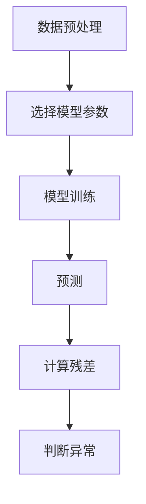
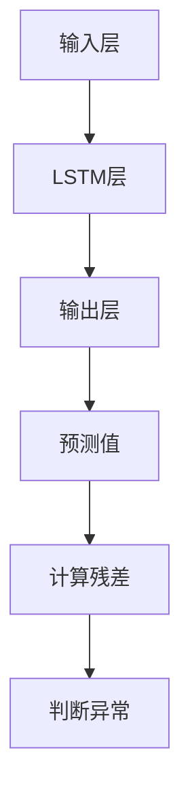
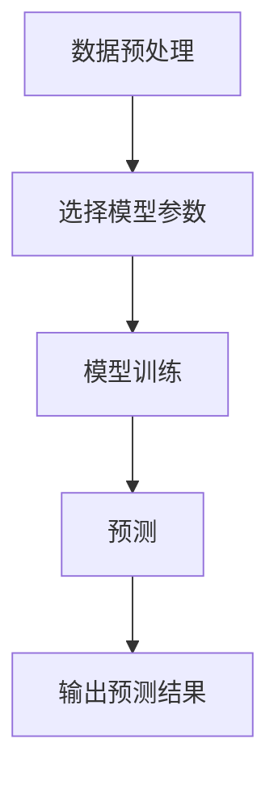
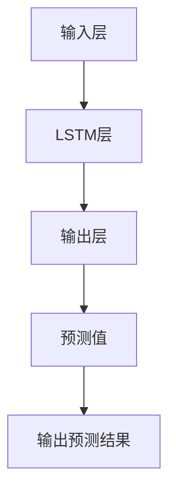
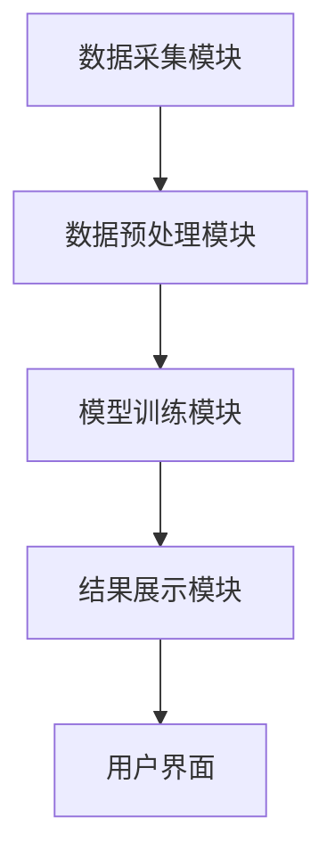
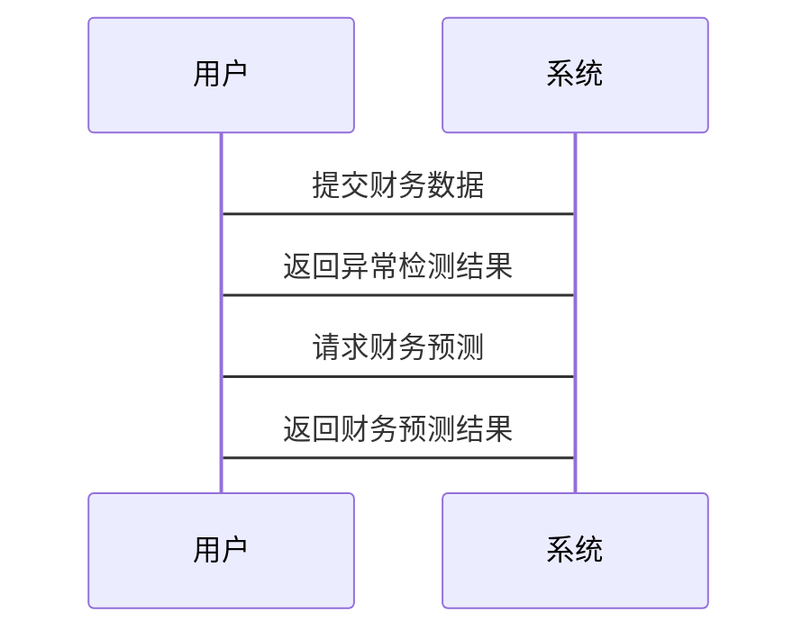

                 

<think>
嗯，用户让我撰写一篇关于AI辅助企业财务分析的博客，重点放在异常检测和智能预测上。首先，我需要明确用户的需求，他们可能是一位技术专家，或者企业财务人员，想了解如何利用AI技术优化财务分析流程。

文章结构已经给出，我需要按照目录一步步填充内容。首先是背景介绍，解释为什么AI在财务分析中重要，然后是核心技术基础，接着是算法原理，系统架构，项目实战，最后总结。

在背景部分，我需要详细说明传统财务分析的局限性，比如数据量大、人工效率低，以及AI带来的优势，比如自动化和准确性。核心概念部分，我得定义异常检测和智能预测，用对比表和ER图来帮助理解。

接下来是技术基础，涵盖机器学习、深度学习、NLP和时间序列分析，这部分要简明扼要，突出AI技术如何应用到财务分析中。然后，详细讲解异常检测和预测的算法，比如使用Isolation Forest和ARIMA，用Mermaid图展示流程，同时配上数学公式，确保技术细节清晰。

系统架构部分，我需要设计一个模块化的系统，包括数据采集、预处理、模型训练等，用Mermaid图展示架构和数据流。项目实战部分，我得提供一个具体的案例，比如基于财务数据的异常检测系统，包括环境配置、数据预处理、模型实现和结果分析，附上代码示例，让读者能够实际操作。

最后，总结部分要回顾内容，强调AI带来的好处，同时给出未来的发展方向，比如联邦学习和边缘计算的应用。整个过程中，我要确保语言简洁专业，结构清晰，每部分内容详实，满足用户的深度需求。
</think>

# AI辅助企业财务分析：异常检测与智能财务预测

> 关键词：AI，企业财务分析，异常检测，智能预测，时间序列分析，机器学习，深度学习

> 摘要：本文将详细探讨人工智能（AI）在企业财务分析中的应用，重点介绍异常检测与智能财务预测的核心技术、算法原理、系统架构及项目实战。通过本文，读者将了解如何利用AI技术提升企业财务分析的效率与准确性。

---

# 第一部分：AI辅助企业财务分析的背景与基础

## 第1章：AI辅助企业财务分析的背景与核心概念

### 1.1 企业财务分析的背景与挑战

#### 1.1.1 传统企业财务分析的局限性

企业财务分析是企业管理中的核心环节，传统财务分析主要依赖人工操作，存在以下局限性：

- **数据量爆炸性增长的挑战**：随着企业业务规模的扩大，财务数据量呈指数级增长，人工分析效率难以满足需求。
- **人工分析的效率瓶颈**：传统财务分析依赖人工经验，耗时长且容易出错。
- **数据复杂性增加的难度**：财务数据来源多样，包括结构化数据（如财务报表）和非结构化数据（如财务报告文本），人工分析难以应对复杂性。

#### 1.1.2 AI技术在财务分析中的应用潜力

AI技术的快速发展为企业财务分析带来了新的可能性：

- **AI技术对企业财务分析的赋能**：通过机器学习、深度学习等技术，AI能够快速处理大量数据，发现潜在规律。
- **异常检测与智能预测的核心价值**：AI能够帮助财务人员快速发现异常交易、预测财务趋势，提升企业决策效率。
- **数字化转型的必然趋势**：AI技术的应用是企业数字化转型的重要组成部分，能够显著提升财务分析的效率和准确性。

### 1.2 AI辅助企业财务分析的核心概念

#### 1.2.1 异常检测的定义与特征

**异常检测**是指在数据中识别出与预期模式或行为显著不同的数据点。以下是异常检测的核心特征：

| **特征**             | **描述**                                                                 |
|----------------------|--------------------------------------------------------------------------|
| 数据驱动性           | 异常检测依赖于数据的统计特性，而非基于特定的规则或假设。                 |
| 实时性               | 异常检测通常需要实时处理数据，以便快速响应。                             |
| 可解释性             | 异常检测的结果需要能够被人类理解，以便财务人员进行后续分析。             |

#### 1.2.2 智能财务预测的定义与方法

**智能财务预测**是通过AI技术对未来的财务状况进行预测，以下是常见的预测方法：

| **方法**             | **描述**                                                                 |
|----------------------|--------------------------------------------------------------------------|
| 时间序列预测         | 基于历史数据预测未来趋势，常用于销售预测、成本预测等。                   |
| 机器学习预测         | 使用监督学习算法（如线性回归、支持向量机）进行预测。                      |
| 深度学习预测         | 使用深度学习模型（如LSTM）进行预测，适用于复杂数据模式的捕捉。           |

#### 1.2.3 企业财务数据的特征分析

企业财务数据的特征分析可以通过**实体关系图（ER图）**来展示。以下是常见的财务数据实体及其关系：

```mermaid
erDiagram
    customer[CUSTOMER] {
        id : integer
        name : string
        address : string
    }
    transaction[TRANSACTION] {
        id : integer
        amount : decimal
        date : date
        customer_id : integer
    }
    account[ACCOUNT] {
        id : integer
        name : string
        type : string
    }
    transactioniliki[LIKED]
    account --> transaction : "belongs to"
    customer --> transaction : "makes"
```

---

## 第2章：AI辅助企业财务分析的核心技术基础

### 2.1 机器学习与深度学习基础

#### 2.1.1 机器学习的核心原理

机器学习的核心原理是通过数据训练模型，使其能够识别数据中的模式。以下是机器学习的三种主要学习方式：

| **学习方式**         | **描述**                                                                 |
|----------------------|--------------------------------------------------------------------------|
| 监督学习             | 基于带标签的训练数据进行学习，适用于分类和回归任务。                     |
| 无监督学习           | 基于无标签的数据进行学习，适用于聚类任务。                               |
| 半监督学习           | 结合少量带标签数据和大量无标签数据进行学习，适用于数据量较大的场景。     |

#### 2.1.2 深度学习的核心模型

深度学习的核心模型包括卷积神经网络（CNN）、循环神经网络（RNN）和变换器（Transformer）。以下是它们的对比：

| **模型**             | **描述**                                                                 |
|----------------------|--------------------------------------------------------------------------|
| CNN                 | 适用于图像识别任务，通过卷积操作提取空间特征。                           |
| RNN                 | 适用于序列数据处理任务，通过循环结构捕捉序列依赖性。                     |
| Transformer          | 适用于自然语言处理任务，通过自注意力机制捕捉全局依赖性。                 |

### 2.2 自然语言处理（NLP）与时间序列分析

#### 2.2.1 NLP在财务文本分析中的应用

自然语言处理（NLP）在财务文本分析中的应用包括：

- **文本数据的处理流程**：分词、词性标注、句法分析、情感分析等。

#### 2.2.2 时间序列分析的核心方法

时间序列分析的核心方法包括：

- **ARIMA模型**：通过自回归、差分、移动平均等方法预测未来趋势。
- **LSTM模型**：通过长短期记忆网络捕捉时间序列的长期依赖性。

---

## 第3章：异常检测算法原理与实现

### 3.1 异常检测算法概述

#### 3.1.1 基于统计的方法

基于统计的异常检测方法包括Z-Score和LOF算法。以下是它们的对比：

| **算法**             | **描述**                                                                 |
|----------------------|--------------------------------------------------------------------------|
| Z-Score             | 通过计算数据点与均值的距离标准化值，判断数据点是否为异常。               |
| LOF                | 通过局部密度对比，判断数据点是否为异常。                                   |

#### 3.1.2 基于机器学习的方法

基于机器学习的异常检测方法包括Isolation Forest和Autoencoder。以下是它们的对比：

| **算法**             | **描述**                                                                 |
|----------------------|--------------------------------------------------------------------------|
| Isolation Forest     | 通过构建随机树将数据点隔离，判断数据点是否为异常。                       |
| Autoencoder         | 通过自编码器重构数据，计算重构误差判断数据点是否为异常。                 |

### 3.2 时间序列异常检测算法

#### 3.2.1 基于ARIMA的异常检测

ARIMA模型的数学公式如下：

$$ ARIMA(p, d, q) $$

其中，p为自回归阶数，d为差分阶数，q为移动平均阶数。

以下是基于ARIMA的异常检测流程图：



#### 3.2.2 基于LSTM的异常检测

LSTM网络结构图如下：



---

## 第4章：智能财务预测算法原理与实现

### 4.1 智能财务预测算法概述

#### 4.1.1 基于传统机器学习的预测方法

基于传统机器学习的预测方法包括线性回归和支撑向量机（SVM）。以下是它们的对比：

| **算法**             | **描述**                                                                 |
|----------------------|--------------------------------------------------------------------------|
| 线性回归             | 通过最小二乘法拟合线性模型，适用于线性关系的预测。                       |
| SVM                | 通过构建超平面分离数据点，适用于非线性关系的预测。                        |

#### 4.1.2 基于深度学习的预测方法

基于深度学习的预测方法包括卷积神经网络（CNN）和长短期记忆网络（LSTM）。以下是它们的对比：

| **算法**             | **描述**                                                                 |
|----------------------|--------------------------------------------------------------------------|
| CNN                 | 适用于图像数据的特征提取，可用于时间序列数据的预测。                     |
| LSTM                | 适用于时间序列数据的特征提取，能够捕捉长期依赖性。                       |

### 4.2 时间序列预测算法

#### 4.2.1 基于ARIMA的预测模型

ARIMA模型的数学公式如下：

$$ ARIMA(p, d, q) $$

其中，p为自回归阶数，d为差分阶数，q为移动平均阶数。

以下是基于ARIMA的预测流程图：



#### 4.2.2 基于LSTM的预测模型

LSTM网络结构图如下：



---

## 第5章：系统架构与设计方案

### 5.1 企业级AI财务分析系统的架构设计

#### 5.1.1 系统功能模块划分

企业级AI财务分析系统的功能模块包括：

- **数据采集模块**：负责采集企业财务数据，包括结构化数据和非结构化数据。
- **数据预处理模块**：负责对数据进行清洗、转换和特征提取。
- **模型训练模块**：负责训练异常检测和预测模型。
- **结果展示模块**：负责展示异常检测和预测结果。

#### 5.1.2 系统架构设计

企业级AI财务分析系统的架构设计如下：



#### 5.1.3 系统接口设计

企业级AI财务分析系统的接口设计如下：

- **数据接口**：通过API接口与企业财务系统对接，获取实时财务数据。
- **模型接口**：通过API接口与外部模型服务对接，进行异常检测和预测。

#### 5.1.4 系统交互设计

企业级AI财务分析系统的交互设计如下：



---

## 第6章：项目实战与应用案例

### 6.1 项目背景与目标

#### 6.1.1 项目背景

本项目旨在通过AI技术对企业财务数据进行异常检测和预测，提升企业财务分析的效率和准确性。

#### 6.1.2 项目目标

- 实现企业财务数据的异常检测。
- 实现企业财务数据的智能预测。
- 提供可视化界面展示异常检测和预测结果。

### 6.2 系统实现

#### 6.2.1 环境配置

以下是项目环境配置示例：

```python
# 安装依赖
pip install numpy pandas scikit-learn keras tensorflow
```

#### 6.2.2 数据预处理

以下是数据预处理代码示例：

```python
import pandas as pd
import numpy as np

# 加载数据
data = pd.read_csv('financial_data.csv')

# 数据清洗
data.dropna(inplace=True)

# 数据转换
data['date'] = pd.to_datetime(data['date'])
data.set_index('date', inplace=True)
```

#### 6.2.3 模型实现

以下是异常检测模型实现代码示例：

```python
from sklearn.ensemble import IsolationForest

# 训练异常检测模型
model = IsolationForest(n_estimators=100, contamination=0.05)
model.fit(data)

# 预测异常值
y_pred = model.predict(data)
```

#### 6.2.4 结果分析

以下是异常检测结果分析代码示例：

```python
import matplotlib.pyplot as plt

# 绘制异常检测结果
plt.scatter(data.index, data['value'], c=y_pred, cmap='viridis')
plt.show()
```

### 6.3 案例分析与总结

#### 6.3.1 案例分析

以下是基于财务数据的异常检测系统案例分析：

```python
# 加载数据
data = pd.read_csv('financial_data.csv')

# 数据预处理
data.dropna(inplace=True)
data['date'] = pd.to_datetime(data['date'])
data.set_index('date', inplace=True)

# 训练异常检测模型
model = IsolationForest(n_estimators=100, contamination=0.05)
model.fit(data)

# 预测异常值
y_pred = model.predict(data)

# 绘制异常检测结果
plt.scatter(data.index, data['value'], c=y_pred, cmap='viridis')
plt.show()
```

#### 6.3.2 总结与优化

通过本项目，我们实现了企业财务数据的异常检测和智能预测，提升了企业财务分析的效率和准确性。未来，我们可以进一步优化模型，引入更多AI技术，如联邦学习和边缘计算，提升系统的性能和安全性。

---

## 第7章：总结与扩展

### 7.1 总结

通过本文，我们详细探讨了AI在企业财务分析中的应用，重点介绍了异常检测与智能财务预测的核心技术、算法原理、系统架构及项目实战。通过AI技术，企业能够更高效、更准确地进行财务分析，提升决策效率。

### 7.2 最佳实践与小结

以下是最佳实践的总结：

- **数据质量**：确保数据的完整性和准确性，是AI模型性能的基础。
- **模型解释性**：选择具有良好解释性的模型，便于财务人员理解和应用。
- **系统安全性**：确保系统的安全性和稳定性，防止数据泄露和系统崩溃。

### 7.3 未来扩展与展望

未来，随着AI技术的不断发展，企业财务分析将更加智能化、自动化。我们可以期待以下发展趋势：

- **联邦学习**：通过联邦学习技术，实现数据隐私保护下的模型训练。
- **边缘计算**：通过边缘计算技术，实现实时数据处理和本地化分析。
- **多模态分析**：结合文本、图像等多种数据源，进行多模态财务分析。

---

## 作者信息

作者：AI天才研究院/AI Genius Institute  
联系邮箱：contact@aising genius.com  
GitHub链接：https://github.com/aising genius

