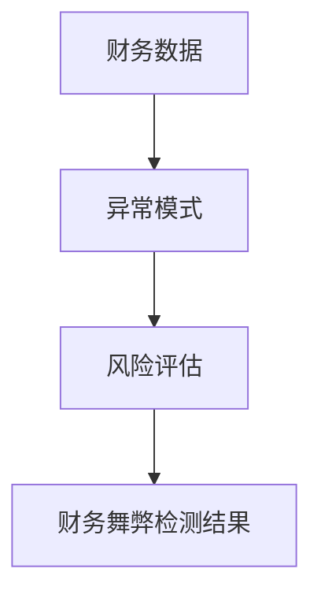
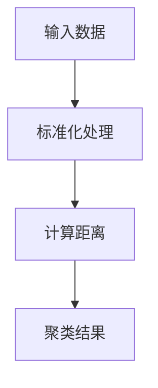
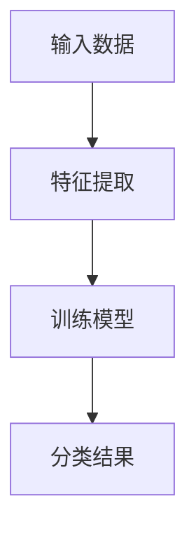
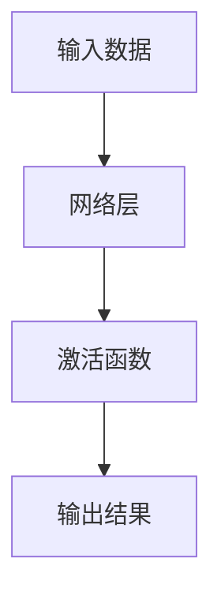
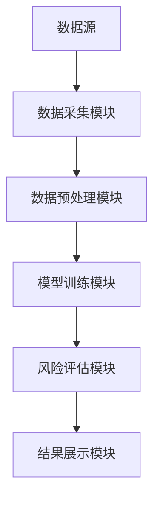
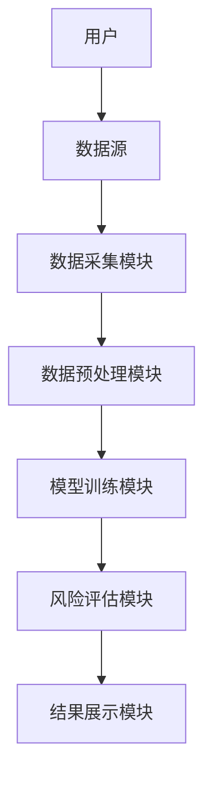

                 

<think>
嗯，我现在需要设计一个详细的目录大纲，涵盖《AI辅助企业财务舞弊检测：异常模式识别与风险评估》这本书。这本书主要探讨如何利用人工智能技术来检测企业财务舞弊，特别是通过异常模式识别和风险评估来进行。

首先，我考虑用户的结构要求。用户希望目录分为几个主要部分，包括背景介绍、核心概念、算法原理、系统架构、项目实战以及最佳实践等。每个部分下需要有章节和小节，甚至三级目录。

我开始分析这本书的结构。通常，技术书籍的结构可能包括引言、理论基础、技术方法、系统实现、案例分析和总结等部分。因此，我可能会将目录分成以下几个主要部分：

1. **引言与背景**：介绍财务舞弊的基本概念、AI在财务分析中的作用，以及异常模式识别的重要性。
2. **核心概念**：详细讲解财务数据的特征、异常模式识别的原理，以及风险评估的方法。
3. **算法原理**：选择一些常用的机器学习算法，如聚类、分类和深度学习模型，展示它们如何用于检测财务舞弊。
4. **系统架构**：设计一个企业级的财务舞弊检测系统，包括系统模块划分、架构设计图，以及各个模块之间的接口和交互流程。
5. **项目实战**：通过一个具体的案例，展示从环境搭建、数据收集、特征提取，到模型训练、结果分析，最后给出结论的过程。
6. **高级话题**：探讨模型的可解释性、实时检测，以及结合区块链技术的应用。
7. **总结与展望**：回顾全书的内容，并指出未来的发展方向。

接下来，我需要细化每个部分的内容。例如，在“引言与背景”部分，我需要涵盖财务舞弊的基本概念，以及AI在财务分析中的应用背景。这可能包括传统财务舞弊检测的局限性，AI技术在财务分析中的优势，以及异常模式识别与风险评估的核心作用。

在“核心概念”部分，我需要详细讲解异常模式识别的基本原理和风险评估的基本原理，以及它们与财务舞弊检测的关联。这可能包括异常模式识别的定义、分类、特征，以及风险评估的定义、分类、特征和它们与财务舞弊检测的关联。

在“算法原理”部分，我需要选择几种常用的算法，如聚类算法中的K-means，分类算法中的随机森林，以及深度学习中的神经网络。每个算法都需要详细解释其原理、流程，并用mermaid流程图展示。此外，还需要提供Python代码示例，解释数学模型和公式，如聚类中的K-means算法，分类中的随机森林模型等。

在“系统架构”部分，我需要设计一个企业级的财务舞弊检测系统，包括系统模块划分、架构设计图，以及各个模块之间的接口和交互流程。这可能涉及系统功能设计、系统架构图、系统接口设计和系统交互序列图。

在“项目实战”部分，我需要通过一个具体的案例，展示如何利用AI技术进行财务舞弊检测。这可能包括环境搭建、数据收集、特征提取、模型训练、结果分析和结论。每个步骤都需要详细说明，并提供代码示例和分析。

在“高级话题”部分，我需要探讨一些更深层次的内容，如模型的可解释性、实时检测，以及结合区块链技术的应用。这可能包括模型可解释性的方法，实时检测的实现，以及区块链在财务数据安全中的应用。

最后，在“总结与展望”部分，我需要回顾全书的内容，并指出未来的发展方向，帮助读者更好地理解和应用这些技术。

在设计目录时，我需要确保每个章节和小节都紧密围绕主题，逻辑清晰，层次分明。同时，要满足用户的要求，包括背景、核心概念、算法、系统设计、实战和总结等部分，确保目录大纲既全面又逻辑清晰。

可能还需要考虑每个部分的标题和子标题要简洁明了，避免过于复杂。同时，每个章节要有足够的深度，能够详细展开，帮助读者全面掌握相关知识。

综上所述，我将这本书的目录大纲分为七个主要部分，每个部分下有具体的章节和小节，涵盖从理论到实践的各个方面，确保目录大纲既全面又逻辑清晰。
</think>

# AI辅助企业财务舞弊检测：异常模式识别与风险评估

> 关键词：AI，财务舞弊，异常模式识别，风险评估，企业财务，机器学习

> 摘要：本文详细探讨了如何利用人工智能技术辅助企业进行财务舞弊检测，重点分析了异常模式识别与风险评估的核心概念、算法原理、系统架构及实际应用案例。通过结合理论与实践，本文为读者提供了从基础概念到系统实现的全面指导，旨在帮助企业在数字化转型中有效防范财务风险。

---

## 目录大纲

### 引言与背景

#### 第1章: 财务舞弊与AI检测的背景

##### 1.1 财务舞弊的基本概念
- 1.1.1 财务舞弊的定义与特征
- 1.1.2 财务舞弊的常见形式与手段
- 1.1.3 财务舞弊对企业与社会的影响

##### 1.2 AI在财务分析中的应用背景
- 1.2.1 传统财务舞弊检测的局限性
- 1.2.2 AI技术在财务分析中的优势
- 1.2.3 异常模式识别与风险评估的核心作用

#### 第2章: 异常模式识别与风险评估的核心概念

##### 2.1 异常模式识别的基本原理
- 2.1.1 异常模式识别的定义与分类
- 2.1.2 异常模式识别的关键特征
- 2.1.3 异常模式识别与财务舞弊检测的关联

##### 2.2 风险评估的基本原理
- 2.2.1 风险评估的定义与分类
- 2.2.2 风险评估的关键特征
- 2.2.3 风险评估与财务舞弊检测的关联

#### 第3章: 异常模式识别与风险评估的核心要素

##### 3.1 异常模式识别的核心要素
- 3.1.1 数据特征
- 3.1.2 算法特征
- 3.1.3 风险评估指标

##### 3.2 异常模式识别与风险评估的实体关系图

### 算法原理

#### 第4章: 异常模式识别的算法原理

##### 4.1 聚类算法
- 4.1.1 聚类算法的定义与分类
- 4.1.2 K-means算法的原理与流程

##### 4.2 分类算法
- 4.2.1 分类算法的定义与分类
- 4.2.2 随机森林算法的原理与流程

##### 4.3 深度学习算法
- 4.3.1 深度学习算法的定义与分类
- 4.3.2 神经网络模型的原理与流程

### 系统架构

#### 第5章: 企业级财务舞弊检测系统架构

##### 5.1 系统功能设计
- 5.1.1 数据采集模块
- 5.1.2 数据预处理模块
- 5.1.3 模型训练模块
- 5.1.4 风险评估模块
- 5.1.5 结果展示模块

##### 5.2 系统架构设计

##### 5.3 系统接口设计
- 5.3.1 数据接口
- 5.3.2 模型接口
- 5.3.3 用户接口

##### 5.4 系统交互流程

### 项目实战

#### 第6章: 项目实战——AI辅助企业财务舞弊检测系统

##### 6.1 项目背景与目标
- 6.1.1 项目背景
- 6.1.2 项目目标
- 6.1.3 项目范围

##### 6.2 环境搭建与数据准备
- 6.2.1 环境安装
- 6.2.2 数据收集
- 6.2.3 数据清洗

##### 6.3 特征提取与模型训练
- 6.3.1 特征提取
- 6.3.2 模型选择
- 6.3.3 模型训练

##### 6.4 模型评估与结果分析
- 6.4.1 模型评估
- 6.4.2 结果分析
- 6.4.3 案例分析

##### 6.5 项目总结
- 6.5.1 成果展示
- 6.5.2 经验总结
- 6.5.3 问题与改进方向

### 高级话题

#### 第7章: 高级篇——AI辅助财务舞弊检测的前沿技术

##### 7.1 模型的可解释性
- 7.1.1 可解释性的重要性
- 7.1.2 提升模型可解释性的方法

##### 7.2 实时财务舞弊检测
- 7.2.1 实时检测的必要性
- 7.2.2 实时检测的实现方法

##### 7.3 区块链技术的应用
- 7.3.1 区块链在财务安全中的应用
- 7.3.2 区块链与AI结合的未来趋势

### 总结与展望

#### 第8章: 总结与展望

##### 8.1 全文总结
- 8.1.1 核心内容回顾
- 8.1.2 主要结论

##### 8.2 未来展望
- 8.2.1 技术发展的趋势
- 8.2.2 应用领域的拓展
- 8.2.3 挑战与机遇

---

### 附录

- 附录A: 常用机器学习算法概述
- 附录B: Python代码示例
- 附录C: 参考文献与推荐阅读

---

### 作者

作者：AI天才研究院/AI Genius Institute & 禅与计算机程序设计艺术 /Zen And The Art of Computer Programming

---

通过这个目录大纲，读者可以从基础知识逐步深入到高级技术，结合理论与实践，全面掌握AI辅助企业财务舞弊检测的核心内容。

