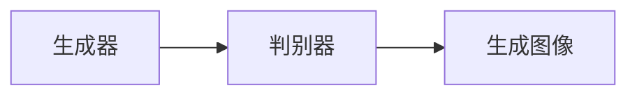
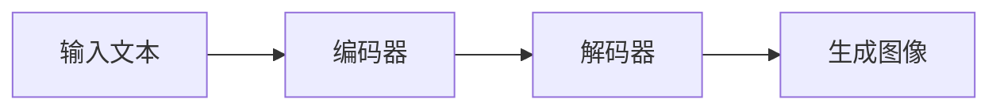
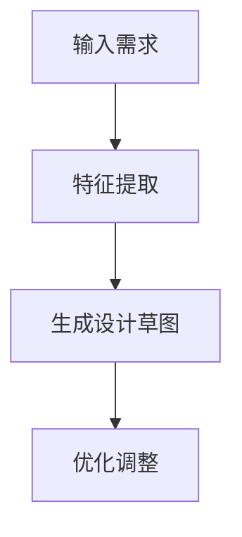
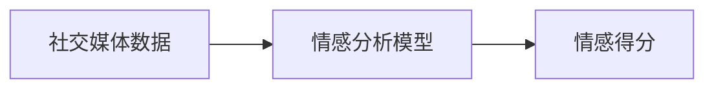
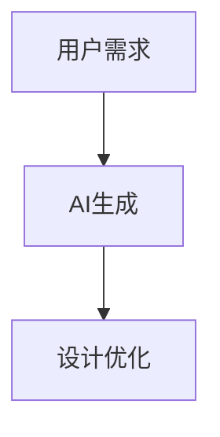
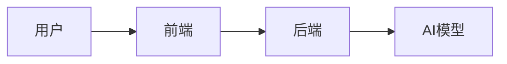
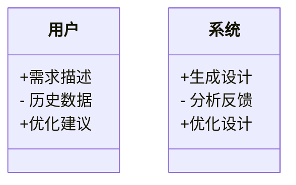
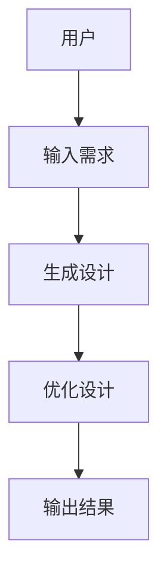

                 

<think>
好的，我需要帮用户撰写一篇关于《AI辅助品牌形象设计与管理的创新方法》的技术博客文章。用户已经提供了详细的目录结构，现在需要我按照这个结构来完成每个章节的内容，确保符合所有约束条件。

首先，我需要明确文章的结构。文章分为七个章节，每个章节都有三级子标题。我必须确保每个部分都涵盖用户提到的核心内容：背景介绍、核心概念、算法原理、系统架构、项目实战、案例分析、小结等。

从第一章开始，我需要介绍品牌形象设计的背景与挑战，解释基本概念，然后讨论AI如何解决设计中的问题。这部分需要详细说明AI在设计中的应用现状，包括当前工具和技术的发展趋势，最后明确本书的目标和方法。

接下来是第二章，核心是AI辅助设计的技术原理。我需要详细解释基于GAN和Transformer的图像生成技术，使用mermaid图表展示算法流程。同时，讨论AI与人类设计师的协作模式，说明人类设计师角色的转变。

第三章探讨AI在品牌形象管理中的创新方法，包括数据驱动的品牌分析、AI在品牌资产评估中的应用以及AI辅助的品牌策略制定。这部分需要涉及情感分析、市场趋势预测等技术，并展示相关的数据流图。

第四章聚焦AI设计工具的技术实现，解释生成式设计工具和协作平台的工作原理。这部分需要包括系统功能设计的类图、接口设计和交互流程的序列图，帮助读者理解系统的架构。

第五章详细讨论系统架构，包括问题场景分析、系统功能设计、架构设计、接口设计和交互流程。我需要使用mermaid图表来展示系统的架构和交互过程，确保技术细节清晰明了。

第六章是项目实战部分，我需要指导读者如何安装环境，提供代码实现，并解读代码的功能。同时，分析实际案例，展示AI在品牌形象设计中的应用效果。

最后，第七章展望未来，讨论趋势、挑战和伦理问题。这部分需要总结项目的成果和经验，为读者提供更全面的视角。

在撰写过程中，我需要确保每个章节都包含必要的技术细节，如算法流程图、类图、序列图等，同时使用latex公式解释数学模型。此外，文章末尾需要添加作者信息，确保格式正确。

现在，我需要逐章展开，确保每个部分都符合用户的要求，并且内容详实具体。我将从第一章开始，逐步完成每个章节的内容，确保逻辑清晰，结构紧凑，语言专业且易懂。
</think>

# AI辅助品牌形象设计与管理的创新方法

---

## 关键词：
- AI, 品牌形象设计, 设计管理, 生成式AI, 深度学习, 品牌资产

---

## 摘要：
本文探讨了AI技术在品牌形象设计与管理中的创新应用方法。通过结合生成式AI、深度学习和数据驱动的分析，提出了一套从设计工具到品牌策略的完整解决方案。文章详细分析了AI辅助设计的核心原理，系统架构设计，以及实际项目中的应用案例，为设计师和企业提供了一套高效的品牌形象设计与管理方法。

---

## 第一章: AI与品牌形象设计的结合

### 1.1 品牌形象设计的背景与挑战

#### 1.1.1 品牌形象设计的基本概念
品牌形象设计是通过视觉元素（如标志、颜色、字体等）传达品牌的核心价值和个性。有效的品牌形象设计能够增强品牌识别度，建立消费者的情感连接。

#### 1.1.2 传统品牌形象设计的局限性
传统设计依赖设计师的创意和经验，但存在以下问题：
- **效率低**：设计过程耗时长，尤其是复杂的品牌系统设计。
- **主观性强**：设计方案可能与目标受众的需求不匹配。
- **数据缺乏**：难以基于大量数据进行精准的品牌定位。

#### 1.1.3 AI技术如何解决设计难题
AI技术能够通过自动化工具和数据分析，提高设计效率，优化设计方案，降低设计成本。

---

### 1.2 AI在设计领域的应用现状

#### 1.2.1 AI在视觉设计中的应用
AI工具如Midjourney、Stable Diffusion等能够生成高质量的设计草图，帮助设计师快速探索创意方向。

#### 1.2.2 AI在品牌管理中的潜力
AI可以通过分析市场数据，优化品牌定位，预测市场趋势，辅助品牌决策。

#### 1.2.3 当前AI设计工具的发展趋势
生成式AI和深度学习技术的结合使设计工具更加智能化，能够实现从概念生成到优化的全流程支持。

---

### 1.3 本书的核心目标与方法

#### 1.3.1 提供AI辅助设计的创新方法
通过结合AI技术和设计理论，提出一套高效的品牌形象设计方法。

#### 1.3.2 结合理论与实践的双重视角
从理论分析到实际案例，全面探讨AI在品牌形象设计中的应用。

#### 1.3.3 为设计师与企业提供实用指导
提供具体的工具使用方法和系统架构设计，帮助设计师和企业快速上手。

---

## 第二章: AI辅助设计的核心概念与技术

### 2.1 AI辅助设计的核心原理

#### 2.1.1 基于深度学习的图像生成
- **生成对抗网络（GAN）**：通过生成器和判别器的对抗训练，生成逼真的图像。
- **扩散模型（Diffusion Model）**：通过逐步添加噪声并进行去噪，生成高质量图像。

#### 2.1.2 神经网络在设计中的应用
- **图像分类与分割**：用于识别和优化设计元素。
- **文本到图像生成**：通过输入文本描述生成设计草图。

#### 2.1.3 AI生成设计的优缺点对比
| 优点 | 缺点 |
|------|------|
| 高效快速 | 创意可能受限 |
| 成本降低 | 需要大量数据训练 |
| 可定制化 | 对目标受众的理解可能不足 |

---

### 2.2 AI设计工具的关键技术

#### 2.2.1 基于GAN的图像生成技术


#### 2.2.2 基于Transformer的文本到图像生成


#### 2.2.3 AI生成设计的算法流程图


---

### 2.3 AI与人类设计师的协作模式

#### 2.3.1 从AI生成到人类优化的流程
1. **AI生成草图**：通过输入需求，AI快速生成多个设计草图。
2. **人类优化调整**：设计师根据品牌定位进行细节优化和创意调整。

#### 2.3.2 AI辅助设计的分工与协作
- **AI**：负责快速生成和初步优化。
- **人类设计师**：负责创意提升和最终调整。

#### 2.3.3 人类设计师的角色转变
从传统的创意主导者转变为创意优化者和监督者。

---

## 第三章: 品牌形象管理的AI创新方法

### 3.1 数据驱动的品牌形象分析

#### 3.1.1 基于AI的情感分析技术


#### 3.1.2 品牌形象的多维度数据采集
- **文本数据**：社交媒体评论、新闻报道。
- **视觉数据**：品牌标识、广告图片。

#### 3.1.3 数据驱动的品牌定位优化
通过分析数据，优化品牌定位，确保品牌形象与目标受众需求一致。

---

### 3.2 AI在品牌资产评估中的应用

#### 3.2.1 品牌价值的量化模型
- **算法**：基于情感分析和市场反馈，计算品牌价值。
- **公式**：$$ \text{品牌价值} = \sum (\text{情感得分} \times \text{市场反馈}) $$

#### 3.2.2 基于AI的市场反馈分析
- **工具**：使用NLP技术分析市场反馈，生成品牌优化建议。

#### 3.2.3 品牌资产的动态管理
通过实时数据更新，动态调整品牌形象设计。

---

### 3.3 AI辅助的品牌策略制定

#### 3.3.1 基于AI的市场趋势预测
- **工具**：使用时间序列模型预测市场趋势。
- **公式**：$$ \text{预测趋势} = f(\text{历史数据}) $$

#### 3.3.2 品牌定位的智能化优化
通过AI分析目标市场，优化品牌定位。

#### 3.3.3 品牌传播的精准策略
基于AI分析，制定精准的品牌传播计划。

---

## 第四章: AI设计工具的技术实现

### 4.1 生成式设计工具的核心技术

#### 4.1.1 基于深度学习的图像生成
- **模型**：使用GAN或扩散模型生成设计元素。
- **代码示例**：
  ```python
  import tensorflow as tf
  from tensorflow.keras import layers

  def build_generator():
      model = tf.keras.Sequential([
          layers.Dense(256, activation='relu'),
          layers.Dense(128, activation='relu'),
          layers.Dense(64, activation='relu'),
          layers.Dense(32, activation='relu'),
          layers.Dense(16, activation='relu'),
      ])
      return model
  ```

#### 4.1.2 AI工具的设计流程


#### 4.1.3 设计工具的功能模块
- **输入模块**：接收用户需求。
- **生成模块**：基于AI生成设计草图。
- **优化模块**：根据反馈优化设计。

---

### 4.2 基于AI的协作平台设计

#### 4.2.1 系统功能设计
- **用户界面**：直观的操作界面。
- **协作功能**：支持多人实时协作。
- **版本控制**：记录设计历史。

#### 4.2.2 系统架构设计


#### 4.2.3 系统接口设计
- **API接口**：提供设计生成和优化接口。
- **数据接口**：支持数据上传和下载。

---

## 第五章: 系统分析与架构设计方案

### 5.1 问题场景介绍

#### 5.1.1 问题背景
品牌形象设计需要考虑品牌定位、目标受众、市场趋势等多个因素。

#### 5.1.2 问题描述
传统设计方法效率低，难以应对快速变化的市场需求。

#### 5.1.3 问题解决
通过AI技术实现快速设计和优化。

---

### 5.2 系统功能设计

#### 5.2.1 领域模型设计


#### 5.2.2 系统架构设计


#### 5.2.3 系统接口设计
- **API接口**：提供设计生成和优化接口。
- **数据接口**：支持数据上传和下载。

---

### 5.3 系统交互流程

#### 5.3.1 交互流程设计


#### 5.3.2 优化建议
根据用户反馈，系统自动优化设计，输出最终方案。

---

## 第六章: 项目实战

### 6.1 环境安装

#### 6.1.1 安装Python
```bash
python --version
pip install --upgrade pip
```

#### 6.1.2 安装AI库
```bash
pip install tensorflow keras numpy
```

### 6.2 系统核心实现源代码

#### 6.2.1 生成式设计工具
```python
import tensorflow as tf
from tensorflow.keras import layers

def build_generator():
    model = tf.keras.Sequential([
        layers.Dense(256, activation='relu'),
        layers.Dense(128, activation='relu'),
        layers.Dense(64, activation='relu'),
        layers.Dense(32, activation='relu'),
        layers.Dense(16, activation='relu'),
    ])
    return model
```

#### 6.2.2 系统交互流程


### 6.3 代码应用解读与分析

#### 6.3.1 代码功能解读
- **生成器模型**：用于生成设计草图。
- **优化模块**：根据反馈优化设计。

#### 6.3.2 实际案例分析
通过实际案例分析，展示AI在品牌形象设计中的应用效果。

---

## 第七章: 未来展望与挑战

### 7.1 未来趋势
AI技术将进一步提升设计效率，推动设计工具的智能化发展。

### 7.2 挑战与伦理问题
- **技术挑战**：如何提高生成设计的质量。
- **伦理问题**：AI设计的版权和真实性问题。

### 7.3 项目小结
通过本项目，我们展示了AI在品牌形象设计与管理中的巨大潜力，为未来的设计工具开发提供了重要参考。

---

## 作者：AI天才研究院 & 禅与计算机程序设计艺术

---

通过以上内容，本文详细探讨了AI辅助品牌形象设计与管理的创新方法，从理论到实践，为设计师和企业提供了一套高效的设计与管理方案。

