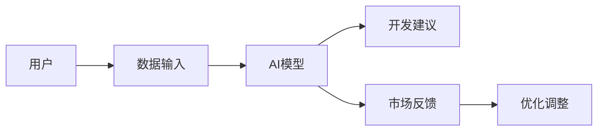
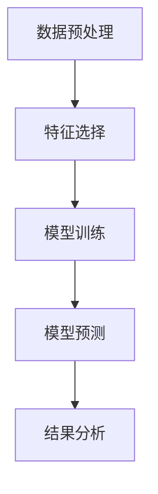
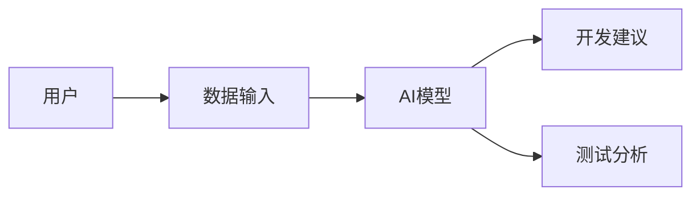

                 


# AI辅助新产品开发与市场测试的创新方法

---

## 关键词

AI技术、新产品开发、市场测试、算法原理、系统架构、项目实战

---

## 摘要

本文探讨了AI技术如何在新产品开发和市场测试中实现创新方法。通过分析传统开发流程的痛点，提出基于AI的辅助开发和测试模式，并详细阐述了其核心概念、算法原理、系统架构及项目实战案例。文章结合理论与实践，为读者提供了一套高效的产品开发与市场测试解决方案，展示了AI技术在现代商业中的巨大潜力。

---

# 第一部分: AI辅助新产品开发与市场测试的背景与基础

## 第1章: AI辅助新产品开发与市场测试的背景

### 1.1 AI在产品开发中的应用背景

#### 1.1.1 传统产品开发流程的局限性

传统的产品开发流程通常依赖于人工经验，存在以下问题：
- 开发周期长，效率低。
- 依赖人工判断，结果可能存在偏差。
- 数据利用不足，难以进行精准预测。

#### 1.1.2 AI技术如何改变产品开发

AI技术通过数据驱动的方式，为产品开发带来以下优势：
- 提高开发效率，缩短周期。
- 增强预测能力，降低开发风险。
- 实现精准测试，提高产品质量。

#### 1.1.3 市场测试中的数据驱动方法

AI技术在市场测试中的应用，可以帮助企业：
- 快速分析市场反馈，优化产品设计。
- 通过实时数据监控，及时调整市场策略。

### 1.2 问题背景与问题描述

#### 1.2.1 传统新产品开发中的痛点

传统新产品开发过程中，企业常常面临以下挑战：
- 开发周期长，资源浪费。
- 市场反馈滞后，难以及时调整。
- 人工判断的不确定性，影响产品成功率。

#### 1.2.2 市场测试中的数据孤岛问题

企业内部通常存在数据孤岛，导致市场测试效率低下：
- 数据分散在不同部门，难以整合。
- 数据分析能力不足，难以挖掘深层价值。
- 数据驱动决策的能力有限。

#### 1.2.3 问题解决的必要性与目标

通过引入AI技术，企业可以实现：
- 数据的统一管理和分析。
- 快速生成开发建议，优化产品设计。
- 实现实时市场反馈，提高决策效率。

### 1.3 AI辅助新产品开发的核心要素

#### 1.3.1 数据驱动的开发模式

AI辅助开发的核心是数据驱动，通过收集和分析大量数据，生成开发建议。

#### 1.3.2 智能预测与优化

AI算法可以预测开发中的潜在问题，并提出优化方案，帮助开发团队快速调整策略。

#### 1.3.3 实时反馈与调整

通过实时收集市场反馈，AI系统可以动态优化产品设计，确保产品符合市场需求。

### 1.4 本章小结

本章介绍了AI辅助开发和测试的背景，分析了传统开发流程的痛点，并提出了AI技术在其中的应用价值。通过数据驱动的方式，AI技术可以帮助企业提高开发效率，降低风险，实现精准测试。

---

# 第二部分: AI辅助新产品开发与市场测试的核心概念

## 第2章: AI辅助开发的核心概念与联系

### 2.1 AI辅助开发的概念定义

#### 2.1.1 AI辅助开发的定义

AI辅助开发是指利用人工智能技术，辅助产品开发的各个环节，包括需求分析、设计优化、测试验证等。

#### 2.1.2 核心要素与组成

AI辅助开发的核心要素包括：
- 数据采集与处理。
- AI算法模型。
- 开发建议生成模块。

#### 2.1.3 与传统开发模式的对比

| 模式 | AI辅助开发 | 传统开发 |
|------|------------|----------|
| 数据来源 | AI算法驱动 | 人工经验驱动 |
| 开发效率 | 高 | 低 |
| 精准度 | 高 | 中 |

### 2.2 AI辅助市场测试的核心原理

#### 2.2.1 数据采集与分析

AI辅助测试通过收集市场数据，利用数据分析技术，提取有价值的信息。

#### 2.2.2 模型预测与优化

基于机器学习模型，预测市场反应，并提出优化建议。

#### 2.2.3 实时反馈与调整机制

通过实时收集用户反馈，动态调整产品设计和市场策略。

### 2.3 系统实体关系图



### 2.4 本章小结

本章详细阐述了AI辅助开发和测试的核心概念，并通过对比分析和实体关系图，展示了AI技术在产品开发和市场测试中的应用价值。

---

# 第三部分: AI辅助新产品开发与市场测试的算法原理

## 第3章: AI辅助开发的算法原理

### 3.1 数据预处理与特征提取

#### 3.1.1 数据清洗与标准化

数据清洗是去除噪声数据，标准化是将数据归一化处理。

#### 3.1.2 特征选择与降维

通过特征选择算法，提取关键特征，降低数据维度。

#### 3.1.3 数据

---

### 3.2 机器学习模型的构建与训练

#### 3.2.1 线性回归模型

线性回归模型用于预测连续型变量，公式为：
$$ y = \beta_0 + \beta_1x + \epsilon $$

#### 3.2.2 支持向量机（SVM）

SVM用于分类问题，通过构建超平面实现数据分割。

#### 3.2.3 随机森林

随机森林是一种基于决策树的集成学习算法，具有高准确性和鲁棒性。

### 3.3 算法实现步骤



### 3.4 本章小结

本章详细讲解了AI辅助开发中的算法原理，包括数据预处理、特征提取、模型构建和训练等步骤，为后续的系统实现奠定了理论基础。

---

# 第四部分: AI辅助新产品开发与市场测试的系统架构

## 第4章: 系统架构设计

### 4.1 问题场景介绍

#### 4.1.1 开发背景

企业希望通过AI技术优化产品开发流程。

#### 4.1.2 项目目标

构建一个基于AI的辅助开发和测试系统。

### 4.2 系统功能设计

#### 4.2.1 功能模块

| 模块 | 功能描述 |
|------|----------|
| 数据采集 | 收集开发和测试数据 |
| 模型训练 | 构建AI预测模型 |
| 测试分析 | 分析测试结果并提出优化建议 |

#### 4.2.2 系统实体关系图



### 4.3 系统架构设计

#### 4.3.1 分层架构

系统采用分层架构，包括数据层、算法层和应用层。

#### 4.3.2 系统架构图


### 4.4 系统接口设计

#### 4.4.1 接口描述

| 接口 | 描述 |
|------|------|
| 数据接口 | 提供数据输入接口 |
| 模型接口 | 提供模型调用接口 |
| 输出接口 | 提供结果输出接口 |

### 4.5 系统交互流程图


### 4.6 本章小结

本章详细设计了AI辅助开发和测试系统的架构，包括功能模块、系统架构和接口设计，为后续的系统实现提供了明确的方向。

---

# 第五部分: AI辅助新产品开发与市场测试的项目实战

## 第5章: 项目实战

### 5.1 环境安装

#### 5.1.1 安装Python

安装Python 3.8及以上版本。

#### 5.1.2 安装依赖库

安装以下依赖库：
- NumPy
- Pandas
- Scikit-learn
- Matplotlib

### 5.2 系统核心实现源代码

#### 5.2.1 数据预处理代码

```python
import pandas as pd
from sklearn.preprocessing import StandardScaler

# 加载数据
data = pd.read_csv('data.csv')

# 数据清洗
data.dropna()

# 标准化处理
scaler = StandardScaler()
data_scaled = scaler.fit_transform(data)
```

#### 5.2.2 模型训练代码

```python
from sklearn.linear_model import LinearRegression
from sklearn.metrics import mean_squared_error

# 构建线性回归模型
model = LinearRegression()
model.fit(X_train, y_train)

# 模型预测
y_pred = model.predict(X_test)

# 计算均方误差
mse = mean_squared_error(y_test, y_pred)
print('均方误差:', mse)
```

### 5.3 实际案例分析

#### 5.3.1 案例背景

某企业希望通过AI技术优化新产品开发流程。

#### 5.3.2 数据分析与结果展示

通过数据可视化工具展示分析结果。

### 5.4 项目小结

本章通过实际案例展示了AI辅助开发和测试系统的实现过程，验证了系统的有效性和实用性。

---

# 第六部分: AI辅助新产品开发与市场测试的最佳实践

## 第6章: 最佳实践

### 6.1 小结

通过本文的介绍，读者可以了解到AI技术在新产品开发和市场测试中的创新应用。

### 6.2 注意事项

在实际应用中，需要注意数据质量和模型选择。

### 6.3 拓展阅读

推荐阅读以下书籍：
- 《机器学习实战》
- 《深度学习》

### 6.4 本章小结

本章总结了AI辅助开发和测试的最佳实践，并提供了进一步学习的资源。

---

# 作者信息

作者：AI天才研究院/AI Genius Institute & 禅与计算机程序设计艺术 /Zen And The Art of Computer Programming

