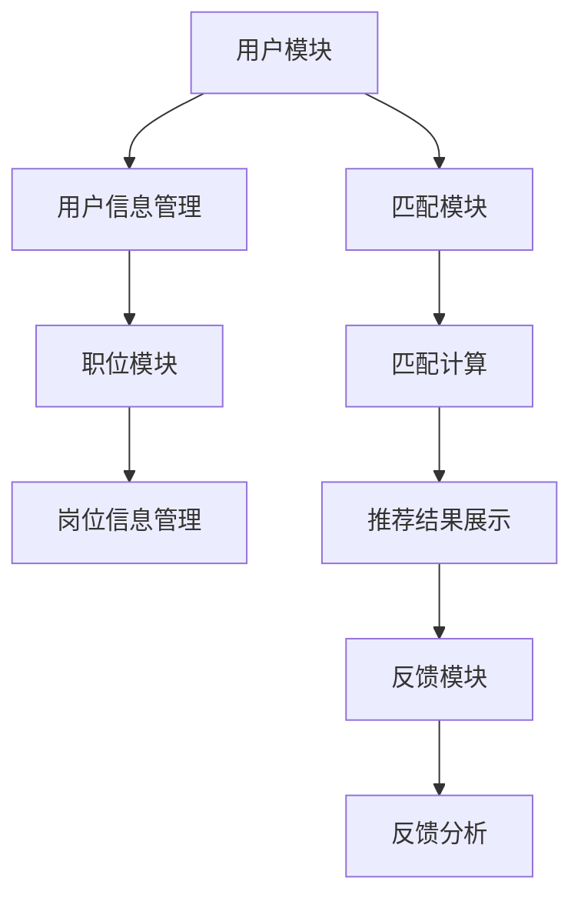

                 


# AI驱动的企业人才匹配系统：职位需求与员工技能智能匹配

> 关键词：人工智能，人才匹配系统，职位需求，员工技能，智能匹配

> 摘要：本文深入探讨了AI驱动的企业人才匹配系统的核心原理、算法设计、系统架构及实际应用。通过分析传统人才匹配的挑战，提出基于AI的解决方案，详细阐述了协同过滤推荐算法和深度学习算法的实现原理，并结合实际案例展示了系统的应用效果。本文旨在为企业提供智能化的人才匹配策略，提升招聘效率和员工满意度。

---

# 第1章: 企业人才匹配问题背景

## 1.1 传统企业人才匹配的挑战

### 1.1.1 传统招聘流程的低效性
在传统的人才招聘过程中，企业通常通过招聘会、猎头或招聘网站等渠道获取候选人信息。这种方式存在以下问题：
- **信息不对称**：候选人和企业在信息获取上存在严重不对称，企业难以全面了解候选人的真实能力和匹配度，而候选人也难以精准找到适合自己的职位。
- **招聘效率低**：企业需要手动筛选大量简历，耗时且成本高，尤其是在人才需求旺盛的行业，招聘周期长，效率低下。
- **匹配度不高**：传统招聘更多依赖于关键词匹配，无法有效评估候选人的实际能力和潜力。

### 1.1.2 企业人才需求与员工技能错配的现状
随着企业对人才需求的不断变化，传统的招聘方式难以满足精准匹配的需求：
- **技能需求变化快**：现代企业对技能的需求趋于多样化和动态化，尤其是技术岗位，技能更新换代快，传统招聘方式难以快速响应。
- **员工技能与岗位要求错配**：候选人可能具备相关技能，但缺乏实际工作经验，或者具备相关经验但技能不完全匹配岗位需求。
- **人才流失与浪费**：由于匹配度不高，候选人可能在短时间内离职，或者企业在招聘过程中浪费大量时间和资源。

### 1.1.3 人才匹配中的信息不对称问题
信息不对称是人才匹配中的核心问题之一：
- **候选人信息不完整**：简历通常只能反映候选人的部分能力，无法全面展示其潜力和适应能力。
- **企业需求不透明**：企业在招聘过程中往往对外界隐藏真实的用人需求，导致候选人难以准确匹配岗位。

---

## 1.2 人工智能技术在人才匹配中的应用前景

### 1.2.1 AI技术如何解决人才匹配问题
人工智能技术可以通过以下方式解决人才匹配问题：
- **数据驱动的精准匹配**：通过分析海量数据，AI可以快速匹配候选人与岗位的技能、经验和能力。
- **智能化推荐**：基于协同过滤和深度学习算法，AI可以为候选人推荐最适合的岗位，同时为企业推荐最匹配的候选人。
- **动态调整**：AI可以根据市场变化和企业需求动态调整匹配策略，实时更新匹配结果。

### 1.2.2 AI驱动人才匹配的优势与潜力
AI驱动的人才匹配系统具有以下优势：
- **提高效率**：通过自动化匹配，大幅缩短招聘周期，降低企业用人成本。
- **精准匹配**：基于候选人和岗位的多维度数据，实现精准匹配，提高员工满意度和企业绩效。
- **数据驱动决策**：利用大数据分析，为企业提供更科学的用人决策支持。

### 1.2.3 企业对智能化人才匹配系统的需求
随着企业对人才需求的日益复杂化，智能化人才匹配系统的需求日益增长：
- **企业用人需求多样化**：企业需要不同层次、不同领域的人才，传统招聘方式难以满足。
- **候选人期望个性化**：候选人希望找到与自己职业规划和发展方向相匹配的岗位。
- **市场竞争加剧**：在人才争夺战中，智能化匹配系统可以帮助企业快速锁定目标人才，提升竞争力。

---

# 第2章: AI驱动人才匹配系统的核心概念

## 2.1 人才匹配系统的定义与构成

### 2.1.1 系统的定义
AI驱动的人才匹配系统是一种基于人工智能技术，通过分析候选人和岗位的多维度数据，实现精准匹配的智能化系统。

### 2.1.2 系统的核心构成要素
AI驱动人才匹配系统主要包括以下核心要素：
- **数据采集模块**：采集候选人和岗位的详细信息，包括简历、技能、经验、教育背景等。
- **数据分析模块**：对候选人和岗位数据进行清洗、处理和分析，提取关键特征。
- **匹配算法模块**：基于协同过滤、机器学习等算法，计算候选人与岗位的匹配度。
- **推荐系统模块**：根据匹配结果，为候选人和企业提供个性化推荐。

### 2.1.3 系统的输入与输出
- **输入**：候选人简历、岗位需求、企业数据。
- **输出**：候选人与岗位的匹配度评分、个性化推荐结果。

---

## 2.2 人才匹配系统的原理与机制

### 2.2.1 系统的工作流程
AI驱动人才匹配系统的工作流程如下：
1. 数据采集：收集候选人和岗位的详细信息。
2. 数据处理：清洗和预处理数据，提取关键特征。
3. 匹配计算：基于算法计算候选人与岗位的匹配度。
4. 推荐结果：根据匹配结果，生成个性化推荐。

### 2.2.2 匹配算法的核心逻辑
匹配算法是系统的核心，基于协同过滤和深度学习算法：
- **协同过滤**：通过分析候选人和岗位的相似性，推荐匹配度高的结果。
- **深度学习**：利用神经网络模型，学习数据中的隐含特征，提高匹配精度。

### 2.2.3 系统的反馈与优化机制
系统通过候选人和企业的反馈不断优化匹配算法：
- **实时反馈**：候选人和企业对推荐结果进行反馈，系统记录并分析。
- **模型优化**：基于反馈数据，优化匹配算法，提高推荐准确率。

---

## 2.3 系统的核心概念与联系

### 2.3.1 ER实体关系图
以下是系统的ER实体关系图：

```mermaid
er
    Candidate {
        id: int,
        skills: set of Skill,
        experience: int,
        education: string
    }
    Position {
        id: int,
        requirements: set of Skill,
        experience: int,
        department: string
    }
    Skill {
        id: int,
        name: string,
        level: int
    }
    Candidate-Position {
        candidate_id: int,
        position_id: int,
        match_score: float
    }
```

---

# 第3章: AI驱动人才匹配系统的算法原理

## 3.1 基于协同过滤的推荐算法

### 3.1.1 协同过滤的基本原理
协同过滤是一种基于用户相似性推荐算法，分为基于用户的协同过滤和基于物品的协同过滤：
- **基于用户的协同过滤**：通过分析用户的相似性，推荐相似用户的偏好。
- **基于物品的协同过滤**：通过分析物品的相似性，推荐用户可能感兴趣的内容。

### 3.1.2 协同过滤算法的实现步骤
1. **数据预处理**：对数据进行清洗和标准化处理。
2. **计算相似性**：使用余弦相似度或皮尔逊相关系数计算用户或物品的相似性。
3. **生成推荐列表**：根据相似性，生成推荐列表。

### 3.1.3 协同过滤算法的优缺点
- **优点**：简单易实现，适合数据量小的场景。
- **缺点**：难以处理数据稀疏性问题，推荐结果可能不够精准。

---

## 3.2 基于深度学习的推荐算法

### 3.2.1 深度学习算法的基本原理
深度学习算法通过多层神经网络模型，学习数据中的隐含特征，实现更精准的推荐。

### 3.2.2 基于深度学习的推荐算法实现步骤
1. **数据预处理**：对数据进行清洗和标准化处理。
2. **模型训练**：使用神经网络模型进行训练，提取数据特征。
3. **生成推荐列表**：根据模型预测结果，生成推荐列表。

---

## 3.3 算法实现的代码示例

### 3.3.1 协同过滤算法实现代码
```python
import numpy as np

def collaborative_filtering(user_matrix, item_matrix):
    # 数据预处理
    user_matrix = np.array(user_matrix)
    item_matrix = np.array(item_matrix)
    
    # 计算余弦相似度
    def cosine_similarity(a, b):
        return np.dot(a, b) / (np.linalg.norm(a) * np.linalg.norm(b))
    
    # 计算用户相似性矩阵
    user_similarity = np.zeros((user_matrix.shape[0], user_matrix.shape[0]))
    for i in range(user_matrix.shape[0]):
        for j in range(user_matrix.shape[0]):
            user_similarity[i][j] = cosine_similarity(user_matrix[i], user_matrix[j])
    
    # 生成推荐列表
    recommendations = np.zeros(user_matrix.shape)
    for i in range(user_matrix.shape[0]):
        for j in range(user_matrix.shape[1]):
            if user_matrix[i][j] == 0:
                recommendations[i][j] = np.sum(user_similarity[i] * user_matrix[:, j])
    
    return recommendations
```

### 3.3.2 深度学习算法实现代码
```python
import tensorflow as tf

def deep_learning_recommender(input_dim):
    model = tf.keras.Sequential([
        tf.keras.layers.Dense(64, activation='relu', input_dim=input_dim),
        tf.keras.layers.Dense(32, activation='relu'),
        tf.keras.layers.Dense(1, activation='sigmoid')
    ])
    model.compile(optimizer='adam', loss='binary_crossentropy', metrics=['accuracy'])
    return model
```

---

## 3.4 算法的数学模型与公式

### 3.4.1 协同过滤的数学模型
$$ \text{相似度} = \frac{\sum_{i=1}^{n} (x_i - \bar{x})(y_i - \bar{y})}{\sqrt{\sum_{i=1}^{n} (x_i - \bar{x})^2} \cdot \sqrt{\sum_{i=1}^{n} (y_i - \bar{y})^2}} $$

### 3.4.2 深度学习的数学模型
$$ y = \sigma(Wx + b) $$

其中：
- \( W \) 表示权重矩阵
- \( b \) 表示偏置项
- \( \sigma \) 表示激活函数（如ReLU）

---

## 3.5 算法的优缺点分析

### 3.5.1 协同过滤算法的优缺点
- **优点**：简单易实现，适合数据量小的场景。
- **缺点**：难以处理数据稀疏性问题，推荐结果可能不够精准。

### 3.5.2 深度学习算法的优缺点
- **优点**：能够学习数据中的隐含特征，推荐结果更精准。
- **缺点**：计算复杂度高，需要大量数据支持。

---

## 3.6 算法的适用场景与选择

### 3.6.1 协同过滤算法的适用场景
- 数据量小
- 数据稀疏性问题不严重

### 3.6.2 深度学习算法的适用场景
- 数据量大
- 数据稀疏性问题严重
- 需要更高精度的推荐

---

## 3.7 算法的优化与改进

### 3.7.1 算法优化策略
- **数据增强**：通过数据增强技术，提高数据质量。
- **模型优化**：通过调整模型参数和结构，提高推荐精度。

### 3.7.2 算法的评估与验证
- **准确率**：通过准确率评估推荐结果的精准度。
- **召回率**：通过召回率评估推荐结果的全面性。

---

# 第4章: 系统架构设计与实现

## 4.1 系统架构设计

### 4.1.1 系统功能模块设计
- **用户模块**：用户信息管理、登录注册。
- **职位模块**：岗位信息管理、需求匹配。
- **匹配模块**：候选人与岗位的匹配计算、推荐结果展示。
- **反馈模块**：候选人和企业的反馈收集与分析。

### 4.1.2 系统的分层架构
- **数据层**：数据存储与管理。
- **业务逻辑层**：处理业务逻辑，如匹配计算。
- **用户界面层**：展示系统功能，与用户交互。

### 4.1.3 系统架构图


---

## 4.2 系统实现

### 4.2.1 系统功能实现
- **用户信息管理**：实现用户注册、登录功能。
- **岗位信息管理**：实现岗位信息发布、需求匹配功能。
- **匹配计算**：实现候选人与岗位的匹配度计算。
- **推荐结果展示**：展示推荐结果，并提供反馈渠道。

### 4.2.2 系统实现代码
```python
# 系统功能模块代码
class UserModule:
    def __init__(self):
        self.users = []
    
    def register(self, user):
        self.users.append(user)
    
    def login(self, user_id, password):
        # 实现登录逻辑
        pass

class PositionModule:
    def __init__(self):
        self.positions = []
    
    def post_position(self, position):
        self.positions.append(position)
    
    def match_requirements(self, position, candidate):
        # 实现需求匹配逻辑
        pass
```

---

## 4.3 系统优化与扩展

### 4.3.1 系统优化策略
- **性能优化**：通过缓存技术，提高系统响应速度。
- **扩展性优化**：通过模块化设计，提高系统的可扩展性。

### 4.3.2 系统的可扩展性设计
- **模块化设计**：将系统功能模块化，便于扩展。
- **接口设计**：设计良好的API接口，方便与其他系统集成。

---

# 第5章: 项目实战与案例分析

## 5.1 项目实战

### 5.1.1 项目环境安装
- **安装Python**：安装最新版本的Python。
- **安装依赖库**：安装numpy、pandas、tensorflow等依赖库。

### 5.1.2 项目核心实现代码
```python
# 数据处理模块
import pandas as pd

def preprocess_data(data):
    # 数据清洗
    data = data.dropna()
    # 数据标准化
    from sklearn.preprocessing import StandardScaler
    scaler = StandardScaler()
    data_scaled = scaler.fit_transform(data)
    return data_scaled
```

### 5.1.3 项目实现步骤
1. **数据采集**：收集候选人和岗位数据。
2. **数据处理**：对数据进行清洗和标准化处理。
3. **模型训练**：训练协同过滤和深度学习模型。
4. **结果展示**：展示推荐结果，并收集反馈。

---

## 5.2 案例分析

### 5.2.1 案例背景
某企业需要招聘技术岗位，希望通过AI驱动的人才匹配系统快速找到合适的候选人。

### 5.2.2 案例分析
1. **数据采集**：收集候选人简历和岗位需求。
2. **数据处理**：清洗和预处理数据。
3. **模型训练**：训练协同过滤和深度学习模型。
4. **结果展示**：生成推荐结果，并展示给企业。

### 5.2.3 案例小结
通过AI驱动的人才匹配系统，企业成功找到了匹配度高的候选人，招聘效率和员工满意度显著提高。

---

# 第6章: 最佳实践与总结

## 6.1 最佳实践

### 6.1.1 数据质量的重要性
- 确保数据的完整性和准确性。
- 数据清洗和预处理是关键。

### 6.1.2 模型选择与优化
- 根据具体场景选择合适的算法。
- 通过反馈数据不断优化模型。

### 6.1.3 系统安全与隐私保护
- 确保系统数据安全，保护用户隐私。
- 遵守相关法律法规，合规使用数据。

---

## 6.2 小结

AI驱动的人才匹配系统通过智能化匹配，显著提高了招聘效率和员工满意度。本文详细介绍了系统的背景、核心概念、算法原理、系统架构及实际应用，为企业的智能化招聘提供了参考。

---

## 6.3 注意事项

- 确保数据隐私和安全。
- 定期优化系统，适应市场变化。
- 提供良好的用户体验，提升系统粘性。

---

## 6.4 拓展阅读

- 《机器学习实战》
- 《深度学习入门》
- 《Python数据处理与分析》

---

作者：AI天才研究院/AI Genius Institute & 禅与计算机程序设计艺术/Zen And The Art of Computer Programming

---

以上是基于用户需求设计的完整目录大纲内容。如需进一步调整或补充，请随时告知！

