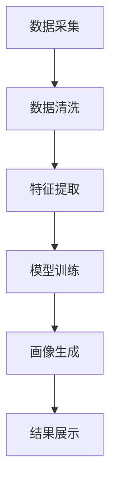
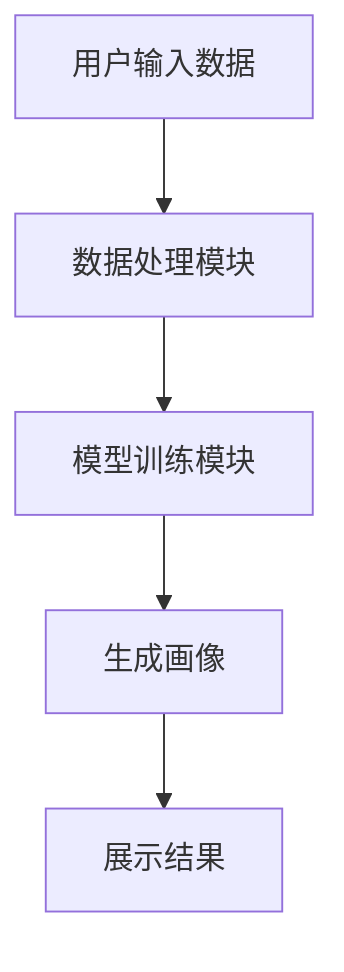

                 

<think>
好的，我现在要帮用户完成《AI驱动的企业人才画像系统：全方位员工能力评估》这本书的目录大纲。用户已经提供了一个详细的大纲，分为四部分，每部分有具体的章节和小节。我的任务是根据这个大纲，按照用户的指示，逐步完成整篇文章的内容。

首先，我需要理解用户的需求。用户希望我以技术专家的身份，撰写一篇结构紧凑、逻辑清晰、技术深度高的博客文章。内容涉及AI驱动的企业人才画像系统，重点是全方位员工能力评估。

接下来，我需要按照用户提供的目录大纲，逐步完成每一部分的内容。每部分需要详细展开，包括背景介绍、核心概念、算法原理、系统架构、项目实战和最佳实践。

在撰写过程中，我需要确保每一部分都符合用户的要求：使用专业技术语言，逻辑清晰，结构紧凑，简单易懂。同时，要包含必要的技术细节，如数学公式、代码示例、表格和图表，以增强文章的深度和可读性。

我需要先撰写摘要部分，然后依次完成每一章的各个小节。在撰写过程中，要注意每个章节的衔接和整体的流畅性，确保读者能够轻松跟随思路，逐步理解AI在人才评估中的应用。

最后，完成整篇文章后，还需要添加作者信息，确保格式正确，内容完整。

总结一下，我的步骤是：
1. 理解用户需求和目录大纲。
2. 按照大纲，逐步撰写每一部分的内容。
3. 确保技术细节和格式要求符合用户指示。
4. 检查内容的完整性和逻辑性，进行必要的修改和调整。
5. 添加作者信息，完成整篇文章。

现在，我开始按照这个步骤，逐步完成整篇博客文章的内容。
</think>

# AI驱动的企业人才画像系统：全方位员工能力评估

> 关键词：AI技术，人才画像，员工能力评估，机器学习，企业人才管理，深度学习

> 摘要：随着企业数字化转型的深入，AI技术在人才管理中的应用越来越广泛。本文将详细介绍AI驱动的企业人才画像系统，从系统背景、核心概念、算法原理到系统架构、项目实战，最后总结最佳实践。通过本文，读者将全面了解如何利用AI技术进行员工能力评估，优化企业人才管理流程。

## 第一部分: AI驱动的企业人才画像系统概述

### 第1章: 企业人才画像的背景与意义

#### 1.1 人才画像的定义与内涵

- **1.1.1 人才画像的定义**
  人才画像是一种基于数据和AI技术的员工能力评估方法，通过收集和分析员工的多维度数据，构建个性化的员工能力模型，帮助企业更准确地识别和培养人才。

- **1.1.2 人才画像的核心要素**
  人才画像是一个多维度的能力模型，包括但不限于技能水平、工作表现、潜力评估、价值观匹配度等。通过这些要素的综合分析，可以全面评估员工的能力和发展潜力。

- **1.1.3 人才画像的业务价值**
  人才画像是企业优化人力资源管理的重要工具，能够帮助企业实现精准招聘、个性化培训、高效绩效管理和人才储备。

#### 1.2 AI技术在人才评估中的应用背景

- **1.2.1 传统人才评估的局限性**
  传统的人才评估方法依赖于主观判断和有限的数据，存在评估结果不准确、难以量化和难以预测员工潜力等问题。

- **1.2.2 AI技术在人才评估中的优势**
  AI技术能够通过大数据分析和机器学习算法，提取员工的多维度特征，构建更精准的能力模型，帮助企业在人才管理中做出更科学的决策。

- **1.2.3 企业数字化转型与AI技术的结合**
  随着企业数字化转型的推进，AI技术在人才管理中的应用越来越广泛，企业通过AI技术实现人才画像，能够更好地支持业务发展和组织优化。

#### 1.3 企业人才画像系统的必要性

- **1.3.1 提高人才评估的效率与准确性**
  通过AI技术，企业可以快速处理大量数据，生成准确的能力评估结果，避免传统评估方法的主观性和误差。

- **1.3.2 个性化员工能力分析与培养**
  人才画像系统能够根据员工的个性特征和能力水平，制定个性化的培养计划，帮助员工提升能力，实现个人职业发展。

- **1.3.3 数据驱动的决策支持**
  通过人才画像系统，企业可以基于数据进行决策，优化招聘策略、培训计划和绩效管理，提升整体组织效率。

### 第2章: 人才画像系统的核心概念与框架

#### 2.1 人才画像系统的核心概念

- **2.1.1 数据驱动的画像构建**
  人才画像是基于大量数据构建的，包括员工的历史表现、技能测试结果、行为数据等。通过数据驱动的方法，构建全面的员工能力模型。

- **2.1.2 多维度能力评估模型**
  人才画像系统采用多维度模型，从技能、经验、潜力、价值观等多个维度评估员工的能力，确保评估结果的全面性和准确性。

- **2.1.3 AI算法在画像生成中的作用**
  AI算法（如机器学习和深度学习）在人才画像系统中用于特征提取、模型训练和预测，帮助生成个性化的员工能力画像。

#### 2.2 人才画像系统的框架结构

- **2.2.1 数据采集与处理模块**
  该模块负责采集员工的相关数据，包括简历信息、绩效数据、培训记录等，并进行数据清洗和特征提取。

- **2.2.2 能力分析与建模模块**
  该模块利用机器学习算法对员工数据进行分析，构建能力评估模型，生成员工的多维度能力评分。

- **2.2.3 画像生成与展示模块**
  该模块将能力评估结果转化为可视化的员工画像，展示员工的核心能力、优势和潜力，方便企业进行人才管理和决策。

#### 2.3 人才画像系统的流程图



### 第3章: 人才画像系统的算法原理

#### 3.1 数据预处理与特征工程

- **3.1.1 数据清洗与标准化**
  数据清洗包括去除重复数据、处理缺失值和异常值等。标准化是将数据转换为统一的格式，便于模型训练。

- **3.1.2 特征选择与降维**
  通过特征选择（如基于相关性分析）和降维技术（如主成分分析），减少数据维度，提高模型训练效率。

- **3.1.3 数据增强与扩展**
  数据增强是通过增加数据的多样性来提高模型的泛化能力，例如通过数据合成或扩展数据集。

#### 3.2 能力评估模型的构建

- **3.2.1 基于机器学习的分类模型**
  使用逻辑回归、支持向量机（SVM）等算法，对员工的能力进行分类评估。

- **3.2.2 基于深度学习的表示学习**
  使用神经网络模型（如卷积神经网络CNN、循环神经网络RNN）进行特征学习，提取更复杂的员工能力特征。

- **3.2.3 混合模型的应用**
  结合机器学习和深度学习的优势，构建混合模型，提高能力评估的准确性和鲁棒性。

#### 3.3 画像生成的算法实现

- **3.3.1 基于聚类的画像分组**
  使用K-means等聚类算法，将员工分为不同的能力组，帮助识别具有相似能力特征的员工。

- **3.3.2 基于回归的画像预测**
  使用线性回归或随机森林等回归算法，预测员工的能力评分和潜力。

- **3.3.3 基于图神经网络的画像关联分析**
  使用图神经网络分析员工之间的关联性，识别团队中的关键成员和潜在领导者。

### 第4章: 系统架构与功能设计

#### 4.1 系统架构设计

- **4.1.1 分层架构设计**
  系统采用分层架构，包括数据层、服务层和表现层，分别处理数据存储、业务逻辑和用户界面。

- **4.1.2 微服务架构实现**
  通过微服务架构，将系统功能模块化，提高系统的可扩展性和维护性。

- **4.1.3 高可用性与扩展性设计**
  系统设计考虑高可用性和扩展性，通过负载均衡、容错设计和弹性扩展，确保系统的稳定运行。

#### 4.2 功能模块设计

- **4.2.1 数据采集模块**
  负责采集员工的简历、绩效数据、培训记录等信息，并进行数据清洗和预处理。

- **4.2.2 模型训练模块**
  使用机器学习算法对员工数据进行建模，生成能力评估结果。

- **4.2.3 画像展示模块**
  将能力评估结果以可视化的方式展示，方便企业进行人才管理和决策。

- **4.2.4 报告生成模块**
  生成详细的员工能力评估报告，包括员工的优势、潜力和改进建议。

#### 4.3 系统接口设计

- **4.3.1 数据接口**
  包括数据输入接口和数据输出接口，用于数据的采集和处理。

- **4.3.2 模型接口**
  包括模型训练接口和模型预测接口，用于模型的训练和应用。

- **4.3.3 用户接口**
  提供友好的用户界面，方便用户进行数据输入、模型选择和结果查看。

#### 4.4 系统交互流程图



## 第二部分: 项目实战与算法实现

### 第5章: 项目实战

#### 5.1 环境安装与配置

- **5.1.1 安装Python和相关库**
  安装Python，然后安装所需的库，如NumPy、Pandas、Scikit-learn、XGBoost等。

#### 5.2 核心代码实现

- **5.2.1 数据预处理代码**
  ```python
  import pandas as pd
  import numpy as np

  # 数据加载
  data = pd.read_csv('employee_data.csv')

  # 数据清洗
  data = data.dropna()
  data = data.drop_duplicates()

  # 特征提取
  features = data[['技能水平', '工作表现', '潜力评分', '价值观匹配度']]
  ```

- **5.2.2 模型训练代码**
  ```python
  from sklearn.model import LinearRegression
  from sklearn.metrics import mean_squared_error

  # 模型训练
  model = LinearRegression()
  model.fit(features, labels)

  # 模型预测
  predictions = model.predict(new_features)
  ```

#### 5.3 案例分析与结果解读

- **5.3.1 实际案例分析**
  通过实际案例分析，展示人才画像系统如何帮助企业识别高潜力员工和优化培训计划。

- **5.3.2 结果解读与改进建议**
  解读模型的预测结果，提出针对性的改进建议，帮助员工提升能力和企业优化管理。

#### 5.4 项目小结

- **5.4.1 项目成果**
  通过项目实施，构建了一个高效的人才画像系统，能够准确评估员工的能力，并为企业提供数据驱动的决策支持。

- **5.4.2 项目经验**
  总结项目实施过程中的经验和教训，为后续类似项目提供参考。

## 第三部分: 最佳实践与总结

### 第6章: 最佳实践与总结

#### 6.1 小结

- **6.1.1 核心要点总结**
  总结本文的核心内容，包括人才画像的定义、系统架构、算法原理和项目实战。

- **6.1.2 关键技术总结**
  总结本文中涉及的关键技术，如数据预处理、模型训练和系统设计。

#### 6.2 注意事项

- **6.2.1 数据隐私与安全**
  在实施人才画像系统时，要注意保护员工的隐私和数据安全，遵守相关法律法规。

- **6.2.2 模型的可解释性**
  在模型应用中，要关注模型的可解释性，确保企业能够理解和信任评估结果。

- **6.2.3 持续优化**
  持续监控和优化模型性能，确保系统能够适应业务发展的需求。

#### 6.3 拓展阅读

- **6.3.1 相关技术领域**
  建议读者进一步了解机器学习、深度学习和数据挖掘等技术，提升对人才画像系统的理解。

- **6.3.2 实际应用案例**
  阅读更多企业人才画像系统的实际应用案例，学习如何将技术应用于实际业务中。

## 作者信息

作者：AI天才研究院/AI Genius Institute & 禅与计算机程序设计艺术 /Zen And The Art of Computer Programming

---

这篇文章详细介绍了AI驱动的企业人才画像系统，从系统背景、核心概念、算法原理到系统架构、项目实战，最后总结最佳实践。通过本文，读者将全面了解如何利用AI技术进行员工能力评估，优化企业人才管理流程。

