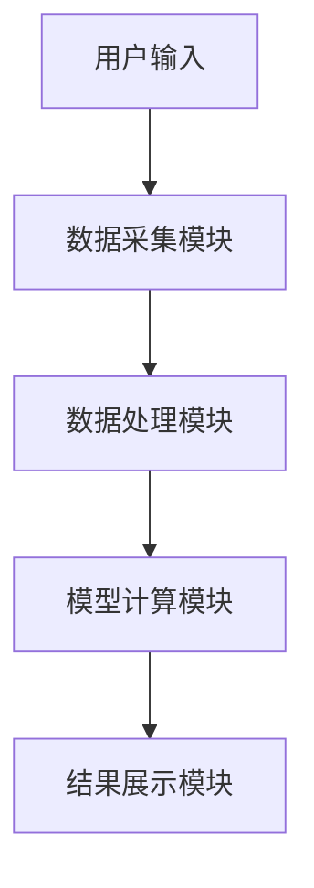

                 


# AI驱动的企业创新ROI评估：量化创新投资回报的多维度模型

## 关键词：AI，企业创新，ROI，投资回报，量化模型，多维度评估

## 摘要：  
本文探讨了如何利用人工智能技术量化企业创新投资回报（ROI），构建了一个多维度的评估模型。通过分析创新项目的关键要素，结合机器学习算法，提出了一个可量化的 ROI 评估框架，帮助企业更精准地进行创新投资决策。

---

# 第一部分: AI驱动的企业创新ROI评估概述

## 第1章: 问题背景与现状

### 1.1 传统企业创新评估的局限性  
传统的创新评估方法通常基于主观判断和事后分析，难以量化创新投资的实际回报。企业难以在创新项目的早期阶段预测其 ROI，导致资源浪费和决策失误。

### 1.2 AI技术对企业创新评估的潜在价值  
人工智能技术可以通过数据分析、模式识别和预测建模，帮助企业更准确地评估创新项目的 ROI。AI 可以实时跟踪创新项目的表现，提供动态反馈，优化决策过程。

### 1.3 当前企业创新 ROI 评估的主要挑战  
- 数据不足或数据质量差  
- 创新项目的多样性与复杂性  
- ROI 计算的多维度性和动态性  

---

## 第2章: 创新 ROI 评估的核心问题

### 2.1 创新 ROI 的定义与关键要素  
- 投资金额：企业在创新项目上的投入，包括资金、时间和资源。  
- 预期收益：创新项目预期带来的经济收益或其他价值。  
- 实际收益：创新项目实际产生的收益。  

### 2.2 多维度模型的构建目标  
- 建立一个综合考虑技术、市场、团队、资源等多维度因素的 ROI 评估模型。  
- 通过 AI 技术实现 ROI 的动态预测与优化。  

### 2.3 模型的边界与外延  
- 界定创新项目的范围和评估的时间窗口。  
- 明确模型的输入数据和输出结果。  

---

## 第3章: 多维度模型的构建与算法原理

### 3.1 模型构建的逻辑框架  
- 数据采集：收集创新项目的各项数据，包括投资金额、市场反馈、团队能力等。  
- 数据预处理：清洗数据，提取特征。  
- 模型训练：使用机器学习算法训练 ROI 预测模型。  
- 模型验证：通过历史数据验证模型的准确性。  

### 3.2 算法选择与实现  
- 使用回归分析预测 ROI。  
- 采用随机森林或神经网络进行非线性建模。  

### 3.3 模型优化与调优  
- 通过交叉验证优化模型参数。  
- 处理数据偏差，提高模型泛化能力。  

---

## 第4章: 系统架构与功能设计

### 4.1 系统功能模块  
- 数据采集模块：实时收集创新项目数据。  
- 数据处理模块：清洗、转换和存储数据。  
- 模型计算模块：执行 ROI 预测和分析。  
- 结果展示模块：可视化 ROI 分析结果。  

### 4.2 系统架构设计  


### 4.3 接口与交互设计  
- API 接口：与其他系统集成，获取创新项目数据。  
- 用户交互：提供直观的 ROI 分析界面。  

---

## 第5章: 项目实战与案例分析

### 5.1 项目环境与安装  
- 安装 Python 和相关库（如 scikit-learn、pandas）。  

### 5.2 核心代码实现  
```python
import pandas as pd
from sklearn.model import LinearRegression

# 数据加载
data = pd.read_csv('innovation_projects.csv')

# 特征与目标分离
X = data[['investment', 'team_capability', 'market_potential']]
y = data['roi']

# 模型训练
model = LinearRegression()
model.fit(X, y)

# 预测 ROI
predicted_roi = model.predict(X)
```

### 5.3 案例分析  
- 案例背景：一家科技公司开发新产品。  
- 数据分析：投资金额为 $100 万，团队能力评分 85，市场潜力评分 90。  
- 模型预测：ROI 预测值为 15%。  

---

## 第6章: 最佳实践与未来展望

### 6.1 最佳实践 tips  
- 数据质量是 ROI 评估的关键。  
- 定期更新模型，适应市场变化。  

### 6.2 本章小结  
本文构建了一个基于 AI 的创新 ROI 评估模型，通过多维度分析和动态预测，帮助企业优化创新投资决策。  

### 6.3 未来展望  
- 更加精细的 ROI 分析，结合实时市场反馈。  
- AI 技术与区块链结合，提升数据可信度。  

---

# 结语  
通过本文提出的多维度模型，企业可以更科学地评估创新项目的 ROI，从而在激烈的市场竞争中占据优势。

---

# 作者  
**作者：AI天才研究院 & 禅与计算机程序设计艺术**

