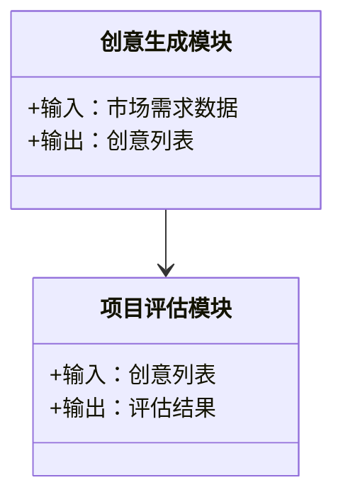

                 


# AI驱动的企业创新孵化器：从创意到商业化

> **关键词**：人工智能、企业创新、孵化器、创意商业化、技术驱动、AI算法、创新生态系统  
> 
> **摘要**：本文探讨了AI技术如何驱动企业创新孵化器的发展，从创意的生成与评估到商业化落地的完整流程。通过分析AI在创新项目评估、需求预测、市场分析等环节中的应用，结合具体的算法原理、系统架构设计和实际案例，详细阐述了AI驱动的企业创新孵化器的核心概念、技术实现和实际价值。文章还提供了系统设计的详细方案、项目实战的代码示例以及最佳实践建议，为读者提供了从理论到实践的全面指导。

---

## 第1章：AI驱动的企业创新孵化器概述

### 1.1 企业创新孵化器的背景与现状

#### 1.1.1 传统企业孵化器的定义与特点
企业孵化器是一种支持初创企业和创新项目的组织形式，其核心目标是通过提供资源、技术支持和管理指导，帮助创新项目从创意阶段发展为成熟的企业。传统孵化器通常依赖于人工评估和经验判断，存在效率低、成本高等问题。

#### 1.1.2 创新孵化器的演进与发展趋势
随着人工智能技术的快速发展，创新孵化器也在不断演进。传统的孵化器逐渐向智能化、数据化方向转型，AI技术的应用使得创新项目的筛选、评估和培育更加高效和精准。

#### 1.1.3 AI技术对企业创新的推动作用
AI技术通过自动化分析和数据挖掘，能够快速识别高潜力的创新项目，优化资源配置，降低创新成本。同时，AI还能帮助企业预测市场趋势，提供个性化的培育方案，显著提升创新成功的概率。

### 1.2 AI驱动的企业创新孵化器的定义与特点

#### 1.2.1 创新孵化器的核心概念
AI驱动的企业创新孵化器是以人工智能技术为核心，结合大数据分析、机器学习等技术，为创新项目提供从创意生成到商业化落地的全生命周期支持的组织形式。

#### 1.2.2 AI技术在创新孵化器中的应用
AI技术在创新孵化器中的应用主要体现在创意生成、项目评估、需求预测、市场分析等方面。通过AI算法，孵化器能够快速筛选出高潜力项目，并为其制定最优的发展路径。

#### 1.2.3 与传统孵化器的区别与优势
与传统孵化器相比，AI驱动的创新孵化器具有以下优势：
- **高效性**：通过自动化分析和数据挖掘，显著提高项目筛选和评估效率。
- **精准性**：基于AI算法，能够更准确地识别高潜力项目。
- **个性化**：根据项目的具体需求，提供定制化的支持方案。

### 1.3 企业创新孵化器的价值与意义

#### 1.3.1 企业创新孵化器的价值链分析
创新孵化器的价值链包括创意生成、项目筛选、资源匹配、项目培育和商业化落地等环节。AI技术的应用贯穿于整个价值链，通过数据驱动的方式优化各个环节的效率和效果。

#### 1.3.2 AI驱动的创新孵化器对企业的具体价值
- **降低创新成本**：通过AI技术快速筛选和评估项目，减少无效投资。
- **提高创新成功率**：基于数据和算法的精准判断，提升项目成功的概率。
- **加速商业化进程**：通过智能化支持，缩短从创意到商业化的时间。

#### 1.3.3 对整个创新生态的影响
AI驱动的创新孵化器不仅能够提升单个企业的创新能力，还能通过数据共享和经验积累，促进整个创新生态的优化和升级，推动更多创新成果的落地。

### 1.4 本章小结

---

## 第2章：AI驱动的企业创新孵化器的核心要素

### 2.1 创意生成与评估

#### 2.1.1 创意生成的AI技术原理
创意生成主要依赖于自然语言处理（NLP）和生成对抗网络（GAN）等技术。通过分析大量的行业数据和用户需求，AI系统可以生成符合市场需求的创意。

#### 2.1.2 创意评估的指标与方法
创意评估的指标包括市场潜力、技术可行性、团队能力等。AI系统通过构建多维度评估模型，对创意进行综合评分。

#### 2.1.3 创意评估的对比分析
| 指标 | 传统评估 | AI评估 |
|------|----------|--------|
| 效率 | 低效     | 高效   |
| 精准度 | 主观     | 客观   |
| 成本 | 高       | 低     |

### 2.2 需求预测与市场分析

#### 2.2.1 市场需求预测的AI模型
基于时间序列分析和机器学习算法，AI系统能够预测市场的未来趋势，帮助企业制定精准的市场策略。

#### 2.2.2 竞争分析与机会识别
通过爬取和分析竞争对手的数据，AI系统能够识别市场机会，帮助企业制定差异化竞争策略。

### 2.3 创新项目的筛选与优先级排序

#### 2.3.1 项目筛选的标准与流程
项目筛选的标准包括创新性、可行性、团队能力等。AI系统通过构建评分模型，对项目进行自动筛选和排序。

#### 2.3.2 优先级排序的AI算法
优先级排序主要采用层次分析法（AHP）和遗传算法（GA）等方法，通过多维度指标对项目进行综合评估。

---

## 第3章：AI驱动的创新项目评估算法

### 3.1 创新项目评估的核心算法

#### 3.1.1 基于机器学习的分类算法
常用算法包括决策树（Decision Tree）、随机森林（Random Forest）和逻辑回归（Logistic Regression）等。

#### 3.1.2 基于深度学习的生成模型
常用模型包括生成对抗网络（GAN）和变分自编码器（VAE）等。

### 3.2 创意评估的数学模型

#### 3.2.1 基于概率的评估模型
概率模型通过分析项目的成功概率，评估其市场潜力。

#### 3.2.2 基于矩阵的相似性分析
通过构建项目相似性矩阵，识别具有潜力的创新方向。

### 3.3 创新项目的筛选流程

---

## 第4章：AI驱动的企业创新孵化器的系统架构与设计

### 4.1 问题场景介绍
创新孵化器的系统需要支持创意生成、项目评估、资源匹配和商业化支持等功能。

### 4.2 系统功能设计

#### 4.2.1 领域模型设计


#### 4.2.2 系统架构设计


#### 4.2.3 系统接口设计
接口包括创意生成接口、项目评估接口和资源匹配接口。

#### 4.2.4 系统交互设计
```mermaid
sequenceDiagram
    participant 用户
    participant 创意生成模块
    participant 项目评估模块
    用户 -> 创意生成模块：提交需求
    创意生成模块 -> 项目评估模块：生成创意
    项目评估模块 -> 用户：返回评估结果
```

---

## 第5章：项目实战：AI驱动的企业创新孵化器的实现

### 5.1 环境安装与配置
需要安装Python、机器学习库（如Scikit-learn、TensorFlow）和数据处理工具（如Pandas）。

### 5.2 系统核心实现

#### 5.2.1 创意生成模块实现
```python
import numpy as np
from sklearn.tree import DecisionTreeClassifier

# 示例数据
X = np.array([[1, 2], [3, 4], [5, 6]])
y = np.array([0, 1, 0])

# 训练模型
model = DecisionTreeClassifier()
model.fit(X, y)

# 预测新数据
new_data = np.array([[2, 3]])
print(model.predict(new_data))
```

#### 5.2.2 项目评估模块实现
```python
import pandas as pd
from sklearn.ensemble import RandomForestClassifier

# 示例数据
data = pd.DataFrame({
    '特征1': [0, 1, 2],
    '特征2': [3, 4, 5],
    '标签': [0, 1, 0]
})

# 训练模型
model = RandomForestClassifier()
model.fit(data[['特征1', '特征2']], data['标签'])

# 预测新数据
new_data = pd.DataFrame({
    '特征1': [1],
    '特征2': [4]
})
print(model.predict(new_data))
```

---

## 第6章：最佳实践与总结

### 6.1 小结
AI技术的应用显著提升了企业创新孵化器的效率和精准度，为创新项目的筛选和培育提供了强有力的支持。

### 6.2 注意事项
在实际应用中，需要注意数据质量和模型的可解释性，确保AI算法的可靠性和实用性。

### 6.3 拓展阅读
推荐阅读《机器学习实战》、《深度学习入门》等书籍，深入理解AI技术的核心原理和应用方法。

---

## 作者：AI天才研究院 & 禅与计算机程序设计艺术

